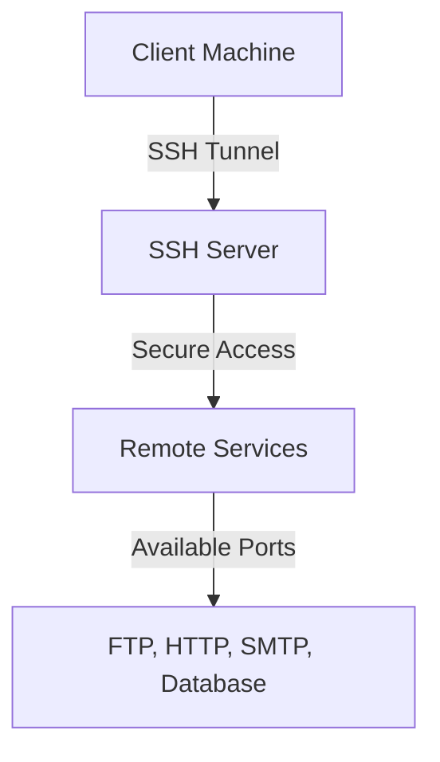
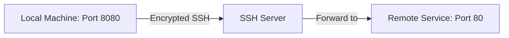

<details open>
<summary><b>Section 107: SSH Port Forwarding and Tunneling (CL-KK-Terminal)</b></summary>

# Section 107: SSH Port Forwarding and Tunneling

## Table of Contents
- [Introduction to SSH Tunneling](#introduction-to-ssh-tunneling)
- [Types of SSH Port Forwarding](#types-of-ssh-port-forwarding)
- [Local Port Forwarding](#local-port-forwarding)
- [Remote Port Forwarding](#remote-port-forwarding)
- [Dynamic Port Forwarding](#dynamic-port-forwarding)
- [Practical Demonstrations](#practical-demonstrations)
- [Summary](#summary)

## Introduction to SSH Tunneling

### Overview
SSH port forwarding, also known as SSH tunneling, is a powerful technique that allows secure access to services through encrypted SSH channels. By creating secure tunnels between machines, you can safely access remote services that would otherwise be insecure or blocked, while encrypting all transmitted data.

### Key Concepts
SSH tunneling addresses security limitations in traditional network communications:

- **Insecure vs Secure Connections**: Traditional connections transmit data in plain text, making them vulnerable to interception. SSH tunneling routes traffic through encrypted SSH channels, ensuring data integrity and confidentiality.

- **Fundamental Purpose**: Replace potentially insecure connections with secure, encrypted SSH channels that can access remote services safely.

- **Common Use Cases**: 
  - Access blocked services (FTP, SMTP, HTTP databases)
  - Secure communication for web services, databases, and application servers
  - Bypassing firewall restrictions while maintaining security

### SSH Features for Tunneling
SSH provides essential security features:

- **Encryption/Decryption**: Automatic encryption and decryption of data during transmission
- **Authentication Integration**: Verified identity confirmation between communicating parties
- **Integrity Protection**: Prevents data manipulation during transit



## Types of SSH Port Forwarding

### Overview
SSH supports three primary types of port forwarding, each serving different networking scenarios. Understanding their differences is crucial for selecting the appropriate tunneling method.

### Key Differences

| Type | Direction | Use Case |
|------|-----------|----------|
| Local Port Forwarding | Client-side tunneling | Access remote services from local machine |
| Remote Port Forwarding | Server-side tunneling | Make local services accessible to remote machines |
| Dynamic Port Forwarding | SOCKS proxy creation | Route traffic through SSH proxy for blocked services |

## Local Port Forwarding

### Overview
Local port forwarding creates a secure tunnel from your local machine to a remote server, allowing access to remote services as if they were running locally. Traffic is forwarded through an encrypted SSH channel.

### How It Works


### Command Syntax
```bash
ssh -L [LOCAL_PORT]:[REMOTE_HOST]:[REMOTE_PORT] [SSH_USER]@[SSH_SERVER]
```

### Practical Example
Connect to remote web server through local port:

```bash
ssh -L 8080:localhost:80 root@192.168.1.100
```

This forwards local port 8080 to the remote server's port 80 through an SSH tunnel.

### Verification Commands
- Check tunnel processes: `ps aux | grep ssh`
- Monitor traffic: `tcpdump -i ens0 port 8080`

## Remote Port Forwarding

### Overview
Remote port forwarding works in the opposite direction of local forwarding. You initiate the SSH connection from the server hosting the service and forward ports to allow remote access to local services.

### How It Works


### Command Syntax
```bash
ssh -R [REMOTE_PORT]:[LOCAL_HOST]:[LOCAL_PORT] [SSH_USER]@[SSH_SERVER]
```

### Practical Example
From the web server machine, forward local port 80 to remote SSH server port 8080:

```bash
ssh -R 8080:localhost:80 root@192.168.1.200
```

This allows remote clients to access the local web server through the SSH server's forwarded port.

## Dynamic Port Forwarding

### Overview
Dynamic port forwarding creates a SOCKS proxy through SSH, allowing you to route any traffic through the encrypted tunnel. This is particularly useful for accessing services that are blocked or for creating VPN-like connections.

### Command Syntax
```bash
ssh -D [LOCAL_PORT] [SSH_USER]@[SSH_SERVER]
```

### Practical Example
Create dynamic tunnel on port 1080:

```bash
ssh -D 1080 root@192.168.1.100
```

### Usage with Applications
- **Web Browsers**: Configure SOCKS proxy to route traffic
- **Command Line Tools**: Use proxychains for connectivity
- **Bypassing Blocks**: Access blocked protocols through the SSH tunnel

```bash
curl --proxy socks5://localhost:1080 http://example.com
```

## Practical Demonstrations

### 3-Machine Setup
The demonstrations use three Linux machines:
- **Server 1**: Client machine (10.0.0.241)
- **Server 2**: Intermediate gateway (10.0.0.242) 
- **Server 3**: Web server host (10.0.0.243)

### Local Port Forwarding Demo
1. **Setup Web Server** on Server 3:
   ```bash
   apt install python3-http.server
   python3 -m http.server 80
   ```

2. **Create Firewall Rules** (if needed):
   ```bash
   firewall-cmd --add-port=80/tcp --permanent
   firewall-cmd --reload
   ```

3. **Initiate Local Forwarding** from Server 1:
   ```bash
   ssh -L 8080:10.0.0.243:80 root@10.0.0.241
   ```

4. **Access Service**:
   ```bash
   curl http://localhost:8080
   ```

### Multi-Hop Tunneling
Create tunnel through intermediate gateway:

```bash
ssh -L 8080:10.0.0.243:80 -o ProxyCommand="ssh -W %h:%p root@10.0.0.242" root@10.0.0.241
```

### With Gateway Ports
```bash
ssh -L 8080:10.0.0.243:80 root@10.0.0.242
```

### Stopping Tunnels
Find and terminate tunnel processes:

```bash
ps aux | grep ssh  # Find PID
kill -9 [PID]
```

## Summary

### Key Takeaways
```diff
! SSH tunneling provides secure access to remote services through encrypted channels
+ Local forwarding: Access remote services from local machine (client to server)
- Remote forwarding: Make local services accessible remotely (server to client)  
+ Dynamic forwarding: Create SOCKS proxy for flexible traffic routing
! Critical for bypass blocked services while maintaining encryption
+ Supports multiple services: FTP, SMTP, HTTP, databases, and custom applications
- Requires active SSH connection; tunnels terminate when connection closes
```

### Quick Reference
**Local Port Forwarding:**
```bash
ssh -L [LOCAL_PORT]:[TARGET_HOST]:[TARGET_PORT] user@ssh_server
```

**Remote Port Forwarding:**
```bash
ssh -R [REMOTE_PORT]:[LOCAL_HOST]:[LOCAL_PORT] user@ssh_server
```

**Dynamic Port Forwarding:**
```bash
ssh -D [LOCAL_PORT] user@ssh_server
```

**Monitor Tunnels:**
```bash
ps aux | grep ssh
tcpdump -i [interface] port [PORT]
```

**Stop Tunnels:**
```bash
kill -9 [SSH_PID]
```

### Expert Insight

#### Real-world Application
SSH tunneling is essential in enterprise environments for:
- Secure access to cloud-hosted database servers
- Bypassing corporate firewalls for development work
- Creating VPN-like connections without full VPN infrastructure
- Accessing IoT devices and sensors securely over public networks

#### Expert Path
Master intermediate networking concepts:
- Understand TCP/IP fundamentals and port concepts
- Practice with various SSH clients and automation tools
- Learn firewall management (firewalld, ufw, iptables)
- Explore SSH config files for persistent tunnel configurations

#### Common Pitfalls
- Forgetting tunnel direction (local vs remote vs dynamic)
- Not handling firewall rules properly
- Leaving SSH connections unattended (session timeouts)
- Using tunnels for high-bandwidth applications (performance impact)
- Not securing SSH keys and authentication methods

> [!IMPORTANT]
> Always use key-based authentication instead of passwords for SSH tunneling in production environments.

> [!NOTE]
> Tunnels consume SSH sessions; limit concurrent tunnels based on server resources.

> [!WARNING] 
> Dynamic tunneling can be abused for bypassing security policies; implement proper monitoring and controls.
``` 

</details>
