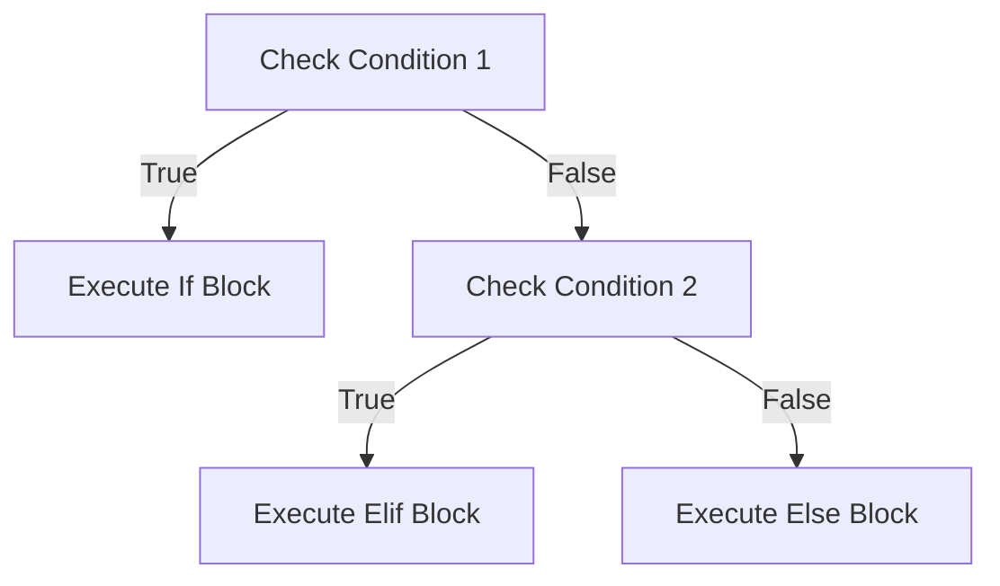

# Section 112: Conditional Statements in Bash Shell Scripting

<details open>
<summary><b>Section 112: Conditional Statements in Bash Shell Scripting (CL-KK-Terminal)</b></summary>

## Table of Contents
- [Overview](#overview)
- [Conditional Statements Introduction](#conditional-statements-introduction)
- [Comparison Operators](#comparison-operators)
- [Basic If Statement](#basic-if-statement)
- [If-Else Statement](#if-else-statement)
- [Elif (Else-If) Statement](#elif-else-if-statement)
- [User Input with Conditionals](#user-input-with-conditionals)
- [Summary](#summary)

## Overview
Conditional statements in Bash shell scripting allow you to execute different parts of your script based on specific conditions or criteria. This section covers the use of `if`, `else`, and `elif` statements, along with comparison operators, to make scripts more dynamic and responsive to different scenarios. These are essential for decision-making logic in automation and system administration tasks.

## Conditional Statements Introduction
Conditional statements evaluate whether a condition is true or false and execute commands accordingly. They form the foundation of logical flow in scripts, allowing you to handle different outcomes based on variable values, user input, or system states.

- **Syntax Overview**: Conditions are expressed using operators and enclosed in `if` blocks.
- **Key Components**:
  - `if`: Initiates the conditional check.
  - `then`: Specifies actions if the condition is true.
  - `else`: Provides alternative actions if the condition is false.
  - `elif`: Allows checking additional conditions if the initial `if` is false.
  - `fi`: Closes the conditional block.

Always ensure proper spacing around brackets and operators to avoid syntax errors.

## Comparison Operators
Bash supports various comparison operators for integers, strings, and files. These operators are critical for building conditions. Note: String comparisons should be enclosed in double quotes or brackets for reliability.

### String Comparison Operators
- `-eq`: Equal to (integers) or equivalent strings.
- `-ne`: Not equal to.
- `-gt`: Greater than.
- `-ge`: Greater than or equal to.
- `-lt`: Less than.
- `-le`: Less than or equal to.

### Integer Comparison Operators
- `==`: Equal (with `[[ ]]`)
- `!=`: Not equal.
- `>`: Greater than (requires `(( ))` or `[[ ]]`)
- `<`: Less than.
- `>=`: Greater than or equal.
- `<=`: Less than or equal.

### Examples
- For integers: Use `(( $num1 -gt $num2 ))` or `[[ $num1 -gt $num2 ]]`.
- For strings: Use `[[ "$string1" == "$string2" ]]` or `[[ "$string1" < "$string2" ]]` for alphabetical order.
- Boolean equivalence: Use `[[ ]]` for safer evaluations.

> [!NOTE]
> Always test operators with different data types to ensure correct behavior, as integer and string comparisons differ.

## Basic If Statement
The basic `if` statement checks a condition and executes commands only if true. If false, no action is taken.

### Syntax
```bash
if [ condition ]; then
    # Commands to execute if true
fi
```

### Example: Simple Numeric Comparison
```bash
if [ 20 -eq 20 ]; then
    echo "The condition is true."
fi
```
If the condition evaluates to true, the echo command prints to output. No output if false.

### Key Points
- Use `[ ]` for simple comparisons or `[[ ]]` for advanced features.
- Ensure spaces around brackets and operators.
- Debug by testing invalid conditions to verify no unexpected output.

> [!IMPORTANT]
> Incorrect spacing causes syntax errors. Always include spaces after `[` and before `]`, and around operators like `-eq`.

## If-Else Statement
The `if-else` block executes one set of commands if the condition is true, and another set if false.

### Syntax
```bash
if [ condition ]; then
    # Commands if true
else
    # Commands if false
fi
```

### Example: Variable Comparison
```bash
num=30
if [[ $num -gt 20 ]]; then
    echo "The condition is true."
else
    echo "The condition is false."
fi
```
Output: "The condition is true." since 30 > 20.

### Advanced Example: String Comparison
```bash
var1="abc"
if [[ "$var1" == "abc" ]]; then
    echo "This condition is true."
else
    echo "This condition is false."
fi
```
Output: "This condition is true."

> [!DIFF]
> + Accurate: Using descriptive variable names improves readability.
> - Avoid: Hardcoding values without variables reduces reusability.

## Elif (Else-If) Statement
`elif` allows chaining multiple conditions, checking additional scenarios after the initial `if`.

### Syntax
```bash
if [ condition1 ]; then
    # Action if condition1 true
elif [ condition2 ]; then
    # Action if condition2 true
else
    # Action if all above false
fi
```

### Example: Multi-Condition Check
```bash
var="abc"
if [[ "$var" == "value1" ]]; then
    echo "First condition true."
elif [[ "$var" == "abc" ]]; then
    echo "Second condition true."
else
    echo "All conditions false."
fi
```
Output: "Second condition true."

### Flow Example:


## User Input with Conditionals
You can incorporate user input using `read` to make scripts interactive, then evaluate inputs with conditionals.

### Example: Interactive Script
```bash
#!/bin/bash

echo "Please enter a value:"
read user_input

if [[ "$user_input" == "1" ]]; then
    echo "First condition is true."
elif [[ "$user_input" == "2" ]]; then
    echo "Second condition is true."
else
    echo "All conditions are false."
fi
```

- Run the script and provide input via terminal.
- Output varies based on input: "1" → first message, "2" → second message, others → else message.

## Summary

### Key Takeaways
- Conditional statements control script execution flow based on evaluations.
- Use appropriate operators: integer comparisons with `[ ]` or `(( ))`, strings with `[[ ]]`.
- `if-else` and `elif` handle multiple scenarios efficiently.
- Always verify syntax with test runs to catch errors early.

### Quick Reference
- **Basic If**: `if [ $var -eq 10 ]; then echo "Equal"; fi`
- **If-Else**: `if [ $a -gt $b ]; then echo "A greater"; else echo "B greater"; fi`
- **Elif**: `if [ cond1 ]; then ... elif [ cond2 ]; then ... else ... fi`
- **String Check**: `if [[ "$str1" == "$str2" ]]; then ... fi`

### Expert Insight
**Real-World Application**: Use conditionals to check system states, e.g., file existence (`if [ -f file.txt ]; then ...`) or user permissions, in deployment scripts or monitoring tools to automate responses.

**Expert Path**: Master logical operators (next section) to combine conditions (e.g., `&&` for AND, `||` for OR) for complex logic. Practice with real scripts like backup routines that check disk space before proceeding.

**Common Pitfalls**: Forgetting spaces in `[ ]` causes failures—always syntax check with `bash -n script.sh`. Mismatched quotes in strings lead to unexpected evaluations; use `[[ ]]` for safety. Avoid infinite loops by ensuring conditions eventually resolve.

</details>
