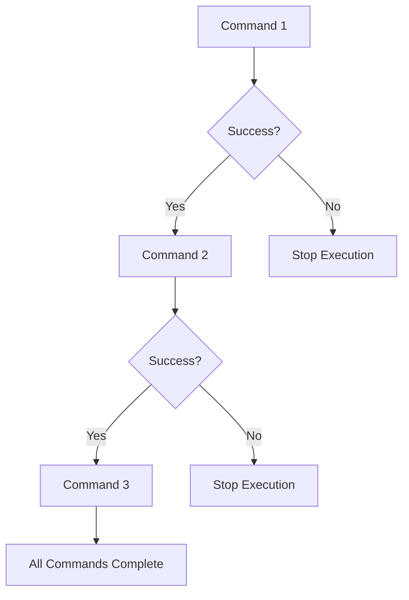

# Section 115: Logical AND Operators in Bash Scripts

<details open>
<summary><b>Section 115: Logical AND Operators in Bash Scripts (CL-KK-Terminal)</b></summary>

## Table of Contents
1. [Overview](#overview)
2. [Logical AND Operator Basics](#logical-and-operator-basics)
3. [Using Double Ampersand (&&) Syntax](#using-double-ampersand-syntax)
4. [Multiple Condition Scenarios](#multiple-condition-scenarios)
5. [Alternative Syntax Methods](#alternative-syntax-methods)
6. [Real-World Examples](#real-world-examples)
7. [Summary](#summary)

## Overview {#overview}

In bash scripting, the logical AND operator allows you to execute multiple commands conditionally - where all conditions must be true for the complete operation to succeed. This is essential when you need to chain commands that depend on the success of previous operations, commonly used for building robust conditional logic in scripts, deployment processes, and automated workflows.

## Logical AND Operator Basics {#logical-and-operator-basics}

### Understanding Logical AND Behavior

The logical AND operator ensures that **all connected conditions must evaluate to true** for the entire expression to be considered successful. If any single condition fails, the entire chain stops executing.

> [!NOTE]
> Logical AND differs from logical OR - with AND, all conditions must succeed; with OR, only one needs to succeed.

### Key Characteristics:
- **Short-circuit evaluation**: If the first condition fails, subsequent conditions aren't evaluated
- **Exit code dependency**: Each command returns an exit status (0 = success, non-zero = failure)
- **Sequential execution**: Commands execute left-to-right until the first failure or all succeed

## Using Double Ampersand (&&) Syntax {#using-double-ampersand-syntax}

The `&&` operator is the primary syntax for logical AND operations in bash.

### Basic Syntax
```bash
command1 && command2 && command3
```

### Behavior Flow


### Practical Example
```bash
echo "Welcome to Training!" && date && echo "Training Complete!"
```

**Execution Flow:**
1. `echo` command succeeds (exit code 0)
2. `date` command executes and succeeds
3. `echo` command executes and succeeds
4. All output displays sequentially

### Failure Handling
If any command fails, execution stops:

```bash
ls /valid/directory && echo "Directory exists" && cat /nonexistent/file
# Output: Directory exists
# Error: cat: /nonexistent/file: No such file or directory
```

## Multiple Condition Scenarios {#multiple-condition-scenarios}

### Validating User Input Ranges

Common use case: Validate that input falls within specific boundaries.

```bash
#!/bin/bash

# Script: validate_age.sh
read -p "Please enter your age: " age

if [ "$age" -gt 18 ] && [ "$age" -lt 40 ]; then
    echo "Valid age"
else
    echo "Invalid age"
fi
```

**Logic Flow:**
```diff
! Input Age → Check > 18 → Check < 40 → Execute if-else block
! └─ AND operation ensures both conditions must be true
```

### File Validation Chain
```bash
[ -f "$file" ] && echo "File exists" && [ -r "$file" ] && echo "File is readable" && head -5 "$file"
```

## Alternative Syntax Methods {#alternative-syntax-methods}

### Method 1: Single Bracket with &&

Instead of:
```bash
if [ "$condition1" ] && [ "$condition2" ]; then
```

You can use:
```bash
[ "$condition1" ] && [ "$condition2" ]
```

### Method 2: Command Chaining with Semicolons
For cleaner formatting in scripts:
```bash
command1 \
  && echo "Step 1 complete" \
  && command2 \
  && echo "Step 2 complete"
```

### Method 3: Conditional Expressions in IF Statements

```bash
if [ "$age" -ge 18 -a "$age" -le 40 ]; then
    echo "Valid age range"
fi
```

**Note:** `-a` (logical AND) works within single brackets, equivalent to `&&` between test commands.

## Real-World Examples {#real-world-examples}

### Deployment Validation Script
```bash
#!/bin/bash

deploy_app() {
    # Check prerequisites before deployment
    [ -f "docker-compose.yml" ] \
      && docker --version > /dev/null \
      && echo "Starting deployment..." \
      && docker-compose up -d \
      && echo "Application deployed successfully"
}

# Usage
deploy_app
```

### Conditional Backup Operation
```bash
#!/bin/bash

BACKUP_DIR="/backup"
SOURCE_DIR="/data"

[ -d "$BACKUP_DIR" ] \
  && echo "Backup directory exists" \
  && rsync -av --delete "$SOURCE_DIR/" "$BACKUP_DIR/" \
  && echo "Backup completed successfully" \
  || echo "Backup failed - please check directories"
```

### System Health Check
```bash
#!/bin/bash

check_system_health() {
    echo "Running system health checks..."

    df -h / | grep -v Use \
      && echo "✓ Disk space OK" \
      && free -h \
      && echo "✓ Memory OK" \
      && ps aux | head -5 \
      && echo "✓ Processes OK" \
      && echo "All system checks passed!"
}

check_system_health
```

## Summary {#summary}

### Key Takeaways
```diff
+ Logical AND (&&) requires ALL connected conditions to be true
+ Commands execute sequentially until first failure (short-circuit)
+ Essential for conditional scripting, deployments, and validation chains
+ Exit codes determine success: 0 = success, non-zero = failure
+ Alternative syntaxes (single brackets, -a flag) provide flexibility
+ Real-world usage includes deployment checks, backup operations, and system monitoring

- Command execution stops immediately when any condition fails
- All commands must complete successfully for the entire chain to succeed
```

### Quick Reference

| Operator | Syntax | Example | Use Case |
|----------|----------|---------|----------|
| `&&` | `cmd1 && cmd2` | `mkdir /tmp/test && cd /tmp/test` | Conditional execution chains |
| `-a` | `[ "$var1" = "value" -a "$var2" = "value" ]` | `[ "$age" -gt 18 -a "$age" -lt 40 ]` | Logical AND in test expressions |
| `&&` | `test1 && test2` | `[ -f file.txt ] && echo "exists"` | Combining test conditions |

### Expert Insight

#### Real-world Application
```bash
#!/bin/bash
# Production deployment script with safety checks

deploy_production() {
    # Multi-layer validation before production deployment
    [ -f "app.py" ] && python3 -m py_compile app.py \
      && [ -f "requirements.txt" ] && pip install -r requirements.txt \
      && [ -d "config/" ] && cp config/prod.yml config.yml \
      && docker build -t myapp:latest . \
      && docker run -d --name myapp-prod -p 8080:8080 myapp:latest \
      && echo "✅ Production deployment completed successfully"
}

deploy_production
```

#### Expert Path
Master logical AND operators by:
- **Practice complex condition chains**: Build deployment scripts with multiple prerequisite checks
- **Understand exit codes**: Learn to modify command exit codes using `exit` for custom logic
- **Combine with other operators**: Progress to mixing AND with OR (`||`) for advanced conditional logic
- **Build safety mechanisms**: Use AND in monitoring scripts to prevent unsafe operations

#### Common Pitfalls
- **Forgetting quotation marks**: Always quote variables in conditions
- **Ignoring exit codes**: Test operations may succeed even when logic fails
- **Overusing short-circuit**: Can hide potential issues in validation chains
- **Command ordering**: Ensure logical dependencies are sequenced correctly

```
🤖 Generated with [Claude Code](https://claude.com/claude-code)

Co-Authored-By: Claude <noreply@anthropic.com>
```

</details>
