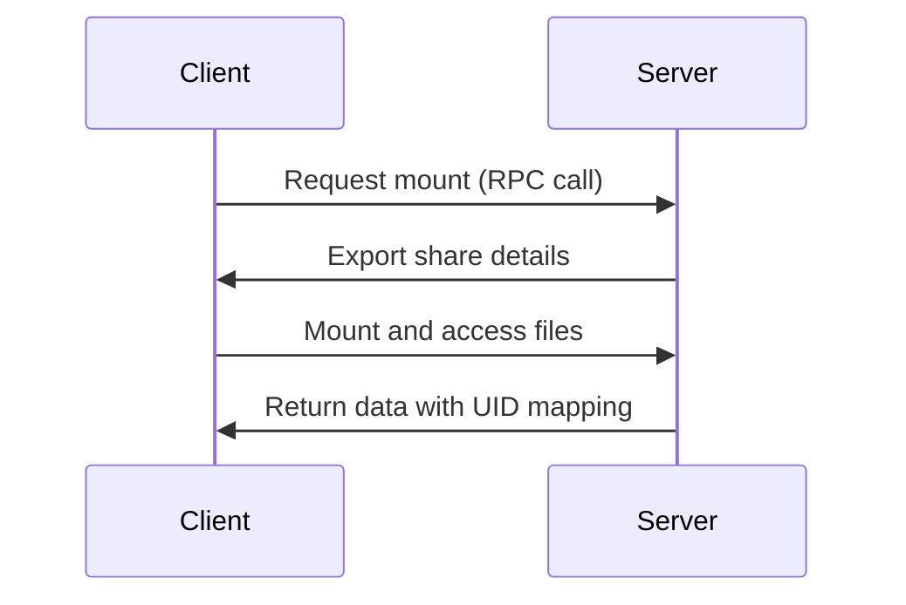

# Section 121: NFS Server Configuration

<details open>
<summary><b>Section 121: NFS Server Configuration (CL-KK-Terminal)</b></summary>

## Table of Contents
- [Introduction and Benefits of NFS](#introduction-and-benefits-of-nfs)
- [Server Configuration Steps](#server-configuration-steps)
- [Client Configuration and Mounting](#client-configuration-and-mounting)
- [Advanced NFS Options and Security](#advanced-nfs-options-and-security)
- [Hands-on Demonstrations](#hands-on-demonstrations)
- [Summary](#summary)

## Introduction and Benefits of NFS

### Overview
Network File System (NFS) is a distributed file system protocol originally developed by Sun Microsystems in 1984. It allows sharing file systems across a network, enabling clients to access remote storage as if it were local. This section covers NFS version 3 and 4, supporting 64-bit file sizes, cross-platform compatibility, and Access Control Lists (ACLs).

### Key Concepts/Deep Dive
- **Architecture**: NFS operates on a client-server model where the server exports directories and clients mount them. It uses Remote Procedure Calls (RPC) for communication, typically over ports 111 (rpcbind) and 2049 (NFS).
- **Versions**: 
  - NFSv2: Limited to 32-bit file sizes.
  - NFSv3: Introduced 64-bit support, TCP/UDP, and better performance (used in this demo).
  - NFSv4: Added ACLs, stateful connections, and no separate RPC bind requirement.
- **Benefits**:
  - Centralized storage management.
  - Seamless integration with local file systems.
  - Cost-effective for sharing data in LAN environments.

> [!NOTE]
> NFS requires proper firewall rules (allow ports for rpcbind and NFS mounts) and consistent user ID mappings between server and client.

### Code/Config Example
NFS uses these core commands:
- `rpcinfo`: Check registered services.
- `exportfs`: Export and manage shared directories.

## Server Configuration Steps

### Overview
Configuring an NFS server involves installing packages, enabling services, creating shares, editing configuration files, and exporting directories. All commands must be run as root or with sudo.

### Key Concepts/Deep Dive
- **Prerequisites**: Ensure repositories are enabled (e.g., via `dnf config-manager --set-enabled` for Red Hat-based systems).
- **Services Involved**:
  - `rpcbind`: Manages RPC services.
  - `nfs-server`: Core NFS service.
  - `nfsv4-server`: For NFSv4 support.

### Lab Demo: Server Setup
1. **Set Hostname**: Use `hostnamectl set-hostname <name>` (e.g., `lkhnmehra.local`).
2. **Install Packages**: 
   ```
   dnf install nfs-utils -y
   ```
   This installs all necessary utilities.

3. **Enable and Start Services**:
   ```
   systemctl enable rpcbind
   systemctl start rpcbind
   systemctl enable nfs-server
   systemctl start nfs-server
   ```

4. **Verify Services**:
   ```
   systemctl status nfs-server
   rpcinfo -p | grep nfs
   ```
   ✅ Output should show NFS running on port 2049.

5. **Create Share Directory**:
   ```
   mkdir -p /share/clientshare
   ```

6. **Set Permissions**:
   ```
   chown nobody:nobody /share/clientshare
   chmod 777 /share/clientshare  # Recursive with -R if needed
   ```

### Code/Config Blocks
/etc/exports Configuration:
```
/share/clientshare 192.168.143.4(rw,sync,no_subtree_check,no_all_squash,no_root_squash)
```
- `rw`: Read-write access.
- `sync`: Direct disk writes for data integrity.
- `no_all_squash`: Preserves client user IDs (maps to server).
- `no_root_squash`: Allows root access.
- `192.168.143.4`: Restricts to specific client IP.

Update /etc/fstab for Permanent Mounting (server-side example):
```
# Mounting NFS share from 192.168.143.4:/share/clientshare on /mnt/nfs_share
```

Export the Share:
```
exportfs -rav
```

Firewall Adjustments:
```
firewall-cmd --add-service=nfs --permanent
firewall-cmd --reload
```

> [!IMPORTANT]
> Always use `sync` for data consistency; `async` may cause data loss on power failure.

## Client Configuration and Mounting

### Overview
Once the server exports shares, clients install NFS utilities, create mount points, and mount remotely.

### Key Concepts/Deep Dive
- **Client-side Requirements**: Install `nfs-utils`, enable `rpcbind`, and verify server exports.
- **Mounting Types**: Manual (`mount`) vs. Permanent (`fstab` entry with auto-mount).

### Lab Demo: Client Setup
1. **Set Hostname**: `hostnamectl set-hostname clientsystem.local`.
2. **Install Packages**: `dnf install nfs-utils -y`.
3. **Check Server Exports**:
   ```
   showmount -e 192.168.143.3  # Replace with server IP
   ```
   Output: `/share/clientshare 192.168.143.4`

4. **Create Mount Point**: `mkdir -p /mnt/clientshare`.
5. **Manual Mount**:
   ```
   mount -t nfs 192.168.143.3:/share/clientshare /mnt/clientshare
   df -h /mnt/clientshare  # Verify
   ```

6. **Unmount**: `umount /mnt/clientshare`.

### Code/Config Blocks
/etc/fstab for Permanent Mount:
```
192.168.143.3:/share/clientshare /mnt/clientshare nfs defaults 0 0
```
- `defaults`: Standard options; add `noauto` to prevent boot-time mounting.

Auto-mount with on-demand mounting (recommended):
- Edit /etc/auto.master: Add `/mnt /etc/auto.nfsfile`.
- /etc/auto.nfsfile:
  ```
  clientshare -rw,sync 192.168.143.3:/share/clientshare
  ```

Start auto-mount:
```
systemctl start autofs
```

> [!TIP]
> On-demand mounting delays boot if network is unavailable; ideal for volatile networks.

## Advanced NFS Options and Security

### Overview
NFS supports root squashing, user ID mapping, and secure access controls to prevent unauthorized operations.

### Key Concepts/Deep Dive
- **Root Squashing**: Prevents root from arbitrary actions (enabled by default with `root_squash`).
- **Export Options**:
  - `root_squash`: Maps root to nobody.
  - `no_root_squash`: Allows root privileges.
  - `all_squash`: Maps all users to nobody.
  - `anonuid/anonuid`: Set anonymous user/group IDs.
- **User Mapping**: `no_all_squash` preserves UIDs/GIDs if matching; otherwise, uses `anonuid`.

### Lab Demo: Testing Options
1. **Test Root Squashing**:
   - Disable `root_squash` in /etc/exports, restart service.
   - As root on client, create file; server shows root ownership.
   - Re-enable for security.

2. **User ID Mapping**:
   - With `all_squash`, all files owned by nobody.
   - With `no_all_squash`, matching users retain ownership.

3. **Sync vs. Async**:
   - `async`: Faster but potential data loss.
   - `sync`: Slower, reliable.

Firewall Rule (Client):
```
firewall-cmd --add-source=192.168.143.3 --permanent
```

### Code/Config Blocks
Secure /etc/exports for all networks:
```
/share/clientshare *(rw,sync,root_squash)
```

> [!WARNING]
> Disabling root squashing poses security risks; use ACLs or Kerberos for authentication.

## Hands-on Demonstrations

### Overview
Practical demos include creating files across client-server, testing permissions, and troubleshooting.

### Lab Demo: File Operations
- **Create Files on Client**:
  - As regular user: Files owned by client UID (if no_all_squash).
  - As root: Squashed if configured.
- **Server Verification**: `ls -la /share/clientshare` shows ownership mapping.

Mermaid Diagram for NFS Workflow:


> [!NOTE]  
> If mount fails, check `rpcbind` status and network connectivity.

### Quick Troubleshooting
- Command: `rpcinfo -s` (list registered services).
- Error "Access Denied": Verify IP in /etc/exports, restart services.

## Summary

### Key Takeaways
```diff
+ NFS enables seamless network-based file sharing with client-server model
+ Server exports directories via /etc/exports; clients mount persistently
! Use sync for data integrity; enable root_squash for security
- Avoid async in production; ensure UID/GID consistency
+ Versions 3-4 support modern needs; install nfs-utils on both ends
```

### Quick Reference
- **Install**: `dnf install nfs-utils -y`
- **Start Services**: `systemctl start rpcbind nfs-server`
- **Export**: `exportfs -rav`
- **Mount Manual**: `mount -t nfs server_ip:/share /mnt`
- **Check Exports**: `showmount -e server_ip`
- **Ports**: 111 (rpcbind), 2049 (NFS)
- **Secure Options**: `root_squash, sync, rw`

### Expert Insight
**Real-world Application**: Used in cloud storage solutions (e.g., AWS EFS-like setups) for shared storage across VMs or containers. Ideal for media servers or collaborative environments.  
**Expert Path**: Master Kerberos integration for authenticated NFSv4. Monitor with `nfsstat` for performance tuning.  
**Common Pitfalls**: Mismatched user IDs cause ownership issues; always test permissions. Firewall blocks cause mount failures—add NFS service rules.

</details>
