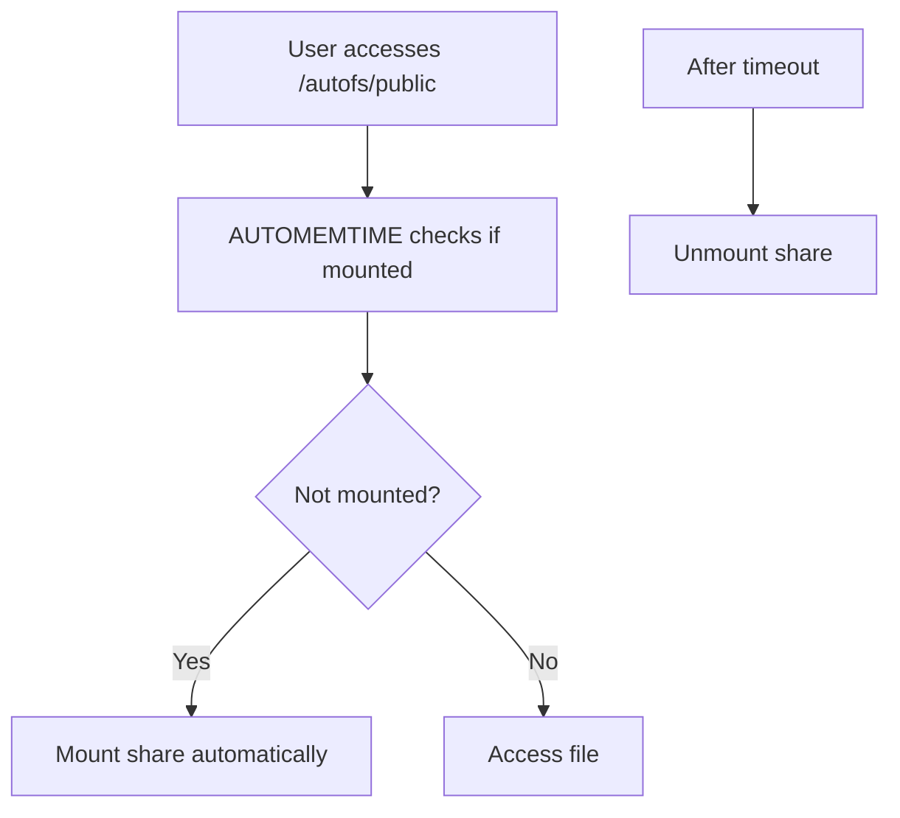

# Section 122: NFS Autofs and ACLs

<details open>
<summary><b>Section 122: NFS Autofs and ACLs (CL-KK-Terminal)</b></summary>

[TOC]

## Overview
This section covers two essential NFS (Network File System) features for advanced Linux administration: Autofs for on-demand mounting and NFSv4 Access Control Lists (ACLs) for fine-grained permissions. You'll learn how to configure these features on server and client machines, with practical demonstrations.

## Autofs for On-Demand Mounting

### Introduction
Autofs is a service that enables automatic mounting and unmounting of NFS shares on demand, eliminating the need for permanent mounts that consume resources when unused. This improves system performance and handles connectivity issues gracefully.

### Key Concepts

#### Why Use Autofs?
- **On-Demand Mounting**: Shares mount only when accessed, reducing resource utilization.
- **Timeout-Based Unmounting**: Automatically unmounts shares after a specified idle period.
- **Network Resilience**: Prevents system failures due to unavailable NFS servers.

```diff
+ Main Advantage: Automatic mount on access, unmount when idle
- Common Issue: Avoid permanent mounts causing resource waste
! Security Note: Encrypted connection in NFSv4 for better security
```

#### Demo Setup
Configure Autofs on a CentOS/RHEL system. Use online repositories or local repositories if preferred.

1. Install necessary packages:
   ```bash
   yum install autofs nfs-utils cifs-utils
   ```
   - Packages: `autofs`, `nfs-utils`, `cifs-utils` for NFS and CIFS support.

2. Create shares on NFS server:
   - Public share: `/public` with full permissions.
   - Private share: `/private` with full permissions.
   - Export them via `/etc/exports`:
     ```
     /public 192.168.0.0/24(rw,no_root_squash)
     /private 192.168.0.0/24(rw)
     ```

3. Export and restart services:
   ```bash
   exportfs -rav
   systemctl restart nfs-server rpcbind
   systemctl enable nfs-server rpcbind
   ```

4. On client machine, install packages:
   ```bash
   yum install autofs nfs-utils
   ```

5. Create auto-mount directory:
   ```bash
   mkdir /autofs
   mkdir /autofs/public
   mkdir /autofs/private
   ```

6. Configure `/etc/auto.master`:
   ```
   /autofs /etc/auto.nfs --timeout=30
   ```

7. Configure `/etc/auto.nfs`:
   ```
   public -ro 192.168.0.143:/public
   private -rw 192.168.0.143:/private
   ```

8. Start and enable Autofs:
   ```bash
   systemctl start autofs
   systemctl enable autofs
   ```

#### Testing Autofs
- Access shares: `cd /autofs/public`
- Verify mounting: `mount` or `df -h`
- Timeout: Shares unmount after 30 seconds if idle.



> [!NOTE] Autofs maps users to the root user on the server using `root_squash` for security.

## NFSv4 Access Control Lists (ACLs)

### Introduction
ACLs provide fine-grained permissions beyond standard Unix permissions, allowing specific access control for users and groups on NFSv4 shares.

### Key Concepts

#### Why Use ACLs?
- **Fine-Grained Control**: Grant permissions to specific users/groups without changing standard permissions.
- **Security Enhancement**: Prevent over-permissive sharing via standard permissions.

#### ACL Components
- **ACE (Access Control Entry)**: `type:flags:principal:permissions`
  - **Type**: `allow` or `deny`
  - **Flags**: `group_inherit`, `file_inherit`
  - **Principal**: User/group ID
  - **Permissions**: `r` (read), `w` (write), `x` (execute), etc.

#### Permission Types
- File permissions: `rwx` (read, write, execute)
- Directory permissions: `rxwx` (list, read, write, execute)
- Additional: `p` (append), `d` (delete)

#### Demo with ACLs

1. Set up NFSv4 share with ID mapping:
   - Add to `/etc/exports`:
     ```
     /nfs4 192.168.0.0/24(rw,no_root_squash,fsid=0)
     ```
   - Restart services.

2. On client, mount and create a file.

3. Configure ACL:
   ```bash
   setfacl -m u:vikas:rwx /path/to/file
   ```
   - Grants user "vikas" read/write/execute permissions.

4. Check permissions:
   ```bash
   getfacl /path/to/file
   ```

> [!IMPORTANT] Ensure user/group IDs match between client and server for proper ID mapping.

### Summary
Today we covered Autofs for efficient NFS mounting and NFSv4 ACLs for precise access control.

#### Key Takeaways

```diff
+ Autofs: On-demand mount/unmount for resource efficiency
- Traditional Mounts: Waste resources if shares are unused
+ ACLs: Fine-grained user/group permissions beyond standard Unix
- Standard Permissions: Insufficient for complex access needs
! NFSv4: Encrypts connection, supports ACLs
```

#### Quick Reference

- Install: `yum install autofs nfs-utils`
- Start Autofs: `systemctl start autofs`
- Set ACL: `setfacl -m u:user:permissions file`
- Get ACL: `getfacl file`
- Export shares: `exportfs -rav`

#### Expert Insight

**Real-world Application**: Use Autofs in production for central file servers to reduce server load; apply ACLs for compliance-heavy environments like finance.

**Expert Path**: Master kernel NFS modules (`nfsmount`) and LDAP integration for enterprise-scale setups.

**Common Pitfalls**: Mismatched user IDs cause permission errors; forget to restart services after exports changes.

</details>
