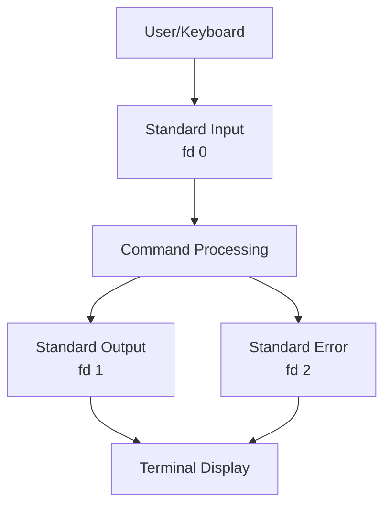

### File Descriptors Table

| Stream Name | File Descriptor | Purpose | Default Source/Destination |
|-------------|-----------------|---------|----------------------------|
| stdin | 0 | Input to commands | Keyboard |
| stdout | 1 | Successful output | Terminal screen |
| stderr | 2 | Error messages | Terminal screen |

### Understanding Stream Flow


## Output Redirection

### Overview
Output redirection allows you to send command output to files instead of the terminal screen. This is useful for logging, file operations, and processing output.

### Basic Output Redirection

#### Single Greater Than (`>`)
- **Syntax**: `command > filename`
- **Behavior**: Overwrites existing file content
- **File Descriptor**: Defaults to stdout (fd 1)

```bash
# Example: Redirect date command output to a file
date > output.txt

# Equivalent to explicit file descriptor
date 1> output.txt
```

#### Double Greater Than (`>>`)
- **Syntax**: `command >> filename`
- **Behavior**: Appends to existing file content
- **File Descriptor**: Defaults to stdout

```bash
# Append calendar output to existing file
cal >> output.txt
```

### Error Redirection

#### Redirecting Standard Error
- **Syntax**: `command 2> filename`
- **File Descriptor**: Explicit stderr redirection

```bash
# Redirect error messages to a file
invalidcmd 2> error.log

# Redirect both output and errors
date > output.txt 2> error.txt
```

#### Combined Output and Error Redirection
- **Syntax**: `command &> filename` or `command > filename 2>&1`
- **Behavior**: Combines stdout and stderr into single stream

```bash
# Modern syntax (preferred)
date &> combined.txt

# Traditional syntax
date > combined.txt 2>&1
```

## Input Redirection

### Overview
Input redirection allows commands to read from files instead of keyboard input.

### Basic Input Redirection

#### Input Redirection Operator (`<`)
- **Syntax**: `command < filename`
- **Behavior**: Reads file content as input to command

```bash
# Make mail command read from a file
mail user@example.com < message.txt
```

#### Alternative Input Syntax
```bash
# Explicit file descriptor (equivalent to above)
mail user@example.com 0< message.txt
```

### Advanced Input Techniques

#### Here Document (`<<`)
- **Syntax**: `command << delimiter`
- **Behavior**: Allows inline text input until delimiter

```bash
# Example: Create a file with inline content
cat << EOF > newfile.txt
This is line 1
This is line 2
End of file content
EOF
```

##### Key Points:
- Content between `<< EOF` and `EOF` becomes file content
- `EOF` is a common delimiter (End Of File)
- No spaces around delimiter when closing

## Advanced Redirection Techniques

### Compound Commands and Redirection

#### Multiple File Operations
```bash
# Copy file1 content to file2, append file3 content
cat file1.txt > file2.txt && cat file3.txt >> file2.txt

# Create backup before redirection
cp output.txt backup.txt && date > output.txt
```

#### Command Sequencing with Redirection
```bash
# Execute command1, redirect output, then command2
(command1 > file1.txt) && command2 >> file2.txt
```

### Complex Redirection Scenarios

#### Conditional Redirection
```bash
# Only redirect if command succeeds
successful_command && date > success.log

# Only redirect if command fails
failed_command || echo "Command failed" > error.log 2>&1
```

## Special Files and Options

### The Null Device (`/dev/null`)

#### Overview
`/dev/null` is a special virtual file that discards all input written to it. It's like a "black hole" for data.

#### Key Characteristics:
- **Capacity**: Infinite (can accept unlimited data)
- **Accessibility**: Readable but unreadable
- **Purpose**: Discard unwanted output

#### Common Uses:
```bash
# Suppress successful output, keep errors visible
long_running_command >/dev/null

# Suppress both output and errors (complete silence)
silent_command >/dev/null 2>&1

# Alternative syntax
silent_command &>/dev/null
```

### Protection Options

#### No Clobber Option
- **Purpose**: Prevents accidental file overwriting
- **Command**: `set -o noclobber`
- **Effect**: `>` and `>>` fail on existing files (unless forced)

```bash
# Enable protection
set -o noclobber

# This will fail if file exists
date > existing-file.txt  # Command fails

# Force override protection
date >| existing-file.txt  # Overrides noclobber

# Disable protection
set +o noclobber
```

#### Checking Option Status
```bash
# Display current shell options
set -o

# Check specific option
echo "Noclobber status: $(set +o | grep noclobber)"
```

### File Content Management

#### Truncating Files
```bash
# Create empty file or truncate existing
> emptyfile.txt

# Alternative method
truncate -s 0 filename.txt
```

#### Redirection Sequence Understanding
The shell processes redirection operators in a specific order:
1. **Command parsing**: Commands are parsed left to right
2. **Redirection order**: Redirections are applied in sequence as encountered
3. **File descriptors**: Numbers specify which stream to redirect

> [!NOTE]
> Command execution happens after all redirections are set up

## Practical Examples

### Example 1: Basic Output Capture
```bash
# Capture current date and time
date > current_time.txt

# View captured content
cat current_time.txt
```

### Example 2: Error Isolation
```bash
# Separate successful output and errors
./myscript.sh > output.log 2> error.log

# Check if script worked
if [ -s error.log ]; then
    echo "Script had errors"
else
    echo "Script completed successfully"
fi
```

### Example 3: Silent Operations
```bash
# Install package silently (suppress progress output)
apt-get install -y package_name >/dev/null

# Or suppress everything
apt-get install -y package_name &>/dev/null
```

### Example 4: Log File Management
```bash
# Append timestamped logs
echo "$(date): Starting backup" >> backup.log
perform_backup >> backup.log 2>&1
echo "$(date): Backup completed" >> backup.log
```

### Example 5: Configuration File Creation
```bash
# Create config file using here document
cat << 'EOF' > /etc/myapp/config.ini
[database]
host=localhost
port=5432
username=myuser

[logging]
level=INFO
file=/var/log/myapp.log
EOF
```

## Summary

### Key Takeaways
```diff
+ Standard streams (stdin, stdout, stderr) have file descriptors 0, 1, and 2 respectively
+ > overwrites files, >> appends to files
+ < redirects input from files, << creates here documents
+ &> combines stdout and stderr redirection
+ /dev/null discards unwanted output
+ set -o noclobber prevents accidental file overwriting
+ 2>&1 merges error stream with output stream
```

### Quick Reference

| Operation | Syntax | Example |
|-----------|---------|---------|
| Redirect stdout | `cmd > file` | `ls > dirlist.txt` |
| Append stdout | `cmd >> file` | `date >> logfile.txt` |
| Redirect stderr | `cmd 2> file` | `cmd 2> errors.txt` |
| Redirect both | `cmd &> file` | `cmd &> alloutput.txt` |
| Input redirection | `cmd < file` | `mail user < message.txt` |
| Here document | `cmd << EOF` | `cat << EOF > file` |
| Suppress output | `cmd >/dev/null` | `silent_cmd >/dev/null` |
| Force overwrite | `cmd >\| file` | `cmd >\| protected.txt` |

### Expert Insight

#### Real-world Application
In production environments, redirection is crucial for:
- **Log management**: Capturing application output for monitoring
- **Automated scripts**: Making commands run silently or logged
- **Error handling**: Separating successful operations from failures
- **Data processing**: Feeding file content to processing commands

#### Expert Path
Master redirection by:
1. Understanding file descriptor concepts thoroughly
2. Practicing advanced redirection: `cmd 3>&1 1>&2 2>&3`
3. Learning process substitution: `diff <(cmd1) <(cmd2)`
4. Combining with pipes: `cmd | tee file | another_cmd`
5. Exploring exec redirection: `exec 3>&1; cmd >&3`

#### Common Pitfalls
- ⚠️ Forgetting file descriptor numbers: `2>&1` redirects FD2 to where FD1 points
- ❌ Overwriting important files without checking
- ⚠️ Mixing redirection operators without understanding precedence
- ❌ Assuming all commands behave identically with redirection
- ⚠️ Not testing redirections in safe environments first

</details>
