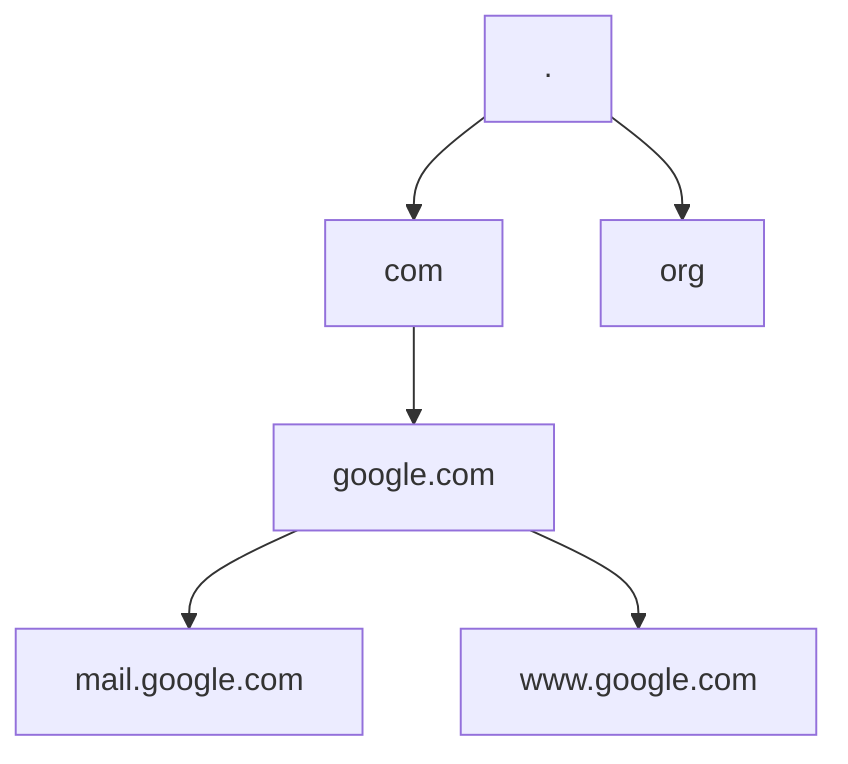

# Section 132: DNS Configuration

<details open>
<summary><b>Section 132: DNS Configuration (CL-KK-Terminal)</b></summary>

**Table of Contents**
- [Introduction to DNS](#introduction-to-dns)
- [History and Importance](#history-and-importance)
- [How DNS Works](#how-dns-works)
- [DNS Namespace and Zones](#dns-namespace-and-zones)
- [DNS Records](#dns-records)
- [DNS Server Types](#dns-server-types)
- [DNS Configuration in Linux](#dns-configuration-in-linux)
- [Practical Lab: Setting Up DNS Server](#practical-lab-setting-up-dns-server)
- [Testing DNS Resolution](#testing-dns-resolution)
- [Summary](#summary)

## Introduction to DNS
DNS (Domain Name System) is a service that translates domain names to IP addresses and vice versa. It enables human-readable names to map to machine-usable IP addresses. Hosts file was the precursor, but DNS is a distributed system for global internet handling.

### Key Concepts
DNS resolves names like google.com to IP addresses. Without DNS, you'd need to remember IP addresses for all sites.
- **Why DNS?** Humans prefer names over numbers; machines need IPs.
- **Port and Protocol**: DNS uses port 53; UDP for queries, TCP for zone transfers.

## History and Importance
Invented in 1984 by Paul Mockapetris. Replaced hosts file limitations for scalability. DNS is a hierarchical, distributed database updated in real-time.

### Key Concepts
- Pre-1984: Hosts file for local resolution.
- **Evolves**: Distributed across servers globally.
- **Current Usage**: 200+ top-level domains; supports billions of resolutions daily.

## How DNS Works
Clients query DNS servers via forward (name to IP) or reverse (IP to name) lookups. Servers cache results and query root/authoritative servers if needed.

### Key Concepts
- **Forward Lookup**: e.g., `nslookup google.com` → IP.
- **Reverse Lookup**: e.g., `nslookup 192.168.1.1` → hostname.
- **Configuration**: Set DNS in `/etc/resolv.conf` for clients.

```bash
# Example resolv.conf
nameserver 8.8.8.8
search example.com
```

## DNS Namespace and Zones
Hierarchical tree from root (.) down to subdomains. Zones are adminisrable subsets (e.g., example.com zone).

### Key Concepts
- **Root**: 13 root servers (A-M).
- **TLDs**: .com, .org, etc.
- **Fully Qualified Domain Name (FQDN)**: host.domain.tld. (trailing dot).
- **Zones**: Portion of tree under one authority.



## DNS Records
Standard records in zone files define mappings.

### Key Concepts
- **A Record**: IPv4 address for host.
- **PTR Record**: Reverse mapping for IP.
- **NS Record**: Nameserver for zone.
- **SOA Record**: Zone authority, serial, refresh, etc.
- **CNAME Record**: Alias for another name.
- **MX Record**: Mail server for domain.

```diff
+ A Record: Maps hostname to IPv4
- PTR Record: Maps IP to hostname (reverse)
! SOA Record: Keeps zone updated
```

## DNS Server Types
Classified by caching, authority, and updates.

### Key Concepts
- **Only Server**: Caches but no own zones.
- **Authoritative Server**: Owns zone data (primary reads/writes, secondary reads-only).
- **Caching Server**: Speeds queries with cache.

```diff
+ Primary Server: Read/write zone data
- Secondary Server: Read-only, syncs via zone transfers
! Caching: Improves performance, no persistence
```

Zone transfers: Incremental/full, controlled by SOA refresh/retry/expiry.

## DNS Configuration in Linux
Install bind/bind-utils. Edit files in `/var/named/chroot/var/named/`.

### Key Concepts
Edit `/etc/named.conf`:
- Comment listen-on localhost.
- Add zone definitions for forward/reverse.

```nginx
# /etc/named.conf excerpt
zone "neharaclasses.local" IN {
    type master;
    file "neharaclasses.local.db";
    allow-update { none; };
};
zone "0.168.192.in-addr.arpa" IN {
    type master;
    file "neharaclasses.local.arpa";
};
```

Create zone files with SOA, NS, A, PTR records.

Forward zone (`neharaclasses.local.db`):
```
$TTL 86400
@ IN SOA dns-primary.neharaclasses.local. admin.neharaclasses.local. (
    2023 ; serial
    3600 ; refresh
    1800 ; retry
    604800 ; expire
    86400 ; minimum
)
@ IN NS dns-primary.neharaclasses.local.
dns-primary IN A 192.168.0.143
mail IN A 192.168.0.60
www IN A 192.168.0.50
mail IN MX 10 mail.neharaclasses.local.
```

Reverse zone (`neharaclasses.local.arpa`):
```
$TTL 86400
@ IN SOA dns-primary.neharaclasses.local. admin.neharaclasses.local. (
    2023 ; serial
    3600 ; refresh
    1800 ; retry
    604800 ; expire
    86400 ; minimum
)
@ IN NS dns-primary.neharaclasses.local.
143 IN PTR dns-primary.neharaclasses.local.
60 IN PTR mail.neharaclasses.local.
50 IN PTR www.neharaclasses.local.
```

Set permissions: `chown named.named files`. Start service: `systemctl start named`.

## Practical Lab: Setting Up DNS Server
On CentOS, set static hostname, install bind, configure zones, restart services. Add firewall rule for DNS.

### Steps
1. Set hostname: `hostnamectl set-hostname dns-primary.neharaclasses.local`
2. Install packages: `dnf install bind bind-utils`
3. Back up and edit `/etc/named.conf`
4. Create forward reverse zone files in `/var/named/`
5. Check syntax: `named-checkconf`, `named-checkzone`
6. Restart: `systemctl restart named`
7. Add firewall: `firewall-cmd --add-service=dns --permanent; firewall-cmd --reload`

## Testing DNS Resolution
Use nslookup/dig from client machines.

### Commands
```bash
# Forward lookup
nslookup dns-primary.neharaclasses.local 192.168.0.143
dig dns-primary.neharaclasses.local

# Reverse lookup
dig -x 192.168.0.143
nslookup 192.168.0.143
```

Client config: Edit Wifi settings or `/etc/resolv.conf` to point to DNS server IP.

## Summary
### Key Takeaways
```diff
+ DNS resolves names to IPs/vice versa for internet navigation
- Born in 1984 by Paul Mockapetris as distributed system
! Records like A/PTR/NS/SOA define mappings
```

### Quick Reference
- Install: `dnf install bind bind-utils`
- Check: `named-checkconf`, `named-checkzone`
- Test: `nslookup`, `dig`
- SOA fields: Serial (increment for updates), refresh/expire (zone transfer times)

### Expert Insight
**Real-world Application**: DNS is critical for web hosting, email routing, and load balancing. Configure authoritative servers for domains, caching proxies for performance.  
**Expert Path**: Master zone transfers, DNSSEC for security, split-horizon DNS for internal/external views.  
**Common Pitfalls**: Forget trailing dots in FQDNs; outdated serial numbers prevent updates; expose public DNS without rate limiting risks DDoS.
</details>
