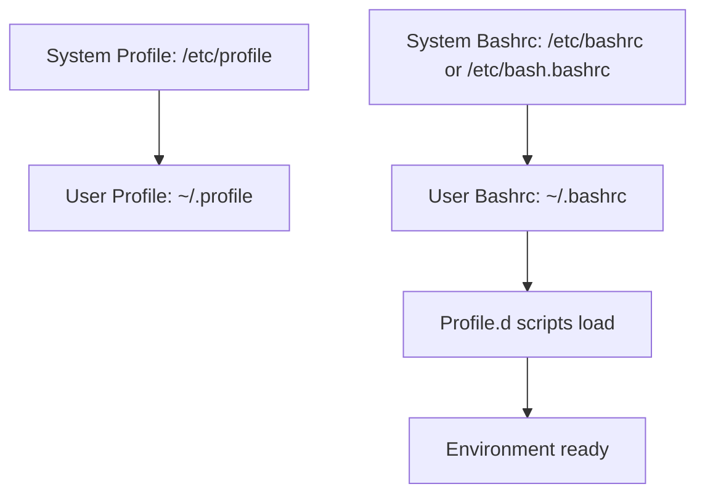

# Section 21: Profile Files

<head>
<summary><b>Section 21: Profile Files (CL-KK-Terminal)</b></summary>
</head>

## Table of Contents

- [Overview of Profile Files](#overview-of-profile-files)
- [System Profile Files](#system-profile-files)
- [User Profile Files](#user-profile-files)
- [Profile Execution Process](#profile-execution-process)
- [Lab Demos: Working with Profile Files](#lab-demos-working-with-profile-files)
- [Summary](#summary)

## Overview of Profile Files

Profile files in Linux serve as critical startup scripts that configure the system environment, define variables, functions, and load necessary settings when a user logs in or starts a new shell session. They are categorized into two main types: system profile files that apply global settings for all users, and user profile files that provide individual user-specific customizations. Understanding profile files is essential for system administrators and users who need to customize their Linux environment effectively.

These files control environment variables like `$PATH`, `$HOME`, and `$PS1`, as well as keyboard mappings and system-wide aliases. Both Debian-based and Red Hat-based distributions maintain profile files, though the naming conventions and specific file locations may differ slightly between distributions. Modern Linux systems integrate both Ubuntu and CentOS lineages, requiring knowledge of profile file implementations across different base distributions.

## System Profile Files

System profile files are located in `/etc` and are responsible for global environment setup that applies to all users on the system. These files load environment variables, aliases, functions, and other settings automatically during system startup and user login processes.

### Key System Profile Files

| Distribution | Profile Files | Purpose |
|--------------|--------------|---------|
| Red Hat/CentOS | `/etc/profile`<br>`/etc/bashrc`<br>`/etc/profile.d/`<br>`/etc/inputrc` | Global environment variables, PS1 configuration, function definitions, keyboard mapping |
| Debian/Ubuntu | `/etc/profile`<br>`/etc/bash.bashrc`<br>`/etc/profile.d/`<br>`/etc/inputrc` | Same as above with slight variations |

### `/etc/profile` Details
This is the primary system profile file that executes once during system startup. It serves several critical functions:

```bash
# System-wide environment variables
PATH="/usr/local/bin:/usr/bin:/bin"
export PATH

# PS1 configuration for prompt
PS1="\u@\h:\w \$ "

# Loading of additional scripts
if [ -d /etc/profile.d ]; then
  for i in /etc/profile.d/*.sh; do
    if [ -r $i ]; then
      . $i
    fi
  done
fi
```

### `/etc/bashrc` (Red Hat) vs `/etc/bash.bashrc` (Debian)
The bashrc file loads interactively for each shell session:

```bash
# Configuration per shell session
[ -z "$PS1" ] && return  # Exit if non-interactive
shopt -s histappend      # Append history
HISTSIZE=1000
HISTFILESIZE=2000
```

### `/etc/profile.d/` Directory
This directory allows administrators to drop custom script files that are automatically sourced by `/etc/profile`. Any `.sh` file placed here becomes available system-wide without modifying core system files.

### `/etc/inputrc` Configuration
This file handles keyboard mapping and input configuration:
```bash
# Example keyboard settings
set completion-ignore-case on
set show-all-if-ambiguous on
"\e[1~": beginning-of-line  # Home key
```

## User Profile Files

User profile files are stored in each user's home directory and provide customization options specific to individual users. These files override system-wide settings and allow personal environment configurations.

### Key User Profile Files

| Filename | Purpose | Execution Time |
|----------|---------|----------------|
| `~/.profile` | Login shell configuration | Once during login |
| `~/.bashrc` | Interactive shell settings | Each new shell |
| `~/.bash_logout` | Logout configuration | During logout |
| `~/.bash_history` | Command history | Auto-created |

### Home Directory Profile Files

For Red Hat/CentOS systems:
- `~/.profile` - Primary login configuration
- `~/.bashrc` - Interactive shell settings  
- `~/.bash_logout` - Cleanup on logout

For Debian/Ubuntu systems:
- `~/.profile` - Main login profile
- `~/.bash_logout` - Logout scripts

### File Execution Hierarchy



## Profile Execution Process

Understanding the profile loading sequence is crucial for debugging environment issues and implementing proper customizations.

### Login Process Flow

1. **System Level**: `/etc/profile` loads first, setting global environment variables
2. **User Level**: `~/.profile` executes, potentially overriding system settings
3. **Shell Sessions**: For each new interactive shell, `~/.bashrc` loads
4. **Dependencies**: Profile.d scripts are included in the loading process

### Key Differences Between Distributions

| Aspect | Red Hat Family | Debian Family |
|--------|----------------|---------------|
| Main user file | `~/.bashrc` | `~/.profile` |
| Interactive config | More features in bashrc | Basic in profile |
| Logout handling | `~/.bash_logout` | `/etc/bash_logout` or `~/.bash_logout` |

### Environment Variable Loading

```bash
# In ~/.bashrc or ~/.profile
export EDITOR=vim
export JAVA_HOME=/usr/java/default
export PATH=$PATH:$HOME/bin

# Function definitions
function extract() {
    if [ -f $1 ]; then
        case $1 in
            *.tar.bz2) tar xvjf $1 ;;
            *.tar.gz)  tar xvzf $1 ;;
            *) echo "don't know how to extract '$1'..." ;;
        esac
    else
        echo "'$1' is not a valid file!"
    fi
}
```

## Lab Demos: Working with Profile Files

### Demo 1: Examining System Profile Files

**Goal**: Understand the contents and function of system profile files

**Steps**:
1. View system profile file:
   ```bash
   cat /etc/profile
   ```

2. Check profile.d directory:
   ```bash
   ls -la /etc/profile.d/
   ```

3. View per-shell configuration:
   ```bash
   cat /etc/bashrc  # or /etc/bash.bashrc on Debian
   ```

### Demo 2: Customizing User Profile

**Goal**: Add custom environment variables and functions to user profile

**Steps**:
1. Edit user profile file:
   ```bash
   vi ~/.bashrc  # or ~/.profile
   ```

2. Add custom configuration:
   ```bash
   # Add to ~/.bashrc
   export MY_VAR="Hello World"
   export PATH=$PATH:~/my_scripts

   # Add function
   function hello() {
       echo "Hello from profile!"
   }
   ```

3. Reload profile or start new shell:
   ```bash
   source ~/.bashrc
   ```

4. Verify changes:
   ```bash
   echo $MY_VAR
   hello
   ```

### Demo 3: Profile Loading Verification

**Goal**: Verify which profile files are loading during login

**Steps**:
1. Add debug messages to profile files

2. Login to see execution order

3. Check environment variables:
   ```bash
   echo $PATH
   echo $PS1
   echo $HOME
   ```

## Summary

### Key Takeaways

```diff
+ Profile files are essential for Linux environment configuration
+ System profiles (/etc/*) apply globally to all users
+ User profiles (~/) provide individual customizations
+ Execution follows hierarchical loading: system → user → interactive shells
+ Modifications should be made carefully to avoid system issues
! Red Hat and Debian families have slightly different file naming conventions
! Always source profiles after modifications: source ~/.bashrc
```

### Quick Reference

**Most Common Profile Files:**
- `/etc/profile` - Primary system profile
- `/etc/bashrc` or `/etc/bash.bashrc` - System shell configuration
- `~/.profile` - User login profile  
- `~/.bashrc` - User interactive shell settings

**Useful Commands:**
```bash
cat /etc/profile           # View system profile
ls ~/.profile ~/.bashrc   # Check user profiles
source ~/.bashrc          # Reload user profile
env | grep PATH          # Check PATH variable
bash --login             # Start login shell
```

### Expert Insight

**Real-world Application**: In production environments, profile files are commonly used for setting up development environments, configuring tool paths (like Java, Python, or Go), and establishing consistent shell behaviors across teams. System administrators often create custom scripts in `/etc/profile.d/` for company-wide tool installations and environment standardization.

**Expert Path**: Master profile files by understanding the complete boot sequence, learning to debug environment issues with `env` and `set` commands, and implementing secure practices like avoiding excessive PATH modifications that could introduce security risks. Study bash completion and inputrc configuration for advanced shell customization.

**Common Pitfalls**: 
- Modifying `/etc/profile` incorrectly can break system functionality for all users
- Overwriting `$PATH` instead of prepending/appending can cause system tools to become inaccessible
- Not understanding the difference between profile vs bashrc execution timing
- Placing user-specific configs in system files creates maintenance challenges

> [!IMPORTANT] 
> Always backup profile files before modification and test changes in a non-production environment first.

> [!NOTE]
> For distributions using different shells (zsh, fish), profile mechanisms vary significantly and require additional study.

</details>
