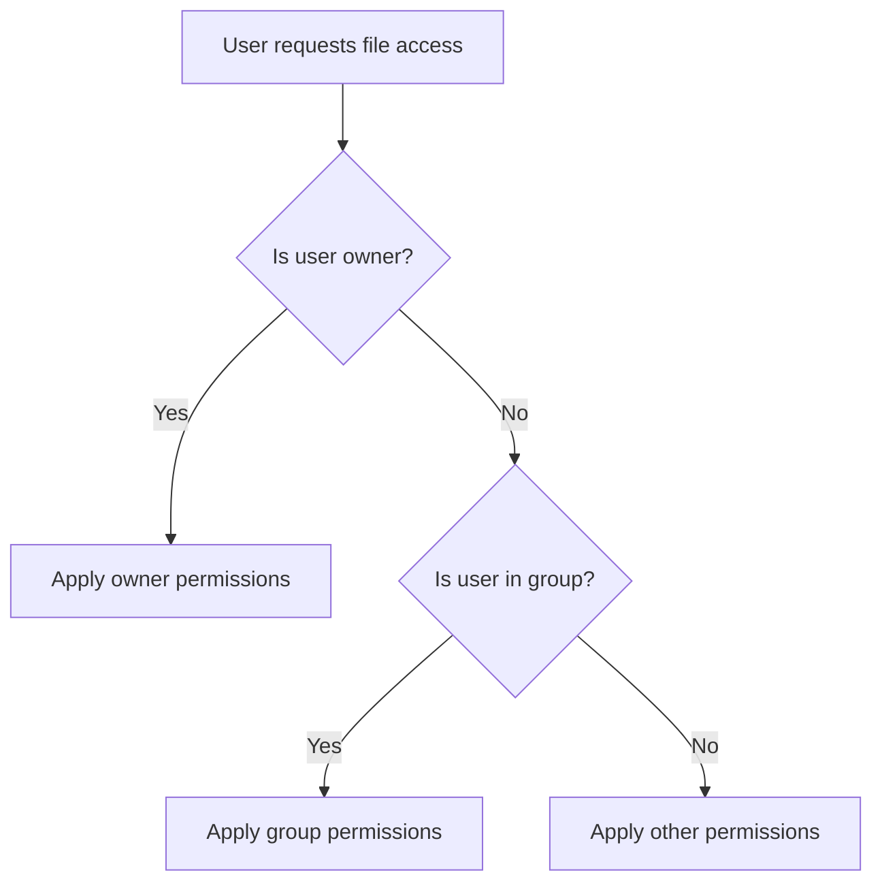

# Section 22: Group Management

<details open>
<summary><b>Section 22: Group Management (CL-KK-Terminal)</b></summary>

## Table of Contents

- [Benefits of Groups](#benefits-of-groups)
- [Primary and Secondary Groups](#primary-and-secondary-groups)
- [Adding Groups](#adding-groups)
- [Adding Users to Groups](#adding-users-to-groups)
- [Changing Primary Groups](#changing-primary-groups)
- [Modifying Groups](#modifying-groups)
- [Deleting Groups](#deleting-groups)
- [Group Administrators](#group-administrators)
- [Newgrp Command and Sub-shells](#newgrp-command-and-sub-shells)

## Benefits of Groups

### Overview
Groups in Linux are collections of users that help manage permissions efficiently. Instead of assigning permissions to individual users repeatedly, administrators can assign them to entire groups, allowing multiple users to inherit the same access rights through group membership.

### Key Concepts

**File Permission Model**: Groups work alongside the traditional Linux permission model (owner-group-others) to provide scalable access control.



**Permission Inheritance**: When a user belongs to multiple groups, they inherit permissions from all their groups.

### Labs and Commands

To view current group memberships:
```bash
groups [username]          # Show groups for a user
id [username]             # Show detailed user/group information
```

**Output Example**:
```
user1 : user1 adm cdrom sudo
```
> Groups are fundamental to organizing access control in multi-user environments.

- Primary group: Automatically created when user is added
- Secondary groups: Additional groups for specific permissions

## Primary and Secondary Groups

### Overview
Linux distinguishes between primary (initial) groups and secondary (additional) groups. Every user must have exactly one primary group but can belong to multiple secondary groups.

### Key Concepts

**Primary Group Characteristics**:
- Created automatically when user is added
- Stored in `/etc/group` file
- User's main group for file ownership
- UID and GID are typically identical for primary groups

```bash
# View primary group in /etc/passwd
tail -n 5 /etc/passwd

# Output format: username:x:uid:gid:gecos:home:shell
raj:*:1001:1001:User Raj:/home/raj:/bin/bash
```

**Secondary Groups**:
- Must be created manually
- Provide additional permissions
- No automatic creation during user add

**Group File Structure** (`/etc/group`):
```
groupname:x:gid:user1,user2,user3
```

### Commands

```bash
# View current user's groups
groups

# Check user's primary group ID
id -gn $USER

# View all group memberships
id $USER
```

> [!IMPORTANT]
> Primary groups cannot be removed - every user must belong to exactly one primary group. Secondary groups are optional and can be assigned/removed as needed.

## Adding Groups

### Overview
Groups can be created manually using the `groupadd` command. Unlike primary groups that are auto-created with users, secondary groups require explicit creation.

### Key Concepts

**Manual Group Creation Process**:
```bash
groupadd [options] groupname

# Example: Create a group called 'developers'
groupadd developers
```

**Group File Updates**:
After group creation, the new group appears in `/etc/group`:
```bash
tail -n 3 /etc/group

# Output:
# developers:x:1002:
# (empty members list initially)
```

### Verification

```bash
# Check if group was created
grep "^developers:" /etc/group

# View group information
getent group developers
```

### Alternatives

**Text Editor Method**:
```bash
# Edit /etc/group directly (not recommended)
vi /etc/group
# Add line: newgroup:x:1003:
```

> [!NOTE]
> Manual group creation is necessary for secondary groups. Primary groups are created automatically during user addition.

## Adding Users to Groups

### Overview
Users can be added to existing groups using the `usermod` command or by directly editing group configuration files. This allows users to inherit group permissions.

### Key Concepts

**Using usermod Command**:
```bash
usermod [options] username

# Add user to secondary group
usermod -G groupname username
usermod -aG group1,group2 username  # Add to multiple groups

# Caution: Without -a, all existing secondary groups are replaced
usermod -a -G newgroup username     # Append to existing groups
```

**Direct File Editing**:
```bash
# Edit /etc/group file
vi /etc/group
# Find the group line and add username:
# groupname:x:gid:user1,newuser,user3
```

### Verification Methods

```bash
# Check user's group membership
groups username
id username

# View group members
cat /etc/group | grep '^groupname:'
```

### Example Workflow

```bash
# Create new group
groupadd projectteam

# Add user 'john' to the group
usermod -aG projectteam john

# Verify membership
groups john
# Output: john : john projectteam
```

> [!WARNING]
> Omitting the `-a` flag in `usermod -G` will replace all existing secondary groups. Always use `-aG` to append groups safely.

**Administrative Permissions Required**: Root or `sudo` access needed for group modifications.

## Changing Primary Groups

### Overview
Primary groups can be changed using the `usermod` command. This affects file ownership and group permissions for newly created files.

### Key Concepts

**Primary Group Change Syntax**:
```bash
# Change primary group for a user
usermod -g new_primary_group username

# The -g option specifies the primary group
# This replaces the current primary group
```

**Example**:
```bash
# Change primary group from 'user1' to 'developers'
usermod -g developers user1

# Verify change in /etc/passwd
grep "^user1:" /etc/passwd
# Output: user1:x:1001:1005::/home/user1:/bin/bash
# (where 1005 is the GID of 'developers' group)
```

### Limitations and Considerations

- Primary group cannot be completely removed
- User must always have exactly one primary group
- Secondary groups remain unaffected by primary group change

> [!IMPORTANT]
> The primary group change affects the GID field in `/etc/passwd` and determines default group ownership for new files created by that user.

## Modifying Groups

### Overview
Existing groups can be modified using the `groupmod` command. Common modifications include renaming groups or changing GIDs.

### Key Concepts

**Group Modification Commands**:
```bash
groupmod [options] groupname

# Rename a group
groupmod -n newname oldname

# Change group ID
groupmod -g new_gid groupname
```

**Example: Group Renaming**:
```bash
# Rename 'developers' to 'engineers'
groupmod -n engineers developers

# Verify in /etc/group
grep "^engineers:" /etc/group
```

**Options Available**:
- `-g`: Change GID
- `-n`: Change group name
- `-p`: Change password (rarely used for groups)

### File-Based Editing

Groups can also be modified by directly editing `/etc/group`:
```bash
vi /etc/group
# Modify group entries manually
```

> [!NOTE]
> Group modifications require root privileges. When renaming groups, all user memberships and file permissions are automatically updated.

## Deleting Groups

### Overview
Groups can be deleted using the `groupdel` command. However, groups with existing users or that serve as users' primary groups cannot be removed.

### Key Concepts

**Group Deletion Requirements**:
```bash
groupdel groupname
```

**Restrictions**:
- Cannot delete a user's primary group
- Group must be empty (no members) or primary group must be changed first

**Example Workflow**:
```bash
# First change primary group for all users in the group
usermod -g othergroup user1

# Then remove the group
groupdel oldgroup
```

**Alternative Method**:
```bash
# Edit /etc/group file and remove the line
vi /etc/group
# Delete the line: groupname:x:gid:members
```

### Verification

```bash
# Check if group still exists
getent group groupname

# List all groups
cut -d: -f1 /etc/group | sort
```

> [!IMPORTANT]
> Attempting to delete a primary group will result in an error. Always change users' primary groups before deletion.

## Group Administrators

### Overview
Linux allows designating specific users as group administrators. Group admins can manage group membership without full root privileges, following a model similar to WhatsApp groups.

### Key Concepts

**Administrator Privileges**:
- Add or remove users from groups
- Manage group membership without `su`/`sudo`
- Controlled user access

**Setting Group Administrators**:
```bash
# Add a user as group administrator
gpasswd -A username groupname

# View group administrators
gpasswd -A groupname
```

**Administrator Commands**:
```bash
# As admin, add user to group
gpasswd -a newuser groupname

# As admin, remove user from group
gpasswd -d user groupname

# Remove all administrators
gpasswd -R groupname
```

### User Perspective

**Non-administrators**:
- Cannot add/remove users from groups
- Can request membership changes

**Administrators**:
- Full control within their assigned groups
- No superuser privileges needed for group management

**Example**:
```bash
# Make 'john' admin of 'project'
gpasswd -A john project

# Now 'john' can add users without sudo
gpasswd -a mary project  # As john user
```

> [!NOTE]
> Group administrators provide delegated authority for user management in large organizations, reducing the need for constant root intervention.

## Newgrp Command and Sub-shells

### Overview
The `newgrp` command creates temporary sub-shells with different primary group contexts. This allows users to work in alternate group environments without changing their main group membership.

### Key Concepts

**Sub-shell Creation**:
```bash
newgrp [groupname]
```

**Behavior**:
- Starts a new shell with specified group as primary
- Returns to original group when exited
- Creates additional shell levels

```bash
# Check current shell level
echo $SHLVL  # Usually 1

# Create new group shell
newgrp developers

# Check new level
echo $SHLVL  # Now 2

# Current primary group changed temporarily
id -gn

# Exit back to original shell
exit
```

**Shell Level Tracking**:
```bash
# Monitor shell nesting
ps -o pid,ppid,cmd
echo $SHLVL
```

**Process Hierarchy**:
```
Original Shell (Level 1)
├── newgrp subprocess (Level 2)
│   └── Files created here get 'developers' group
├── Another newgrp subprocess (Level 3)
│   └── Different group context
└── Back to Level 1 after exit
```

### Practical Usage

```bash
# Work in project group temporarily
newgrp project

# Create files with project group ownership
touch project_file.txt   # Owned by project group

# Exit to return to original group
exit
```

### Files Created in Newgrp Context

Files created within `newgrp` inherit the temporary primary group:
```bash
# In normal shell
ls -la test.txt
# Output: -rw-r--r-- user user test.txt

# In newgrp developers
ls -la test.txt
# Would be: -rw-r--r-- user developers test.txt
```

> [!NOTE]
> Multiple `newgrp` commands create nested sub-shells. Each level increases shell depth, and file creation uses the current shell's primary group context.

## Summary

### Key Takeaways
```diff
+ Groups enable efficient permission management for multiple users
+ Every user has exactly one primary group (auto-created) and zero or more secondary groups
! Primary groups cannot be removed or replaced without assignment to alternatives
- Use -aG when adding users to groups to preserve existing memberships
+ Group administrators can manage memberships without full root access
- Direct /etc/group editing requires careful syntax to avoid system issues
+ newgrp creates temporary group contexts for specific workflow needs
```

### Quick Reference

**Essential Commands**:
```bash
# User/Group Management
useradd username           # Create user with primary group
groupadd groupname         # Create secondary group
usermod -aG group user     # Add user to group
usermod -g group user      # Change primary group
groups username           # Show user groups
id username               # Detailed user/group info

# Group Administration
gpasswd -A admin group     # Set group administrator
gpasswd -a user group      # Add user (by admin)
newgrp group              # Start group-specific subshell

# Group Modification
groupmod -n newname old   # Rename group
groupdel groupname        # Delete group (if safe)

# File Operations
tail -n 5 /etc/passwd     # View recent users/groups
tail -n 5 /etc/group      # View recent groups
```

### Expert Insight

**Real-world Application**: 
In enterprise environments, groups organize access by departments, projects, or roles. For example, a "webdev" group might contain all developers working on web projects, ensuring consistent file sharing while maintaining security boundaries.

**Expert Path**: 
Master group nesting and ACLs (Access Control Lists) for advanced permission scenarios. Learn LDAP integration for enterprise-scale group management and automated user provisioning scripts.

**Common Pitfalls**: 
Forgetting the `-a` flag in `usermod -G` causes loss of existing group memberships; attempting to delete primary groups without reassignment; overlooking group administrator delegation in large teams.

</details>
