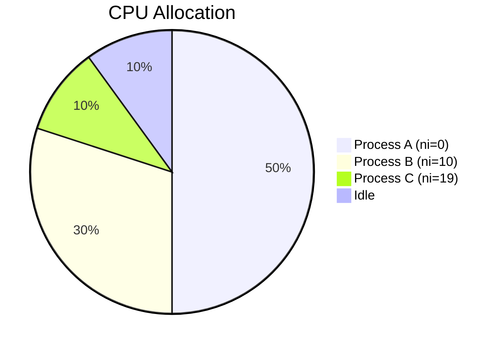

# Section 28: Linux Process Management and Job Scheduling

<details open>
<summary><b>Section 28: Linux Process Management and Job Scheduling (CL-KK-Terminal)</b></summary>

## Table of Contents
1. [Introduction to Top Command](#introduction-to-top-command)
2. [Understanding Top Command Output](#understanding-top-command-output)
3. [Process Priorities and Nice Values](#process-priorities-and-nice-values)
4. [Practical Examples of CPU Load and Process Management](#practical-examples-of-cpu-load-and-process-management)
5. [Job Scheduling with Jobs, BG, and FG Commands](#job-scheduling-with-jobs-bg-and-fg-commands)

## Introduction to Top Command

### Overview
The "top" command is a crucial tool for Linux system administrators to monitor and manage running processes. It provides real-time information about system resources, process details, and performance metrics. Unlike static commands like ps, "top" offers a dynamic, interactive view that updates continuously.

### Key Concepts
- **Purpose**: Monitor CPU usage, memory consumption, process states, and system load.
- **Basic Usage**: Simply run `top` in the terminal to display the interface.
- **Process States**: Processes can be Running, Sleeping, Stopped, or Zombie. Zombie processes are terminated but entries remain.
- **Real-world Application**: Use "top" for troubleshooting high resource usage, identifying runaway processes, and ensuring system stability during performance issues.

### Code/Config Blocks
```bash
# Launch top interactively
top

# Check top version
top -V

# Sort by CPU usage
top -p $(pgrep process_name)
```

> [!NOTE]
> In the transcript, "zombie" processes are correctly described as terminated processes with entries remaining, not consuming resources.

### Lab Demos
- **Demonstrate Zombie Process**: Compile and run a simple C program that creates child processes. Use `ps` to show process states and `kill` to terminate.

## Understanding Top Command Output

### Overview
The "top" command interface displays multiple lines of information, including system uptime, load averages, CPU and memory usage, and detailed process listings. Understanding each section is essential for effective monitoring.

### Key Concepts
- **Top Line**: Shows system time, uptime, user count, and load averages (last 1, 5, 15 minutes).
- **Second Line**: Total tasks: running, sleeping, stopped, zombie.
- **Third Line**: CPU breakdown: us (user space), sy (kernel space), ni (nice processes), id (idle), wa (I/O wait), hi (hardware interrupts), si (software interrupts), st (stolen time).
- **Memory Lines**: Physical RAM usage and swap space utilization.
- **Process Table**: Columns like PID (Process ID), USER, PR (Priority), NI (Nice value), VIRT/RES/SHR (Memory), S (State), %CPU, %MEM, TIME+, COMMAND.

> [!TIP]
> Navigate "top" interactively: Press 'M' for memory sort, 'P' for CPU sort, 'K' to kill a process, 'q' to quit.

> [!IMPORTANT]
> CPU states indicate resource allocation: User processes (us), kernel processes (sy), nice-adjusted processes (ni), idle time (id).

### Code/Config Blocks
```bash
# Sort by memory usage (interactive: press 'M')
top
# Sort by CPU usage (interactive: press 'P')
top

# Filter by user
top -u username

# Show specific processes
top -p PID1,PID2

# Batch mode for scripts
top -b -n1
```

### Tables
| Column | Description |
|--------|-------------|
| PID | Process ID |
| USER | Process owner |
| PR | Priority |
| NI | Nice value (-20 to 19) |
| %CPU | CPU usage percentage |
| %MEM | Memory usage percentage |
| TIME+ | Total CPU time |
| COMMAND | Process command |

> [!NOTE]
> Transcript mentions "evrage load" which should be "average load". Corrected here.

## Process Priorities and Nice Values

### Overview
Process priorities control how the CPU allocates time to running processes. Linux uses "nice" values to adjust priorities, allowing adjustments from -20 (highest priority) to 19 (lowest priority). Only root can set negative nice values.

### Key Concepts
- **Priority Range**: 0-139 (0-99 real-time, 100-139 user space), mapped via formula: Priority = Nice + 20.
- **Nice Values**: -20 (highest CPU time) to 19 (lowest CPU time). Negative values increase priority.
- **Effects**: Higher priority processes get more CPU time, useful for critical services like production databases.
- **Real-world Application**: Adjust priorities for resource-intensive applications to prevent system slowdowns during peak loads.

### Code/Config Blocks
```bash
# View nice value of a process
ps -o pid,comm,nice

# Set nice value (positive for lower priority)
nice -n 10 ./script.sh

# Set nice value for existing process (requires root for negative)
renice -n -5 -p PID

# Start with specific nice value
nice -n -10 bash -c "infinite loop command"
```

> [!WARNING]
> Only root can set negative nice values. Incorrectly setting priorities can lead to system instability.

### Lab Demos
- **Create CPU load with scripts**: Compile and run multiple infinite loops, then adjust nice values to observe CPU allocation changes.

Graphically, this can be shown as:



## Practical Examples of CPU Load and Process Management

### Overview
This section demonstrates practical process management by creating and controlling CPU-intensive processes to study nice values' impact on performance.

### Key Concepts
- **Infinite Loop Creation**: Use C programs or bash scripts to generate CPU load.
- **Nice Impact**: Setting higher nice values reduces CPU share; lower nice values increase it.
- **Process Killing**: Use `kill` to terminate processes, but zombie processes can't be killed directly.
- **Resource Monitoring**: Combine "top" with ps to track changes.

### Code/Config Blocks
```bash
# C program example (zombie.c as mentioned)
#include <stdio.h>
#include <unistd.h>

int main() {
    int pid = fork();
    if (pid > 0) {
        sleep(30); // Parent creates child, runs briefly
    } else {
        printf("Child process, PID: %d\n", getpid());
        return 0; // Child exits
    }
    return 0;
}

# Compile and run
gcc zombie.c -o zombie
./zombie &

# Adjust nice value
renice -n 10 -p <PID>
```

> [!NOTE]
> Transcript mentions "slecp" which is likely a typo for "sleep". Corrected to "sleep".

### Tables
| Nice Value | Priority Effect | CPU Share Impact |
|------------|-----------------|-------------------|
| -20 | Highest | Max CPU allocation |
| 0 | Default | Equal share |
| 19 | Lowest | Minimal CPU share |

> [!EXAMPLE]
> Running multiple scripts with different nice values shows priority distribution.

## Job Scheduling with Jobs, BG, and FG Commands

### Overview
Job scheduling in Bash allows background execution of processes, enabling multitasking. Commands like "jobs", "bg", and "fg" manage these jobs.

### Key Concepts
- **Jobs Command**: Lists current jobs with statuses.
- **BG Command**: Moves a stopped job to background.
- **FG Command**: Brings a background job to foreground.
- **States**: Running, Stopped, Done, or background indicators (+ current, - previous).
- **PID Viewing**: Use `jobs -p` to see process IDs.

> [!TIP]
> Control jobs: Use Ctrl+Z to stop foreground, then bg/fg to manage.

### Code/Config Blocks
```bash
# Start a job and move to background
sleep 300 &
jobs

# Stop a foreground process
# (Run command, then Ctrl+Z)
bg %1  # Resume in background

# Bring to foreground
fg %1

# List jobs with PIDs
jobs -p
```

### Lab Demos
- Start multiple sleep commands, use jobs to list, then bg/fg to switch between them.

```diff
+ Foreground: fg %1
- Background: bg %1
! Stop: Ctrl+Z
```

## Summary

### Key Takeaways
```diff
+ Master the "top" command for real-time system monitoring
+ Understand nice values to control process priorities effectively
+ Use job control for efficient multitasking
+ Process states impact: Running > Zombie (non-resource consuming)
- Avoid misconfigurations that could destabilize priority scheduling
+ Combine ps and top for comprehensive process insight
```

### Quick Reference
| Command | Purpose | Example |
|---------|---------|---------|
| `top` | Monitor processes | `top` |
| `nice` | Set initial priority | `nice -n 10 cmd` |
| `renice` | Adjust running process | `renice -5 -p 1234` |
| `jobs` | List jobs | `jobs -p` |
| `bg %n` | Background job | `bg %1` |
| `fg %n` | Foreground job | `fg %1` |

### Expert Insight

#### Real-world Application
In production environments, use "top" and nice values to prioritize database queries over background backups. For web servers, monitor memory usage to prevent OOM kills during traffic spikes.

#### Expert Path
- Dive deep into kernel scheduling policies (CFS, RT) and explore `chrt` for real-time priorities.
- Automate monitoring with scripts that parse "top" output or use `at`/`cron` for scheduled tasks.
- Combine with tools like `sar` for historical performance analysis.

#### Common Pitfalls
- Setting overly aggressive negative nice values without root can cause security issues.
- Overlooking zombie processes as they don't consume resources but indicate process management problems.
- Forgetting job control can leave orphaned processes running indefinitely.

🤖 Generated with [Claude Code](https://claude.com/claude-code)

Co-Authored-By: Claude <noreply@anthropic.com>
</details>
