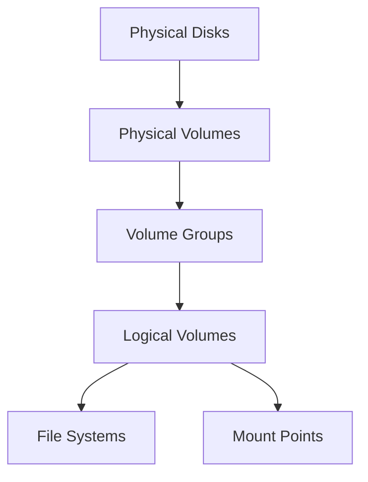

# Section 32: Logical Volume Features in Linux

<details open>
<summary><b>Section 32: Logical Volume Features in Linux (CL-KK-Terminal)</b></summary>

## Table of Contents
- [Introduction](#introduction)
- [Problems with Standard Partitions](#problems-with-standard-partitions)
- [Understanding LVM (Logical Volume Manager)](#understanding-lvm-logical-volume-manager)
- [LVM Components: Physical Volumes, Volume Groups, and Logical Volumes](#lvm-components-physical-volumes-volume-groups-and-logical-volumes)
- [Creating Logical Volumes](#creating-logical-volumes)
- [Extending Logical Volumes](#extending-logical-volumes)
- [Mounting and Using LVM Volumes](#mounting-and-using-lvm-volumes)
- [Snapshot Feature in LVM](#snapshot-feature-in-lvm)
- [Migrating Volumes](#migrating-volumes)
- [Removing LVM Components](#removing-lvm-components)

## Introduction
This section covers the Logical Volume Manager (LVM) feature in Linux, also known as LVM or ELBM (Logical Volume). LVM provides flexible disk management capabilities, addressing limitations of standard partitions. It allows for easier resizing, snapshotting, and management of storage compared to traditional partitioning. The session demonstrates practical commands for creating, extending, and managing logical volumes, highlighting why LVM is preferred over standard partitions for scalable Linux systems.

## Problems with Standard Partitions

### Key Limitations
Standard partitions suffer from several constraints that make them inflexible for dynamic storage needs in production environments:

- **Inability to Resize**: Extending or reducing file systems requires backing up data, deleting and recreating partitions, and restoring data. This process is time-consuming and risky, increasing chances of data corruption.
- **Waste of Space**: When a partition is created with fixed sizes, free space elsewhere can't be easily utilized without complex repartitioning.
- **No Snapshot Feature**: There's no built-in way to create backups or snapshots without affecting production data.
- **Manual Management**: Adding new disks or redistributing space involves significant downtime and error-prone procedures.

> [!WARNING]
> These issues are particularly problematic in enterprise environments where storage demands change frequently and downtime costs money.

### Why LVM Solves These Problems
LVM introduces abstraction layers that make storage more flexible:
- **Dynamic Resizing**: Volumes can be extended or reduced online without backups or downtime.
- **Snapshot Support**: Create read-only copies for backups or testing.
- **Volume Migration**: Move volumes between disks or systems seamlessly.
- **Efficient Space Utilization**: Combine multiple physical disks into virtual groups and allocate space dynamically.

> [!NOTE]
> LVM is especially valuable in cloud environments, virtual machines, and server infrastructures where storage scalability is crucial.

## Understanding LVM (Logical Volume Manager)

LVM works by creating layers of abstraction over physical storage:

1. **Physical Volumes (PVs)**: Raw disk partitions converted to PVs.
2. **Volume Groups (VGs)**: Collections of PVs that act as a virtual storage pool.
3. **Logical Volumes (LVs)**: Virtual partitions carved out of VGs, which can be formatted and mounted like regular partitions.



### Advantages of LVM
- **Flexibility**: Resize volumes dynamically without service interruption.
- **Snapshots**: Capture point-in-time copies of volumes.
- **Striping/Mirroring**: Advanced RAID-like features.
- **Hot Swapping**: Replace or add disks while system is running.

> [!IMPORTANT]
> LVM requires the `lvm2` package to be installed on Linux systems. Modern distributions usually include this by default.

## LVM Components: Physical Volumes, Volume Groups, and Logical Volumes

### Physical Volumes (PVs)
PVs are base building blocks. Created from disk partitions using the `pvcreate` command.

**Example Commands:**
```bash
# Check available disks
fdisk -l

# Create partition (e.g., on /dev/sdb)
fdisk /dev/sdb
# Create new partition, set type to "Linux LVM" (0x8e)

# Convert partition to Physical Volume
pvcreate /dev/sdb1

# Display PV information
pvdisplay /dev/sdb1
```

### Volume Groups (VGs)
VGs combine multiple PVs into a storage pool. Use commands like `vgcreate`, `vgdisplay`.

**Example Commands:**
```bash
# Create Volume Group
vgcreate vg_name /dev/sdb1 /dev/sdc1

# Display VG information
vgdisplay vg_name
```

### Logical Volumes (LVs)
LVs are virtual partitions created from VG space. Use `lvcreate`, `lvdisplay`.

**Example Commands:**
```bash
# Create Logical Volume (e.g., 2GB from vg_name)
lvcreate -L 2G -n lv_name vg_name

# Display LV information
lvdisplay /dev/vg_name/lv_name
```

> [!TIP]
> LVM uses paths like `/dev/vg_name/lv_name` for accessing logical volumes.

## Creating Logical Volumes

### Step-by-Step Process
The session demonstrates creating LVM on two disks with partitions.

1. **Prepare Disks**: Install additional disks and create partitions using `fdisk`.
2. **Convert to PVs**: Use `pvcreate` on each partition.
3. **Create VG**: Use `vgcreate` to group PVs.
4. **Create LV**: Use `lvcreate` with size specification.
5. **Format LV**: Use `mkfs` to create file system (e.g., ext4).
6. **Mount LV**: Create mount point and mount the file system.

**Practical Example from Demo:**
- Two 2GB partitions: `/dev/sdb1` and `/dev/sdb2`
- Created VG `vg0` combining both PVs
- Created 1.5GB LV `lv0` for EXT4 file system
- Mounted to `/test` directory

```bash
# Convert partitions to PVs
pvcreate /dev/sdb1
pvcreate /dev/sdb2

# Create VG
vgcreate vg0 /dev/sdb1 /dev/sdb2

# Create LV
lvcreate -L 1.5G -n lv0 vg0

# Format with EXT4
mkfs.ext4 /dev/vg0/lv0

# Mount
mkdir /test
mount /dev/vg0/lv0 /test
```

> [!NOTE]
> The demo shows 2GB partitions but creates a 2GB VG and 1.5GB LV, leaving free space for future expansion.

### Verification Commands
```bash
# Check LVM status
pvs   # Physical Volumes
vgs   # Volume Groups
lvs   # Logical Volumes
```

## Extending Logical Volumes

### Why Extend?
When file systems outgrow their allocated space, LVM allows seamless extension without data loss.

**Scenario**: LV `lv0` is 1.5GB, but needs 3GB. VG has available space.

### Extension Process
1. **Extend LV**: Use `lvextend` to add space.
2. **Resize File System**: Use `resize2fs` (for EXT) to recognize new space.
   - For EXT4: `resize2fs /dev/vg0/lv0`
   - For XFS: `xfs_growfs /mount/point`

**Example Commands:**
```bash
# Extend LV by adding another PV
pvcreate /dev/sdc1
vgextend vg0 /dev/sdc1

# Extend LV to full VG size or specific size
lvextend -l +100%FREE /dev/vg0/lv0
# or
lvextend -L +1.5G /dev/vg0/lv0

# Resize file system
resize2fs /dev/vg0/lv0
```

### Online Extension Benefits
- No unmounting required for many file systems
- No downtime for applications
- Instant space expansion

> [!IMPORTANT]
> Always check file system type before resizing. EXT supports online resize, while others may require unmount.

## Mounting and Using LVM Volumes

### Mounting LVs
After formatting, LVs work like regular partitions.

```bash
# Mount LV
mount /dev/vg0/lv0 /mount/point

# Add to /etc/fstab for persistence
echo "/dev/vg0/lv0 /mnt/test ext4 defaults 0 0" >> /etc/fstab
```

### Data Operations
- Create directories: `mkdir /mnt/test/data`
- Create files: `echo "test content" > /mnt/test/test.txt`
- Verify space: `df -h /mnt/test`

### Unmounting
```bash
umount /mnt/test
```

## Snapshot Feature in LVM

Snapshots capture read-only copies of LVs at a specific time, useful for backups or testing.

**Create Snapshot:**
```bash
lvcreate -s -L 500M -n snapshot_name /dev/vg0/lv0
```

**Mount and Access Snapshot:**
```bash
mount /dev/vg0/snapshot_name /snapshot_mount
# Now read-only copy is available
```

**Benefits**:
- Instant backup without stopping services
- Minimal space usage (copy-on-write)
- Restore by merging or creating new LV

> [!NOTE]
> Snapshots don't persist across reboots unless added to fstab.

## Migrating Volumes

LVM supports moving LVs between VGs or physical disks seamlessly.

### Volume Migration
```bash
# Move LV to another VG
lvmove -n lv0 /dev/vg0 /dev/new_vg

# Migrate to new disk
pvmove /dev/sdb /dev/sdc  # Move extents from one PV to another
```

### Applications
- Replace failing disks
- Load balance across storage
- Move volumes to new hardware

## Removing LVM Components

**Removal Process (Reverse of Creation):**

1. **Unmount LV**:
   ```bash
   umount /dev/vg0/lv0
   ```

2. **Remove LV**:
   ```bash
   lvremove /dev/vg0/lv0
   ```

3. **Remove VG**:
   ```bash
   vgremove vg0
   ```

4. **Remove PVs**:
   ```bash
   pvremove /dev/sdb1 /dev/sdc1
   ```

5. **Remove Partitions** (optional):
   ```bash
   fdisk /dev/sdb  # Delete partitions
   ```

> [!WARNING]
> Ensure data is backed up before removal. The process from LV to PV is irreversible.

## Summary

### Key Takeaways
```diff
+ LVM provides dynamic storage management over rigid partitions
+ Components: PVs → VGs → LVs offer abstraction and flexibility
+ Online resizing eliminates downtime for capacity expansion
+ Snapshots enable zero-downtime backups
+ Migration features support hardware upgrades and disaster recovery
- Requires careful planning to avoid data loss during removal
- Not suitable for boot partitions in some distributions
```

### Quick Reference
| Task | Command | Example |
|------|---------|---------|
| Create PV | `pvcreate` | `pvcreate /dev/sdb1` |
| Display PV | `pvdisplay` | `pvdisplay /dev/sdb1` |
| Create VG | `vgcreate` | `vgcreate vg0 /dev/sdb1` |
| Create LV | `lvcreate` | `lvcreate -L 2G -n lv0 vg0` |
| Extend LV | `lvextend` | `lvextend -L +1G /dev/vg0/lv0` |
| Resize FS | `resize2fs` | `resize2fs /dev/vg0/lv0` |
| Mount LV | `mount` | `mount /dev/vg0/lv0 /mnt` |
| Create Snapshot | `lvcreate -s` | `lvcreate -s -L 1G -n snap /dev/vg0/lv0` |

### Expert Insight

#### Real-world Application
In production Linux servers, LVM is essential for managing database storage (e.g., PostgreSQL, MySQL) where data grows unpredictably. For instance, web application logs might require sudden expansion during traffic spikes. LVM's online resize capabilities prevent service downtime during maintenance windows.

#### Expert Path
- Practice in virtual environments (VirtualBox, KVM) before production implementation.
- Understand LVM RAID (lvmraid) for redundancy.
- Learn monitoring with `dmsetup` and integration with tools like Nagios.
- Study advanced features like thin provisioning and caching.

#### Common Pitfalls
- Forgetting to run `partprobe` after partition changes, causing kernel to miss updates.
- Attempting to reduce IO-sensitive LVs without proper testing.
- Not reserving VG space for snapshots, leading to full VGs during backup operations.
- Ignoring file system limits when resizing (EXT4 max 1EiB, but VG limits apply).

</details>
