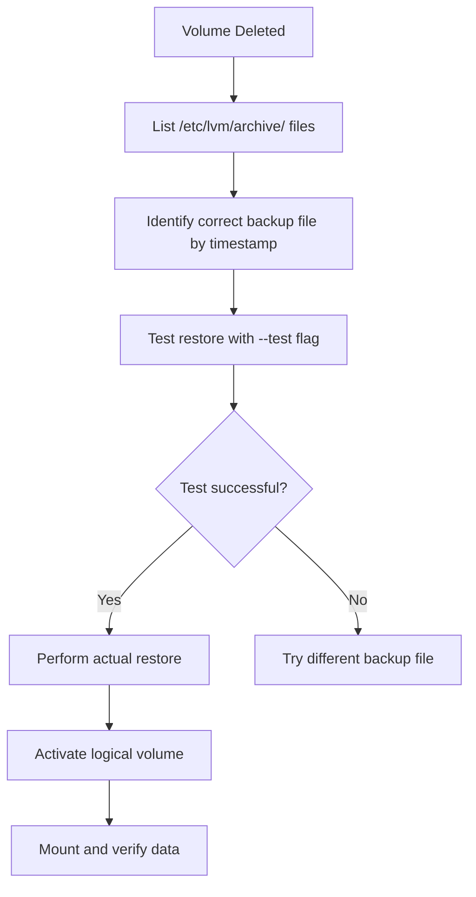

# Section 35: Restore Logical Volume LVM in Linux

<details open>
<summary><b>Section 35: Restore Logical Volume LVM in Linux (CL-KK-Terminal)</b></summary>

## Table of Contents
1. [Overview](#overview)
2. [Setup LVM Components](#setup-lvm-components)
3. [Create Logical Volume with File System](#create-logical-volume-with-file-system)
4. [Add Data to Logical Volume](#add-data-to-logical-volume)
5. [Delete Logical Volume](#delete-logical-volume)
6. [Restore Deleted Logical Volume](#restore-deleted-logical-volume)
7. [Activate and Verify Restored Volume](#activate-and-verify-restored-volume)
8. [Understanding LVM Attributes](#understanding-lvm-attributes)
9. [Best Practices for Recovery](#best-practices-for-recovery)
10. [Summary](#summary)

## Overview
This section demonstrates how to restore accidentally deleted logical volumes in LVM (Logical Volume Manager) while preserving all data. LVM automatically creates metadata backup files whenever changes are made to volumes, which can be used to restore deleted logical volumes using the `vgcfgrestore` command.

## Setup LVM Components
Before demonstrating the restore process, we'll set up the necessary LVM components:

- Physical disk/partition
- Physical Volume (PV)
- Volume Group (VG)
- Logical Volume (LV)

### Create Physical Volume
```bash
# Add a disk (example: /dev/sdb)
# Create partition on /dev/sdb
fdisk /dev/sdb
# Create primary partition, set type to 8e (Linux LVM)

# Create Physical Volume
pvcreate /dev/sdb1

# Verify Physical Volume
pvs
```

### Create Volume Group
```bash
# Create Volume Group named 'linux_vg' using the PV
vgcreate linux_vg /dev/sdb1

# Verify Volume Group
vgs
```

## Create Logical Volume with File System
```bash
# Create 3GB Logical Volume named 'lenovo_lv'
lvcreate -L 3G -n lenovo_lv linux_vg

# Verify Logical Volume
lvs

# Create file system (ext4)
mkfs.ext4 /dev/linux_vg/lenovo_lv

# Verify file system creation
blkid /dev/linux_vg/lenovo_lv
```

## Add Data to Logical Volume
```bash
# Create mount point
mkdir /mnt/lvm_data

# Mount the logical volume
mount /dev/linux_vg/lenovo_lv /mnt/lvm_data

# Create sample data
cd /mnt/lvm_data
mkdir dir_a dir_b dir_c dir_d
echo "Sample data file 1" > file1.txt
echo "Sample data file 2" > file2.txt
echo "Sample data file 3" > file3.txt
# ... create more sample files

# Verify data
ls -la
```

## Delete Logical Volume
To simulate an accidental deletion:
```bash
# Unmount first
umount /mnt/lvm_data

# Delete the logical volume (simulating accident)
lvremove /dev/linux_vg/lenovo_lv

# Verify deletion
lvs
# Should show no logical volumes or show as removed
```

## Restore Deleted Logical Volume
LVM maintains backup metadata files in `/etc/lvm/archive/` whenever changes are made.

### Locate Backup Files
```bash
# Check backup directory
ls -la /etc/lvm/archive/
# Files are named with timestamp and VG name

# List contents with timestamps
ls -ltr /etc/lvm/archive/
# Most recent files show latest changes, including deletions
```

### Test Restore Configuration
```bash
# Test restore before actual restoration (IMPORTANT)
vgcfgrestore --test --file /etc/lvm/archive/linux_vg_<timestamp> linux_vg

# Example output should indicate volume group can be restored
# Response should show: "Restored volume group linux_vg"
```

### Perform Actual Restore
```bash
# Restore volume group configuration
vgcfgrestore --file /etc/lvm/archive/linux_vg_<timestamp> linux_vg

# Verify logical volume is restored (will be inactive)
lvs
# Shows restored LV but in inactive state

# Alternative verification
lvscan
# Shows inactive logical volumes
```

## Activate and Verify Restored Volume
```bash
# Activate the logical volume
lvchange -ay /dev/linux_vg/lenovo_lv

# Verify activation
lvs
# Should show 'a' attribute indicating active

# Mount and verify data integrity
mount /dev/linux_vg/lenovo_lv /mnt/lvm_data

# Check if data is intact
ls -la /mnt/lvm_data
# All created files and directories should be present
```

## Understanding LVM Attributes
LVM attributes provide important information about logical volume states:

| Attribute | Meaning | State |
|-----------|---------|--------|
| a | Active | Volume is active and accessible |
| i | Inactive | Volume exists but not active |
| s | Suspended | Volume operations suspended |
| d | Invalid | Volume has inconsistencies |
| r | Read-only | Volume is read-only |

### Checking Attributes
```bash
# Display detailed logical volume information
lvs -a
# Shows attributes for all logical volumes

# Alternative: Use lvscan for status overview
lvscan
# Shows active/inactive status with paths
```

## Best Practices for Recovery
> [!IMPORTANT]
> Always perform restoration on backup files first before production recovery.

> [!NOTE]
> The older the backup file, the more changes you may lose. Recover as soon as possible after accidental deletion.

### Key Recovery Steps
```diff
+ Test restore first with --test flag
+ Identify correct backup file by timestamp
+ Ensure no active operations on volume group
+ Verify data integrity after restoration
- Never restore from wrong timestamp
- Don't skip testing phase
- Avoid working on production systems without testing
```

### Recovery Flowchart


## Summary

### Key Takeaways
```diff
+ LVM automatically creates backup metadata files in /etc/lvm/archive/
+ Use vgcfgrestore to restore deleted logical volumes
+ Always test restore first with --test flag before actual restoration
+ Restore as soon as possible to minimize data loss
+ Logical volumes are restored in inactive state and need activation
! Recovery preserves data if performed before new changes overwrite metadata
```

### Quick Reference
```bash
# View backup files
ls -ltr /etc/lvm/archive/

# Test restore
vgcfgrestore --test --file <backup_file> <vg_name>

# Restore volume group
vgcfgrestore --file <backup_file> <vg_name>

# Activate logical volume
lvchange -ay /dev/<vg_name>/<lv_name>

# Check LVM status
lvs -a && lvscan

# Mount verified volume
mount /dev/<vg_name>/<lv_name> <mount_point>
```

### Expert Insight

**Real-world Application**: In production environments, this restoration method is critical for recovering accidentally deleted database volumes, application data volumes, or filesystem corruption scenarios. It's a lifesaver when other backup methods aren't available or recent.

**Expert Path**: Master LVM attribute interpretation and combine with regular snapshots (covered in Section 34) for comprehensive data protection. Learn to automate monitoring of `/etc/lvm/archive/` directory size and rotation.

**Common Pitfalls**: 
- Restoring from wrong timestamp loses recent changes
- Forgetting to activate restored volumes wastes time
- Not testing restore on non-production systems first
- Overlooking that multiple volume group changes create separate backup files

</details>
