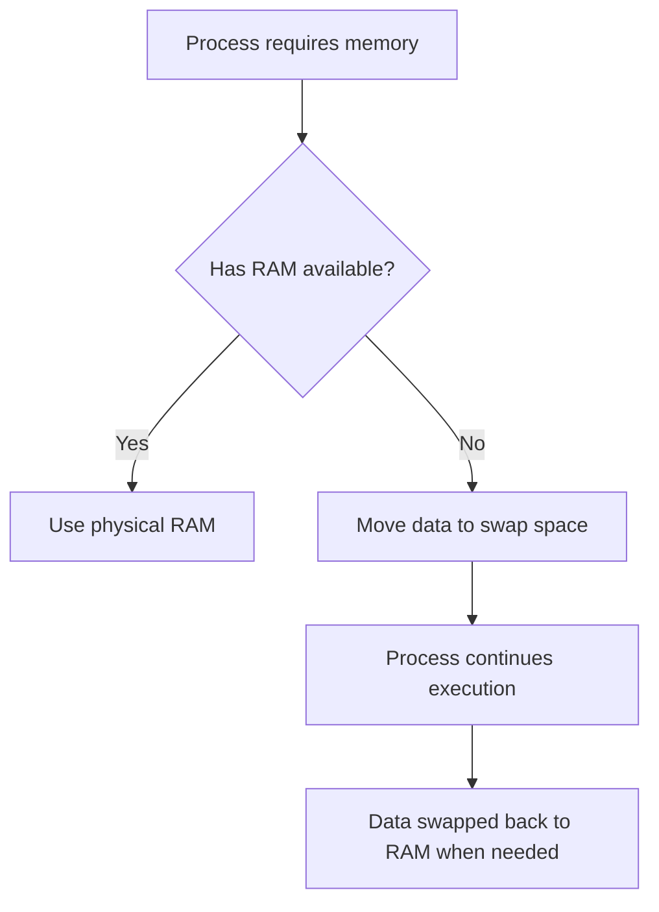

Section 42: Swap Space Management in Linux

<details open>
<summary><b>Section 42: Swap Space Management in Linux (CL-KK-Terminal)</b></summary>

## Understanding Swap Space Fundamentals

### Overview
Swap space is a critical component of Linux memory management that serves as virtual memory when physical RAM becomes insufficient. When your system's RAM utilization reaches maximum capacity, the kernel moves less frequently used data from RAM to swap space on disk, allowing processes to continue running smoothly.

### Key Concepts

#### Virtual Memory Mechanism


#### When Swap Space Activates
- System reaches high RAM utilization (typically 80-90%)
- Multiple memory-intensive processes running simultaneously
- Large file operations (unzipping, database queries, etc.)
- Critical for servers handling multiple applications

#### Optimal Swap Size Guidelines
| RAM Size | Recommended Swap Size | Minimum Swap Size |
|-----------|----------------------|-------------------|
| 4GB | 4-8GB | 2GB |
| 8GB | 8-16GB | 4GB |
| 16GB | 16-32GB | 8GB |
| 32GB+ | Equal to RAM | Half of RAM |

**Expert Insight**: Always prefer swap size equal to or greater than RAM for server environments handling databases and multiple applications. Performance impact exists but small compared to system crashes.

## Creating Swap Space on Physical Partition

### Prerequisites
- Root privileges
- Available disk space
- fdisk or parted for partition creation

### Step-by-Step Creation Process

#### 1. Partition Disk Space
```bash
fdisk /dev/sdb  # Replace with your disk device
# Commands in fdisk:
n              # New partition
p              # Primary partition
1              # Partition number
<Enter>        # Default start sector
+4G            # 4GB partition size
t              # Change type
82             # Linux swap (82 hex code)
w              # Write changes
```

#### 2. Update Kernel Partition Table
```bash
partprobe  # Update kernel with new partition table
```

#### 3. Verify Partition Creation
```bash
lsblk  # Verify new partition /dev/sdb1 appears
```

#### 4. Format as Swap Space
```bash
mkswap /dev/sdb1  # Format the partition for swap use
```

#### 5. Activate Swap Space
```bash
swapon /dev/sdb1  # Immediately activate swap
```

#### 6. Make Swap Persistent
```bash
# Add to /etc/fstab
echo '/dev/sdb1 swap swap defaults 0 0' >> /etc/fstab
```

### Verification Commands
```bash
free -h                    # Show memory and swap usage
swapon -s                  # Display active swap spaces
cat /proc/swaps           # Detailed swap information
```

**Key Takeaways**:
- Physical partition swap requires dedicated disk space allocation
- Cannot be easily extended without additional partitioning
- Best for simple, stable environments

## Creating Swap Space on LVM Logical Volume

### Advantages of LVM Swap
- Easy extension when more space needed
- No wasted disk space
- Flexible volume management

### LVM Swap Creation Process

#### 1. Convert Disk to Physical Volume
```bash
pvcreate /dev/sdc1  # Create physical volume
```

#### 2. Create Volume Group
```bash
vgcreate vg_swap /dev/sdc1  # Create volume group named vg_swap
```

#### 3. Create Logical Volume
```bash
lvcreate -L 4G -n lv_swap vg_swap  # 4GB logical volume for swap
```

#### 4. Format Logical Volume
```bash
mkswap /dev/vg_swap/lv_swap  # Format as swap space
```

#### 5. Activate Swap
```bash
swapon /dev/vg_swap/lv_swap  # Activate the swap space
```

### Verification
```bash
lvs                          # Show logical volumes
vgs                          # Show volume groups
pvs                          # Show physical volumes
free -h                      # Verify swap is active
```

**Real-world Application**: LVM swap is preferred in production environments where you might need to increase swap space without system downtime or disk addition complexity.

## Extending Existing LVM Swap Volume

### When to Extend Swap
- Increasing memory workloads
- Adding new services to server
- Preventing out-of-memory scenarios

### Extension Process

#### 1. Check Available Space in Volume Group
```bash
vgs  # Verify free space in volume group
```

#### 2. Extend Logical Volume
```bash
lvextend -L +4G /dev/vg_swap/lv_swap  # Add 4GB to existing swap LV
```

#### 3. Resize Swap Filesystem
```bash
# For most Linux distributions:
swapoff /dev/vg_swap/lv_swap        # Deactivate swap
mkswap /dev/vg_swap/lv_swap         # Reformat with new size
swapon /dev/vg_swap/lv_swap         # Reactivate swap
```

**Expert Insight**: Always backup critical data before swap modifications. Use logical volume extension for flexibility over physical partitions.

## Managing Multiple Swap Spaces

### Viewing Active Swaps
```bash
cat /proc/swaps     # Shows all active swap areas
swapon -s          # Alternative command for swap status
```

### Priority Management
Swap spaces have priority levels determining usage order:
```bash
# Higher priority numbers get used first
swapon -p 10 /dev/sda2    # Higher priority
swapon -p 5 /dev/sdb1     # Lower priority
```

### Deactivating Swap Spaces
```bash
swapoff /dev/vg_swap/lv_swap    # Deactivate specific swap
# or
swapoff -a                       # Deactivate all swap spaces
```

**Common Pitfalls**:
- Never reduce swap space on the same volume group as root filesystem
- Always backup data before swap modifications
- Test swap activation after system reboots
- Monitor swap usage with `free -h` and `vmstat`

## Temporary Swap Using File

### When to Use File-Based Swap
- No available partitions or LVM space
- Emergency memory relief needed
- Development/testing environments

### Creation Process (Demonstrated in next session)
```bash
# Basic commands shown (detailed in Section 43):
dd if=/dev/zero of=/swapfile bs=1M count=1024
mkswap /swapfile
swapon /swapfile
echo '/swapfile swap swap defaults 0 0' >> /etc/fstab
chmod 600 /swapfile
```

## Summary

### Key Takeaways
```diff
+ Swap provides virtual memory when RAM is insufficient
+ LVM swap enables easy expansion vs physical partition limitations
+ Size equal to RAM minimum for server environments
+ Multiple swaps can be prioritized for performance
- Never reduce swap on same VG as root filesystem
! Always test swap persistence after reboots
```

### Quick Reference
| Command | Purpose |
|---------|---------|
| `mkswap` | Format partition/LV for swap use |
| `swapon` | Activate swap space |
| `swapoff` | Deactivate swap space |
| `free -h` | Check memory and swap usage |
| `swapon -s` | Display all active swaps |

### Real-world Application
In production Linux servers, swap space prevents system crashes during memory spikes. LVM-based swap allows administrators to dynamically adjust memory resources without service interruption, crucial for database servers and web applications experiencing variable loads.

### Expert Path to Mastery
- Monitor swap usage patterns with `vmstat` and system logs
- Implement swap on fast SSD storage for better performance
- Configure swapiness (`vm.swappiness`) kernel parameter
- Use multiple smaller swap areas for load balancing
- Implement swap files for cloud environments with limited partitioning

### Common Pitfalls
- Creating swap smaller than minimum recommendations causes instability
- Forgetting to update `/etc/fstab` results in swap disappearing after reboot
- Attempting to reduce live swap without proper deactivation
- Using swap on slow HDD for performance-critical applications
- Not monitoring swap usage leading to unexpected memory issues

</details>
