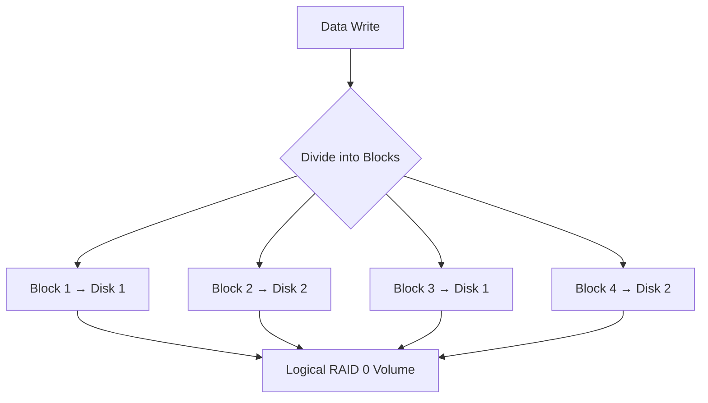

# Section 45: Configuring RAID 0 in Linux

<details open>
<summary><b>Section 45: Configuring RAID 0 in Linux (CL-KK-Terminal)</b></summary>

## Table of Contents

- [Overview of RAID Technology](#overview-of-raid-technology)
- [Detailed Explanation of RAID 0](#detailed-explanation-of-raid-0)
- [Key Advantages and Disadvantages](#key-advantages-and-disadvantages)
- [Use Cases for RAID 0](#use-cases-for-raid-0)
- [Prerequisites for RAID 0 Configuration](#prerequisites-for-raid-0-configuration)
- [Step-by-Step RAID 0 Configuration](#step-by-step-raid-0-configuration)
- [Configuring RAID 0 with More Than Two Disks](#configuring-raid-0-with-more-than-two-disks)
- [Creating Logical Volumes on RAID](#creating-logical-volumes-on-raid)
- [Stopping and Removing RAID 0](#stopping-and-removing-raid-0)
- [Fault Tolerance Limitations](#fault-tolerance-limitations)
- [Fixing Virtual Hard Drive Mounting Issues](#fixing-virtual-hard-drive-mounting-issues)

## Overview of RAID Technology

RAID (Redundant Array of Independent Disks) is a data storage technology that combines multiple physical disk drives into a single logical unit to improve performance, reliability, or both. It uses various techniques like striping (RAID 0), mirroring (RAID 1), or parity (RAID 5/6) depending on the level. RAID 0 focuses on performance through striping data across disks, making it ideal for read-write workloads but without redundancy.

## Detailed Explanation of RAID 0

RAID 0 stripes data across multiple disks (at least two) by dividing it into blocks and writing them alternately. For example, if you have two 1TB disks, RAID 0 creates a 2TB logical drive. Data is read/written in parallel, doubling I/O performance.



In the example (e.g., "Nehuraclass" text): Letters alternate: N (Disk 1), e/Disk 2, h/Disk 1, etc., but striped across devices. No mirroring or parity; if one disk fails, all data is lost.

## Key Advantages and Disadvantages

### Advantages of RAID 0
- **Performance Boost**: Speeds up read/write operations significantly (e.g., 4 disks = 4x performance).
- **Storage Efficiency**: All disk capacity is used (100% utilization).
- **Cost-Effective**: Simple to implement without overhead.

### Disadvantages of RAID 0
- **No Fault Tolerance**: If one disk fails, the entire array becomes unusable. No data redundancy.
- **Higher Risk**: Requires backups; not suitable for critical data.
- **Not Scalable Safely**: Adding disks isn't inherently safe without other RAID levels.

## Use Cases for RAID 0

RAID 0 is ideal for scenarios prioritizing speed over safety:
- **Video Editing**: Large file transfers and rendering.
- **Gaming**: Fast loading of game assets.
- **Scratch Drives**: Temporary storage for computations.
- **Databases with Backups**: Where performance matters and data is backed up elsewhere.

For production environments with high HDD costs, RAID 0 was common, but newer setups prefer SSDs and hybrid RAIDs.

## Prerequisites for RAID 0 Configuration

- **Multiple Disks**: At least two identical or similar disks (e.g., SSTs, HDDs).
- **Kernel Support**: Ensure `mdadm` (RAID management tool) is installed:
  ```bash
  sudo apt update && sudo apt install mdadm
  ```
- **Partitioning**: Use tools like `fdisk` or `parted` to create partitions on disks.
- **Permissions**: Root access for RAID operations.

## Step-by-Step RAID 0 Configuration

1. **Partition the Disks**:
   ```bash
   sudo fdisk /dev/sdb
   # Create new partition (n), primary (p), size full (default), type Linux RAID (fd), write (w)
   sudo fdisk /dev/sdc  # Repeat for partition /dev/sdc1
   sudo partprobe  # Refresh kernel partition table
   sudo lsblk  # Verify partitions
   ```

2. **Create RAID 0 Array**:
   ```bash
   sudo mdadm --create /dev/md0 --level=0 --raid-devices=2 /dev/sdb1 /dev/sdc1
   ```
   - `--level=0`: Specifies RAID 0.
   - `--raid-devices=2`: Number of devices (adjust for more disks).

3. **Verify RAID Status**:
   ```bash
   sudo mdadm --detail /dev/md0
   # Output shows RAID type, size (~8TB for 4TB disks), active disks
   sudo mdadm -D /dev/md0  # Detailed view
   ```

4. **Format the RAID Device**:
   ```bash
   sudo mkfs.ext4 /dev/md0
   ```

5. **Mount the RAID**:
   ```bash
   sudo mount /dev/md0 /mnt/raid0
   cd /mnt/raid0 && ls  # Test by creating files
   ```

6. **Make Mounting Persistent** (Edit `/etc/fstab`):
   ```
   /dev/md0    /mnt/raid0    ext4    defaults    0 0
   ```
   Or use UUID:
   ```bash
   blkid /dev/md0  # Get UUID
   # Add to fstab: UUID=your-uuid    /mnt/raid0    ext4    defaults    0 0
   sudo systemctl daemon-reload && sudo mount -a  # Reload
   ```

## Configuring RAID 0 with More Than Two Disks

For three disks using unpartitioned drives (e.g., virtual):
```bash
sudo mdadm --create /dev/md0 --level=0 --raid-devices=3 /dev/sdc /dev/sdd /dev/sde
sudo mdadm --detail /dev/md0
sudo mkfs.ext4 /dev/md0
sudo mount /dev/md0 /mnt/raid0
```

This increases performance further but amplifies risk.

## Creating Logical Volumes on RAID

To add LVM flexibility:
```bash
sudo pvcreate /dev/md0  # Create physical volume
sudo vgcreate vgraid /dev/md0  # Create volume group
sudo lvcreate -l 100%FREE -n lvraid vgraid  # Create logical volume full size
sudo mkfs.ext4 /dev/mapper/vgraid-lvraid
sudo mount /dev/mapper/vgraid-lvraid /mnt/raid0
```

Verify with `pvs`, `vgs`, `lvs`.

## Stopping and Removing RAID 0

1. **Unmount**:
   ```bash
   sudo umount /dev/md0
   # Remove from /etc/fstab if added
   ```

2. **Stop RAID**:
   ```bash
   sudo mdadm --stop /dev/md0
   ```

3. **Remove Partitions** (if needed):
   ```bash
   sudo fdisk /dev/sdb  # Delete partitions
   ```

4. **Verify Removal**:
   ```bash
   sudo lsblk  # No RAID devices
   ```

## Fault Tolerance Limitations

```diff
- RAID 0 has ZERO fault tolerance. Failure of ANY disk corrupts all data.
- Replaced disks cause full data loss; use --fail for testing/removal but NEVER attempt auto-repair in RAID 0.
- Always maintain separate backups for critical data.
```

In testing:
```bash
sudo mdadm /dev/md0 --fail /dev/sdb1  # Simulate failure (data loss)
# In RAID 0, this makes array unusable; replace manually if rebuilding, but data recovery is impossible without backups.
```

## Fixing Virtual Hard Drive Mounting Issues

From previous session: If virtual drive mount fails, check `/etc/fstab` entry formatting and file type.

Example fix for missing `ext4` flag:
```bash
# Edit /etc/fstab
/dev/loop10    /mnt/virtual    ext4    rw    0 0  # Add ext4 and rw
sudo systemctl daemon-reload && sudo mount -a
```

Verify mount point:
```bash
df -h /mnt/virtual
```

## Summary

### Key Takeaways
```diff
+ RAID 0 maximizes performance by striping data across disks, ideal for speed-critical tasks like video processing.
+ Full storage utilization with no wasted space, suitable for SSD arrays.
- Lacks redundancy; single disk failure destroys all data—never use for production without backups.
+ Easy setup with mdadm; supports 2+ disks; automates mount via fstab/UUID.
! Always test configurations; avoid in data-sensitive environments.
💡 Tip: Monitor with mdadm --detail regularly for health.
```

### Quick Reference
- **Create RAID 0**: `sudo mdadm --create /dev/md0 --level=0 --raid-devices=N /dev/sdX1 ...`
- **Check Status**: `sudo mdadm --detail /dev/md0`
- **Format/Mount**: `sudo mkfs.ext4 /dev/md0 && sudo mount /dev/md0 /path`
- **Stop RAID**: `sudo umount /dev/md0 && sudo mdadm --stop /dev/md0`
- **Common Commands**: `lsblk`, `fdisk /dev/sdX`, `parted`, `blkid`

### Expert Insight

**Real-world Application**: Deploy RAID 0 in servers for database scratch files or render farms where speed trumps safety. Combine with RAID 1 for backups in enterprise setups.

**Expert Path**: Study RAID 5/6 for redundancy; experiment with mdadm options like --chunk for stripe size optimization. Migrate to ZFS/Btrfs for advanced features.

**Common Pitfalls**: Forgetting fstab persistence; mixing disk speeds (hurts performance); ignoring --stop before removal (corrupts kernels). Always document array components for recovery.
</details>
