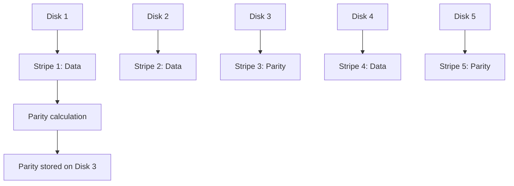

<details open>
<summary><b>Section 47: RAID 5 Configuration and Management (CL-KK-Terminal)</b></summary>

# Section 47: RAID 5 Configuration and Management

## Overview

This section explores RAID 5, a data storage technology that combines striping with parity for fault tolerance in Linux systems. RAID 5 provides redundancy by distributing parity information across multiple disks, allowing systems to continue operating even if one disk fails. Learn about RAID 5 fundamentals, practical configuration using mdadm, and data recovery scenarios.

## Key Concepts

### RAID 5 Fundamentals

RAID 5 uses striping with parity to provide fault tolerance. Unlike RAID 1 (mirroring), RAID 5 stripes data across multiple disks and includes parity information distributed across all disks in the array.

#### Configuration Requirements
- **Minimum disks**: 3 (data and parity are distributed)
- **Maximum disks**: 16 (theoretical limit)
- **Storage efficiency**: (n-1)/n where n = number of disks
- **Fault tolerance**: Survives exactly 1 disk failure

#### How RAID 5 Works


Data is striped across disks with parity calculated using XOR operations. If any disk fails, the parity information allows complete data reconstruction.

**Example Parity Calculation:**
Simple XOR example with 3 disks:
- Disk 1: Data block A (value: 101)
- Disk 2: Data block B (value: 011)
- Disk 3: Parity block C = A ⊕ B (value: 110)

If Disk 1 fails, data recovery: A = B ⊕ C = 011 ⊕ 110 = 101

### Advantages & Disadvantages

#### Advantages
+ **Fault Tolerance**: Survives one disk failure without data loss
+ **High Read Performance**: Data reads benefit from parallel I/O across multiple disks
+ **Storage Efficiency**: (n-1)/n utilization ratio
+ **Hot Swap Support**: Failed disks can be replaced while system remains online

#### Disadvantages
- **Complex Technology**: Advanced parity calculations increase system overhead
- **Lower Write Performance**: Parity must be recalculated on every write operation
- **High Replacement Risk**: Losing a second disk during rebuild causes complete data loss
- **Higher Resource Usage**: CPU and memory overhead for parity calculations

### Where RAID 5 is Used

- **Database Servers**: High read performance with transactional integrity
- **File Servers**: Shared storage with moderate performance needs
- **Application Servers**: Limited data sets requiring both performance and redundancy
- **Archives**: Long-term storage where read access is more common than writes

> [!NOTE]
> RAID 5 is ideal for environments with limited disk count where both performance and redundancy are crucial, but not for write-heavy workloads.

## Lab Demos

### RAID 5 Configuration Demo

#### Prerequisites
Verify available disks (minimum 4 × 4GB disks recommended):

```bash
ls /dev/sd*  # List available disks
fdisk -l     # Check disk sizes and partitions
```

#### Create RAID 5 Array

Use `mdadm` to create RAID 5 array:

```bash
# Create RAID 5 using 3 devices
sudo mdadm --create --verbose /dev/md0 --level=5 --raid-devices=3 /dev/sdb /dev/sdc /dev/sdd

# Result: RAID 5 created with 8GB total capacity (3 disks × 4GB / 1.5 overhead ratio)
```

Verify RAID creation:

```bash
# Check RAID details
sudo mdadm --detail /dev/md0

# Output shows:
# - State: clean
# - Active Devices: 3
# - Total capacity: ~8GB
# - RAID Level: raid5
```

#### Format and Mount File System

Create ext4 file system on RAID device:

```bash
# Format RAID array
sudo mkfs.ext4 /dev/md0

# Create mount point
sudo mkdir /mnt/raid5

# Mount RAID array
sudo mount /dev/md0 /mnt/raid5

# Verify mount
df -h | grep md0
```

#### Create Test Data

Generate test files to verify data integrity:

```bash
# Create test files (10 files named 1-10)
cd /mnt/raid5
for i in {1..10}; do sudo touch file$i.txt; echo "Test data $i" | sudo tee file$i.txt; done
ls -la  # Verify files created
```

### Data Recovery Demo

#### Simulate Disk Failure

Remove one disk from RAID array:

```bash
# Check current RAID state
sudo mdadm --detail /dev/md0

# Fail a disk (simulate failure)
sudo mdadm /dev/md0 --fail /dev/sdd

# Remove failed disk from array
sudo mdadm /dev/md0 --remove /dev/sdd

# Verify RAID still operational
sudo mdadm --detail /dev/md0  # State: clean, degraded
```

#### Verify Data Integrity

Ensure data remains accessible despite disk failure:

```bash
# Change to RAID mount point
cd /mnt/raid5

# Verify test files still present and readable
ls -la  # Files should be visible
cat file1.txt  # Content should be intact
```

#### Replace Failed Disk

Add new disk to replace failed device:

```bash
# Add replacement disk to array
sudo mdadm /dev/md0 --add /dev/sde

# Monitor rebuild process
sudo mdadm --detail /dev/md0  # Watch rebuild status

# Note: Rebuild uses XOR calculations to regenerate data
```

#### Complete Recovery

Verify full recovery and data integrity:

```bash
# Monitor rebuild completion
watch sudo mdadm --detail /dev/md0

# Once rebuild complete (State: clean)
ls -la /mnt/raid5  # All original files present
```

### Managing RAID 5 Arrays

#### Daily Monitoring Commands

```bash
# Check RAID status regularly
sudo mdadm --detail /dev/md1

# View RAID configuration
cat /proc/mdstat

# Monitor disk health
sudo smartctl -a /dev/sdb  # Check each disk SMART status
```

#### RAID Growth Operations

While RAID 5 supports adding disks, Linux RAID has limitations:

```bash
# Stop RAID array (data destructive operation!)
sudo mdadm --stop /dev/md0

# Add new disk and reshape (advanced operation - use with caution)
sudo mdadm --grow /dev/md0 --raid-devices=4 --add /dev/sde

# Warning: Growth operations are complex and may require downtime
```

## Summary

### Key Takeaways

```diff
+ RAID 5 provides fault tolerance for 1 disk failure using striping + parity distribution
+ Compatible with 3-16 disks with (n-1)/n storage efficiency  
+ Excellent for read-heavy workloads like databases and file servers
+ mdadm tool enables complete RAID management (create, monitor, recover)
+ Data reconstruction uses XOR parity calculations for seamless recovery
- Write performance impact due to parity recalculation overhead
- Second disk failure during rebuild causes complete data loss risk
- Complex rebuild process requires CPU and time resources
```

### Quick Reference

**Common RAID 5 Commands:**
```bash
# Create RAID 5
mdadm --create /dev/md0 --level=5 --raid-devices=3 /dev/sd[b-d]

# Check status
mdadm --detail /dev/md0

# Fail disk  
mdadm /dev/md0 --fail /dev/sdd

# Replace disk
mdadm /dev/md0 --remove /dev/sdd --add /dev/sde

# Stop array
mdadm --stop /dev/md0
```

### Expert Insight

**Real-world Application**: RAID 5 excels in SMB environments and departmental servers where budget constraints limit expensive SAN solutions. It's commonly deployed in VMware vSphere hosts for VM storage with vSAN integrations.

**Expert Path**: Master RAID calculations by understanding XOR operations. Practice with virtual disks (using losetup or qemu-img) before production deployment. Learn advanced concepts like RAID growth and bitmap tracking for faster rebuilds.

**Common Pitfalls**: Avoid using RAID 5 with <3 disks (no redundancy). Never mix disk sizes or types. Monitor SMART status regularly to prevent simultaneous failures during rebuilds.

</details>
