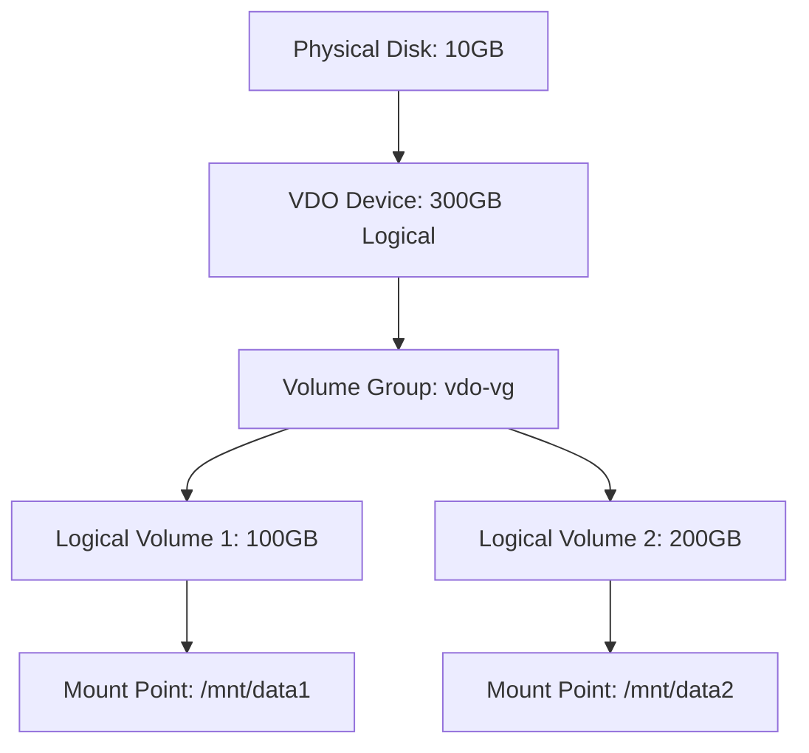

# Section 53: Virtual Data Optimizer (VDO in RHEL 8)

<details open>
<summary><b>Section 53: Virtual Data Optimizer (VDO in RHEL 8) (CL-KK-Terminal)</b></summary>

## Table of Contents
- [Introduction to Virtual Data Optimizer](#introduction-to-virtual-data-optimizer)
- [Installing and Enabling VDO](#installing-and-enabling-vdo)
- [Creating a VDO Volume](#creating-a-vdo-volume)
- [Creating Logical Volumes and File Systems](#creating-logical-volumes-and-file-systems)
- [Demonstration: Using VDO for Over-Provisioning](#demonstration-using-vdo-for-over-provisioning)
- [Managing VDO Volumes](#managing-vdo-volumes)
- [VDO Service and Utility Commands](#vdo-service-and-utility-commands)
- [Summary](#summary)

## Introduction to Virtual Data Optimizer

### Overview
Virtual Data Optimizer (VDO) is a block-level virtualization technology introduced with RHEL 7.5 and later versions, including RHEL 8. VDO supports data deduplication, data compression at the block level, and over-provisioned thin volumes. It allows creating logical volumes that are larger than the physical storage capacity by leveraging deduplication and compression.

VDO works by storing only unique data blocks and referencing duplicates instead of storing multiple copies. It also compresses data at the block level, significantly reducing storage footprint. This is ideal for environments with repetitive data, such as virtual machine images, container layers, or user-generated content where duplicates are common.

### Key Concepts
- **Data Deduplication**: Identifies and eliminates duplicate data blocks, storing only unique blocks and using reference pointers for duplicates. For example, if you have 10 copies of a 1GB file on a 10GB disk, VDO can reduce the effective usage by storing one copy and referencing the others.
- **Data Compression**: Compresses blocks at the device level, similar to zip-like compression, using less storage for compressible data.
- **Thin Provisioning**: Enables creating provisioned volumes larger than available physical storage. As data grows, the logical volume can be extended.
- **Supported Platforms**: Available as a kernel feature in RHEL 8 and supported on physical disks, partitions, or LVM physical volumes.

VDO is particularly useful for storage optimization in cloud, virtualization, and data-heavy environments.

## Installing and Enabling VDO

### Prerequisites
- RHEL 8 system with root access or sudo privileges.
- Subscription to Red Hat (for packages from official repositories), or use developer subscriptions for a 3-month evaluation.
- Network connection for online repository access; alternatively, set up local repositories if offline.
- Ensure your system is subscribed: Run `rhel-check-subscription` or `subscription-manager status`.

### Installation Steps
1. Check subscribed repositories:
   ```bash
   dnf repolist
   ```
   This lists configured repositories and their status.

2. Install the VDO package:
   - For online access (recommended):
     ```bash
     dnf install vdo
     ```
   - If using local repos or encountering issues, use:
     ```bash
     dnf --disablerepo=* --enablerepo=<local-repo> install vdo
     ```

3. Update system (optional but recommended):
   ```bash
   dnf update
   ```
   This may take time (10-20 minutes); use background if needed.

4. Verify installation:
   ```bash
   dnf list installed | grep vdo
   ```
   Look for `vdo` and related packages.

### Enabling the VDO Service
1. Enable and start the VDO service:
   ```bash
   systemctl enable vdo
   systemctl start vdo
   ```

2. Verify status:
   ```bash
   systemctl status vdo
   ```
   Ensure it shows "active (running)" and "enabled".

> [!NOTE]
> Reboot the system after installation if you updated packages, as some components may require it for proper initialization.

> [!IMPORTANT]
> Without an active VDO service, over-provisioned volumes may fail at boot time. Always enable the service in `/etc/fstab` or use `rpm --import` for persistent enabling.

## Creating a VDO Volume

### Prerequisites
- Identify physical storage: Use `lsblk` or `fdisk -l` to list available disks (e.g., `/dev/sdb`, `/dev/sdc`, 10GB disks).
- Backup data if needed, as creation may overwrite partitions.

### Creation Steps
1. Create a VDO device:
   ```bash
   vdo create --name <vdo-name> --device <physical-device> --vdoLogicalSize 300G
   ```
   - Example: `vdo create --name vdo1 --device /dev/sdb --vdoLogicalSize 300G`
   - This creates a 300GB logical VDO on a 10GB physical disk leveraging deduplication/compression.

   > [!WARNING]
   > First creation may fail if packages were updated without reboot. Reboot and retry.

2. Reboot if creation fails, then rerun the command.

3. Verify creation:
   ```bash
   vdo status --name vdo1
   ```
   Shows volume details, physical/logical sizes, used/available space, and compression/deduplication stats.

### Detailed VDO Options
- `--name`: Unique VDO name (e.g., `vdo1`).
- `--device`: Physical device (e.g., `/dev/sdb`).
- `--vdoLogicalSize`: Logical size (e.g., `300G` for 300GB).
- `--spareFileSize`: Space for overhead (default sufficient).

After creation:
- VDO volume appears as `/dev/mapper/<name>` or `/dev/vdo/<name>`.
- Check with `lsblk` or `lvdisplay`.

> [!TIP]
> For production, monitor stats: `vdo stats --name vdo1 --verbose` for block counts, savings percentages, etc.

## Creating Logical Volumes and File Systems

### Convert VDO to Physical and Logical Volumes
1. Create a physical volume from VDO:
   ```bash
   pvcreate /dev/mapper/vdo1
   ```
   If fails due to existing PVs, use `pvcreate --force /dev/mapper/vdo1`.

2. Create a volume group:
   ```bash
   vgcreate vdo-vg /dev/mapper/vdo1
   ```

3. Create logical volumes:
   ```bash
   lvcreate -n vdo-lv1 -L 100G vdo-vg
   lvcreate -n vdo-lv2 -L 200G vdo-vg
   ```

4. Format file systems:
   ```bash
   mkfs.xfs -K /dev/vdo-vg/vdo-lv1  # -K to ignore zeroing for speed
   mkfs.ext4 -L vdo.ext4 /dev/vdo-vg/vdo-lv2  # For ext4
   ```

> [!NOTE]
> For VDO, use `-K` with `mkfs.xfs` to disable zero-filling, as it's unnecessary and slow. For XFS, it prevents discarding unused blocks automatically.

> [!CAUTION]
> Avoid warning: "This device may be overwritten with zeroes by the filesystem initialization." Use force options or `-K` to ignore.

### Trim and Mount
- Enable discard for trim:
  ```bash
  mount -t xfs /dev/vdo-vg/vdo-lv1 /mnt/vdo-data -o discard
  ```
- For permanent mounting, add to `/etc/fstab`:
  ```
  /dev/vdo-vg/vdo-lv1 /mnt/vdo-data xfs defaults,discard 0 0
  ```

## Demonstration: Using VDO for Over-Provisioning

### Scenario: 300GB Logical on 10GB Physical
- Physical Disk: 10GB (e.g., `/dev/sdb`).
- VDO Creation: `vdo create --name vdo1 --device /dev/sdb --vdoLogicalSize 300G`.
- Logical Volumes: 100GB and 200GB LVs created.
- Data Copy: Duplicate data across volumes; check savings.

1. Initial Status:
   ```bash
   vdo status --name vdo1
   ```
   Shows ~99% storage savings initially.

2. Copy Sample Data:
   - Assume duplicates (e.g., VM images or large files).
   ```bash
   cp large-file.bin /mnt/vdo-data1/
   cp large-file.bin /mnt/vdo-data2/
   ```

3. Check Post-Copy Status:
   ```bash
   vdo status --name vdo1
   ```
   Savings drop to ~98-99% as deduplication activates on duplicates.

4. Extend Logical Volume if needed:
   ```bash
   lvextend -L +50G vdo-vg/vdo-lv1
   resize2fs /dev/vdo-vg/vdo-lv1  # For ext3/4; xfs_growfs for XFS
   ```

Diagram (Mermaid):



## Managing VDO Volumes

### Expanding Logical Volumes
- Extend LV: `lvextend -L +N vdo-vg/vdo-lv1`
- Resize FS: `xfs_growfs /mnt/data1` or `resize2fs /dev/vdo-vg/vdo-lv1`

### Monitoring and Stats
- Full Stats: `vdo stats --name vdo1`
- Savings: Shows deduplication/compression percentages.
- Health: `vdo status --name vdo1`

### Removal (Dangerous)
```bash
lvremove vdo-vg/vdo-lv1
vgremove vdo-vg
vdo stop --name vdo1  # Drains and stops
vdo remove --name vdo1  # Removes device
```

> [!DANGER]
> Removing VDO devices destroys data. Always back up before removal.

## VDO Service and Utility Commands

| Command | Description | Example |
|---------|-------------|---------|
| `systemctl enable/start vdo` | Enable/start service | `systemctl start vdo` |
| `vdo create` | Create VDO device | `vdo create --name vdo1 --device /dev/sdb --vdoLogicalSize 300G` |
| `vdo status` | Check status | `vdo status --name vdo1` |
| `vdo stats` | View stats | `vdo stats --name vdo1 --verbose` |
| `pvcreate/vgcreate` | Create PV/VG | `vgcreate vdo-vg /dev/mapper/vdo1` |
| `lvcreate` | Create LV | `lvcreate -n lv1 -L 100G vdo-vg` |
| `fstrim` | Discard unused blocks | `fstrim -v /mnt/data` |
| `vdo stop/remove` | Stop/remove device | `vdo remove --name vdo1` |

## Summary

### Key Takeaways
```diff
+ VDO enables block-level deduplication and compression for over-provisioned volumes.
+ Requires RHEL subscription or developer eval; install with dnf.
+ Creates logical volumes larger than physical via deduplication/references.
+ Deduplication saves space on duplicates; compression reduces block size.
- First creation may require reboot post-update.
- Thin provisioning risks data explosion if unique data exceeds physical capacity.
! Monitor stats regularly; savings vary by data (low on unique data, high on duplicates).
```

### Quick Reference
- **Install VDO**: `dnf install vdo; systemctl enable --now vdo`
- **Create VDO**: `vdo create --name vdo1 --device /dev/sdb --vdoLogicalSize 300G`
- **Stats**: `vdo status --name vdo1; vdo stats --name vdo1`
- **Filesystem Format**: `mkfs.xfs -K /dev/vdo-vg/lv1`
- **Expand LV**: `lvextend -L +50G vdo-vg/lv1; xfs_growfs /mnt/data`

### Expert Insight
**Real-world Application**: VDO excels in virtualization (e.g., OpenStack, Kubernetes) where VMs have overlapping OS images, reducing storage costs by 4-10x. Use for backup repositories, database logs, or content delivery where redundancy exists. Monitor with `vdo stats` for efficiency.

**Expert Path**: Experiment with sparse files and layered storage. Study deduplication algorithms in production docs. Master integration with LVM and RAID for hybrid setups. Avoid mixing VDO with SSD caching without performance profiling.

**Common Pitfalls**: Ignoring service startup leads to boot failures. Over-provision excessively on small disks risks "out of space" errors. Not rebóoting after package updates causes creation failures. Always test with sample duplicates to verify savings.

</details>
