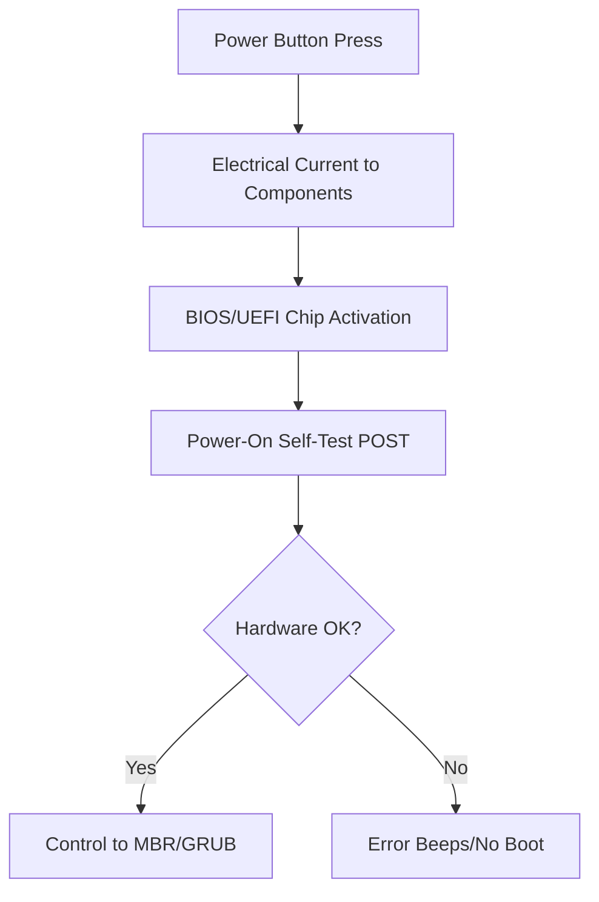
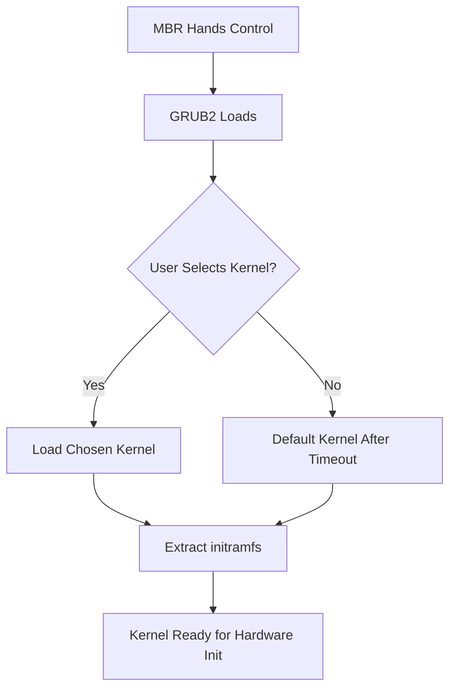

# Section 56: Booting Process of RHEL 8 

<details open>
<summary><b>Section 56: Booting Process of RHEL 8 (CL-KK-Terminal)</b></summary>

## Table of Contents

- [What is Booting?](#what-is-booting)
- [BIOS/UEFI and POST Operation](#biosuefi-and-post-operation)
- [Master Boot Record (MBR)](#master-boot-record-mbr)
- [GRUB2 Loader and Kernel Selection](#grub2-loader-and-kernel-selection)
- [Kernel Loading and initramfs](#kernel-loading-and-initramfs)
- [Systemd and Runlevels/Targets](#systemd-and-runlevels-targets)
- [Chicken and Egg Problem in Booting](#chicken-and-egg-problem-in-booting)

## What is Booting?

### Overview
Booting is the process of copying operating system files from hard disk to RAM, enabling users to interact with the system. In RHEL 8, this involves sequential steps including hardware initialization, bootloader execution, kernel loading, and service startup through systemd.

### Key Concepts
The booting process initializes the OS by loading required files and configurations:

- **Components Involved**:
  - Motherboard (with BIOS/UEFI firmware)
  - CPU, RAM, Storage Devices
  - Bootloader (GRUB2 in RHEL 8)
  - Kernel (vmlinuz image)
  - initramfs (initial RAM filesystem)
  - Systemd (init system)

- **Importance**: Understanding booting is crucial for tasks like password recovery, single-user mode rescue, filesystem repairs, and custom boot configurations.

> [!IMPORTANT]  
> A corrupted boot partition or GRUB can prevent system startup, making boot knowledge essential for Red Hat certifications and real-world troubleshooting.

## BIOS/UEFI and POST Operation

### Overview
When the power button is pressed, electrical current flows through components, triggering the BIOS/UEFI chip. This firmware performs Power-On Self-Test (POST) to verify hardware integrity before handing control to the bootloader.

### Key Concepts
BIOS/UEFI acts as the bridge between hardware and software:

- **BIOS Basics** (legacy, being replaced by UEFI):
  - Standard Basic Input Output System firmware on motherboard
  - Combination of hardware (chip) and software (program for POST and device checks)
  - Maintains CMOS settings (time, boot order) via battery
  - Performs POST: Checks all attached components for operational status

- **POST Operations**:
  - Power-on triggers BIOS activation
  - Tests CPU, RAM, storage, peripherals
  - Emits beeps on success (e.g., single beep for OK)
  - Multiple beeps indicate hardware failure (e.g., RAM issues)

- **Transition to MBR**:
  - After POST, control passes to Master Boot Record on selected boot device
  - BIOS cannot boot without hardware integrity confirmed

> [!NOTE]  
> UEFI provides more flexibility, GUI support, and no CMOS dependency compared to BIOS.

### Table: BIOS vs UEFI

| Feature          | BIOS (Legacy)                      | UEFI (Modern)                      |
|------------------|------------------------------------|------------------------------------|
| Interface       | Text-based                        | GUI and mouse support             |
| Storage Support | MBR only (up to 2TB partitions)   | GPT support (larger drives)       |
| Settings        | CMOS with battery backup          | NVRAM, more flexible              |
| Boot Time       | Slower                            | Faster, more features             |

```bash
# Example: Check UEFI or BIOS via command (after boot)
efibootmgr  # Shows UEFI variables
dmidecode -t bios  # BIOS info query
```



```diff
+ Key Point: Hardware verification ensures only functional systems boot, preventing silent failures.
- Warning: Continuous beeps often indicate RAM or motherboard issues.
! Security Note: UEFI includes secure boot features to prevent malware-loaded kernels.
```

## Master Boot Record (MBR)

### Overview
MBR is the first sector (512 bytes) of the boot device, containing the primary bootloader. It holds partition table entries and code to locate the secondary bootloader (GRUB2).

### Key Concepts
MBR acts as the initial boot loader code holder:

- **Structure** (512 bytes):
  - **440 bytes**: Primary boot loader code (points to GRUB)
  - **64 bytes**: Partition table (4 entries, max 4 primary partitions)
  - **2 bytes**: Boot signature (magic number for jump to code)
  - **6 bytes**: Disk signature and null padding

- **Primary Bootloader Role**:
  - Stored in boot partition (e.g., /boot partition)
  - Reads partition info and locates GRUB2
  - Dimensional overview for GRUB menu (multi-kernel selection)

```bash
# Check MBR structure (do not run on production)
sudo dd if=/dev/sda bs=512 count=1 | hexdump -C  # Read first 512 bytes
```

```diff
+ disks[MBR primarily supports 4 primary partitions via 64-byte table.
- Limitation: No support for >2TB drives without GPT (which uses EFI partitioning).
```

## GRUB2 Loader and Kernel Selection

### Overview
GRUB2 (Grand Unified Bootloader v2) provides a menu for kernel selection. It loads the chosen kernel image into RAM and sets up the initramfs for initial hardware detection.

### Key Concepts
GRUB2 manages kernel loading and boot menu:

- **GRUB2 Configuration**:
  - File: /boot/grub2/grub.cfg (auto-generated)
  - Allows timeout-based or manual kernel selection
  - Supports multiple kernel entries for updates

- **Kernel Loading Process**:
  - Extracts vmlinuz-{version}.img from /boot
  - Sets up initial RAM disk (initramfs) for drivers/modules
  - Provides 5-15 second selection window (configurable)

```bash
# View GRUB entries
cat /boot/grub2/grub.cfg  # Auto-generated
grub2-editenv list  # Check saved entry
```

- **Menu Options**:
  - Normal kernel boot
  - Rescue mode
  - Network boot options



```diff
- Common Pitfall: Modifying /boot/grub2/grub.cfg manually can break boot; use tools instead.
! Expert Tip: Use GRUB menu to boot old kernels after updates fail.
```

## Kernel Loading and initramfs

### Overview
After kernel selection, GRUB2 loads the kernel into RAM. The kernel then initializes hardware using modules from the initial RAM filesystem (initramfs), which contains essential drivers.

### Key Concepts
initramfs bridges the gap for hardware initialization:

- **initramfs Role**:
  - Temporary root filesystem in RAM
  - Contains drivers/modules for storage, RAID, LVM
  - Allows kernel to handle devices before root mount

- **Kernel Initialization**:
  - Starts processes (init has PID 1 via systemd)
  - Mounts root temporarily, then switches to real root
  - Defines runlevels via /etc/systemd/system/default.target

```bash
# List systemd targets runlevels
systemctl list-units --type=target --all  # Shows available targets
systemctl set-default multi-user.target  # Example change
```

```diff
+ Root Mount Flow: initramfs mounts root temporarily, switches to permanent / root.
- Chicken-Egg Problem: Hardware needs drivers from disk, but disk needs hardware initialized – initramfs solves this.
```

## Systemd and Runlevels/Targets

### Overview
Systemd (replacing SysV init) is the first process (PID 1) that manages services and defines runlevels/targets. It executes units based on the default target set in /etc/systemd/system/default.target.

### Key Concepts
Targets define system states and service sets:

- **Key Targets/Runlevels**:
  - `poweroff.target` (Runlevel 0): Shutdown
  - `rescue.target` (Runlevel 1): Single-user mode
  - `multi-user.target` (Runlevel 3): Multi-user console
  - `graphical.target` (Runlevel 5): GUI mode
  - `reboot.target` (Runlevel 6): Reboot

- **Systemd Operations**:
  - Executes all units as per target
  - Mounts real root filesystem permanently
  - Starts remaining services/components

```bash
# View current target
systemctl get-default
# Change target example
sudo systemctl isolate rescue.target  # Single-user mode
```

### Table: RHEL Targets

| Target                  | Description                     | Analogous Runlevel |
|-------------------------|---------------------------------|--------------------|
| poweroff.target        | System shutdown                | 0                  |
| rescue.target          | Single-user mode               | 1                  |
| multi-user.target      | Multi-user console             | 3                  |
| graphical.target       | Graphical UI mode              | 5                  |
| reboot.target          | System reboot                  | 6                  |


```diff
+ Systemd Advantage: Parallel service startup via units, faster boot times.
- Pitfall: Changing default target can lock out GUI if set to console-only.
! Real-World: Use rescue.target for password recovery without network services.
```

## Chicken and Egg Problem in Booting

### Overview
The "Chicken and Egg" issue refers to the dependency loop: Hardware needs drivers from disk, but disk access requires initialized hardware. initramfs resolves this by pre-loading essential modules.

### Key Concepts
- **Core Issue**: Boot partition and kernel are on disk, unaccessible without drivers.
- **Solution**: MBR includes code to directly load GRUB2, bypassing uninitialized hardware.
- **Outcome**: Modules in initramfs handle remaining hardware as kernel initializes.

```diff
- Problem: Uninitialized disk prevents driver loading in a circular dependency.
+ Solution: initramfs contains pre-extracted drivers for critical hardware.
! Insight: This is why boot partitions must remain intact during maintenance.
```

## Summary

```diff
+ Key Takeaway: RHEL 8 booting follows BIOS/UEFI → POST → MBR → GRUB2 → Kernel → initramfs → Systemd → Target execution.
- Pitfall: Corrupted GRUB or initramfs can render system unbootable; always backup /boot.
! Expert Insight: For single-user rescue (password reset), boot to rescue.target and remount root read-write.
```

### Quick Reference
- **Check Boot Order**: `efibootmgr` or BIOS/UEFI menu.
- **Kernel Selection**: Use GRUB menu during boot (5-15 sec timeout).
- **Change Default Target**: `sudo systemctl set-default graphical.target`.
- **Rescue Mode**: boot to `rescue.target` for maintenance.
- **initramfs Update**: `sudo dracut -f` after kernel module changes.

### Expert Insight
**Real-world Application**: Booting knowledge is vital for automating server setups, troubleshoot boot failures in cloud environments, and optimize boot times in enterprise deployments.

**Expert Path**: Master GRUB customization and systemd unit management to handle complex multi-boot scenarios and systemd drop-ins for fine-tuned services.

**Common Pitfalls**: 
- Modifying GRUB config manually without backups.
- Ignoring hardware beeps during POST.
- Setting incompatible default targets (e.g., graphical on headless servers).
- Deleting /boot partition thinking it's disk space waste.

</details>
