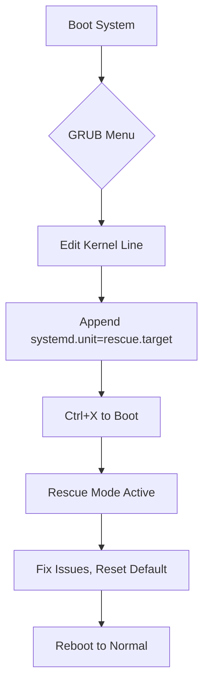

# Section 57: Managing Runlevels in Linux

<details open>
<summary><b>Section 57: Managing Runlevels in Linux (CL-KK-Terminal)</b></summary>

## Table of Contents
- [Introduction to Runlevels](#introduction-to-runlevels)
- [Understanding Runlevel Types](#understanding-runlevel-types)
- [Checking Current and Previous Runlevels](#checking-current-and-previous-runlevels)
- [Commands to List Available Runlevels](#commands-to-list-available-runlevels)
- [Setting Default Runlevel Permanently](#setting-default-runlevel-permanently)
- [Changing Runlevel Temporarily](#changing-runlevel-temporarily)
- [Booting into Non-Default Runlevels](#booting-into-non-default-runlevels)
- [Demonstrations and Labs](#demonstrations-and-labs)
- [Summary](#summary)

## Introduction to Runlevels
Runlevels in Linux define the operational state of the system during boot, specifying which services, processes, and user interfaces are available. This session explains how runlevels work in systemd-based systems (like RHEL 8), covering concepts from basic runlevel identification to advanced manipulation techniques.

## Understanding Runlevel Types
Runlevels range from 0 to 6, each representing a specific system state. Below is a table summarizing the standard runlevels:

| Runlevel | Description | Target Name |
|----------|-------------|-------------|
| 0 | System power off | poweroff.target |
| 1 | Single-user mode (rescue mode, minimal services, no network) | rescue.target |
| 2 | Multi-user mode without GUI (non-graphical, no network support) | multi-user.target (rarely used directly) |
| 3 | Multi-user mode without GUI (non-graphical, with network support) | multi-user.target |
| 4 | Unused (available for customization in research or development) | multi-user.target |
| 5 | Graphical multi-user mode (with GUI, network, and full services) | graphical.target |
| 6 | System reboot | reboot.target |

Runlevel 2 and 3 are both multi-user non-graphical modes, but level 2 lacks network support. Level 4 is typically not used in standard configurations. The default runlevel determines the system's boot state, commonly set to graphical.target (5) for desktop systems.

## Checking Current and Previous Runlevels
Use the `runlevel` command to display the previous and current runlevels. The output includes:
- **N**: No previous runlevel (system just booted).
- A number (e.g., 5): Current runlevel.

Example output:
```
N 5
```
This indicates no prior runlevel and current graphical mode.

Additional commands:
- `systemctl get-default`: Shows the default target/runlevel (e.g., graphical.target).
- `systemd-analyze get-default`: Alternative for default runlevel.
- Environment variable `$RUNLEVEL`: May show current runlevel in some setups, though often unset by default.

Note: In systemd, runlevels map to targets. Traditional runlevel numbers are still supported but targets are preferred.

## Commands to List Available Runlevels
### Using systemctl
- `systemctl list-units --type=target --state=loaded`: Lists loaded targets/runlevels.
- `systemctl show --property=Allowed target`: Not standard; focus on loaded units.

### Using systemd Commands
- `systemctl --type=target`: Similar to the above, shows units by type.

Runlevels are predefined targets in `/usr/lib/systemd/system/`, with symbolic links creating them.

## Setting Default Runlevel Permanently
The default runlevel is controlled by the `/etc/systemd/system/default.target` symlink.

### Method 1: systemctl set-default
Use `systemctl set-default <target>`. Examples:
- Set to rescue mode: `sudo systemctl set-default rescue.target`
- Set to graphical: `sudo systemctl set-default graphical.target`
- Verify: `systemctl get-default` should show the new target.

This creates/removes symlinks in `/etc/systemd/system/`.

### Method 2: Symbolic Links
Manually create symbolic links:
```bash
sudo ln -sf /usr/lib/systemd/system/rescue.target /etc/systemd/system/default.target
sudo ln -sf /usr/lib/systemd/system/graphical.target /etc/systemd/system/default.target
```

List contents: `ls -l /usr/lib/systemd/system/` to see available targets.

Note: Changes apply on next boot. For immediate effect, use isolate/ init commands below.

## Changing Runlevel Temporarily
To change the runlevel without affecting the default (temporary change):

### Method 1: init Command
- `sudo init <runlevel>`: Immediately switches to the specified runlevel.
  - `init 0`: Power off.
  - `init 3`: Multi-user non-graphical (if default was graphical).
  - `init 6`: Reboot.

> [!NOTE]
> `init 1` or `init rescue` switches to rescue mode.

This affects the current session but not the default for future boots.

### Method 2: systemctl isolate
- `sudo systemctl isolate <target>`: Switches to the target/runlevel.
  - Example: `sudo systemctl isolate multi-user.target` (equivalent to runlevel 3).

Equivalent syntax: `sudo systemctl isolate runlevel<#>target`, e.g., `systemctl isolate runlevel3.target`.

## Booting into Non-Default Runlevels
To override the default runlevel during boot:

1. Reboot the system.
2. At the GRUB menu, press 'e' for edit mode.
3. Navigate to the kernel line.
4. At the end of the "linux" line, add `systemd.unit=<target>` or `rd.break` for rescue.
5. Press Ctrl+X to boot.

Examples:
- Force rescue: Append `rd.break` or `systemd.unit=emergency.target`.
- Force graphical even if default is rescue: Append `systemd.unit=graphical.target`.

In the boot process:
- First kernel line: Normal boot.
- Second kernel line: Recovery/rescue boot.

This overrides `/etc/systemd/system/default.target` for that boot only.

> [!IMPORTANT]
> If default is set to reboot.target (6), the system will continuously reboot. Override via GRUB to fix.

Use `systemctl set-default graphical.target` post-recovery to reset.

## Demonstrations and Labs
### Lab 1: Checking Runlevels
- Run `runlevel`: Shows previous (N) and current (5 in graphical mode).
- Run `systemctl get-default`: Confirms default target (e.g., graphical.target).
- Experiment: Switch temporarily with `sudo init 3` and check `runlevel` again.

### Lab 2: Setting Default Runlevel
- Set to rescue: `sudo systemctl set-default rescue.target`
- Reboot: System boots into rescue mode (single-user, no network).
- Reset: `sudo systemctl set-default graphical.target`

### Lab 3: Boot Override
- Set default to reboot.target for demonstration (causes infinite reboot).
- Fix via GRUB: Edit kernel line, add `systemd.unit=graphical.target`, boot back to fix.

### Lab 4: Temporary Changes
- In graphical mode, run `sudo init 1`: Switches to rescue (password prompt).
- Return with `sudo init 5`: Back to graphical.

Practice sequence: Change default → test boot → GRUB override → reset.



## Summary

### Key Takeaways
```diff
+ Runlevels (0-6) define system states: power off (0), rescue (1), multi-user (3), graphical (5), reboot (6).
+ Default runlevel is set via systemctl set-default and controlled by /etc/systemd/system/default.target.
+ Temporary changes use init or systemctl isolate; GRUB override for one-time boots.
+ Rescue from infinite reboot: Edit GRUB and force correct target.
- Avoid setting default to reboot.target (6) unless intentional, as it causes loops.
- Level 4 is unused; levels 2-3 differ only in network support.
```

### Quick Reference
- Check current: `runlevel`
- Check default: `systemctl get-default`
- Set default: `sudo systemctl set-default <target>`
- Temporary switch: `sudo init <level>` or `sudo systemctl isolate <target>`
- Manual symlink: `sudo ln -sf /usr/lib/systemd/system/<target> /etc/systemd/system/default.target`
- GRUB override: Append `systemd.unit=<target>` to kernel line.

### Expert Insight
**Real-world Application**: In production, use rescue mode (1) for maintenance, multi-user (3) for servers without GUI. GRUB overrides are crucial for recovering from misconfigurations or boot failures.

**Expert Path**: Master systemd targets deeply; practice troubleshooting scenarios like infinite reboots. Experiment with custom targets for specialized environments.

**Common Pitfalls**: Misspelling target names (e.g., "graphical" vs. "graphical.target"). Forgetting to verify with `get-default`. Setting reboot as default unintentionally.

Troubleshooting Q&A:
- HTTPD not starting? Check service status: `sudo systemctl status httpd`.
- Recover deleted files? Use LVM snapshots or backups; systemctl commands don't restore files.
- Kernel updates: Follow version-specific guides; test boots carefully.

</details>
