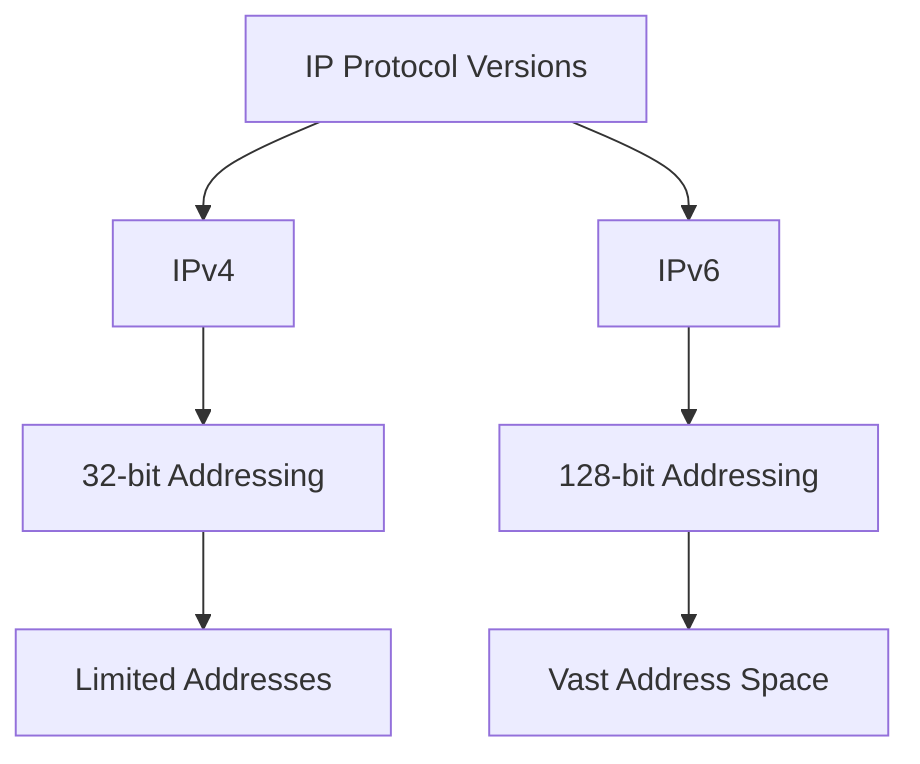

# Section 71: Configuring Static IPv4/IPv6 Addresses and Managing Network Adapters

<details open>
<summary><b>Section 71: Configuring Static IPv4/IPv6 Addresses and Managing Network Adapters (CL-KK-Terminal)</b></summary>

## Table of Contents
- [Understanding IPv4 vs IPv6 Differences](#understanding-ipv4-vs-ipv6-differences)
- [Setting Static IPv4 Address Using nmcli](#setting-static-ipv4-address-using-nmcli)
- [Adding Multiple IP Addresses to Network Interface](#adding-multiple-ip-addresses-to-network-interface)
- [Configuring Static IPv6 Address](#configuring-static-ipv6-address)
- [Using nmtui for Network Configuration](#using-nmtui-for-network-configuration)
- [File-Based Network Configuration](#file-based-network-configuration)
- [Summary](#summary)

## Understanding IPv4 vs IPv6 Differences
IPv4 and IPv6 are two different Internet Protocol versions with significant differences in addressing and capabilities.

### Key Differences
- **Developed**: IPv4 in 1982, IPv6 in 1996
- **Address Length**: IPv4 is 32-bit; IPv6 is 128-bit
- **Address Format**: IPv4 uses decimal notation (e.g., 121.68.0.145); IPv6 uses hexadecimal notation (e.g., 2001:0db8:85a3:0000:0000:8a2e:0370:7334)
- **Prefix Notation**: IPv4 uses CIDR notation like /24; IPv6 uses similar notation
- **Address Types**: Both support unicast, multicast, etc., but IPv6 has additional features
- **Total Addresses**: IPv4 supports ~4.3 billion addresses; IPv6 supports 2^128 addresses

### Why IPv6?
With growing global population and increasing need for unique addresses, IPv4's limitations made IPv6 necessary for future-proofing.



> [!NOTE]
> IPv6 provides far more address space, making it essential for modern network expansion.

## Setting Static IPv4 Address Using nmcli
NetworkManager provides command-line tools like `nmcli` for configuring network interfaces.

### Prerequisites
- Identify your network device: `ip a` or `nmcli device status`
- Ensure NetworkManager is running

### Steps
1. **Create a connection** (optional if modifying existing):
   ```bash
   nmcli connection add con-name "MyETH" ifname eth0 type ethernet
   ```
   
2. **Configure static IPv4**:
   ```bash
   nmcli connection modify MyETH ipv4.addresses 192.168.1.100/24
   nmcli connection modify MyETH ipv4.gateway 192.168.1.1
   nmcli connection modify MyETH ipv4.dns "8.8.8.8 8.8.4.4"
   nmcli connection modify MyETH ipv4.method manual
   ```

3. **Activate the connection**:
   ```bash
   nmcli connection up MyETH
   ```

4. **Reload NetworkManager** (optional):
   ```bash
   nmcli connection reload
   ```

### Verification
```bash
ip addr show eth0  # Shows assigned IP
ping -c 4 192.168.1.1  # Tests connectivity
```

> [!IMPORTANT]
> Static IP configuration bypasses DHCP; ensure IP doesn't conflict with other devices.

## Adding Multiple IP Addresses to Network Interface
You can assign multiple IP addresses to a single network adapter for various purposes.

### Using nmcli
1. **Add secondary IP**:
   ```bash
   nmcli connection modify MyETH +ipv4.addresses 192.168.1.101/24
   ```

2. **Reload connection**:
   ```bash
   nmcli connection reload
   nmcli connection up MyETH
   ```

### Removing IP Addresses
```bash
nmcli connection modify MyETH -ipv4.addresses "192.168.1.101/24"
nmcli connection reload
```

### Verification
```bash
ip addr show eth0
ping -c 4 192.168.1.100  # Primary IP
ping -c 4 192.168.1.101  # Secondary IP
```

> [!NOTE]
> Multiple IPs can be useful for hosting multiple services on one server without additional NICs.

```diff
+ Benefits: Load balancing, service isolation, failover
- Potential Issues: Routing complexity, IP conflict risks
```

## Configuring Static IPv6 Address
IPv6 configuration follows similar principles but with different syntax.

### Prerequisites
- IPv6-enabled network
- Unique IPv6 address (often assigned by ISP)

### Using nmcli
1. **Modify connection**:
   ```bash
   nmcli connection modify MyETH ipv6.addresses "2001:db8::1/64"
   nmcli connection modify MyETH ipv6.method manual
   nmcli connection modify MyETH ipv6.dns "2001:4860:4860::8888"
   ```

2. **Activate**:
   ```bash
   nmcli connection up MyETH
   ```

### Verification
```bash
ip -6 addr show eth0
ping6 -c 4 2001:db8::1
```

> [!TIP]
> Use shortened notation for IPv6 addresses (e.g., 2001:db8::1 instead of full expansion).

## Using nmtui for Network Configuration
nmtui provides a text-based GUI for network configuration, easier for beginners.

### Launching nmtui
```bash
nmtui
```

### Steps
1. **Add Connection**:
   - Select "Add"
   - Choose "Ethernet"
   - Set Interface name
   - Configure IPv4/IPv6 settings
   - Select "Manual" for static IP

2. **Modify Existing Connection**:
   - Select "Edit a connection"
   - Choose interface
   - Set IPv4/IPv6 method to Manual
   - Input address details

3. **Activate/Deactivate**:
   - Select "Activate a connection"

> [!NOTE]
> nmtui creates the same configuration files as nmcli, just with a user-friendly interface.

## File-Based Network Configuration
Direct editing of configuration files under `/etc/NetworkManager/system-connections/` .

### File Structure
```ini
[connection]
id=MyETH
uuid=...
type=ethernet
interface-name=eth0

[ipv4]
method=manual
addresses=192.168.1.100/24;192.168.1.101/24
gateway=192.168.1.1
dns=8.8.8.8;8.8.4.4

[ipv6]
method=manual
addresses=2001:db8::1/64
```

### After Editing
```bash
nmcli connection reload
nmcli connection up MyETH
```

> [!WARNING]
> Always backup configuration files before manual editing.

## Summary

### Key Takeaways
```diff
+ IPv6 provides vastly more address space than IPv4
+ nmcli offers powerful command-line network configuration
+ Multiple IPs on one interface enable advanced networking scenarios
+ nmtui provides user-friendly alternative to nmcli
+ Manual configuration bypasses DHCP for predictable addresses
```

### Quick Reference
| Command | Description |
|---------|-------------|
| `nmcli device status` | Show network devices |
| `nmcli connection add` | Create new connection |
| `nmcli connection modify` | Change connection settings |
| `nmcli connection up` | Activate connection |
| `nmcli connection reload` | Reload all connections |
| `ip addr show` | Display IP addresses |

### Expert Insight
**Real-World Application**: Static IPs are crucial for servers, allowing reliable access and service hosting. Multiple IPs enable load balancing and isolation of services.

**Expert Path**: Master IPv6 configuration as modern networks increasingly adopt it. Learn routing protocols and firewall rules in conjunction with IP configuration.

**Common Pitfalls**: 
- IP address conflicts with existing devices
- Incorrect subnet masks causing connectivity issues  
- Forgetting to reload NetworkManager after manual file changes
- DNS configuration errors preventing name resolution

</details>
