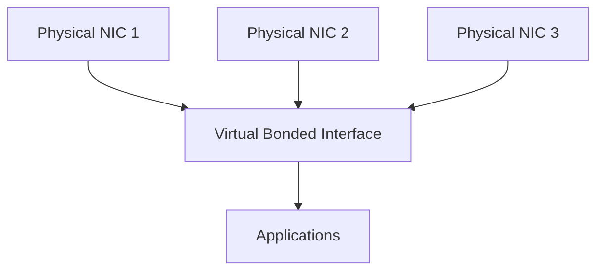
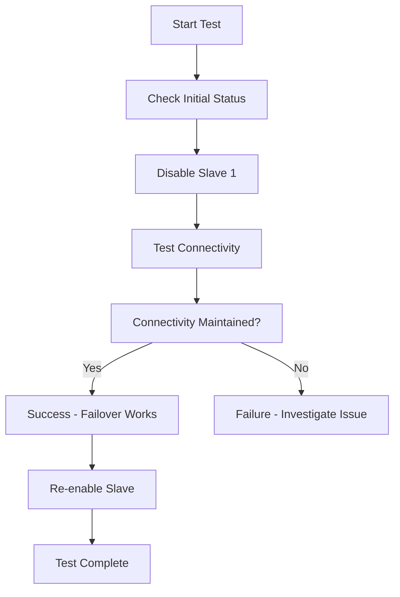

# Section 72: NIC Teaming/Bonding (Link Aggregation)

<details open>
<summary><b>Section 72: NIC Teaming/Bonding (Link Aggregation) (CL-KK-Terminal)</b></summary>

## Table of Contents
- [Introduction to NIC Teaming/Bonding](#introduction-to-nic-teamingbonding)
- [Benefits and Use Cases](#benefits-and-use-cases)
- [NIC Teaming Modes](#nic-teaming-modes)
- [Prerequisites and Installation](#prerequisites-and-installation)
- [Configuring NIC Teaming with teamd](#configuring-nic-teaming-with-teamd)
- [Creating Network Connections](#creating-network-connections)
- [Modifying and Assigning IP Addresses](#modifying-and-assigning-ip-addresses)
- [Activating and Testing Bond](#activating-and-testing-bond)

## Introduction to NIC Teaming/Bonding

### Overview
NIC (Network Interface Controller) Teaming, also known as Link Aggregation or Network Bonding, is a technique that combines multiple network interface controllers into a single virtual interface. This provides redundancy, increased bandwidth, and fault tolerance. The session introduces this concept through an animation video and practical implementation using Linux's `teamd` tool.

### Key Concepts
NIC Teaming allows combining 2 or more network interfaces to create a single logical interface. This virtual device can operate in different modes depending on requirements:

- **Virtual Interface Creation**: Combines physical network adapters into one logical network device
- **Policy-based Operation**: Different modes determine traffic distribution and failover behavior
- **Teamd Tool**: Linux utility for managing network teaming configurations

### Deep Dive
Network bonding addresses single points of failure in network connectivity. Without bonding, if one network cable is damaged or one interface fails, the entire network connectivity is lost. Teaming creates redundancy by using multiple paths for data transmission.

> [!IMPORTANT]
> Unlike traditional bonding with `ifenslave`, `teamd` provides more advanced features with kernel-level support.



## Benefits and Use Cases

### Overview
The primary benefit of NIC bonding is preventing network downtime. In critical systems like web servers hosting websites, even minutes of downtime can result in significant business loss.

### Key Concepts
- **Redundancy**: Automatic failover when one interface fails
- **Increased Bandwidth**: Aggregate bandwidth from multiple interfaces
- **Load Distribution**: Distribute traffic across available interfaces

### Deep Dive
In production scenarios, web servers under heavy load might become unreachable if they rely on a single network connection. NIC bonding ensures:
- No single point of failure
- Automatic detection and switching between interfaces
- Load balancing for better performance

> [!NOTE]
> The animation video demonstrates how bonding prevents service interruption when network cables are physically disconnected.

## NIC Teaming Modes

### Overview
teamd supports multiple operating modes that determine how traffic is distributed and how failover works.

### Key Concepts

#### Round Robin Mode
Sends packets sequentially across all available interfaces.

- **Mode Identifier**: `balance-rr`
- **Use Case**: When equal load distribution is needed
- **Behavior**: Packet 1 → Interface 1, Packet 2 → Interface 2, continuing in cycle

#### Broadcast Mode
Transmits all packets to all interfaces simultaneously.

- **Mode Identifier**: `broadcast`
- **Use Case**: Maximum redundancy (rarely used due to high bandwidth consumption)
- **Behavior**: Packet sent to all slave interfaces

#### Load Balancer Mode
Distributes and balances load based on current interface utilization.

- **Mode Identifier**: `balance-lb`
- **Use Case**: Automatic load balancing
- **Behavior**: Monitors interface load and routes traffic accordingly

#### Active-Backup Mode
One interface active, others in standby for failover.

- **Mode Identifier**: `activebackup`
- **Use Case**: Simple redundancy with minimal configuration
- **Behavior**: Primary interface handles traffic; secondary activates on failure

> [!CAUTION]
> Choose mode carefully - some modes (like broadcast) can waste bandwidth and are unsuitable for most environments.

## Prerequisites and Installation

### Overview
teamd requires the `teamd` package to be installed on the system. This session checks for existing installation and demonstrates manual installation if needed.

### Key Concepts
```diff
+ Required Package: teamd (provides network teaming functionality)
- Common Error: Teamd not installed causes configuration failures
! Repository Access: Ensure yum repositories are enabled
```

### Lab Demo Steps
1. Check if teamd is installed:
   ```bash
   rpm -ql teamd
   ```

2. Check using list or info commands:
   ```bash
   rpm -q teamd
   yum list installed | grep teamd
   ```

3. If not installed, enable repositories and install:
   ```bash
   yum install teamd
   ```

### Common Configuration
- **Service Management**: teamd runs as a kernel module
- **Configuration Files**: Located in `/etc/sysconfig/network-scripts/`
- **Utility Tools**: `teamdctl`, `teamnl` for management

## Configuring NIC Teaming with teamd

### Overview
Configuration involves creating a team/master connection and then adding slave connections for each physical interface.

### Deep Dive
The `nmcli` command is used for all configurations. The process creates:
- One master team connection (virtual interface)
- Multiple slave connections tied to physical adapters

### Lab Demo Steps
1. Create master team connection:
   ```bash
   nmcli connection add type team con-name team0 ifname team0 config '{"runner": {"name": "activebackup"}}'
   ```

2. Verify connection creation:
   ```bash
   nmcli connection show
   cat /etc/sysconfig/network-scripts/ifcfg-team0
   ```

Key configuration elements:
- **Type**: `team`
- **Configuration**: JSON format specifying mode
- **Runner Name**: Operating mode (activebackup, loadbalance, etc.)

## Creating Network Connections

### Overview
After creating the master team connection, add slave connections for each physical NIC to include in the team.

### Lab Demo Steps
1. Add first slave connection:
   ```bash
   nmcli connection add type team-slave con-name team0-slave1 ifname enp0s25 master team0
   ```

2. Add second slave connection:
   ```bash
   nmcli connection add type team-slave con-name team0-slave2 ifname enp0s26 master team0
   ```

3. Verify slave connections:
   ```bash
   cat /etc/sysconfig/network-scripts/ifcfg-team0-slave1
   cat /etc/sysconfig/network-scripts/ifcfg-team0-slave2
   ```

> [!NOTE]
> Each slave connection specifies the master team connection and the physical interface name.

## Modifying and Assigning IP Addresses

### Overview
Assign IP configuration to the master team connection for network access.

### Lab Demo Steps
1. Modify team connection for static IP:
   ```bash
   nmcli connection modify team0 ipv4.addresses 192.168.1.100/24 ipv4.method manual
   ```

2. Optionally add DNS and gateway:
   ```bash
   nmcli connection modify team0 ipv4.dns 8.8.8.8 ipv4.gateway 192.168.1.1
   ```

3. Verify configuration:
   ```bash
   cat /etc/sysconfig/network-scripts/ifcfg-team0
   ```

```diff
+ Correct Configuration: Static IP assignment to team interface
- Avoid DHCP: Static IP recommended for server configurations
```

## Activating and Testing Bond

### Overview
Test the teaming configuration by activating connections and simulating failures to verify failover.

### Lab Demo Steps
1. Bring up all connections:
   ```bash
   nmcli connection up team0
   nmcli connection up team0-slave1
   nmcli connection up team0-slave2
   ```

2. Verify team interface IP:
   ```bash
   ip addr show team0
   ```

3. Check team status:
   ```bash
   teamdctl team0 state
   teamdctl team0 config dump
   ```

4. Test failover by disabling slave:
   ```bash
   nmcli connection down team0-slave1
   ```

5. Verify connectivity maintenance:
   - Use `ping` from another machine
   - Check team status shows active backup switching

6. Re-enable slave:
   ```bash
   nmcli connection up team0-slave1
   ```



## Summary

### Key Takeaways
```diff
+ NIC Teaming provides redundancy and load balancing for network interfaces
+ teamd is the modern Linux tool for network bonding/link aggregation
+ Active-backup mode offers simple failover between interfaces
+ Proper configuration requires master team interface and slave connections
+ Test thoroughly by simulating interface failures
- Single network interface creates single points of failure
- Configuration requires teamd package installation
- Choose appropriate mode based on network requirements
```

### Quick Reference
**Check team status:**
```bash
teamdctl team0 state
teamdctl team0 config dump
```

**Create basic active-backup team:**
```bash
nmcli connection add type team con-name team0 ifname team0 config '{"runner": {"name": "activebackup"}}'
nmcli connection add type team-slave con-name team0-slave1 ifname enp0s25 master team0
nmcli connection add type team-slave con-name team0-slave2 ifname enp0s26 master team0
nmcli connection up team0
```

**Modes available:**
- `activebackup`: One active, others backup
- `loadbalance`: Balance load across interfaces
- `balance-rr`: Round-robin packet distribution
- `broadcast`: Send to all interfaces

### Expert Insight

#### Real-world Application
In enterprise environments, NIC teaming is critical for server high availability. Web servers, database servers, and load balancers commonly use teaming to prevent network-related downtimes. For example, in cloud infrastructures, bonded interfaces ensure VMs remain accessible during network maintenance.

#### Expert Path
Master teamd by experimenting with different runner modes and understanding JSON configuration options. Study kernel parameters that affect teaming behavior and integrate with systemd for automated startup. Learn to troubleshoot teaming issues using `teamdctl` and network debugging tools.

#### Common Pitfalls
- Forgetting to activate slave connections after creating them
- Using inappropriate modes for specific network requirements
- Not testing failover scenarios in lab environments before production deployment
- Conflicting configurations when mixing teamd with traditional bonding tools
- Assuming teaming provides unlimited bandwidth (it's limited by slowest link)
- Network switches must support teaming protocols for optimal performance

</details>
