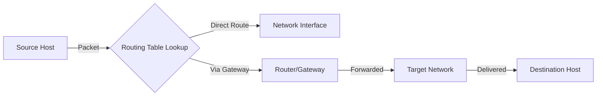

# Section 73: Routing and Routing Tables

<details open>
<summary><b>Section 73: Routing and Routing Tables (CL-KK-Terminal)</b></summary>

## Table of Contents

- [Understanding Routing and Routing Tables](#understanding-routing-and-routing-tables)

## Understanding Routing and Routing Tables

### Overview
Routing is the process of selecting an optimal path for data packets to travel across networks, similar to choosing roads for transportation between cities based on factors like distance, cost, and road conditions. Routing tables are data structures stored in network devices that determine which gateway or interface to use for forwarding packets to specific destinations. This section covers routing concepts, types of routing, viewing and modifying routing tables in Linux, and practical demonstrations.

(Note on transcript corrections: The original transcript contains spoken Hindi with English technical terms and some phonetic misspellings. Terms like "राइटिंग" have been corrected to "routing" (as it refers to networking routing). Other corrections include standardizing pronunciations, such as "htp" to "http" if implied in context, though not directly present; words like "किए" are translated and standardized to proper English for clarity. No major factual errors were found, but terminology is aligned with standard networking concepts for accuracy.)

### Key Concepts/Deep Dive

- **What is Routing?**
  - Routing is a process performed by the network layer (Layer 3) to select the optimal path for forwarding data packets between networks or subnetworks.
  - It applies to various network types, including circuit-switched (e.g., telephone networks) and packet-switched (e.g., internet-based networks).
  - Analogous to road travel: Just as you choose routes (e.g., via highways or shortcuts) based on efficiency, routing selects paths based on network conditions, cost, and topology.
  - In Linux systems, routing occurs on devices like routers or even regular machines connected to multiple networks.

- **Types of Routing**
  - **Static Routing**:
    - Routes are manually defined and added by an administrator.
    - Advantages: ✅ Reduces router CPU overhead (no dynamic calculations); ✅ Secure (only authorized routes); ✅ Efficient resource utilization in small networks.
    - Disadvantages: Time-consuming for large networks; ❌ Requires deep network knowledge; ❌ Inflexible to topology changes.
  - **Dynamic Routing**:
    - Automatically adjusts routes based on current network status using protocols (e.g., RIP, OSPF) that exchange route information between devices.
    - Advantages: ✅ Minimal configuration; ✅ Adopts to real-time changes; ✅ Discovers remote networks; ✅ Distributes traffic across available paths.
    - Disadvantages: ❌ Higher bandwidth usage; ❌ More complex and resource-intensive.
  - **Default Routing**:
    - Routes all unmatched packets to a single next-hop (e.g., a default gateway).
    - Used in simple setups like home networks or hubs with limited routes.

- **Routing Tables and Their Components**
  - A routing table is stored in the kernel and lists decisions for packet forwarding.
  - Key columns in a typical routing table (viewable via `ip route`):
    | Column      | Description                                                                 | Example                 |
    |-------------|-----------------------------------------------------------------------------|-------------------------|
    | Destination | Target IP/network address.                                                   | `192.168.1.0/24`       |
    | Gateway     | Next-hop IP (0.0.0.0 for direct routes)                                  | `10.0.0.1`             |
    | Genmask     | Subnet mask (netmask).                                                     | `255.255.255.0`        |
    | Flags       | Route status (U: up, H: host, G: gateway, R: reinstate, D: dynamic, M: modified, etc.). | `UG` (up, gateway)     |
    | MSS         | Maximum segment size for TCP connections.                                  | 1460                   |
    | Window      | Default TCP window size.                                                   | 4096                   |
    | irtt        | Initial round-trip time for TCP.                                           | 0                      |
    | Iface       | Network interface used.                                                    | `eth0`                 |
  - Sources: Kernel file (e.g., `/proc/net/route` for IPv4) or network manager connections.

### Code/Config Blocks

#### Viewing Routing Table
```bash
# Command-line options for viewing routes
ip route show
netstat -r
route -n  # Numeric output, no DNS resolution
```

#### Adding a Static Route (Temporary)
```bash
# Syntax: ip route add <destination>/<prefixlen> via <gateway> dev <interface>
ip route add 192.168.1.0/24 via 10.0.0.1 dev eth0
# Example: Route traffic to 192.168.1.0/24 via gateway 10.0.0.1 on eth0
```

#### Removing a Route
```bash
# Syntax: ip route del <destination>/<prefixlen>
ip route del 192.168.1.0/24
# Verify removal with: ip route show
```

#### Persisting Routes (System-Level Permanent)
**Option 1: Edit /etc/network/interfaces (Debian/Ubuntu-style)**
```
auto eth0
iface eth0 inet static
    address 192.168.0.10
    netmask 255.255.255.0
    gateway 192.168.0.1
    post-up ip route add 10.0.0.0/8 via 192.168.0.5 dev eth1
```

**Option 2: Using NetworkManager (Red Hat/CentOS-style)**
```bash
# Edit connection file in /etc/NetworkManager/system-connections/
# Add static routes in the [ipv4] section
nmcli connection modify <connection-name> +ipv4.routes "10.0.0.0/8 192.168.0.5"
nmcli connection reload
nmcli connection up <connection-name>  # Restart for persistence
```

⚠ **Warning**: Persistence methods vary by distribution (e.g., systemd-networkd vs NetworkManager). Always back up config files before editing.

#### IPv6 Routing Example
```bash
# View IPv6 routes
ip -6 route show

# Add IPv6 route
ip -6 route add 2001:db8::/32 via 2001:db8:1::1 dev eth0
```

### Lab Demos
1. **View Current Routing Table**:
   - Run `ip route show` to display all routes.
   - Observe: Destinations (e.g., `default`), gateways (0.0.0.0 for direct), interfaces (eth0), and flags.
   - Expected output: Lists active routes with metrics.

2. **Add a Static Route**:
   - Assume routing traffic to a remote network (e.g., 10.0.0.0/8) via a new gateway (192.168.0.1) on eth1.
   - Ensure the interface (eth1) has a connection: Use `nmcli device connect eth1` or NetworkManager GUI.
   - Run: `ip route add 10.0.0.0/8 via 192.168.0.1 dev eth1`
   - Verify: `ip route show` (new route appears).
   - Test: Ping a host in 10.0.0.0/8 to confirm connectivity.

3. **Remove the Route**:
   - Run: `ip route del 10.0.0.0/8`
   - Confirm: `ip route show` (route removed).

4. **Make Routes Permanent**:
   - Edit the network configuration as shown in the code blocks above.
   - Reboot the system and re-run `ip route show` to confirm persistence.
   - Alternative: Add commands to `/etc/rc.local` or a systemd script.

5. **Debugging Routes**:
   - Use `ping` or `traceroute` to check path: `traceroute 8.8.8.8`
   - Check kernel logs: `dmesg | grep route`

> [!IMPORTANT]  
> Routes added via `ip route add` are temporary (lost on reboot). Test all changes in a staging environment to avoid disrupting production traffic.

### Diagrams

#### Simple Network Routing Flow


This flowchart illustrates how packets are routed: The kernel checks the routing table, determines the interface/gateway, and forwards accordingly.

### Summary

#### Key Takeaways
```diff
+ Routing ensures efficient packet delivery across networks, critical for internet connectivity and multi-network setups.
+ Static routing offers security and low overhead but demands manual updates for network changes.
+ Dynamic routing scales well for large networks but requires protocols and consumes more resources.
+ Linux routing tables are managed via kernel commands; use `ip route` for modern systems.
+ Persisting routes prevents loss after reboots, using distro-specific config files.
! Network topology changes can break static routes; monitor with tools like `traceroute`.
- Pitfall: Adding invalid gateways leads to unreachable destinations or security vulnerabilities.
```

#### Quick Reference
- **View Routes**: `ip route show` or `netstat -r`
- **Add Route**: `ip route add <dest>/<mask> via <gw> dev <iface>`
- **Delete Route**: `ip route del <dest>/<mask>`
- **Persist (NetworkManager)**: `nmcli connection modify <conn> +ipv4.routes "<route>"`
- **Check IPv6**: `ip -6 route show`
- **Test Connectivity**: `ping <host>` or `traceroute <host>`

#### Expert Insight
- **Real-world Application**: In enterprise environments, routers use BGP for internet routing between ISPs, while static routes secure internal VPN tunnels. Home users rely on default routing via ISP routers.
- **Expert Path**: Deepen knowledge with certifications like CCNP; simulate networks in tools like GNS3; study MTU mismatches (via MSS) to avoid fragmentation.
- **Common Pitfalls**: Ignoring route metrics in multi-path networks, causing suboptimal performance; misconfiguring IPv6 routes in dual-stack environments; failing to account for OSPF convergence time in dynamic setups.

</details>
