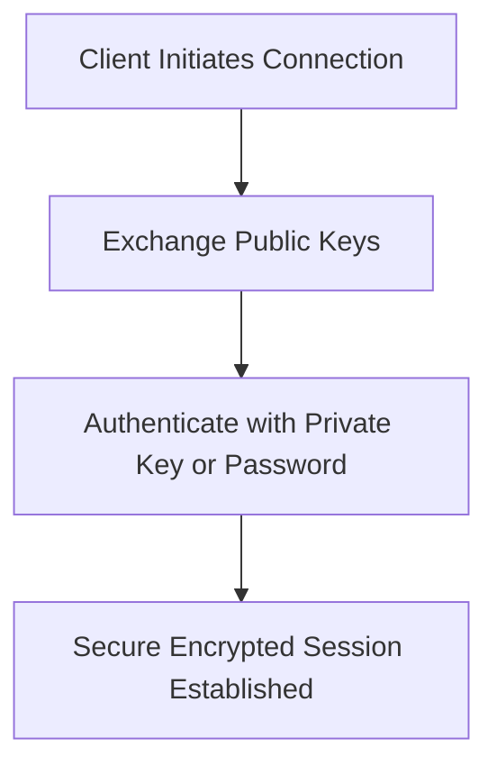

# Section 74: Basics of Networking Sniffing and configuration of Secure SHell (SSH) in Linux

<details open>
<summary><b>Section 74: Basics of Networking Sniffing and configuration of Secure SHell (SSH) in Linux (CL-KK-Terminal)</b></summary>

## Table of Contents
- [Networking Sniffing](#networking-sniffing)
  - [Overview of Network Sniffing](#overview-of-network-sniffing)
  - [Tools for Network Sniffing](#tools-for-network-sniffing)
  - [Why Encryption is Needed](#why-encryption-is-needed)
- [Configuration of Secure Shell (SSH)](#configuration-of-secure-shell-ssh)
  - [Introduction to SSH](#introduction-to-ssh)
  - [Installing and Setting Up SSH](#installing-and-setting-up-ssh)
  - [Using SSH for Remote Login](#using-ssh-for-remote-login)
  - [Running Commands Remotely](#running-commands-remotely)
  - [Copying Files via SSH](#copying-files-via-ssh)
  - [Setting Up Passwordless Authentication](#setting-up-passwordless-authentication)
  - [Managing SSH Keys](#managing-ssh-keys)
- [Summary](#summary)
  - [Key Takeaways](#key-takeaways)
  - [Quick Reference](#quick-reference)
  - [Expert Insight](#expert-insight)

## Networking Sniffing

### Overview of Network Sniffing
Network sniffing involves monitoring and capturing network traffic to analyze data packets transmitted over a network. It is commonly used for network troubleshooting, security auditing, and sometimes unauthorized data interception. In this section, we discuss why sniffing occurs in unencrypted channels and how encryption mitigates it.

### Tools for Network Sniffing
Network sniffing can be performed using various tools. Key tools discussed include:

- **Wireshark**: A graphical tool for analyzing network protocols. Install via `yum install wireshark-gnome` (assuming repositories are configured).
  - To start: Open with `wireshark` command, select interfaces like `nh10` (Ethernet), and capture traffic.
  - Filter packets: Use filters like `tcp`, `http`, `ssh`, or specific IPs (e.g., `ip.addr == 192.168.1.1`).
  - Deep packet inspection: Double-click packets to view layers, including encrypted data (appears scrambled).
  
- **tcpdump**: A command-line tool for packet capture. Install if needed, then run:
  ```bash
  tcpdump -i eth0  # Capture on interface eth0
  tcpdump tcp  # Filter TCP packets
  ```

These tools reveal packet details, but unencrypted traffic (e.g., HTTP, Telnet) can expose sensitive data like passwords.

**Code/Config Block:**
```bash
# Install Wireshark on Fedora-based systems
yum install wireshark-gnome

# Run tcpdump with basic capture
tcpdump -i eth0
```

### Why Encryption is Needed
Unencrypted communication (e.g., Telnet, simple HTTP) can be easily sniffed, exposing data. Encryption like SSH secures transmissions.

> [!IMPORTANT]
> Always use encrypted channels to prevent data leakage in network sniffing scenarios.

**Mistakes Notified:** In the transcript, "http" was referred to as "htp" – corrected to "HTTP". "networking" was transliterated oddly but standardized.

| Protocol | Encryption | Sniffing Risk | Example |
|----------|------------|---------------|---------|
| HTTP | No | High | `tcpdump` captures credentials |
| HTTPS | Yes | Low | Appears as scrambled data |
| Telnet | No | High | Raw text vulnerabilities |
| SSH | Yes | Low | Secure remote shell |

## Configuration of Secure Shell (SSH)

### Introduction to SSH
Secure Shell (SSH) provides secure remote access and file transfer over insecure networks. It uses public-key cryptography (RSA/ECDSA) for authentication and encryption. SSH operates on port 22 by default.

Key versions:
- SSH-1: Insecure, avoid.
- SSH-2: Current standard.

SSH works via key pairs: public key encrypts, private key decrypts.



### Installing and Setting Up SSH
- **Check Installation**: Run `rpm -qa | grep openssh-server`. If not installed: `yum install openssh-server`.
- **Start Service**: `systemctl start sshd`
- **Enable on Boot**: `systemctl enable sshd`
- **Firewall**: Allow port 22 if using firewalld: `firewall-cmd --permanent --add-service=ssh`
- **Config File**: Located at `/etc/ssh/sshd_config`. Common settings:
  - `PermitRootLogin yes/no`
  - `PasswordAuthentication yes/no`

Restart service after changes: `systemctl restart sshd`

### Using SSH for Remote Login
To log in to another machine:
```bash
ssh root@192.168.1.100  # Use IP or hostname
# Enter password when prompted
```

Add to `/etc/hosts` for hostname resolution or use DNS.

### Running Commands Remotely
Execute commands on remote server without full login:
```bash
ssh root@server_ip "pwd"  # Runs 'pwd' remotely
```

### Copying Files via SSH
Use `scp` for secure file transfer:
```bash
scp /path/to/file root@server_ip:/remote/path  # Copy to remote
scp root@server_ip:/remote/file /local/path    # Copy from remote
```

### Setting Up Passwordless Authentication
1. Generate key pair on local machine:
   ```bash
   ssh-keygen -t rsa  # Or -t ecdsa for ECDSA
   ```
   - Keys stored in `~/.ssh/`: `id_rsa` (private), `id_rsa.pub` (public).

2. Copy public key to remote server:
   ```bash
   ssh-copy-id -i ~/.ssh/id_rsa.pub root@remote_ip
   # Or manually: append ~/.ssh/id_rsa.pub to remote ~/.ssh/authorized_keys
   ```

3. Ensure permissions: `chmod 700 ~/.ssh` and `chmod 600 ~/.ssh/authorized_keys`.

For multiple servers, use a loop:
```bash
for ip in 192.168.1.100 192.168.1.101; do
    ssh-copy-id root@$ip ~/.ssh/id_rsa.pub
done
```

### Managing SSH Keys
- View keys: `ls ~/.ssh/`
- Remove authentication: Delete entries from `authorized_keys` on remote hosts.

**Lab Demos:**
- Sniff unencrypted traffic with Wireshark.
- Set up SSH between machines: Login remotely, copy files, run commands.

> [!NOTE]
> SSH tunneling can be used for secure port forwarding, but not covered here.

## Summary

### Key Takeaways
```diff
+ Network sniffing captures unencrypted traffic; use encryption to secure it.
+ SSH provides secure remote access via key-based or password authentication.
+ Tools like Wireshark and tcpdump analyze packets; always filter for efficiency.
- Avoid outdated protocols like Telnet; prefer SSH for all remote operations.
! Verify firewall rules for SSH port to prevent unauthorized access.
```

### Quick Reference
- Install Wireshark: `yum install wireshark-gnome`
- Check SSH status: `systemctl status sshd`
- Generate SSH keys: `ssh-keygen -t rsa`
- Remote login: `ssh user@ip`
- Secure copy: `scp file user@ip:/path`

### Expert Insight
**Real-world Application**: In production, SSH with key authentication is used for server management, code deployments, and secure file transfers via CI/CD pipelines.

**Expert Path**: Master advanced SSH features like agent forwarding, tunneling, and config file optimizations (`~/.ssh/config`). Explore Ansible for automated SSH-based management at scale.

**Common Pitfalls**: 
- Weak passwords enable brute-force; always use keys.
- Exposed private keys lead to security breaches; store securely.
- Neglecting firewall configuration blocks legitimate SSH access.

</details>
