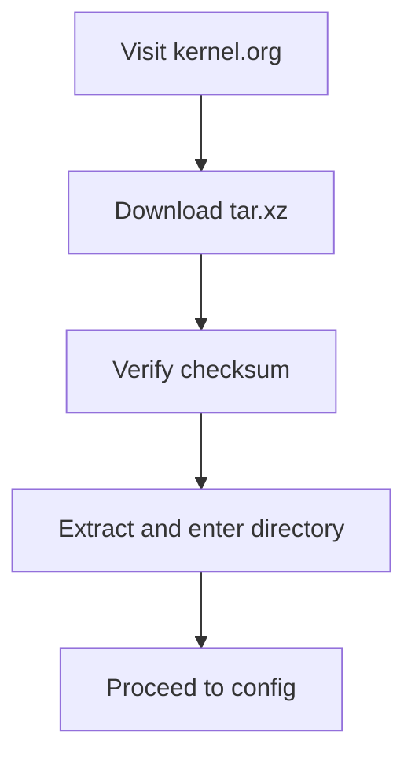
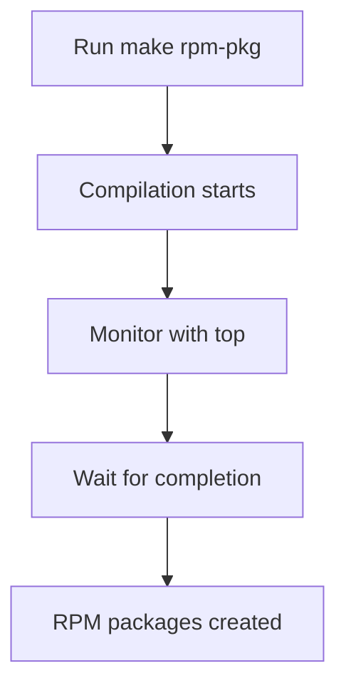

# Section 80: Kernel Compilation

<details open>
<summary><b>Section 80: Kernel Compilation (CL-KK-Terminal)</b></summary>

## Table of Contents
- [Preparation and Setup](#preparation-and-setup)
- [Downloading Kernel Source](#downloading-kernel-source)
- [Configuring Kernel](#configuring-kernel)
- [Compiling Kernel](#compiling-kernel)
- [Installing and Booting](#installing-and-booting)

## Preparation and Setup

### Overview
Kernel compilation involves downloading the latest Linux kernel source code, modifying configurations, and building it for your system. This section covers preparing your RHEL, CentOS, or Fedora system with necessary development tools and repositories.

### Key Concepts
Kernel compilation is essential for:
- **Hardware Support**: Adding support for new hardware or improving existing hardware compatibility.
- **Software Features**: Incorporating latest features or patches not available in stock kernels.
- **Customization**: Tailoring the kernel to specific needs, including security enhancements or optimizations.

Preparation involves installing development toolchains and updating the system.

### Practical Steps
1. **Install Development Groups**:
   ```bash
   sudo dnf group install "Development Tools"
   ```

2. **Additional Packages**:
   ```bash
   sudo dnf install ncurses-devel bc bison flex elfutils-libelf-devel openssl-devel dwarves
   ```

3. **Update System**:
   ```bash
   sudo dnf update
   ```

4. **Enable EPEL Repository**:
   ```bash
   sudo dnf install epel-release
   ```

5. **Enable PowerTools Repository** (if needed):
   ```bash
   sudo dnf config-manager --set-enabled powertools
   ```

> [!IMPORTANT]  
> Ensure sufficient CPU cores and RAM (minimum 16GB recommended) for compilation.

### Common Pitfalls
- Insufficient RAM can crash the compilation process.
- Missing EPEL can lead to package dependency errors.

## Downloading Kernel Source

### Overview
Download the latest kernel source from kernel.org and verify its integrity to ensure it's not corrupted.

### Key Concepts
- Kernel sources are distributed as tarballs on kernel.org.
- Always verify checksums for security.

### Practical Steps
1. **Download Latest Kernel (e.g., v5.17)**:
   ```bash
   wget https://cdn.kernel.org/pub/linux/kernel/v5.x/linux-5.17.tar.xz
   ```

2. **Extract Source**:
   ```bash
   tar -xf linux-5.17.tar.xz
   cd linux-5.17
   ```

3. **Verify (if checksum provided)**:
   Use `sha256sum` to check integrity.

### Diagrams


## Configuring Kernel

### Overview
Kernel configuration involves selecting modules, drivers, and features. Use existing configurations as a base to avoid manual selection.

### Key Concepts
- **Menuconfig**: Interactive configuration tool.
- Start with an existing `.config` file from your distro for compatibility.
- Key modifications: Enable/disable modules based on hardware needs.

### Practical Steps
1. **Copy Existing Config**:
   ```bash
   cp /boot/config-$(uname -r) .config
   ```

2. **Run Menuconfig (if needed for modifications)**:
   ```bash
   make menuconfig
   ```

3. **Disable Issues (e.g., systemd-configuration problem)**:
   In the menu, disable "Systemd" and select appropriate options for your hardware.

4. **Save Configuration**:
   Exit and save config.

> [!NOTE]  
> For beginners, copying the existing config is recommended to avoid errors.

### Common Pitfalls
- Selecting incorrect kernel modules can lead to boot failures.
- Forgetting to disable problematic features like systemd can cause compilation hangs.

## Compiling Kernel

### Overview
Compilation builds the kernel from source, utilizing multiple CPU cores for faster processing. Time varies based on hardware but typically 20-60 minutes.

### Key Concepts
- **Parallel Compilation**: Use `-j` flag to leverage multiple cores.
- RAM usage increases during compilation.

### Practical Steps
1. **Clean Previous Builds**:
   ```bash
   make mrproper
   ```

2. **Generate RPM Packages**:
   ```bash
   make rpm-pkg -j$(nproc)
   ```

3. **Monitor Process**:
   Use `top` or `htop` to track CPU/RAM usage.

### Examples
- With 24 CPUs: `make rpm-pkg -j24`
- Approximate time: 20-45 minutes depending on system.

### Diagrams


> [!IMPORTANT]  
> Ensure no critical processes are running to avoid resource contention.

### Common Pitfalls
- Insufficient cores lead to slow or hung compilation (minimum 4-8 recommended).
- RAM spikes can cause system instability.

## Installing and Booting

### Overview
Install generated RPM packages and reboot. Select the new kernel from the GRUB menu.

### Key Concepts
- RPM packages include kernel, modules, and headers.
- Update GRUB configuration if needed.

### Practical Steps
1. **Install RPMs**:
   ```bash
   sudo rpm -ivh ~/rpmbuild/RPMS/x86_64/kernel-5.17-1.x86_64.rpm
   ```

2. **Reboot System**:
   ```bash
   sudo reboot
   ```

3. **Select Kernel in GRUB**:
   During boot, choose the new kernel entry.

4. **Verify**:
   ```bash
   uname -r
   ```
   Should show version 5.17 or similar.

> [!NOTE]  
> If boot fails, use the old kernel as fallback.

### Common Pitfalls
- Missing kernel modules can cause hardware issues post-install.
- Corrupt configs may prevent boot.

## Summary
- **Key Takeaways**:
  ```diff
  + Custom kernels provide better hardware/software support
  + Use parallel compilation for efficiency
  - Compilation can consume significant resources
  ! Verify sources to avoid security risks
  ```

- **Quick Reference**:
  - Development tools installation: `sudo dnf group install "Development Tools"`
  - Clone config: `cp /boot/config-$(uname -r) .config`
  - Compile: `make rpm-pkg -j$(nproc)`
  - Install kernel: `sudo rpm -ivh kernel*rpm`
  - Verify: `uname -r`

- **Real-world Application**: In production environments, custom kernels optimize for specific workloads like high-performance computing or containers, ensuring stability and feature requirements.

- **Expert Path**: Study kernel documentation on kernel.org; experiment with different configs using `make xconfig` for GUI. Contribute patches upstream for advanced mastery.

- **Common Pitfalls**: Memory exhaustion during compilation; incorrect configs causing boot failures; not testing in a VM-like environment first.

</details>
