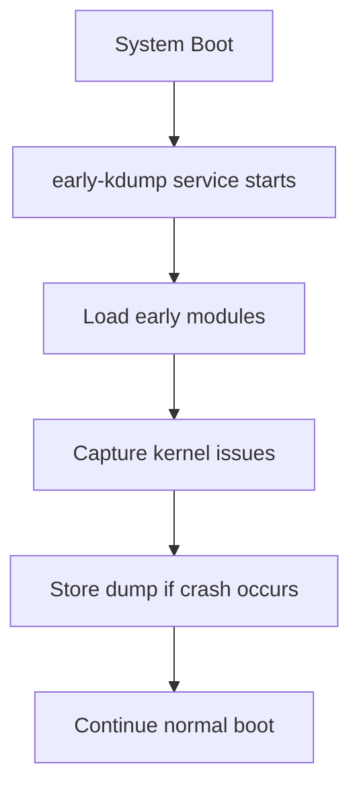

# Section 81: Kernel Dump Configuration in Linux

<details open>
<summary><b>Section 81: Kernel Dump Configuration in Linux (CL-KK-Terminal)</b></summary>

## Table of Contents
- [Overview](#overview)
- [What is Kdump](#what-is-kdump)
- [Configuring Kdump](#configuring-kdump)
- [Testing Kdump](#testing-kdump)
- [Installing Crash Utility and Analyzing Dumps](#installing-crash-utility-and-analyzing-dumps)
- [Early Kdump](#early-kdump)
- [Configuring Early Kdump](#configuring-early-kdump)
- [Testing Early Kdump](#testing-early-kdump)
- [Summary](#summary)

## Overview
Kernel dumps are critical diagnostic tools in Linux for capturing system state during a crash. This section covers kdump (traditional kernel crash dumping mechanism) and early kdump (enhanced mechanism available in Red Hat Enterprise Linux 8). We'll explore their configuration, testing, and analysis, including practical demonstrations using CentOS 7 for kdump and AlmaLinux/CentOS 8 for early kdump.

## What is Kdump
Kdump provides a kernel crash dumping mechanism that captures the contents of system memory for later analysis when a kernel crash occurs. This helps administrators understand what caused the system failure.

### Key Features
- Captures system memory contents at crash time
- Uses a secondary kernel to dump data without affecting the primary kernel
- Stores dumps in a specified location for root cause analysis
- Essential for debugging production system issues

### Difference Between Kdump and Early Kdump
- **Traditional Kdump**: Relies on secondary kernel to capture dumps after boot services are loaded. May miss early crash details if problems occur before services start.
- **Early Kdump**: Starts earlier in the boot process, capturing information from very early kernel issues. Uses dedicated scripts and modules for faster initialization.

```diff
+ Traditional Kdump: Captures post-boot crashes
- Limitation: May lose data from early boot issues
+ Early Kdump: Captures early boot crashes and kernel issues
- Available in RHEL 8+ distributions
```

### When Early Kdump is Needed
If issues occur before full system initialization (e.g., early in boot process), traditional kdump may not capture sufficient information. Early kdump ensures capture of this early data.

> [!IMPORTANT]
> Early kdump is the recommended mechanism for RHEL 8 environments. Traditional kdump is shown for CentOS 7 educational purposes.

## Configuring Kdump
We'll configure kdump on CentOS 7 (bootstrapped to CentOS 8 for practical demonstration). The process involves reserving memory, configuring the service, and setting up dump location.

### Prerequisites
- Ensure `kexec-tools` package is installed:
  ```bash
  rpm -qa | grep kexec-tools
  ```
- If not installed, install it using your package manager

### Reserve Memory for Dump
Edit `/etc/default/grub` to allocate memory for the crash kernel:
```bash
vim /etc/default/grub
```
Add to `GRUB_CMDLINE_LINUX` line (allocate 256MB in example):
```
crashkernel=256M
```
Existing line will show something like `GRUB_CMDLINE_LINUX="rhgb quiet"`

### Regenerate GRUB Configuration
After editing, regenerate the GRUB config:
```bash
grub2-mkconfig -o /boot/grub2/grub.cfg
```

### Configure Kdump Service
Edit `/etc/kdump.conf`:
```bash
vim /etc/kdump.conf
```
Configure dump location (local path shown):
```ini
path /var/crash
core_collector makedumpfile -l --message-level 1 -d 17
default reboot
```

### Enable and Start Kdump Service
Restart system to apply changes, then enable the service:
```bash
systemctl enable kdump.service
systemctl start kdump.service
```
Verify status:
```bash
systemctl status kdump.service
```

## Testing Kdump
To test kdump functionality, we induce a kernel panic in a controlled manner.

### Create Kernel Panic
Use the `echo` command to write to `/proc/sysrq-trigger` (requires `kernel.sysrq=1` sysctl setting):
```bash
echo c > /proc/sysrq-trigger
```

### Post-Crash Behavior
- System will crash and reboot automatically
- Dump file created in specified path (e.g., `/var/crash/core.vmcore`)
- Message files also generated:
  - `vmcore-dmesg.txt`: Boot messages after crash
  - `vmcore.vmcore`: Binary dump file

### Manual Crash Induction
Alternatively, write a script and execute it:
```bash
echo 1 > /proc/sysrq
echo c > /proc/sysrq-trigger
```

> [!WARNING]
> Testing will cause immediate system reboot. Perform in isolated environments only.

## Installing Crash Utility and Analyzing Dumps
To analyze dump files, install the crash utility and kernel debug info packages.

### Install Dependencies
Enable debug repository:
```yaml
yum-config-manager --enable rhel-debuginfo
```

Install crash utility:
```bash
yum install crash
```

Install kernel debug info (must match system kernel version):
```bash
yum install kernel-debuginfo-$(uname -r)
```
This may require significant download time (>2GB).

### Analyze Dump File
Use crash utility to open and analyze:
```bash
crash /usr/lib/debug/lib/modules/$(uname -r)/vmlinux /var/crash/core.vmcore
```

#### Useful Crash Commands
- `ps`: Show running processes at crash time
- `sys`: Show system information (uptime, memory, etc.)
- `vmstat`: Virtual memory statistics
- `files`: List open files
- `log`: Show kernel log messages
- `help`: List available commands

The crash utility provides a console-like interface for debugging the crash state.

## Early Kdump
Early kdump addresses limitations of traditional kdump by allowing capture of kernel issues that occur very early in system boot before full initialization.

### Key Advantages
- Activates immediately on system boot
- Captures information from early boot phases
- Uses specialized scripts for fast kernel loading

### Architecture Overview
Early kdump uses two main scripts in `/usr/lib/kdump/early-kdump/`:
- `early-kdump.service`: Service unit file
- `early-kdump.sh`: Setup script



### Configuration Process Overview
1. Enable early kdump service
2. Modify GRUB configuration
3. Regenerate initramfs
4. Add early kdump module
5. Test and verify

## Configuring Early Kdump
Demonstration uses AlmaLinux (RHEL 8 compatible). Ensure your distribution supports early kdump (RHEL 8, CentOS 8, AlmaLinux, etc.).

### Enable Early Kdump Service
Start and enable the kdump service:
```bash
systemctl start kdump.service
systemctl enable kdump.service
```

### View Available Modules
Check which modules are available:
```bash
ls /usr/lib/kdump/early-kdump/
```

Expected output:
- early-kdump.service
- early-kdump.sh

### Modify GRUB Configuration
Edit `/etc/default/grub` and replace crash kernel parameter:
```bash
vim /etc/default/grub
```
Change:
```
crashkernel=auto
```
Replace with:
```
crashkernel=auto rd.earlykdump=yes
```

### Regenerate GRUB and Regenerate Initramfs
```bash
grub2-mkconfig -o /boot/grub2/grub.cfg
dracut -f --regenerate-all
```

### Add Early Kdump Module
Add the module to running kernel:
```bash
kdumpctl addmodule early-kdump
```

Verify module addition:
```bash
kdumpctl showmodule
```
Expected: `early-kdump` should appear in the list.

### Reboot System
Reboot to apply changes:
```bash
reboot
```

After reboot, verify early kdump is active:
```bash
dmesg | grep early
```

## Testing Early Kdump
Create a custom systemd unit to induce kernel panic during boot for testing.

### Create Test Service Unit File
Create `/etc/systemd/system/test-early-kdump.service`:
```ini
[Unit]
Description=Test Early Kdump Service
After=network.target

[Service]
Type=simple
ExecStart=/usr/local/bin/test-early-kdump.sh
Restart=always

[Install]
WantedBy=multi-user.target
```
Set appropriate permissions:
```bash
chmod 644 /etc/systemd/system/test-early-kdump.service
```

### Create Test Script
Create `/usr/local/bin/test-early-kdump.sh`:
```bash
#!/bin/bash
echo 1 > /proc/sysrq
echo c > /proc/sysrq-trigger
```

Set execution permissions:
```bash
chmod +x /usr/local/bin/test-early-kdump.sh
```

### Enable Test Service (Without Starting Yet)
```bash
systemctl enable test-early-kdump.service
```

### Reboot to Test
Reboot the system. The test service will run on boot and induce kernel panic, triggering early kdump dump creation.

### Post-Test Cleanup
After reboot, enter single-user mode to disable the test:
1. At GRUB menu, edit kernel line and add `single`
2. Boot to single-user mode
3. Mount root filesystem in read-write mode:
   ```bash
   mount -o remount,rw /sysroot
   ```
4. Chroot into system:
   ```bash
   chroot /sysroot
   ```
5. Disable/remove test service and script:
   ```bash
   systemctl disable test-early-kdump.service
   rm /etc/systemd/system/test-early-kdump.service
   rm /usr/local/bin/test-early-kdump.sh
   ```
6. Reboot normally

### Verify Dump Creation
Check for dump files in configured path:
```bash
ls -la /var/crash/
```
Files should include:
- `vmcore.vmcore` (binary dump)
- `vmcore-dmesg.txt` (startup logs)

## Summary

### Key Takeaways
```diff
+ Kdump captures system memory for crash analysis
+ Early kdump supports RHEL 8+ for early boot issues
+ Requires memory reservation and service configuration
+ Test with controlled kernel panics in isolated environments
+ Use crash utility for deep analysis of dump files
! Always test in non-production environments
```

### Quick Reference
- **Reserve memory**: `crashkernel=256M` in `/etc/default/grub`
- **Enable service**: `systemctl enable kdump.service`
- **Induce crash**: `echo c > /proc/sysrq-trigger`
- **Analyze dump**: `crash /usr/lib/debug/lib/modules/$(uname -r)/vmlinux /path/to/vmcore`
- **Early kdump GRUB**: `crashkernel=auto rd.earlykdump=yes`

### Expert Insight
**Real-world Application**: In enterprise environments, enabling early kdump on all production servers ensures forensic data collection for any kernel-related incidents, enabling rapid root cause analysis and minimizing downtime.

**Expert Path**: Master crash dump analysis by studying kernel panic codes, common failure patterns in your specific workload, and integrating with monitoring systems for automated dump capture.

**Common Pitfalls**: 
- Insufficient memory allocation can prevent dump creation
- Forgetting to install matching kernel-debuginfo packages blocks analysis
- Testing in production environments causes unplanned outages
- Not enabling early kdump in modern RHEL 8+ deployments misses early boot diagnostics

</details>
