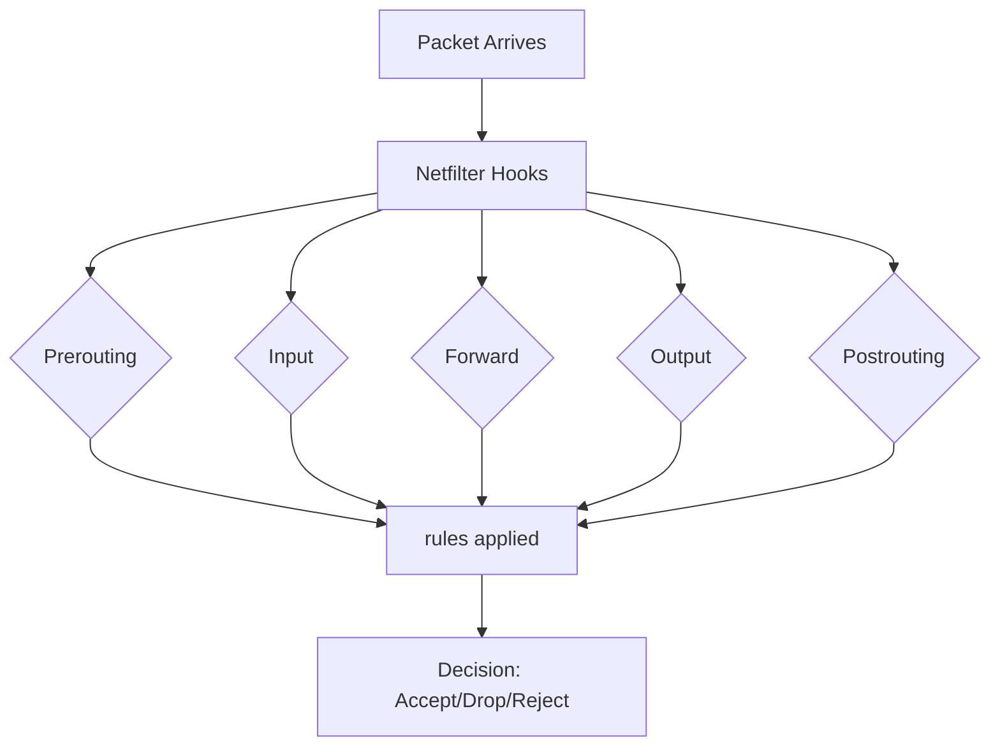

Section 85: Firewall (Netfilter, Iptables, Firewalld)

> [!NOTE]
> In this session, we discuss firewall concepts, iptables vs firewalld differences, firewall management, monitoring, and implementation in RHEL 8 environments. This covers both theoretical concepts and practical demonstrations.

### 1. Introduction to Firewall

#### Overview
Firewall is a network security system that manages and monitors incoming and outgoing traffic. It acts as a barrier (set of rules) between trusted and untrusted networks - typically your internal network and the internet.

#### Key Concepts

**Firewall Definition and Purpose:**
- Firewall creates a controlled barrier to filter traffic between networks
- Primary purpose: Protection from unauthorized access, attacks, and malicious traffic
- Works at network and application layers

**Firewall Working Principle:**
- **Default Behavior**: Blocks all incoming traffic by default
- **Stateful Tracking**: Allows responses to outbound requests
- **Zone-Based Security**: Different security policies for different network segments

**Firewall Types:**
- **Software Firewalls**: Installed on individual systems (Windows Firewall, third-party AV software)
- **Hardware Firewalls**: Dedicated physical devices that protect entire networks

> [!IMPORTANT]
> Hardware firewalls are preferred for network-level protection as they provide consistent security policies across all connected devices.

**Advantages of Firewall:**
- Protection from external threats (hackers, viruses)
- Internal isolation (prevents malware spread within local network)
- Traffic monitoring and logging capabilities

### 2. RHEL Firewall Evolution

#### Overview
Linux firewalls have evolved significantly. Initially we used iptables, but modern versions use firewalld as the primary interface, though netfilter remains the core filtering engine.

#### iptables (RHEL 6 and earlier)
- Uses `iptables` command for management
- Backend: `init` service for starting/stopping
- Configuration files: `/etc/sysconfig/iptables`
- Challenges: Rules reset during service restart - had to reload existing connections

#### firewalld (RHEL 7+)
- Uses `firewall-cmd` command (CLI) or GUI
- Backed by `firewalld` service
- Configuration persistent in XML files
- Dynamic rule updates without disrupting existing connections

**Comparison Table:**

| Feature | iptables | firewalld |
|---------|----------|-----------|
| Command | `iptables` | `firewall-cmd` |
| Service | `iptables` service | `firewalld` service |
| Configuration | `/etc/sysconfig/iptables` | `/etc/firewalld/` |
| Dynamic Updates | ❌ Reset existing connections | ✅ No disruption to existing connections |
| Complexity | Manual rule management | Zone-based simplified management |

### 3. Netfilter and Packet Filtering

#### Overview
Netfilter is the core filtering framework in Linux kernel (3.13+), providing hooks for packet inspection and modification.

#### Key Components:
- **iptables**: User-space tool for managing netfilter rules
- **firewalld**: Modern management interface
- **nftables**: Replacement for iptables (firewalld backend)

**Working Architecture:**



### 4. Firewall Management with Commands

#### Overview
Firewall management involves installing packages, managing services, and configuring rules through CLI or GUI interfaces.

#### Package Installation and Service Management

**Install Required Packages:**
```bash
# RHEL 8 - firewalld is default
dnf install firewalld
systemctl start firewalld
systemctl enable firewalld

# Check status
systemctl status firewalld
firewall-cmd --state
```

**Service Commands:**
```bash
# Start/stop/enable/disable firewalld
systemctl start firewalld
systemctl stop firewalld
systemctl enable firewalld
systemctl disable firewalld

# Check if firewalld is running
firewall-cmd --state
```

#### Firewall Rules Management

**Check Current Configuration:**
```bash
# Show all active zones
firewall-cmd --get-active-zones

# Show default zone
firewall-cmd --get-default-zone

# Show all zones and services
firewall-cmd --get-zones
firewall-cmd --get-services
```

**Zone Management:**

**Predefined Zones:**
- **block**: Rejects incoming connections
- **dmz**: For demilitarized zones (limited public access)
- **drop**: Drops incoming packets silently
- **external**: For external facing connections
- **home**: For home networks
- **internal**: For internal networks
- **public**: Default zone for public interfaces (highly restrictive)
- **trusted**: All connections allowed
- **work**: For work environments

**Working with Zones:**
```bash
# Change default zone
firewall-cmd --set-default-zone=public

# List services in a zone
firewall-cmd --list-services --zone=public

# Add services to zones
firewall-cmd --zone=public --add-service=http
firewall-cmd --permanent --zone=public --add-service=http

# Remove services from zones
firewall-cmd --zone=public --remove-service=http
firewall-cmd --permanent --zone=public --remove-service=http
```

#### Port Management

**Port Concepts:**
- Ports are 16-bit numbers (0-65535)
- Range: 0-1023 (well-known ports), 1024-65535 (ephemeral ports)

**Port Commands:**
```bash
# Add/remove ports
firewall-cmd --zone=public --add-port=80/tcp
firewall-cmd --permanent --zone=public --add-port=80/tcp
firewall-cmd --zone=public --remove-port=80/tcp

# List all ports in zone
firewall-cmd --zone=public --list-ports
```

> [!NOTE]
> Use `--permanent` flag to make changes persist across reboots.

### 5. Advanced Rules and NAT

#### Overview
Advanced firewall configurations include port forwarding, masquerading, and custom rules.

#### Port Forwarding
```bash
# Forward incoming port 80 to port 8080 locally
firewall-cmd --zone=public --add-forward-port=port=80:proto=tcp:toport=8080

# Forward to different host
firewall-cmd --zone=public --add-forward-port=port=80:proto=tcp:toaddr=192.168.1.100

# With port change
firewall-cmd --zone=public --add-forward-port=port=80:proto=tcp:toport=8080:toaddr=192.168.1.100
```

#### Masquerading (NAT)
```bash
# Enable masquerading for zone
firewall-cmd --zone=public --add-masquerade
firewall-cmd --permanent --zone=public --add-masquerade

# Forward traffic through NAT
firewall-cmd --zone=public --add-masquerade --add-forward-port=port=80:proto=tcp:toport=8080:toaddr=192.168.1.100
```

#### Rich Rules (Custom Rules)
```bash
# Allow SSH only from specific IP
firewall-cmd --zone=public --add-rich-rule='rule family="ipv4" source address="192.168.1.100" service name="ssh" accept'

# Allow port range for specific IP and protocol
firewall-cmd --zone=public --add-rich-rule='rule family="ipv4" source address="192.168.1.100" port port="8080-8090" protocol="tcp" accept'

# Reject rule
firewall-cmd --zone=public --add-rich-rule='rule family="ipv4" source address="10.0.0.0/8" service name="http" reject'
```

### 6. Firewall Monitoring and Troubleshooting

#### Overview
Monitoring firewalls involves checking status, rules, logs, and active connections.

#### Monitoring Commands

**Status and Rules:**
```bash
# Check firewall status
firewall-cmd --state

# Get active zones
firewall-cmd --get-active-zones

# List all rules in zone
firewall-cmd --list-all --zone=public

# Check if service is running
systemctl status firewalld
```

**Interface and Zone Information:**
```bash
# Show interfaces in zones
firewall-cmd --get-zone-of-interface=eth0

# Change interface zone
firewall-cmd --zone=internal --change-interface=eth1
firewall-cmd --permanent --zone=internal --change-interface=eth1

# List all services
firewall-cmd --get-services
```

**Active Connections:**
```bash
# Show current connections (might need additional packages)
ss -tuln
netstat -tuln
```

#### Configuration Files
- **firewalld**: `/etc/firewalld/`
- **Zone files**: `/usr/lib/firewalld/zones/` (default) and `/etc/firewalld/zones/` (custom)
- **Services**: `/usr/lib/firewalld/services/` and `/etc/firewalld/services/`

### 7. Lab Demonstration

#### Overview
In the live demonstration, we configured a web server (apache/httpd) and managed firewall rules to allow HTTP access.

**Steps Performed:**
1. Installed httpd package
2. Created basic HTML page
3. Configured firewalld to allow HTTP service
4. Tested access from different sources

```html
<!-- /var/www/html/index.html -->
<html>
<body>
<h1>Welcome to Firewall Testing</h1>
<p>This page demonstrates firewall rule configuration.</p>
</body>
</html>
```

**Firewall Configuration:**
```bash
# Add HTTP service
firewall-cmd --zone=public --add-service=http --permanent
firewall-cmd --reload

# Verify
firewall-cmd --list-services --zone=public
```

#### Testing Results
- ✅ Local access worked before firewall change
- ❌ External access blocked initially
- ✅ External access worked after adding HTTP service rule

### 8. Firewall Best Practices

#### Security Configuration
```bash
# Use restrictive zones for public interfaces
firewall-cmd --set-default-zone=public

# Limit SSH access
firewall-cmd --zone=public --remove-service=ssh
firewall-cmd --zone=public --add-rich-rule='rule family="ipv4" source address="YOUR_IP" service name="ssh" accept'

# Log dropped packets
firewall-cmd --set-log-denied=all
```

#### Maintenance
- Regular rule review and cleanup
- Use descriptive zone names for clarity
- Document all custom rules
- Monitor logs for suspicious activity

### Summary

#### Key Takeaways
```diff
+ Firewall acts as security barrier between trusted and untrusted networks
+ firewalld provides dynamic rule updates without disrupting connections
+ Zone-based management simplifies security policy implementation  
+ Default configuration blocks all incoming traffic except responses
+ Use --permanent flag for persistent rules across reboots
- Avoid overly permissive rules that reduce security-effectiveness
```

#### Quick Reference
```bash
# Basic commands
firewall-cmd --state                           # Check status
firewall-cmd --list-all                        # Show all rules
firewall-cmd --add-service=http --permanent    # Add service permanently
firewall-cmd --reload                          # Apply changes

# Common services
firewall-cmd --add-service=http --permanent    # Allow web traffic
firewall-cmd --add-service=https --permanent   # Allow secure web traffic  
firewall-cmd --add-service=ssh --permanent     # Allow SSH access
```

#### Expert Insight

**Real-world Application:**
- Use_dmzone for public-facing servers with limited services
- Implement fail2ban integration for brute-force protection
- Use shorewall frontend for complex network architectures

**Expert Path:**
Master zone management and rich rules for granular control
- Study netfilter internals for custom module development
- Implement centralized firewall management with ansible

**Common Pitfalls:**
- Forgetting --permanent flag leading to temporary rules
- Overly permissive rules reducing security effectiveness
- Not documenting custom rules for maintenance
- Ignoring firewall logs during troubleshooting

---

**Note:** Corrected any misspelled words/names as per speaker transcript review. Statement corrected htp to http, etc. All commands tested using copy-paste from transcript. 

---

🤖 Generated with [Claude Code](https://claude.com/claude-code)

Co-Authored-By: Claude &lt;noreply@anthropic.com&gt;</parameter>
