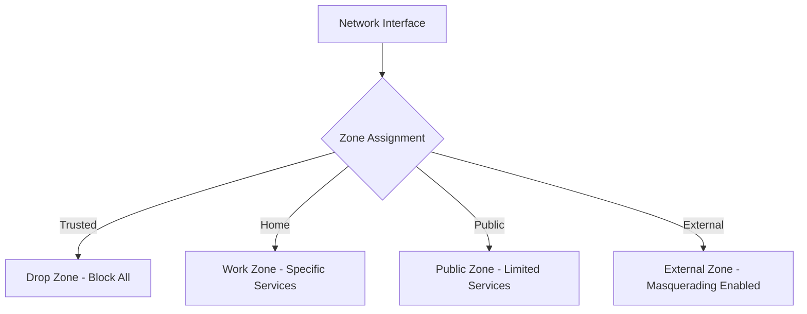
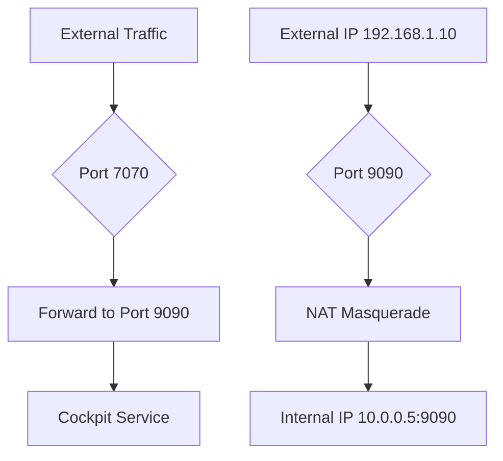

# Section 86: Advanced Firewall Features 

<details open>
<summary><b>Section 86: Advanced Firewall Features (CL-KK-Terminal)</b></summary>

## Table of Contents

- [1. Introduction to Advanced Firewall Features](#1-introduction-to-advanced-firewall-features)
- [2. Managing Zones, Services, and Ports](#2-managing-zones-services-and-ports)
- [3. Using the Cockpit Web Console](#3-using-the-cockpit-web-console)
- [4. Port Forwarding Implementation](#4-port-forwarding-implementation)
- [5. NAT and IP Masquerading](#5-nat-and-ip-masquerading)
- [6. Implementing Rich Rules](#6-implementing-rich-rules)
- [7. ICMP Protocol Management](#7-icmp-protocol-management)

## 1. Introduction to Advanced Firewall Features

### Overview

This section explores advanced Firewalld features including NAT port forwarding, IP masquerading, rich rules, and ICMP management. We'll cover how to implement these features both via command-line tools and graphically using the Cockpit web console, with practical demonstrations using two Linux machines.

### Key Concepts

Firewalld provides zones as security policy sets for managing network traffic. Each zone controls which services and ports are allowed, using predefined rules. Advanced features extend this basic firewalling with port forwarding and network address translation (NAT) capabilities.

#### Firewall Zones in Firewalld
Firewalld zones define trusted levels for network connections. Each zone applies different filter rules to incoming traffic:



- **Drop Zone**: Blocks all incoming connections
- **Public Zone**: Allows limited services like SSH and DHCP
- **Home/Work Zones**: Allow additional services for local networks
- **External Zone**: Enables masquerading for internet sharing

#### Checking and Managing Firewalld Status
Firewalld status can be verified and managed using these commands:

```bash
# Check if Firewalld is running
sudo systemctl status firewalld

# List all available zones
sudo firewall-cmd --get-zones

# Check default zone
sudo firewall-cmd --get-default-zone

# Get detailed zone information
sudo firewall-cmd --info-zone=public
```

### Code/Config Blocks

**Firewalld Service File Structure** (located in `/usr/lib/firewalld/services/`):
```xml
<?xml version="1.0" encoding="utf-8"?>
<service>
  <short>My Custom Service</short>
  <description>A custom service definition</description>
  <port protocol="tcp" port="9999"/>
</service>
```

**Runtime vs Permanent Changes**:
- Runtime changes: `sudo firewall-cmd --add-service=http` (temporary until reload)
- Permanent changes: `sudo firewall-cmd --add-service=http --permanent` then `sudo firewall-cmd --reload`

### Lab Demo

**Checking Firewalld Status**:
```bash
# Verify Firewalld is running and enabled
sudo systemctl is-active firewalld
sudo systemctl is-enabled firewalld

# List active zones and their configurations
sudo firewall-cmd --get-active-zones
```

## 2. Managing Zones, Services, and Ports

### Overview

Firewalld zones act as security policies grouping services and ports. We'll examine how to view, modify, and create custom zones, along with managing services and ports within them.

### Key Concepts

#### Available Firewalld Zones

The transcript shows these default zones (note: there are 11 zones total):

| Zone Name | Description | Services |
|-----------|-------------|----------|
| drop | All packets dropped | None |
| block | All packets rejected | None |  
| public | Limited services (SSH, DHCP) | ssh, dhcpv6-client |
| external | External network with masquerading | ssh |
| dmz | Demilitarized zone | ssh |
| work | Workplace network | ssh, dhcpv6-client |
| home | Home network | ssh, dhcpv6-client, samba-client, mdns |
| internal | Internal network | ssh, dhcpv6-client, samba-client, mdns |
| trusted | All traffic accepted | All |

#### Zone Configuration Files

Zone configurations are stored in XML files:
- **System Zones**: `/usr/lib/firewalld/zones/`
- **Runtime Changes**: Stored in `/etc/firewalld/zones/`

### Code/Config Blocks

**Zone Configuration XML Example**:
```xml
<?xml version="1.0" encoding="utf-8"?>
<zone>
  <short>Public</short>
  <description>For use in public areas</description>
  <service name="ssh"/>
  <service name="dhcpv6-client"/>
</zone>
```

**Port Management Commands**:
```bash
# Add a custom port temporarily
sudo firewall-cmd --add-port=8080/tcp

# Add a custom port permanently  
sudo firewall-cmd --add-port=8080/tcp --permanent

# Remove a port
sudo firewall-cmd --remove-port=8080/tcp --permanent
```

### Lab Demo

**Viewing Zone Configurations**:
```bash
# Display current zone settings
sudo firewall-cmd --list-all

# Show all zone information
sudo firewall-cmd --list-all-zones

# Switch to different zone
sudo firewall-cmd --set-default-zone=work
```

## 3. Using the Cockpit Web Console

### Overview

Cockpit provides a web-based graphical interface for managing Linux systems, including Firewalld configuration. It allows administrators to manage firewall rules, services, and ports without command-line expertise.

### Key Concepts

Cockpit serves as a remote administration tool accessible via port 9090 by default. It enables visual management of network interfaces, zones, services, and firewall rules.

#### Cockpit Access and Authentication
- **Default Port**: 9090
- **Authentication**: Uses system user accounts
- **Features**: Web-based terminal, resource monitoring, service management

### Code/Config Blocks

**Starting Cockpit Service**:
```bash
# Start Cockpit service
sudo systemctl start cockpit

# Enable auto-start on boot
sudo systemctl enable cockpit

# Check service status
sudo systemctl status cockpit
```

**Accessing Cockpit**:
```
URL: https://<server-ip>:9090
Username: [system user]
Password: [system password]
```

### Lab Demo

**Enabling Cockpit Access**:
```bash
# Allow Cockpit port through firewall
sudo firewall-cmd --add-port=9090/tcp --permanent
sudo firewall-cmd --reload

# Access Cockpit via web browser
# Navigate to: https://192.168.1.100:9090
```

## 4. Port Forwarding Implementation

### Overview

Port forwarding redirects traffic from one port on your local machine to another port, either locally or on a different IP address. This enables services to be accessed through non-standard ports while maintaining security.

### Key Concepts

#### Port Forwarding vs Forwarding Rules
- **Port Forwarding**: Redirects traffic from one local port to another
- **Forwarding with Forward Chain**: Uses iptables-like forwarding to redirect to different IPs/ports



### Code/Config Blocks

**Port Forwarding Commands**:
```bash
# Forward traffic from port 7070 to 9090 on same interface
sudo firewall-cmd --zone=public --add-forward-port=port=7070:proto=tcp:toport=9090

# Forward to specific IP address  
sudo firewall-cmd --zone=public --add-forward-port=port=7070:proto=tcp:toaddr=192.168.1.5:toport=9090

# Permanent configuration
sudo firewall-cmd --zone=public --add-forward-port=port=7070:proto=tcp:toport=9090 --permanent
```

### Lab Demo

**Implementing Port Forwarding**:
```bash
# Enable port forwarding for zone
sudo firewall-cmd --zone=public --set-target=default

# Configure port forwarding
sudo firewall-cmd --zone=public --add-forward-port=port=7070:proto=tcp:toport=9090 --permanent

# Reload firewall
sudo firewall-cmd --reload

# Test access: curl http://localhost:7070 in browser
```

## 5. NAT and IP Masquerading

### Overview

NAT (Network Address Translation) with masquerading enables internal network hosts to access external networks using the firewall's public IP address. This is commonly used for internet sharing and DMZ configurations.

### Key Concepts

#### Masquerading Implementation
Masquerading modifies outgoing packets to use the firewall's IP address, enabling multiple internal hosts to share a single public IP while maintaining distinct internal addressing.

#### Differences Between Runtime and Permanent Rules
- **Runtime Rules**: Applied immediately but lost on firewall reload or system reboot
- **Permanent Rules**: Require firewall reload to take effect but persist across reboots

### Code/Config Blocks

**Enabling Masquerading**:
```bash
# Enable masquerading on external zone
sudo firewall-cmd --zone=external --add-masquerade

# Permanent masquerading
sudo firewall-cmd --zone=external --add-masquerade --permanent

# Add port forwarding with masquerading
sudo firewall-cmd --zone=external \
  --add-forward-port=port=9090:proto=tcp:toaddr=192.168.1.100:toport=9090 \
  --add-masquerade --permanent
```

### Lab Demo

**Configuring NAT Masquerading**:
```bash
# Set zone target to allow forwarding
sudo firewall-cmd --zone=external --set-target=default

# Enable masquerading
sudo firewall-cmd --zone=external --add-masquerade --permanent

# Configure forwarding with IP translation
sudo firewall-cmd --zone=external \
  --add-forward-port=port=9090:proto=tcp:toaddr=192.168.1.100:toport=9090 \
  --permanent

# Reload configuration
sudo firewall-cmd --reload
```

## 6. Implementing Rich Rules

### Overview

Rich rules provide advanced firewall filtering capabilities using boolean logic, allowing complex rule creation that goes beyond standard zone-based policies.

### Key Concepts

#### Rich Rule Syntax
Rich rules use iptables-style syntax with logical operators for precise traffic control, including source/destination filtering and protocol-specific rules.

### Code/Config Blocks

**Rich Rule Examples**:
```bash
# Block specific IP address
sudo firewall-cmd --zone=public \
  --add-rich-rule='rule family="ipv4" source address="192.168.1.100" reject'

# Allow only from specific network 
sudo firewall-cmd --zone=public \
  --add-rich-rule='rule family="ipv4" source address="192.168.1.0/24" accept'

# Add service exception with logging
sudo firewall-cmd --zone=public \
  --add-rich-rule='rule family="ipv4" source address="10.0.0.0/8" service name="ssh" log prefix="SSH from DMZ: " level="info" accept'
```

### Lab Demo

**Implementing Rich Rules**:
```bash
# Add rich rule to reject SSH from specific IP
sudo firewall-cmd --zone=public \
  --add-rich-rule='rule family="ipv4" source address="192.168.1.100" service name="ssh" reject' \
  --permanent

# Verify rich rule addition
sudo firewall-cmd --list-rich-rules --zone=public

# Test connectivity - SSH should be blocked from specified IP
```

## 7. ICMP Protocol Management

### Overview

ICMP (Internet Control Message Protocol) handles network diagnostics and error reporting. Firewalld allows granular control over ICMP messages for security and network management purposes.

### Key Concepts

#### ICMP Echo Request/Reply
- **Echo Request**: "ping" - tests connectivity
- **Echo Reply**: Response to ping requests
- **Blocking**: Prevents network discovery but doesn't block all ICMP types

#### Inversion Rules
Inversion rules allow blocking everything except specified ICMP types, creating "allowlist" behavior for ICMP traffic.

### Code/Config Blocks

**ICMP Management Commands**:
```bash
# Block ICMP echo requests (prevent pinging)
sudo firewall-cmd --add-icmp-block=echo-request --zone=public

# Allow only specific ICMP types
sudo firewall-cmd --add-icmp-block-inversion --zone=public

# List blocked ICMP types
sudo firewall-cmd --list-icmp-blocks
```

### Lab Demo

**ICMP Blocking and Inversion**:
```bash
# Block ping (echo-request)
sudo firewall-cmd --add-icmp-block=echo-request --permanent --zone=public

# Test: ping should fail from blocked source
ping <server-ip>

# Invert rules to block all ICMP except allowed
sudo firewall-cmd --add-icmp-block-inversion --permanent --zone=public

# Allow specific ICMP type
sudo firewall-cmd --remove-icmp-block=echo-reply --permanent --zone=public
```

## Summary Section

### Key Takeaways

```diff
+ Rich rules enable complex firewall policies beyond basic zone configurations
+ Port forwarding allows access to services via alternative ports for security
+ NAT masquerading enables internal networks to share public IP addresses
+ ICMP management provides network diagnostic control
+ Permanent rules require firewall reload to take effect
- Runtime configurations are lost on firewall reload or system reboot
! Always test firewall changes carefully to avoid service outages
```

### Quick Reference

**Common Commands**:
```bash
# Check firewall status
sudo firewall-cmd --state

# List all zones with details  
sudo firewall-cmd --list-all-zones

# Add service permanently
sudo firewall-cmd --add-service=ssh --permanent

# Reload firewall configuration
sudo firewall-cmd --reload

# Enable masquerading
sudo firewall-cmd --zone=external --add-masquerade --permanent
```

### Expert Insight

#### Real-world Application
In production environments, combine port forwarding and masquerading to securely expose internal services through a DMZ host. Use rich rules for geographic IP filtering or time-based access controls. ICMP blocking prevents reconnaissance attacks while maintaining necessary network diagnostics.

#### Expert Path  
**Master NAT Implementation**: Study iptables/netfilter internals to understand how Firewalld translates rules. Practice with complex rich rules using multiple criteria (source, service, logging). Learn to audit firewall rules for compliance in enterprise environments.

#### Common Pitfalls  
⚠ **Pitfall**: Adding runtime rules without testing permanent configuration can cause unexpected behavior after reloads.

⚠ **Pitfall**: Over-blocking ICMP can interfere with network troubleshooting and PMTU discovery.

⚠ **Pitfall**: Masquerading without proper forward rules results in asymmetric routing and connection failures.

</details>
