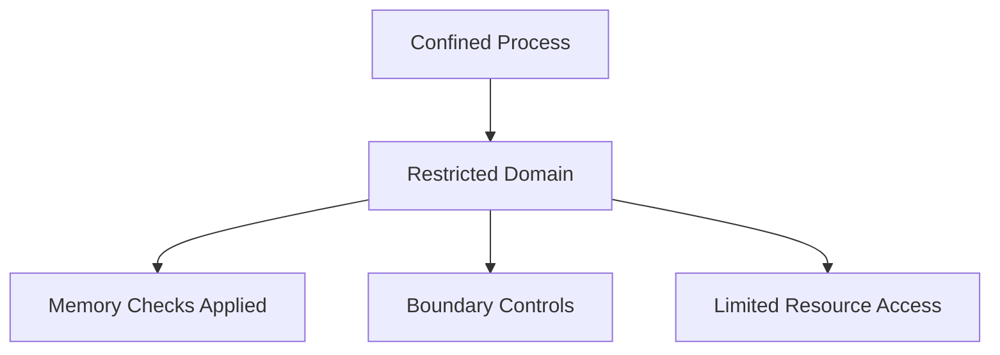

# Section 89: Targeted Policy in SELinux

<details open>
<summary><b>Section 89: Targeted Policy in SELinux (CL-KK-Terminal)</b></summary>

## Table of Contents
- [Targeted Policy Overview](#targeted-policy-overview)
- [Confined and Unconfined Processes](#confined-and-unconfined-processes)
- [Practical Demonstration](#practical-demonstration)
- [Summary](#summary)

## Targeted Policy Overview

SELinux (Security-Enhanced Linux) is a security mechanism in Linux that implements mandatory access control (MAC). When using SELinux in a Linux environment, administrators have multiple policy types available. The targeted policy is the default and most commonly used policy type in SELinux on Fedora and similar distributions.

The targeted policy creates a secure environment where certain processes (known as "targeted processes") run within confined domains, while others run unconfined. This approach balances security with usability by confining only the processes that are most likely to be exploited by attackers, while allowing system and user processes to run with fewer restrictions.

### Key Concept: Policy Types in SELinux
SELinux offers three main policy types when using the `--selinux` option:
- **Targeted**: Default policy that confines targeted processes
- **Minimum** (`--selinux=min`): Uses minimized targeted policy
- **MLS** (`--selinux=mls`): Multi-Level Security (not commonly used)

### How Targeted Policy Works
When targeted policy is enabled, SELinux also enables enforcing mode. In this mode:
- Processes marked as "targeted" run in confined domains
- Processes not targeted run in unconfined domains

> [!IMPORTANT]  
> Targeted policy provides domain separation where confined processes can only access resources within their designated domain, while unconfined processes have broader access capabilities.

```diff
+ Confined Domain: Processes run in restricted security context
- Unconfined Domain: Processes can access system resources freely
! Targeted Policy: Balance between security and usability in SELinux
```

## Confined and Unconfined Processes

### Confined Processes (Confined Domain)
Confined processes are those that run within specific security domains created by the targeted policy. These processes have limited access to system resources and can only interact with resources that are explicitly allowed by the SELinux policy.

**Characteristics:**
- Run in confined domains (`cond_func_t` or similar)
- Subject to memory checks and boundary controls
- Use temporary memory (not directly allocatable)
- Limited resource access based on context
- Prevented from accessing resources outside their domain

**Examples:**
- Network-facing services (HTTP, FTP, etc.)
- User utilities that interact with system resources



### Unconfined Processes (Unconfined Domain)
Unconfined processes run without the same restrictions. By default, most system processes and user-level processes are unconfined.

**Characteristics:**
- Run in unconfined domains (`unconfined_t`)
- Can allocate memory directly
- No boundary controls
- Full access to system resources (within regular Linux permissions)
- Not subject to the same SELinux restrictions

**Examples:**
- System processes started by init/minit
- User-level processes for local accounts
- Administrative utilities

### Domain Separation and Memory Security
In targeted policy, SELinux provides additional security features:

- **Memory Checks**: Both domain types are subject to memory checks, but confined processes have additional restrictions
- **Booleans**: Allow runtime policy modifications without service restart
- **Context Types**: Determine what resources a process can access

```diff
+ Confined Domain Memory: Uses temporary memory, subject to exit table and boundary checks
- Unconfined Domain Memory: Can allocate memory directly, no boundary restrictions
! Boolean Configuration: Allows runtime policy adjustments
```

> [!NOTE]  
> Confined processes prevent privilege escalation attacks by limiting the scope of compromised services, while unconfined processes maintain system usability.

### Security Benefits
Targeted policy confines processes that are most likely to be network-facing or interact with untrusted data, reducing the attack surface. If a confined process is compromised, the damage is limited to resources within its domain.

## Practical Demonstration

### Lab Setup: Web Server Configuration
This demonstration shows how SELinux targeted policy affects process confinement.

#### Step 1: Verify SELinux Status
```bash
# Check SELinux status
sestatus

# Expected output shows:
# SELinux status: enabled
# SELinux state: enforcing
# Current mode: targeted
```

#### Step 2: Install and Configure Web Server
```bash
# Install Apache HTTP Server
dnf install httpd

# Enable and start the service
systemctl enable httpd
systemctl start httpd

# Check service status
systemctl status httpd
```

#### Step 3: Create a Test File
```bash
# Change to web root directory
cd /var/www/html

# Create a test file
echo "Welcome to New Horizon Classes" > index.html

# Update context permanently
chcon -R -t httpd_sys_content_t /var/www/html/index.html
semanage fcontext -a -t httpd_sys_content_t "/var/www/html/index.html"
restorecon -v /var/www/html/index.html

# Verify context
ls -Z /var/www/html/index.html
```

#### Step 4: Test File Access
```bash
# Test local access via curl
curl http://localhost/index.html

# Expected output: Welcome to New Horizon Classes
```

#### Step 5: Change File Context and Test Restrictions
```bash
# Change context to incorrect type
chcon -t samba_share_t /var/www/html/index.html

# Verify context change
ls -Z /var/www/html/index.html

# Attempt to access file via wget (confined process)
rm -f ~/index.html  # Clean up if exists
wget http://localhost/index.html -O ~/index.html

# This should fail with 403 Forbidden error
```

```yaml
# httpd.conf relevant settings (if needed for troubleshooting)
<Directory "/var/www/html">
    AllowOverride None
    Require all granted
</Directory>
```

> ⚠️ When the file context is incorrect, confined processes cannot access resources outside their designated domain
> ✅ Correct context allows proper functioning within SELinux boundaries

#### Step 6: View SELinux Logs
```bash
# Check audit logs for denied operations
tail -f /var/log/audit/audit.log | grep -i denied
```

**Log Analysis:**
- Access denied messages show SELinux blocking operations
- Context mismatches trigger denials
- Audit logs help troubleshoot policy issues

> [!IMPORTANT]  
> SELinux denies resource access when context types don't match policy rules, preventing potential security breaches.

## Summary

### Key Takeaways
```diff
+ Targeted Policy: Default SELinux policy providing domain separation with balanced security
+ Confined Processes: Run in restricted domains, limited to designated resources
- Unconfined Processes: Have broader system access, used for administrative and system tasks
! Domain Security: Processes can only access resources within their assigned security contexts
+ Memory Controls: Confined processes use temporary memory to prevent buffer overflows
- Boolean Configuration: Allows runtime policy modifications for flexibility
+ Context Types: Determine resource access permissions (e.g., httpd_sys_content_t)
```

### Quick Reference
- **Check Status**: `sestatus`
- **View Context**: `ls -Z filename`
- **Change Context**: `chcon -t context_type filename`
- **Permanent Context**: `semanage fcontext -a -t context_type "file_path"`
- **Restore Context**: `restorecon -v filename`
- **View Logs**: `tail /var/log/audit/audit.log`

### Expert Insight

#### Real-world Application
Targeted policy is ideal for production servers handling network services. In enterprise environments, confine web servers, databases, and API endpoints while keeping administrative tools unconfined for management tasks. This approach minimizes attack vectors while maintaining operational efficiency.

#### Expert Path
Master SELinux by:
- Understanding policy modules with `semodule`
- Creating custom policies with `audit2allow`
- Implementing Multi-Level Security (MLS) for high-security needs
- Regular policy audits with automated tools

#### Common Pitfalls
- Misconfigured file contexts leading to service failures
- Overly permissive boolean settings compromising security
- Ignoring audit logs during troubleshooting
- Assuming targeted policy eliminates all manual permission management

</details>
