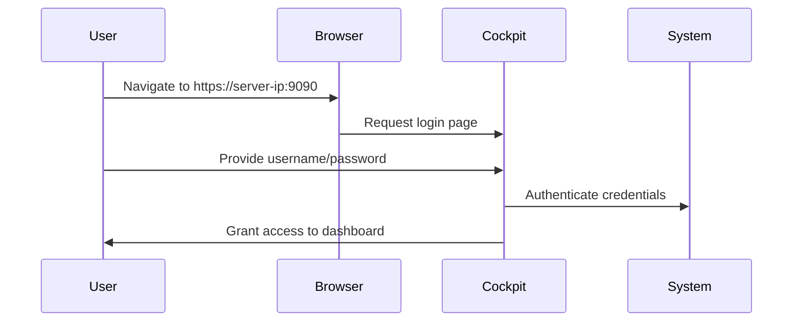

# Section 95: Cockpit Best Server Management Tool

<details open>
<summary><b>Section 95: Cockpit Best Server Management Tool (CL-KK-Terminal)</b></summary>

## Table of Contents

- [Introduction to Cockpit](#introduction-to-cockpit)
- [What is Cockpit?](#what-is-cockpit)
- [Installing Cockpit Package](#installing-cockpit-package)
- [Enabling and Starting Cockpit Service](#enabling-and-starting-cockpit-service)
- [Configuring Firewall for Cockpit](#configuring-firewall-for-cockpit)
- [Accessing Cockpit via Web Browser](#accessing-cockpit-via-web-browser)
- [Cockpit Features Overview](#cockpit-features-overview)
- [Managing System Resources](#managing-system-resources)
- [Managing Logs](#managing-logs)
- [Managing Storage](#managing-storage)
- [Managing Networking](#managing-networking)
- [Managing Containers](#managing-containers)
- [Managing User Accounts](#managing-user-accounts)
- [Managing Services](#managing-services)
- [Installing Applications via Cockpit](#installing-applications-via-cockpit)
- [Using Integrated Terminal](#using-integrated-terminal)
- [Remote Access to Cockpit](#remote-access-to-cockpit)
- [Summary](#summary)

## Introduction to Cockpit

### Overview
Cockpit is a web-based system management tool introduced as a new feature in RHEL 8. It provides a graphical interface for monitoring and managing Linux servers without requiring remote login or additional software installations. As a members-only session focused on new RHEL 8 features, this section covers Cockpit's deployment and usage in detail.

### Key Concepts
Cockpit acts as the "cockpit" of your server - much like an airplane's cockpit where the pilot monitors and controls all flight parameters. In Linux, it allows administrators to manage servers through a web browser from any device, including mobile phones, tablets, or desktops.

The tool integrates with multiple system components and provides:
- Real-time monitoring
- System administration
- Service management
- Resource utilization tracking

## What is Cockpit?

### Overview
Cockpit serves as a centralized control panel for Linux server management, enabling administrators to perform various operations without command-line expertise.

### Key Concepts
**Cockpit Functionality:**
- **Web-Based Management**: Access servers through any web browser
- **No Remote Desktop Required**: Direct browser access without additional software
- **Multi-Device Support**: Works on Android phones, tablets, and computers
- **Integrated Tools**: Built-in utilities for system management and monitoring

**Core Features:**
- System resource monitoring and management
- Service control and monitoring
- Storage administration
- Network configuration
- User account management
- Container operations
- Software installation and updates
- Diagnostic and troubleshooting tools

## Installing Cockpit Package

### Overview
The Cockpit package is automatically installed during RHEL 8 server installation or can be manually installed for custom deployments.

### Key Concepts
**Automatic Installation:**
- Included by default in RHEL 8 Server with GUI installations
- Available for subscription-based systems

**Manual Installation:**
```bash
dnf install cockpit
```
This command installs the Cockpit package if not already present.

## Enabling and Starting Cockpit Service

### Overview
Cockpit operates as a systemd service that must be enabled and started for proper functioning.

### Key Concepts
**Service Management Commands:**

1. **Start Service:**
   ```bash
   systemctl start cockpit
   ```

2. **Enable Service (Auto-start on boot):**
   ```bash
   systemctl enable cockpit
   ```

3. **Combined Enable and Start:**
   ```bash
   systemctl enable --now cockpit
   ```

4. **Check Service Status:**
   ```bash
   systemctl status cockpit
   ```

**Service Characteristics:**
- Runs as a socket-activated service
- Name: `cockpit.service`
- Type: Socket service for efficient resource usage

## Configuring Firewall for Cockpit

### Overview
Firewall configuration is required to allow access to Cockpit's web interface.

### Key Concepts
**Firewall Commands:**

1. **Check Current Zones:**
   ```bash
   firewall-cmd --get-default-zone
   ```

2. **Add Cockpit Service Permanently:**
   ```bash
   firewall-cmd --permanent --add-service=cockpit
   ```

3. **Reload Firewall:**
   ```bash
   firewall-cmd --reload
   ```

4. **Verify Changes:**
   ```bash
   firewall-cmd --list-all
   ```

**Note:** Cockpit uses port 9090 by default. Ensure this port is not blocked by firewall rules.

## Accessing Cockpit via Web Browser

### Overview
Cockpit provides a web-based interface accessible through any modern browser using the server's IP address and default port.

### Key Concepts
**Access Method:**
- URL Format: `https://<server-ip>:9090`
- Port: 9090 (default for Cockpit)
- Authentication: Local system user accounts (including root)

**Login Process:**
1. Open browser and navigate to `https://<server-ip>:9090`
2. Accept security certificate warning (self-signed)
3. Login with system username and password
4. Access full server management interface

**Mermaid Diagram:**


## Cockpit Features Overview

### Overview
Cockpit provides a comprehensive dashboard with multiple management modules accessible through tabbed navigation.

### Key Concepts
**Available Modules:**
- **System**: Overall server monitoring and configuration
- **Logs**: System and service log management
- **Services**: systemd service control and monitoring
- **Storage**: Disk and partition management
- **Networking**: Network interface configuration
- **Containers**: Podman/Docker container management
- **Accounts**: User account administration
- **Software**: Package installation and updates
- **Terminal**: Integrated command-line access

## Managing System Resources

### Overview
The System tab provides comprehensive monitoring of server hardware and software resources.

### Key Concepts
**System Information Available:**
- Operating System details
- Uptime information
- Hardware specifications
- Resource utilization (CPU, Memory, Storage)
- Performance history graphs

**Management Capabilities:**
- CPU usage monitoring
- Memory allocation tracking
- Storage space utilization
- Hardware health indicators
- System performance graphs

## Managing Logs

### Overview
Cockpit integrates journald logs for easy viewing and management of system and service logs.

### Key Concepts
**Log Features:**
- Real-time log streaming
- Service-specific log filtering
- Error and warning identification
- Timestamp-based log navigation
- Export capabilities for troubleshooting

## Managing Storage

### Overview
The Storage section provides detailed information about disk devices, partitions, and file systems.

### Key Concepts
**Storage Information:**
- Disk type identification (HDD/SSD/NVMe)
- SMART status monitoring
- Partition mapping
- File system details
- Mount point configurations

**Management Tasks:**
- Storage capacity monitoring
- Performance metrics
- Health status checking
- RAID configuration (if applicable)

## Managing Networking

### Overview
Network management includes interface configuration, routing, and connection monitoring.

### Key Concepts
**Network Features:**
- Network interface details
- IP address assignment
- Gateway configuration
- DNS settings
- Firewall rule management

**Management Capabilities:**
- Add/remove network interfaces
- Configure static/dynamic IP addressing
- Network bonding configuration
- Routing table modifications
- Network diagnostic tools

## Managing Containers

### Overview
Cockpit integrates with Podman and Docker for container management and monitoring.

### Key Concepts
**Container Operations:**
- Container listing and status
- Start/stop container management
- Resource usage monitoring
- Image management and pulling
- Container logs and diagnostics

**Note:** Container management will be covered in detail in a future dedicated section.

## Managing User Accounts

### Overview
Account management provides interface-based user administration without command-line operations.

### Key Concepts
**Account Management Features:**
- User account creation and modification
- Password management
- Account permissions and groups
- Root user access configuration

**Benefits for GUI Users:**
- Eliminates need for command-line user management
- Intuitive interface for user administration
- Secure account configuration options

## Managing Services

### Overview
The Services tab allows management of systemd services and targets through a web interface.

### Key Concepts
**Service Information:**
- Service status (active/inactive)
- Systemd target monitoring
- Service dependencies and requirements
- Socket service identification

**Management Capabilities:**
- Start/stop/restart services
- Enable/disable services
- View service configuration files
- Monitor service performance metrics

## Installing Applications via Cockpit

### Overview
Cockpit includes software management capabilities for installing and updating packages.

### Key Concepts
**Software Management Features:**
- Package repository management
- Software installation interface
- Update monitoring and application
- Subscription management
- Kernel module configuration

## Using Integrated Terminal

### Overview
Cockpit provides an integrated terminal for command-line operations directly in the web interface.

### Key Concepts
**Terminal Features:**
- Full command-line access without separate SSH/PuTTY connections
- Direct command execution in browser
- Seamless integration with other Cockpit features
- Supports all standard Linux commands

**Example Usage:**
- Run system status commands like `top`, `df -h`
- Execute configuration changes
- View real-time system information

## Remote Access to Cockpit

### Overview
Cockpit supports remote access over public networks through proper network configuration.

### Key Concepts
**Remote Access Requirements:**

1. **Public IP Address:**
   - Static IP preferred for consistent access
   - Check public IP: `curl ifconfig.me`

2. **Port Forwarding:**
   - Configure router to forward port 9090 to server
   - Ensure ISP doesn't block port 9090

**Access Method:**
- Remote URL: `https://<public-ip>:9090`
- Global access from any internet location
- Secure alternative to direct server exposure

## Summary

### Key Takeaways
```diff
+ Cockpit is a powerful web-based server management tool in RHEL 8
+ Provides GUI interface for system administration and monitoring
+ No additional software required - accessible via web browser
+ Supports multi-server management from single dashboard
+ Includes integrated terminal and comprehensive feature set
- Requires proper firewall configuration and secure authentication
- Remote access needs public IP and port forwarding setup
```

### Quick Reference
**Essential Commands:**
```bash
# Install Cockpit
dnf install cockpit

# Start and enable service
systemctl enable --now cockpit

# Firewall configuration
firewall-cmd --permanent --add-service=cockpit
firewall-cmd --reload

# Access URL
https://localhost:9090
```

### Expert Insight

**Real-world Application:**
Cockpit excels in minimal installations where GUI tools aren't available. It's particularly useful for:
- Remote server management in headless environments
- Multi-server monitoring in enterprise deployments
- Training administrators unfamiliar with command-line interfaces
- Mobile device-based server administration during troubleshooting

**Expert Path:**
- Master service management and diagnostic reporting features
- Learn to interpret performance graphs and optimize resource usage
- Practice multi-server management for large infrastructure
- Understand security implications of web-based administrative access

**Common Pitfalls:**
- ✅ Always use HTTPS and avoid accessing over insecure networks
- ❌ Don't rely solely on Cockpit for critical security configurations
- ✅ Regularly update Cockpit package for security patches
- ❌ Avoid exposing Cockpit to internet without proper authentication measures

</details>
