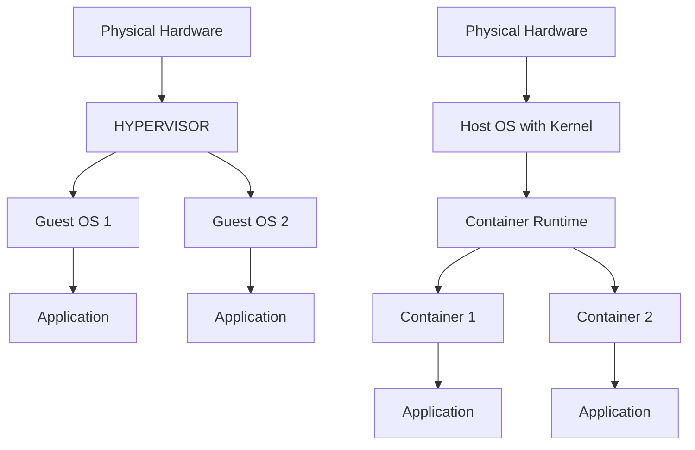

# Section 98: Introduction to Containers

<details open>
<summary><b>Section 98: Introduction to Containers (CL-KK-Terminal)</b></summary>

## Table of Contents
1. [Introduction to Linux Containers](#introduction-to-linux-containers)
2. [Container vs Virtual Machine Comparison](#container-vs-virtual-machine-comparison)
3. [Container Tools and OCI Standards](#container-tools-and-oci-standards)
4. [Installing Container Tools in RHEL](#installing-container-tools-in-rhel)
5. [Container Image Management](#container-image-management)
6. [Running and Managing Containers](#running-and-managing-containers)
7. [Auto-starting Containers via Systemd](#auto-starting-containers-via-systemd)

## Introduction to Linux Containers

### Overview
Containers provide lightweight virtualization technology that allows you to run applications in isolated environments. They share the host system's kernel while providing process isolation, making them more efficient than traditional virtual machines for application deployment.

### Key Concepts
Containers solve the challenge of deploying applications consistently across different environments. When applications require complex dependencies or specific runtime environments, containers package everything needed together.

Compared to virtual machines:
- Containers start in seconds vs. minutes for VMs
- Use minimal resources (megabytes vs. gigabytes)
- Share host OS kernel for efficiency

### Linux Kernel Features for Containers
Containers work by leveraging Linux kernel features that enable resource isolation and sharing:

- **Namespaces**: Provide isolation for system resources
- **Control Groups (cgroups)**: Limit and monitor resource usage
- **Union file systems**: Layer file system changes efficiently

## Container vs Virtual Machine Comparison

### Fundamental Differences

| Aspect | Virtual Machines | Containers |
|--------|-----------------|------------|
| OS Sharing | No - Each VM runs full OS | Yes - Share host kernel |
| Startup Time | Minutes | Seconds |
| Resource Usage | High (200-300MB+ for OS) | Low (Megabytes) |
| Isolation Level | Complete hardware isolation | Process and filesystem isolation |
| Use Cases | Full environment isolation | Application deployment |

### Architecture Comparison



**Virtual Machines:**
- Require complete OS installation per VM
- Emulate hardware for each guest
- Ideal for multi-OS environments
- Better for complete isolation needs

**Containers:**
- Use host OS kernel
- Application-focused isolation
- More efficient resource utilization
- Better for microservices and cloud deployments

## Container Tools and OCI Standards

### Essential Container Tools

**podman** - Command-line tool for managing containers and images:
- Download/push images from registries
- Create, start, stop containers
- Inspect container content
- Non-daemon based (no persistent background service needed)

**podman-compose** - Tool for defining multi-container applications

**buildah** - Tool for building container images

**skopeo** - Utility for inspecting images without downloading

### Open Container Initiative (OCI)
The OCI establishes industry standards for containers:
- **Runtime Spec**: Defines how containers should run
- **Image Spec**: Defines container image format
- **Distribution Spec**: Defines how images are distributed

## Installing Container Tools in RHEL

### Preparation
```bash
# Check subscription repositories are enabled
sudo dnf repolist
dnf repolist | grep enabled
```

### Installation Commands
```bash
# Install container tools
sudo dnf install -y container-tools

# Install additional tools
sudo dnf install -y podman-compose buildah skopeo
```

### Version Verification
```bash
# Check podman version
podman --version

# Check other tools
podman-compose --version
buildah --version
skopeo --version
```

## Container Image Management

### Searching for Images
```bash
# Search for images in registries
podman search [registry/image_name]

# Examples
podman search docker.io/httpd
podman search registry.redhat.io/rhel8/httpd

# Get detailed description
podman search --no-trunc registry.redhat.io/rhel8/httpd
```

### Pulling Images
```bash
# Pull images
podman pull [image_name]
podman pull docker.io/library/httpd:latest

# After login (if needed)
podman login registry.redhat.io
podman pull registry.redhat.io/rhel8/httpd
```

### Inspecting Images
```bash
# Inspect image details
podman inspect [image_id]

# View running containers
podman ps

# View all containers (including stopped)
podman ps -a

# View images
podman images
```

### Tagging Images
```bash
# Tag an existing image
podman tag [source_image] [new_tag]

# Example
podman tag docker.io/library/httpd my-httpd:v1
```

## Running and Managing Containers

### Running Containers

**Interactive Mode (with shell access):**
```bash
podman run -it [image_name] /bin/bash
```

**Detached Mode (background):**
```bash
podman run -d [image_name]
```

**With custom name:**
```bash
podman run -d --name my-container [image_name]
```

### Container Lifecycle Management
```bash
# Stop container
podman stop [container_id]

# Start stopped container
podman start [container_id]

# Restart container
podman restart [container_id]

# Remove container (must be stopped first)
podman rm [container_id]

# Remove all stopped containers
podman rm $(podman ps -aq)

# Remove container and its associated image
podman rmi [image_id]

# Remove all unused images
podman rmi $(podman images -q)
```

### Accessing Running Containers
```bash
# Execute commands in running container
podman exec -it [container_id] /bin/bash

# View container logs
podman logs [container_id]
```

## Auto-starting Containers via Systemd

### Manual Unit File Creation
```bash
# Create systemd unit file
sudo vi /etc/systemd/system/my-container.service

# Unit file content example:
[Unit]
Description=My Container Service
After=network.target

[Service]
ExecStart=/usr/bin/podman start my-container
ExecStop=/usr/bin/podman stop my-container
Restart=always

[Install]
WantedBy=multi-user.target
```

**Enable and start the service:**
```bash
# Reload systemd
sudo systemctl daemon-reload

# Enable the service to start on boot
sudo systemctl enable my-container.service

# Start the service
sudo systemctl start my-container.service

# Check status
sudo systemctl status my-container.service
```

### Automated Unit Generation
A simpler approach using podman's built-in systemd integration:

```bash
# Enable lingering for your user (allows non-systemd user processes after logout)
sudo loginctl enable-linger $USER

# Generate systemd unit file automatically
podman generate systemd --new --files --name [container_name]

# The command creates a unit file in current directory
# Move it to systemd directory
sudo mv container-[name].service /etc/systemd/system/

# Reload and enable as above
sudo systemctl daemon-reload
sudo systemctl enable container-[name].service
sudo systemctl start container-[name].service
```

> [!IMPORTANT]
> Always enable lingering (`loginctl enable-linger`) and ensure podman systemd integration features are available in your RHEL version.

## Summary

### Key Takeaways
```diff
+ Containers use shared host kernel for lightweight virtualization
+ podman is the primary tool for container management in RHEL
+ Containers start faster and use fewer resources than virtual machines
+ Use detached mode (-d) for background container execution
+ Systemd integration enables automatic container startup after reboots
- Virtual machines provide stronger isolation but less efficiency
- Never remove containers force-stop if they contain important data
- Container images can be large; manage disk space accordingly
```

### Quick Reference
**Basic Container Commands:**
- `podman search [image]` - Find container images
- `podman pull [image]` - Download image
- `podman run -d [image]` - Start container in background
- `podman ps` - List running containers
- `podman logs [container]` - View container logs
- `podman stop [container]` - Stop container
- `podman rm [container]` - Remove container

**Systemd Integration:**
- `podman generate systemd --new --files --name [container]` - Auto-generate unit file
- `systemctl enable [service]` - Enable auto-start
- `systemctl start [service]` - Start service manually

### Expert Insight

**Real-world Application:**
In production RHEL environments, containers are essential for:
- Microservices deployment
- CI/CD pipelines automation
- Scaling applications across multiple servers
- Ensuring consistent application environments

**Expert Path:**
- Master podman commands through regular practice
- Understand resource limits with cgroups
- Learn container networking and storage persistence
- Study security contexts (SELinux integration)
- Practice building custom images with buildah

**Common Pitfalls:**
- Forgetting to enable user lingering for systemd integration
- Not configuring proper resource limits on production containers
- Storing persistent data inside containers without bind mounts
- Exposing sensitive ports without proper security configurations

</details>
