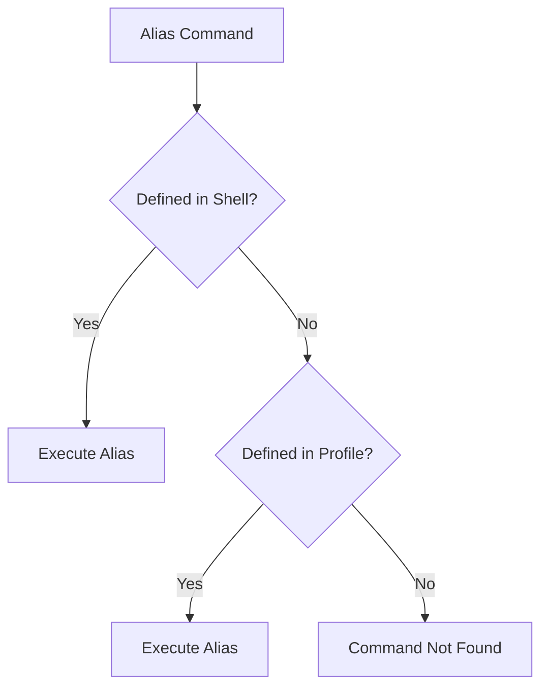

# Section 8: Shell Expansion in Linux Commands And Arguments

<details open>
<summary><b>Section 8: Shell Expansion in Linux Commands And Arguments (CL-KK-Terminal)</b></summary>

## Table of Contents
- [Understanding Shell and Expansion](#understanding-shell-and-expansion)
- [Variables in Linux](#variables-in-linux)
- [Escaping Characters](#escaping-characters)
- [Special Characters and Escaping](#special-characters-and-escaping)
- [Aliases](#aliases)
- [Built-in vs External Commands](#built-in-vs-external-commands)
- [Checking Command Types](#checking-command-types)
- [Command Line Arguments](#command-line-arguments)
- [Debugging Shell Expansion](#debugging-shell-expansion)
- [Summary](#summary)

## Understanding Shell and Expansion

### Overview
The shell is a program that runs in the terminal and processes commands before passing them to the kernel. Shell expansion refers to how the shell modifies or interprets commands before executing them.

### Key Concepts

Shell expansion involves scanning commands and modifying them before sending to the kernel. Key characteristics:

- **Scanning**: The shell scans the command first
- **Modification**: It processes and modifies the command based on internal logic
- **Output**: The result is displayed on screen


### Examples

```bash
# Basic echo command - shell processes this normally
echo hello nehra classes family
# Output: hello nehra classes family
```

```bash
# With multiple spaces - shell normalizes whitespace
echo hello    nehra    classes    family
# Output (same as above): hello nehra classes family
```

> [!NOTE]
> The shell processes whitespace by default. To preserve original formatting, use escaping techniques.

## Variables in Linux

### Overview
Variables are named storage locations that can hold changing values. Linux supports two types: system variables and user-defined variables.

### Key Concepts

System Variables:
- Predefined by the system
- Examples: `$HOSTNAME`, `$USER`, `$HOME`, `$PATH`

User-defined Variables:
- Created by users
- Can be modified

```bash
# View system variables
echo $HOSTNAME    # Displays hostname
echo $USER        # Displays current user

# Define a user variable
name=android
echo $name        # Displays: android
```

### Variable Syntax
To print variable values, use the dollar sign (`$`) prefix:
```bash
variable_name=value
echo $variable_name    # Displays the value
```

## Escaping Characters

### Overview
Escaping prevents the shell from interpreting special characters literally. This allows control over how commands are processed.

### Key Concepts

### Single Quotes (`'`)
- Prevents all shell interpretation
- Everything inside is treated as literal text

```bash
# Single quoted string preserves whitespace
echo 'hello    nehra    classes'
# Output: hello    nehra    classes
```

### Double Quotes (`"`)
- Allows variable expansion and command substitution
- Preserves whitespace

```bash
# Double quotes allow variable expansion
name=nehra
echo "$name classes"    # Displays: nehra classes
```

```diff
+ Key Difference Summary:
- Single quotes: Everything literal, no expansion
+ Double quotes: Allows variable/command expansion, preserves certain escapes
```

## Special Characters and Escaping

### Overview
Special characters like newline (`\n`), tab (`\t`) require escaping with backslash to be interpreted correctly.

### Key Concepts

### Newline Character (`\n`)
- Moves output to next line
- Requires `-e` flag with `echo`

```bash
echo -e "Line 1\nLine 2"
# Output:
# Line 1
# Line 2
```

### Tab Character (`\t`)
- Creates horizontal spacing
- Also requires `-e` flag

```bash
echo -e "Column1\tColumn2\tColumn3"
# Output: Column1    Column2    Column3
```

### Backslash Escaping
All special escape sequences require the `-e` (escape) flag:

```bash
echo -e "Hello\nWorld"
echo -e "Item1\tItem2"
```

> [!IMPORTANT]
> The `-e` flag is crucial for interpreting escape sequences. Without it, backslash characters are printed literally.

## Aliases

### Overview
Aliases create shortcuts for frequently used commands or define alternate command names with different options.

### Key Concepts

Creating aliases:
```bash
# Create an alias
alias dog='cat'

# Now 'dog' works like 'cat'
dog /etc/hostname
```

### Managing Aliases

```bash
# View all aliases
alias

# Remove an alias
unalias dog
```

### Permanent Aliases
To make aliases permanent, add them to profile files (`~/.profile` or `~/.bashrc`):

```bash
# Example in ~/.bashrc
alias ll='ls -l'
alias la='ls -a'
alias lla='ls -la'
```

### Alias with Options
```bash
# Alias for rm with confirmation
alias rm='rm -i'
```



## Built-in vs External Commands

### Overview
Commands can be either built into the shell (built-ins) or exist as separate executable files (external).

### Key Concepts

### Built-in Commands
- Part of the shell itself
- Execute faster
- Examples: `cd`, `echo`, `pwd`, `alias`

### External Commands
- Separate executable files
- Usually in `/bin`, `/usr/bin`, etc.
- Examples: `ls`, `cat`, `grep`, `vim`

### Checking Command Location
```bash
# Find external command location
which ls
# Output: /bin/ls

# Alternative: whereis
whereis ls
# Output: ls: /bin/ls /usr/share/man/man1/ls.1.gz
```

## Checking Command Types

### Overview
The `type` command reveals whether a command is built-in, external, or aliased, and shows its location or definition.

### Key Concepts

Usage:
```bash
type command_name
```

Examples:
```bash
# Check built-in command
type cd
# Output: cd is a shell builtin

# Check external command
type ls
# Output: ls is /bin/ls

# Check aliased command
alias ll='ls -l'
type ll
# Output: ll is aliased to 'ls -l'
```

## Command Line Arguments

### Overview
Command line arguments are parameters passed to commands and scripts. They allow dynamic behavior modification.

### Key Concepts

### Positional Parameters
- `$0`: Script/command name
- `$1`, `$2`, etc.: Arguments
- `$#`: Number of arguments
- `$*`: All arguments as single string
- `$@`: All arguments as separate strings

```bash
# Example script usage
myscript.sh arg1 arg2 arg3

#!/bin/bash
echo "Script name: $0"
echo "First argument: $1"
echo "Second argument: $2"
echo "All arguments: $@"
echo "Number of arguments: $#"
```

### Special Argument Variables
```bash
# Display command arguments
echo "All args: $*"
echo "Args count: $#"

# Iterate through arguments
for arg in "$@"; do
  echo "Processing: $arg"
done
```

## Debugging Shell Expansion

### Overview
Debugging shell expansion allows seeing exactly how the shell processes commands before execution.

### Key Concepts

### Set Tracing
Use `set -x` to enable shell expansion display:
```bash
set -x
# Now all commands will show expansion

date
# Output:
# + date
# Mon Mar 27 12:34:56 UTC 2026

set +x
# Disable tracing
```

### Trace Output Format
When tracing is enabled:
- `+` indicates the expanded command
- Shows exactly what the shell passes to the kernel

```diff
+ Debugging Output Example:
+ set -x
+ echo "User: $USER on $HOSTNAME"
++ echo 'User: username on hostname'
+ User: username on hostname
+ set +x
```

> [!NOTE]
> Tracing helps understand complex command expansions and debug shell script issues.

## Summary

### Key Takeaways
```diff
- Shell expansion processes commands before kernel execution
+ Use single quotes for literal text, double quotes for variable expansion
+ Escape special characters with backslash (-) and -e flag
- Built-in commands are faster than external commands
+ Aliases create command shortcuts and modifications
- Variables store dynamic values; use $ to access
+ Use type, which, whereis to identify command sources
- set -x enables debugging of shell expansion
```

### Quick Reference

#### Escaping Examples:
```bash
# Preserve whitespace
echo 'hello    world'

# Variable expansion
echo "Hello $USER"

# Special characters
echo -e "Line 1\nLine 2\tTabbed"
```

#### Checking Commands:
```bash
type cd        # Built-in
type ls        # External
which ls       # Location
alias          # View aliases
```

#### Variable Operations:
```bash
# Define
name=value

# Access
echo $name

# System vars
echo $HOME $USER $HOSTNAME
```

### Expert Insight

#### Real-world Application
Shell expansion is fundamental for shell scripting and automation. Understanding expansion rules prevents common issues like:
- Incorrect variable expansion in scripts
- Improper handling of whitespace in filenames
- Command injection vulnerabilities in scripts

#### Expert Path
Master shell expansion by:
```bash
# Practice with complex expansions
echo "${USER:-default}_backup_${HOSTNAME%%.*}"

# Create robust aliases
alias backup='cp -iv'  # Interactive verbose copy

# Debug complex scripts
bash -x myscript.sh
```

#### Common Pitfalls
```diff
- Forgetting quotes around variables with spaces
+ "File: $filename" vs 'File: $filename'
- Not using -e flag for escape sequences
+ echo -e "Multi\nLine" vs echo "Multi\nLine"
- Confusing built-in vs external commands
+ type always tells the truth
```

</details>
