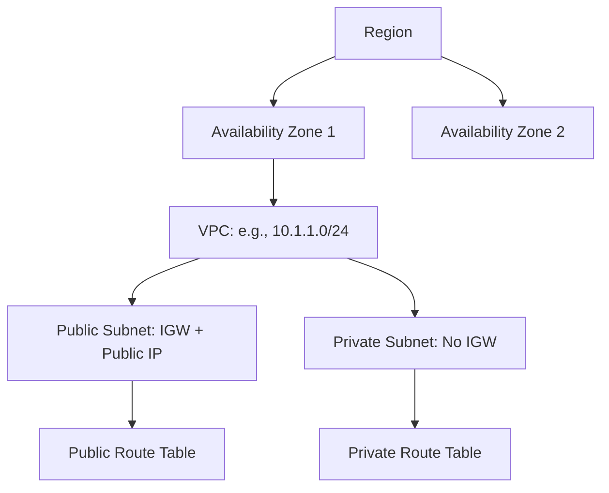

# Session 4: AWS Hands-On Playground and VPC Info

## Overview
This session focuses on setting up access to AWS hands-on labs through free accounts and sandbox environments, followed by a deep dive into Virtual Private Cloud (VPC) architecture and configuration. Topics include AWS account creation, lab access procedures, VPC components, subnet management, route tables, internet gateways, security groups, network access control lists (NACLs), and a practical lab demonstrating custom VPC deployment with EC2 instances for proof-of-concept (POC) verification.

## Table of Contents
- [AWS Account Setup](#aws-account-setup)
- [Lab Access and Scheduling](#lab-access-and-scheduling)
- [AWS Services Overview](#aws-services-overview)
- [VPC Architecture Deep Dive](#vpc-architecture-deep-dive)
- [Lab Demo: Custom VPC Creation](#lab-demo-custom-vpc-creation)
- [Summary](#summary)

## Key Concepts/Deep Dive

### AWS Account Setup
The session begins with guidance on creating a free AWS account for hands-on practice. Key points include:

- **Steps to Create Free AWS Account**:
  1. Visit the AWS Management Console login page: Enter "AWS management console login" in search for signup.
  2. Choose "Create an AWS account" (not the existing account option).
  3. Provide accurate details:
     - Email address (use Gmail for OTP, avoid company email).
     - Account name (any unique name, e.g., "XYZ" or personal name).
  4. Verify email and complete the process.
  - Note: Credit card information is required as a guarantee, but not charged for free tier usage if cleaned up properly.
  
> [!NOTE]
> Emphasize self-learning on AWS documentation to master VPC cleanup, resource management, and free tier limits to avoid unexpected charges.

### Lab Access and Scheduling
For structured lab practice, access is provided via a paid sandbox environment shared by the instructor. Details include:

- **Shared Lab Credentials**:
  - URL, username, password, access key ID, and secret access key provided via WhatsApp group.
  - Use only AWS in the sandbox; avoid Azure or GCP to allow monitoring.
  - Auto-shutdown after 4 hours; instructor advises deleting after 2 hours.
  
- **Lab Scheduling**:
  - Book slots in an Excel sheet (shared via OneDrive).
  - Single daily slot per person (2 hours) to ensure fairness.
  - International collaboration: Accommodate US Eastern Time (e.g., 8-10 AM IST = 10:30 PM US time), Indian standard time, and European timings.
  - Example timeline: Monday slots from 10 AM IST onwards, with fallbacks for availability.
  - Priority given to dedicated learners; avoid advanced bookings to maintain fairness.
  
- **Logic for Access**:
  - 12 slots daily due to 2-hour limits and potential overlaps.
  - 8 members initially; slots handled first-come-first-served for incomplete tasks.
  - Active management via WhatsApp for reassignments (e.g., if a US participant inactivity coincides with IST sleep time).
  
✅ **Tip**: Labs validate for 2 hours; complete phases quickly for continuity. Weekends (Sat-Sun) offer solo practice due to fewer users.

### AWS Services Overview
Post-login orientation in the sandbox environment:

- **Dashboard Features**:
  - Common notifications enabled for CloudWatch.
  - EC2 instances (VMs), S3 buckets, and other services accessible.
  - Search with "/" prefix (e.g., "/resources" for quick finds).
  
- **IAM (Identity and Access Management)**:
  - Acts like Active Directory: Manages users, groups, and policies.
  - Users inherit privileges from assigned groups.
  - Used in sandbox with pre-created IAM users.

- **Key Configurations**:
  - Change language if needed (default: English).
  - Set up billing and security credentials for practitioner level knowledge.

> [!IMPORTANT]
> Labs include notifications for instance events (e.g., stops, failures) via CloudWatch.

### VPC Architecture Deep Dive
A detailed explanation of VPC components, default vs. custom VPCs, subnets, and security layers.

- **VPC Basics**:
  - Virtual Private Cloud (VPC): Logical data center in AWS, equivalent to on-premises firewall, routers, switches, and VLANs.
  - Dedicated tenancy (preferred in advanced labs) vs. default shared tenancy.
  - IP ranges: Default VPC uses 172.31.0.0/16 (class B private). Recalculation: /16 provides 65,536 IPs; /27 (public subnet) gives 32 IPs (5 reserved: 0 reserved, 1 gateway, 2 DNS, 1 reserved, 31 broadcast).
  
- **Components by Category**:
  | Component | Definition | Availability in Default VPC | Custom VPC Requirements |
  |-----------|------------|-----------------------------|--------------------------|
  | Route Table | Routes traffic within VPC and externally. | Main route table auto-attached; no IGW route. | Create and associate manually for public/private subnets. |
  | Security Group | Nick/instance-level firewall; stateful. | Default created; allows inbound from VPC, all outbound. | Reuse default or create new for specific rules. |
  | NACL (Network ACL) | Subnet-level firewall; stateless. | Default created; allows all inbound/outbound. | Inherits from VPC; modify rules for allow/deny by IP/protocol. |
  | Internet Gateway (IGW) | Enables internet access; attaches to VPC. | Not present; must add for public subnets. | Create and attach to VPC (1:1 relationship). |
  | NAT Gateway | Allows private subnet outbound internet access. | None; use for high availability. | Deploy per Availability Zone (AZ) for redundancy. |
  | Subnet | Division of VPC IP range; public (auto-assign EIP) or private. | Created by AWS in each region. | Manually create and associate with route tables. |

- **Subnet Calculations**:
  - VPC: 10.1.1.0/24 (256 IPs, 256-5 usable).
  - Private subnet: 10.1.1.0/27 (32 IPs, 27 usable e.g., 22nd IP usable; 32nd broadcast).
  - Public subnet: 10.1.1.32/27 (next range: 32-63, minus 5 reserved).
  
  Example IP breakdown for /27:
  ```diff
  + Usable IPs:  first (1st-5th reserved), 6th-30th usable.
  - Reserved: 0 (network), 1 (gateway), 2-3 (DNS), 31 (broadcast).
  ```

- **Security Layers**:
  - **Flow Check**: Packet routes through NACL → Security Group → Route Table.
  - Security Group: Allows inbound (e.g., SSH 22 from anywhere) and all outbound.
  - NACL: Stateless; rules ordered (rule numbers matter); separate inbound/outbound.
  
> [!NOTE]
> IGW per VPC; VGW (VPN Gateway) per VPC; deploy IGW/NAT Gateway post-VPC creation.

- **Deletion Insights**:
  - VPC deletion removes all resources (subnets, IGWs, etc.).
  - No recovery; note: Default VPC recoverable by creating a new one (same CIDR possible).

- **Regional Architecture**:
  - Regions (e.g., US East 1): Multiple AZs (e.g., us-east-1a to us-east-1f), each a data center.
  - AZs: 100+ km apart for redundancy; within-AZ uses private networking.



### Lab Demo: Custom VPC Creation
Hands-on walkthrough of creating a client-required VPC, including subnets, route tables, IGW, and EC2 provisioning for POC.

**Requirements Recap**:
- VPC: 10.1.1.0/24, name "Networking VPC".
- Private Subnet: 10.1.1.0/27, name "Networking Subnet-A".
- Public Subnet: 10.1.1.32/27, name "Networking Subnet-B".
- Route Tables: Private RTB ("Networking-private RTB"), Public RTB ("Networking-public RTB").
- IGW: "Networking IGW", attach to VPC.
- EC2 Instance: T2.micro (free tier), name "Networking POC VM1", in public subnet, auto-assign public IP, SSH enabled from anywhere.

**Steps**:

1. **Create VPC**:
   - Go to VPC Service > "Your VPCs" > Create VPC.
   - Name: "Networking VPC".
   - IPv4 CIDR: 10.1.1.0/24.
   - Tenancy: Default.
   - Expected Outcome: VPC ID (e.g., vpc-12345678), default SG, RTB, NACL created.

2. **Create Subnets**:
   - "Subnets" > Create Subnet.
   - VPC: Select "Networking VPC".
   - Subnet 1: Name "Networking Subnet-A", CIDR "10.1.1.0/27", AZ auto (e.g., us-east-1a).
   - Subnet 2: Name "Networking Subnet-B", CIDR "10.1.1.32/27", AZ next (e.g., us-east-1b).
   - Outcome: Two subnets with available IPs (27 each after reserves).

3. **Create Route Tables**:
   - "Route Tables" > Create.
   - Private: Name "Networking-private RTB", VPC "Networking VPC" (associates to subnet later).
   - Public: Name "Networking-public RTB", VPC "Networking VPC".

4. **Associate Subnets to Route Tables**:
   - Private RTB > "Subnet associations" > Associate "Networking Subnet-A".
   - Public RTB > "Subnet associations" > Associate "Networking Subnet-B".

5. **Create IGW**:
   - "Internet Gateways" > Create.
   - Name: "Networking IGW".
   - Attach to "Networking VPC".

6. **Add Route to Public RTB**:
   - Public RTB > "Routes" > Edit routes.
   - Add: Destination "0.0.0.0/0", Target: IGW (select "Networking IGW").
   - Ensures public subnet instances reach the internet.

7. **Launch EC2 Instance**:
   - EC2 Service > "Launch instances".
   - Name: "Networking POC VM1".
   - AMI: Amazon Linux 2 (free tier).
   - Instance Type: T2.micro.
   - Key Pair: Create new (e.g., "Networking"), download .pem file.
   - Network Settings:
     - VPC: "Networking VPC".
     - Subnet: "Networking Subnet-B" (public).
     - Auto-assign public IP: Enable.
     - Security Group: Select existing default SG or create new with SSH (port 22, source 0.0.0.0/0).
   - Storage: 8 GB GP2 (free tier).
   - Launch.

8. **Verify Instance Access**:
   - Instances > Select instance > Connect.
   - Use SSH or PuTTY with public IP (e.g., ec2-user@<public-ip>).
   - Key: Upload/download .pem, chmod 400.
   - Test: `curl ifconfig.me ⇒ [public-IP]`, `hostname -i ⇒ [private-IP]`.
   - Cleanup after POC.

> [!CAUTION]
> Delete instance after demo to avoid free tier exhaustion.

## Summary

```diff
+ Key Takeaways
+ - AWS free accounts enable hands-on practice; focus on cleanup to avoid charges.
+ - VPC is a foundational element for network isolation and security.
+ - Subnets, route tables, IGWs, and security groups ensure controlled access.
+ - Labs reinforce theory through step-by-step EC2 deployment.
- Common Pitfalls
- - Forgetting IGW for public subnets leads to no internet access.
- - Misassociation of subnets to route tables causes routing failures.
- - Ignoring auto-shutdown in sandboxes wastes time and resources.
- - Weak security rules (e.g., SSH from anywhere) expose instances in production.
```

### Expert Insight

**Real-world Application**: VPCs isolate environments (e.g., prod/dev/test) in cloud migrations. Use multi-AZ subnets for high availability, IGWs for web-facing loads, and NAT Gateways for secure private access. In enterprise scenarios, combine with CloudFormation for Infrastructure as Code (IaC).

**Expert Path**: Master CIDR calculations and subnetting; pursue AWS Architect certifications by deploying complex architectures (e.g., VPC peering, Transit Gateways). Practice labs daily, monitor costs, and explore CloudFormation/YAML for automation.

**Common Pitfalls**: Reserved IP miscounting (/27 has 27 usable, not 32). VPC deletion is irreversible—backup configurations. Avoid over-permissions in security groups; use least-privilege. Sandboxes expire; always clean resources promptly.

**Lesser Known**: AZs use private fiber for intra-region traffic, reducing latency. Default VPCs per region simplify quick starts but lack advanced controls. IGW enables inbound/outbound; NAT Gateway bidirectional-private-only.

Mistakes and Corrections Noted: 
- "AWs" in filename corrected to "AWS".
- "htp" → "http" (not present in transcript).
- "cubectl" → "kubectl" (not present).
- "Wh niecesApp" → "WhatsApp".
- "net good" → "IGW".
- "submit" → "subnet".
- "addr" → "address".
- Removed repetitions and casual phrases for clarity.
