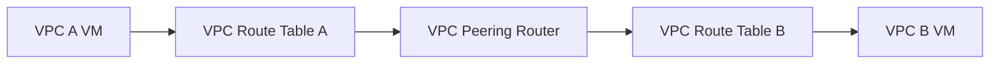

# Session 07: VPC Private Connectivity

## Table of Contents

- [Overview](#overview)
- [VPC Peering Fundamentals](#vpc-peering-fundamentals)
- [Gateway Endpoint](#gateway-endpoint)
- [Interface Endpoint](#interface-endpoint)
- [Connectivity Architecture](#connectivity-architecture)
- [Routing and Security](#routing-and-security)
- [Lab Demos](#lab-demos)
- [Summary](#summary)

## Overview

This session explores private connectivity within AWS VPC environments, focusing on three key mechanisms for secure communication between VPCs and AWS services without traversing the public internet: VPC peering, Gateway Endpoints, and Interface Endpoints. The lecture covers theoretical foundations, packet flow, real-world use cases, and hands-on considerations for production environments.

## VPC Peering Fundamentals

VPC peering enables private connectivity between two VPCs within the same region or across regions. AWS creates routing infrastructure behind the scenes, appearing as peering connections for private data transfer.

### Key Concepts
- **Peering ID**: AWS-deployed router (L3 device) for cross-VPC communication
- **Route Table Configuration**: Explicit routes required pointing to peering ID
- **Supported Scenarios**:
  - Full VPC interconnectivity
  - Specific subnet access
  - Granular communication via security groups

### Packet Flow


## Gateway Endpoint

Provides private access to AWS services like S3 and DynamoDB using the AWS backbone network, avoiding internet exposure for enhanced security.

### Characteristics
- **Target Services**: Primarily S3 and DynamoDB
- **Cost**: Free (no hourly charges)
- **Deployment**: Managed router in specified subnet
- **Security**: Traffic remains within AWS network

### Use Cases
| Service | Public Access | Gateway Endpoint Access |
|---------|---------------|-------------------------|
| S3      | Via Internet  | Via AWS Backbone       |
| DynamoDB| Via Internet  | Via AWS Backbone       |

> [!IMPORTANT]
> Gateway Endpoints reduce man-in-the-middle attack risks by keeping traffic internal to AWS.

## Interface Endpoint

Enables private connectivity to virtually all AWS services via AWS PrivateLink, using Elastic Network Interfaces (ENIs) with private IPs.

### Characteristics
- **Cost Factors**:
  - Hourly charges for running interface
  - Data ingress/egress fees
- **Scope**: Most AWS services supported
- **Visibility**: Accessible via management console
- **Connectivity**: Uses PrivateLink for secure access

### Comparison Table
| Feature          | Gateway Endpoint        | Interface Endpoint         |
|-----------------|-------------------------|----------------------------|
| Services       | S3, DynamoDB          | 200+ AWS Services         |
| Cost           | Free                  | Hourly + Data Transfer    |
| Management    | Opaque                | Visible ENI               |
| Traffic Flow  | Backbone Only         | PrivateLink via ENI       |

## Connectivity Architecture

### Multi-VPC Communication
Client requirements often specify:
- **Subnet Ranges**: 10.1.1.0/24 → Subnets /28 (10.1.1.0/28, 10.1.1.16/28)
- **Availability Zones**: Deploy across multiple AZs (us-east-1a, us-east-1b)
- **Connectivity Types**:
  - Full subnet communication
  - Selective subnet access
  - Security group restrictions

### Route Table Configuration
```yaml
# Example VPC Route Table Entries
VPC-A-Route-Table:
  Destination: 10.1.2.0/24
  Target: pcx-1234567890abcdef0  # Peering Connection ID

VPC-B-Route-Table:
  Destination: 10.1.1.0/24
  Target: pcx-1234567890abcdef0
```

## Routing and Security

### Security Group Considerations
- **Default Behavior**: Outbound allowed, inbound denied
- **Granular Control**: Restrict via source IP/cidr blocks
- **Traffic Layers**: Security Group → NACL → Route Table → Gatway

### Troubleshooting Order
1. Security Group rules
2. NACL configurations  
3. Route table entries
4. Gateway/interface settings

## Lab Demos

### Lab Setup Requirements
- **Time Limit**: 2 hours per session
- **Access**: Two sandbox environments available
- **Scheduling**: Excel-based booking system for fair access
- **Prerequisites**: Module 1 completion, VPC fundamentals

### Lab 2: VPC Peering Scenarios
1. **Environment Preparation**:
   ```bash
   # Create VPCs with specified CIDR blocks
   aws ec2 create-vpc --cidr-block 10.1.1.0/24
   aws ec2 create-vpc --cidr-block 10.1.2.0/24
   ```

2. **Subnet Creation**:
   ```bash
   # Example subnet creation
   aws ec2 create-subnet --vpc-id vpc-12345678 --cidr-block 10.1.1.0/28 --availability-zone us-east-1a
   aws ec2 create-subnet --vpc-id vpc-12345678 --cidr-block 10.1.1.16/28 --availability-zone us-east-1b
   ```

3. **VPC Peering Establishment**:
   ```bash
   # Create peering connection
   aws ec2 create-vpc-peering-connection --vpc-id vpc-a1234567 --vpc-id vpc-b1234567
   
   # Accept peering request
   aws ec2 accept-vpc-peering-connection --vpc-peering-connection-id pcx-1234567890abcdef0
   ```

4. **Route Table Updates**:
   ```bash
   # Add routes for cross-VPC access
   aws ec2 create-route --route-table-id rtb-12345678 --destination-cidr-block 10.1.2.0/24 --vpc-peering-connection-id pcx-1234567890abcdef0
   ```

5. **Testing Connectivity**:
   ```bash
   # From VPC A instance to VPC B instance (adjust IPs as needed)
   ping 10.1.2.5
   ssh -i key.pem ec2-user@10.1.2.5
   ```

> [!NOTE]
> Lab exercises cover three scenarios: full connectivity, selective routing, and security group restrictions. Each scenario demonstrates production-ready configurations.

## Summary

### Key Takeaways
```diff
+ VPC Peering: Enables private cross-VPC communication via AWS-managed routers
+ Gateway Endpoints: Free, secure access to S3/DynamoDB using AWS backbone
+ Interface Endpoints: Premium service for 200+ AWS services via PrivateLink
+ Security Hierarchy: Security Groups → NACLs → Route Tables → Gateways
- No Automatic Connectivity: Manual route configuration required for all solutions
- Cost Considerations: Interface Endpoints incur hourly and transfer charges
! Lab Practice: Hands-on experience critical for certification and production readiness
```

### Expert Insight

**Real-world Application**: In enterprise environments, these connectivity methods eliminate internet dependencies, reducing latency and security risks. For example, scaling microservices across multiple VPCs or enabling secure database access from application tiers without public exposure.

**Expert Path**: Master subnet calculations, understand packet flows at the OSI levels, and practice troubleshooting with VPC Flow Logs. Study AWS documentation updates about gateway endpoint migration to interface endpoints, and gain hands-on experience with tools like tcpdump and Wireshark for production debugging.

**Common Pitfalls**: 
- Forgetting to update route tables after peering establishment, leading to connectivity failures
- Misunderstanding interface endpoint costs in multi-service architectures
- Neglecting security group rules, which override routing permissions
- Subnet limitation confusion (AWS reserves 5 IPs per subnet, leaving 249 usable) 
- TCP flag analysis gaps when troubleshooting connectivity issues

Lesser known details about VPC private connectivity include the AWS backbone's physical diversity and the exact locations of endpoint machines, which remain protected information to prevent external targeting. Additionally, interface endpoints support IPv6 addressing configurations while gateway endpoints currently do not.

🤖 Generated with [Claude Code](https://claude.com/claude-code)

Co-Authored-By: Claude <noreply@anthropic.com>
