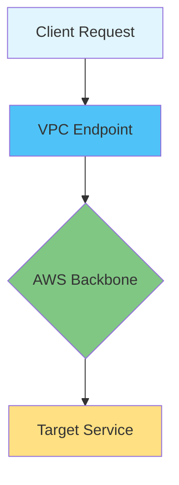
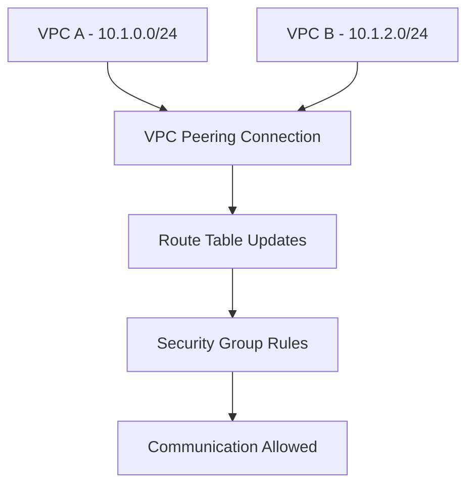

# Session 8: VPC Endpoints, Authentication, and Bastion Hosts

## Table of Contents
- [Overview](#overview)
- [Key Concepts](#key-concepts)
  - [VPC Gateway Endpoints vs. Interface Endpoints](#vpc-gateway-endpoints-vs-interface-endpoints)
  - [Authentication Mechanisms](#authentication-mechanisms)
  - [Bastion Hosts and SSH Key Management](#bastion-hosts-and-ssh-key-management)
  - [VPC Peering](#vpc-peering)
- [Lab Demos](#lab-demos)
  - [Setting Up Networking for VPC Communication](#setting-up-networking-for-vpc-communication)
  - [Configuring Route Tables for Selective Communication](#configuring-route-tables-for-selective-communication)
- [Summary](#summary)

## Overview
This session focuses on advanced VPC networking components including VPC endpoints for private access to AWS services, authentication mechanisms using RSA keys, bastion host configurations for secure access, and VPC peering for interconnecting VPCs. The instructor emphasizes practical implementation and troubleshooting techniques for production environments.

## Key Concepts

### VPC Gateway Endpoints vs. Interface Endpoints

VPC endpoints enable private connectivity to AWS services without requiring internet access. There are two types:

- **Gateway Endpoints**: Used for S3 and DynamoDB, operating as L3 devices that route traffic through the AWS backbone network. They use unique public and private interfaces for each service.
- **Interface Endpoints**: Provide access to all AWS services via Elastic Network Interfaces (ENIs) in subcontractors. AWS is migrating all services to use interface endpoints.



> [!NOTE]
> Gateway endpoints behave similarly to Internet Gateways but maintain traffic within the AWS network.

### Authentication Mechanisms

SSH authentication uses asymmetric RSA key pairs for secure access:

- **Public-Private Key Pairs**: Generated once per EC2 instance or shared across instances for reuse
- **Encryption Flow**: Private key encrypts traffic → Server decrypts with local public key → Matching against stored public key enables authentication

```bash
# Generate key pair
ssh-keygen -t rsa -b 2048

# View public key
cat ~/.ssh/id_rsa.pub

# Private key remains encrypted locally
ls -la ~/.ssh/id_rsa  # Shows encrypted file
```

> [!IMPORTANT]
> Public keys are shared openly; private keys must never be transmitted and should be secured with appropriate file permissions.

### Bastion Hosts and SSH Key Management

Bastion hosts provide secure entry points into private subnets using SSH tunneling:

- **Connection Methods**:
  - Linux-native SSH with RSA keys
  - PuTTY with .ppk files (Windows)
  - PowerShell SSH agent forwarding

- **Key Management Approaches**:
  - Copy concatenated private keys to bastion host locally
  - SSH agent forwarding for automated key handling

```bash
# On bastion host - set proper permissions
chmod 400 /path/to/private_key

# Connect using forwarded keys
ssh -A ec2-user@bastion-host

# From bastion to private instance
ssh ec2-user@private-instance-ip
```

```bash
# Alternative method - SSH agent forwarding
eval $(ssh-agent)
ssh-add /path/to/private_key
ssh -A ec2-user@bastion-host
# Keys automatically forwarded
```

### VPC Peering

VPC peering enables cross-VPC communication within the same or different regions:

- **Non-Transitive**: Direct connection only between peered VPCs
- **Routing Control**: Achieved through route table modifications
- **Security Integration**: Works with security groups and NACLs
- **DNS Resolution**: Optional cross-VPC DNS resolution



| Component | Function | Scope |
|-----------|----------|-------|
| Route Tables | Direct specific subnet traffic | Transitional routing |
| Security Groups | Instance-level access control | VPC boundary |
| NACLs | Subnet-level traffic filtering | Network boundary |

## Lab Demos

### Setting Up Networking for VPC Communication

**Objective**: Configure two VPCs with selective communication between specific subnets only.

**Steps**:
1. **Create VPCs**:
   - VPC A: 10.1.0.0/24 (networks-king-A)
   - VPC B: 10.1.2.0/24 (networks-king-B)

2. **Create Subnets**:
   - VPC A:
     - Private Subnet A: 10.1.1.0/28
     - Private Subnet B: 10.1.1.16/28  
     - Public Subnet C: 10.1.1.32/28 (Bastion host)
   - VPC B:
     - Private Subnet A: 10.1.2.0/26
     - Private Subnet B: 10.1.2.64/26

3. **Configure Security Groups**:
   ```json
   {
     "bastion-sg": {
       "inbound": [
         {
           "protocol": "tcp",
           "port": 22,
           "source": "0.0.0.0/0",
           "description": "SSH access to bastion"
         }
       ]
     },
     "private-instance-sg": {
       "inbound": [
         {
           "protocol": "tcp", 
           "port": 22,
           "source": "bastion-sg-id"
         },
         {
           "protocol": "icmp",
           "source": "10.1.2.64/26"
         }
       ]
     }
   }
   ```

4. **Launch Instances**:
   - Bastion host in public subnet (VPC A)
   - Test instances in each private subnet

### Configuring Route Tables for Selective Communication

**Steps**:
1. **Create VPC Peering**:
   ```bash
   # Create peering request
   aws ec2 create-vpc-peering-connection \
     --vpc-id vpc-a-id \
     --peer-vpc-id vpc-b-id \
     --peer-region us-east-1 \
     --tag-specifications 'ResourceType=vpc-peering-connection,Tags=[{Key=Name,Value=Zinder-VPC-Peering}]'
   
   # Accept peering (in accepting VPC)
   aws ec2 accept-vpc-peering-connection --vpc-peering-connection-id pcx-1234567890abcdef0
   ```

2. **Customize Route Tables**:
   - Route Table A (Private Subnet A):
     ```
     Destination: 10.1.2.64/26
     Target: pcx-peering-connection-id
     ```
   - Route Table B (Private Subnet B):  
     ```
     Destination: 10.1.1.0/28
     Target: pcx-peering-connection-id
     ```

3. **Associate Route Tables**:
   - Explicitly associate subnets with custom route tables
   - Remove default associations where selective routing is needed

4. **Test Connectivity**:
   - From bastion host, SSH to private instance in VPC A
   - Ping private instance in VPC B from VPC A instance
   ```bash
   # From bastion host
   ssh -i private-key.pem ec2-user@private-instance-a-ip
   
   # From private instance A
   ping private-instance-b-ip
   ```

## Summary

### Key Takeaways
```diff
+ VPC Endpoints enable private service access without IGW
+ Gateway Endpoints = S3/DynamoDB, Interface Endpoints = All services  
+ RSA Key authentication uses public-private key encryption
+ Bastion hosts provide secure SSH access to private subnets
+ SSH agent forwarding automates key handling across hops
+ VPC Peering creates non-transitive cross-VPC connections
+ Route tables control peering communication granularity
```

### Expert Insight

**Real-world Application**: 
In production environments, VPC endpoints reduce data transfer costs and enhance security by keeping traffic within AWS networks. Bastion hosts with automated key management streamline DevOps workflows while maintaining security boundaries.

**Expert Path**: 
Master advanced routing architectures combining VPC peering with transit gateways for complex multi-VPC designs. Implement automated key rotation and bastion host fleets using infrastructure-as-code tools like Terraform.

**Common Pitfalls**: 
Avoid sharing private keys across different bastion hosts - each host should have unique keys. Check security group source references carefully, as they're VPC-bound. Always test connectivity bi-directionally when configuring route tables.

**Common Issues & Resolution**:
- **Connectivity Fails After Peering**: Check route table associations - ensure subnets are explicitly associated with custom route tables, not remaining on default main route table
- **SSH Key Authentication Issues**: Copy entire private key file to bastion host and verify file permissions (400)
- **Security Group Not Working Across VPCs**: Remember security groups reference VPC-specific resources; use CIDR blocks for cross-VPC rules
- **Route Table Not Propagating**: After creating peered connection, manually add routes to both VPCs' route tables for desired subnets

**Lesser Known Things**: 
Interface endpoints automatically scale (up to 50 Gbps per endpoint), while gateway endpoints have no throughput limits. AWS is migrating all services to interface endpoints, with gateway endpoints maintained only for S3/DynamoDB. SSH agent forwarding eliminates need for key copying, though it's less commonly used due to complexity concerns.
