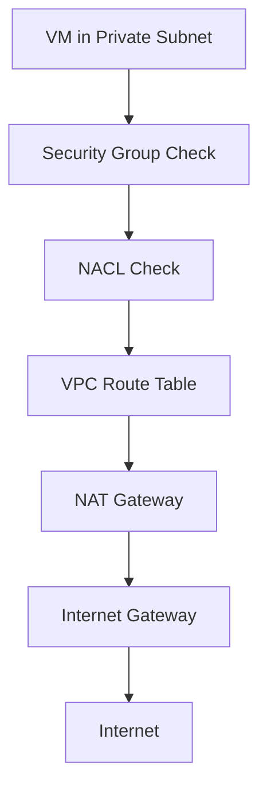
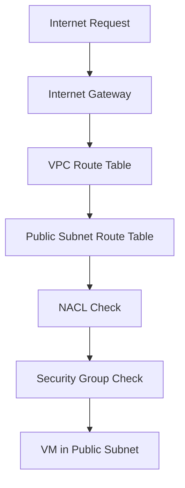

# Customized VPC & Private subnet

<details open>
<summary><b>Customized VPC & Private subnet (CL-KK-Terminal)</b></summary>

## Table of Contents
- [Overview](#overview)
- [Key Concepts and Deep Dive](#key-concepts-and-deep-dive)
- [Packet Flow Explanation](#packet-flow-explanation)
- [Internet Gateway vs NAT Gateway](#internet-gateway-vs-nat-gateway)
- [IP Address Management](#ip-address-management)
- [Route Tables and Routing](#route-tables-and-routing)
- [Lab Demo: Creating VPC, Subnets, and Gateways](#lab-demo-creating-vpc-subnets-and-gateways)
- [Summary](#summary)

## Overview
This session focuses on creating a customized Virtual Private Cloud (VPC) in AWS with private and public subnets. It covers the fundamental differences between Internet Gateway (IGW) and NAT Gateway, IP address management, route tables, and packet flow concepts. The session demonstrates practical implementation of networking components required for secure AWS deployments.

## Key Concepts and Deep Dive

### What is a VPC?
A Virtual Private Cloud (VPC) is a logically isolated section of the AWS cloud where you can launch AWS resources in a virtual network that you define. It provides complete control over the virtual networking environment, including IP address ranges, subnets, route tables, and network gateways.

> [!IMPORTANT]
> A VPC acts as your own private network in the AWS cloud. It allows you to define your own IP address range and control ingress/egress traffic.

### Subnets
Subnets are subdivisions of a VPC that allow you to group resources based on security and operational needs. There are two primary types:
- **Public Subnet**: Resources in this subnet can communicate directly with the internet via an Internet Gateway
- **Private Subnet**: Resources in this subnet cannot directly access the internet unless routed through a NAT Gateway

### CIDR Blocks and IP Allocation
IP addresses in AWS VPCs use Classless Inter-Domain Routing (CIDR) notation. A CIDR block represents a range of IP addresses.

| CIDR Block | Available IPs | Usable IPs | Description |
|------------|---------------|------------|-------------|
| /28 | 16 | 11 | Small subnet for testing (reserves 5 IPs) |
| /24 | 256 | 251 | Larger subnet (reserves 5 IPs) |
| /16 | 65,536 | 65,531 | VPC-level range |

> [!NOTE]
> AWS reserves the first 4 IP addresses and the last IP address in each subnet for network purposes.

## Packet Flow Explanation
Understanding packet flow is crucial for VPC design. Here's how traffic moves through different components:

### From Private Subnet VM to Internet


### From Internet to Public Subnet VM


## Internet Gateway vs NAT Gateway

### Internet Gateway (IGW)
- **Purpose**: Provides bidirectional internet connectivity
- **Connectivity**: OUTBOUND: Private subnet → NAT Gateway → IGW
- **Key Characteristics**:
  - Enables both inbound and outbound traffic
  - Performs 1:1 IP address translation
  - Attached at the VPC level
  - Required for public subnets

### NAT Gateway
- **Purpose**: Enables outbound-only internet access from private subnets
- **Connectivity**: One-way communication (outbound only)
- **Key Characteristics**:
  - Converts private IP addresses to public IP addresses
  - Performs Port Address Translation (PAT)
  - Deployed in a public subnet
  - Highly available within an Availability Zone

### Comparison Table

| Feature | Internet Gateway | NAT Gateway |
|---------|------------------|-------------|
| Direction | Bidirectional | Unidirectional (Outbound) |
| Translation | 1:1 (Static/Dynamic) | Many:1 (PAT) |
| Placement | VPC attachment | Public subnet |
| Cost | Free | Charged per hour + data transfer |
| Use Case | Public-facing services | Private resources needing internet access |

## IP Address Management

### Elastic IP vs Dynamic Public IP
- **Dynamic Public IP**: Automatically assigned by AWS when an EC2 instance is launched in a public subnet. The IP address changes when the instance is stopped and restarted.
- **Elastic IP**: A static public IP address that you can allocate and associate with your AWS account. It remains associated with your account until you explicitly release it.

```yaml
# Allocate Elastic IP (AWS CLI)
aws ec2 allocate-address --domain vpc

# Associate Elastic IP with EC2 instance
aws ec2 associate-address --instance-id i-1234567890abcdef0 --allocation-id eipalloc-64d5890a
```

### Bring Your Own IP (BYOIP)
AWS allows you to bring your own public IP addresses for specific use cases. This requires coordination with AWS support and is typically used for:
- NAT Gateways
- Static public IPs for EC2 instances

## Route Tables and Routing

### Route Table Hierarchy
1. **VPC Route Table (Main)**: Contains local routes and default routes
2. **Subnet Route Table**: Associated with specific subnets, can override VPC routing

### Key Route Entries
- **Local Route**: Allows communication between resources in the same VPC
- **0.0.0.0/0**: Default route pointing to IGW (for internet access)
- **Custom Routes**: Point to NAT Gateways, Virtual Private Gateways, etc.

```bash
# Create route table
aws ec2 create-route-table --vpc-id vpc-12345678

# Add route to NAT Gateway
aws ec2 create-route --route-table-id rtb-12345678 \
  --destination-cidr-block 0.0.0.0/0 \
  --nat-gateway-id nat-12345678

# Associate route table with subnet
aws ec2 associate-route-table --subnet-id subnet-12345678 \
  --route-table-id rtb-12345678
```

## Lab Demo: Creating VPC, Subnets, and Gateways

### Step 1: Delete Default VPC (if required)
```bash
# List VPCs
aws ec2 describe-vpcs

# Delete default VPC (WARNING: This will remove all default resources)
aws ec2 delete-vpc --vpc-id vpc-12345678
```

### Step 2: Create Customized VPC
```bash
# Create VPC with custom CIDR
aws ec2 create-vpc \
  --cidr-block 10.1.0.0/24 \
  --tag-specifications 'ResourceType=vpc,Tags=[{Key=Name,Value=NetworkingKingsVPC}]'
```

### Step 3: Create Subnets
```bash
# Create private subnet A
aws ec2 create-subnet \
  --vpc-id vpc-12345678 \
  --cidr-block 10.1.0.0/28 \
  --availability-zone us-east-1a \
  --tag-specifications 'ResourceType=subnet,Tags=[{Key=Name,Value=NetworkingSubnetA}]'

# Create public subnet B
aws ec2 create-subnet \
  --vpc-id vpc-12345678 \
  --cidr-block 10.1.16.0/28 \
  --availability-zone us-east-1b \
  --tag-specifications 'ResourceType=subnet,Tags=[{Key=Name,Value=NetworkingSubnetB}]'
```

### Step 4: Create Internet Gateway
```bash
# Create IGW
aws ec2 create-internet-gateway \
  --tag-specifications 'ResourceType=internet-gateway,Tags=[{Key=Name,Value=IGWProd}]'

# Attach IGW to VPC
aws ec2 attach-internet-gateway \
  --vpc-id vpc-12345678 \
  --internet-gateway-id igw-12345678
```

### Step 5: Create NAT Gateway
```bash
# First, allocate Elastic IP for NAT Gateway
aws ec2 allocate-address --domain vpc

# Create NAT Gateway in public subnet
aws ec2 create-nat-gateway \
  --subnet-id subnet-public \
  --allocation-id eipalloc-12345678 \
  --tag-specifications 'ResourceType=natgateway,Tags=[{Key=Name,Value=NATGatewayProd}]'
```

### Step 6: Configure Route Tables
```bash
# Create public route table
aws ec2 create-route-table --vpc-id vpc-12345678

# Add default route to IGW
aws ec2 create-route \
  --route-table-id rtb-public \
  --destination-cidr-block 0.0.0.0/0 \
  --gateway-id igw-12345678

# Associate public route table with public subnet
aws ec2 associate-route-table \
  --subnet-id subnet-public \
  --route-table-id rtb-public

# Create private route table
aws ec2 create-route-table --vpc-id vpc-12345678

# Add route to NAT Gateway
aws ec2 create-route \
  --route-table-id rtb-private \
  --destination-cidr-block 0.0.0.0/0 \
  --nat-gateway-id nat-12345678

# Associate private route table with private subnet
aws ec2 associate-route-table \
  --subnet-id subnet-private \
  --route-table-id rtb-private
```

### Step 7: Launch EC2 Instances for Testing
```bash
# Launch instance in public subnet (will get dynamic public IP)
aws ec2 run-instances \
  --image-id ami-12345678 \
  --count 1 \
  --instance-type t2.micro \
  --key-name my-keypair \
  --security-group-ids sg-12345678 \
  --subnet-id subnet-public

# Launch instance in private subnet
aws ec2 run-instances \
  --image-id ami-12345678 \
  --count 1 \
  --instance-type t2.micro \
  --key-name my-keypair \
  --security-group-ids sg-12345678 \
  --subnet-id subnet-private

# Allocate and associate Elastic IP
aws ec2 associate-address \
  --instance-id i-public \
  --allocation-id eipalloc-12345678
```

## Summary

### Key Takeaways
```diff
+ VPC is the foundation of AWS networking
+ Public subnets use IGW for bidirectional traffic
+ Private subnets use NAT Gateway for outbound-only access
+ Route tables control traffic flow between subnets
+ Elastic IPs provide static public addresses
+ AWS reserves 5 IP addresses in each subnet
- Don't delete default VPC without understanding consequences
- Public subnet resources don't automatically have internet access
- NAT Gateway provides one-way communication only
```

### Quick Reference
```bash
# Check route table entries
aws ec2 describe-route-tables --route-table-id rtb-12345678

# List NAT Gateways
aws ec2 describe-nat-gateways

# Get VPC details
aws ec2 describe-vpcs --vpc-id vpc-12345678
```

### Expert Insight
#### Real-world Application
In production environments, you'll typically have multi-tier architectures with private subnets hosting application servers and databases, while public subnets contain load balancers and bastion hosts. This setup provides security by keeping sensitive resources isolated from direct internet access while maintaining necessary connectivity through NAT Gateways.

#### Expert Path
Master VPC peering and transit gateways for complex multi-VPC architectures. Understand VPC flow logs for troubleshooting connectivity issues. Learn AWS Network Firewall for advanced security controls beyond Security Groups and NACLs.

#### Common Pitfalls
- Forgetting to associate custom route tables with subnets (traffic will use main route table)
- Placing NAT Gateway in private subnet (it requires public subnet placement)
- Using dynamic public IPs for production services (use Elastic IPs for stability)
- Not reserving enough IP addresses for subnet growth

</details>
