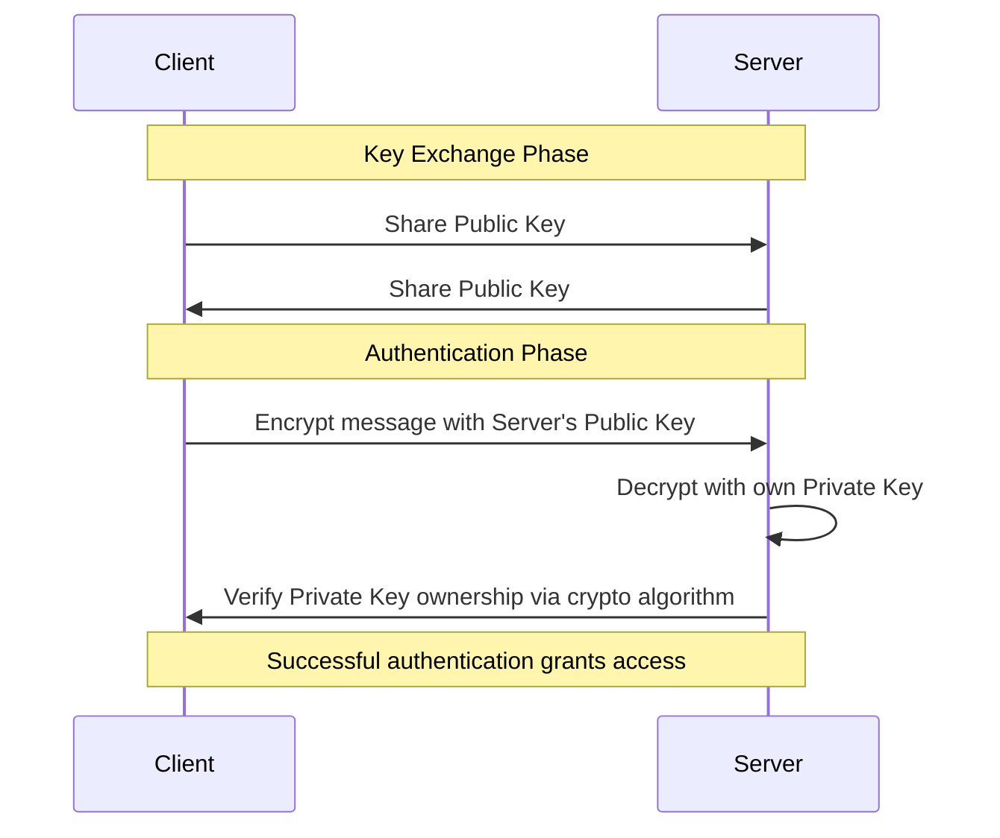

# Session Name

<details open>
<summary><b>Session Name (CL-KK-Terminal)</b></summary>

## Table of Contents

- [Overview](#overview)
- [Key Concepts/Deep Dive](#key-conceptsdeep-dive)
  - [RSA Asymmetric Key Authentication](#rsa-asymmetric-key-authentication)
  - [Bastion Host Concepts](#bastion-host-concepts)
  - [VPC Peering Fundamentals](#vpc-peering-fundamentals)
- [Code/Config Blocks](#codeconfig-blocks)
  - [Bastion Host Implementation](#bastion-host-implementation)
  - [VPC Peering Lab Setup](#vpc-peering-lab-setup)
- [Lab Demos](#lab-demos)
  - [Bastion Host with PuTTY](#bastion-host-with-putty)
  - [Bastion Host with PowerShell](#bastion-host-with-powershell)
  - [Bastion Host with Linux Commands](#bastion-host-with-linux-commands)
- [Summary](#summary)

## Overview

This session focuses on advanced AWS networking concepts, specifically VPC peering, bastion hosts, and RSA authentication. The instructor covers Module 2 (PC1 and PC2) with emphasis on gateway vs interface endpoints, followed by a comprehensive lab setup for VPC peering with restrictive routing. Key themes include security implementations, key management strategies, and cross-VPC connectivity patterns.

## Key Concepts/Deep Dive

### RSA Asymmetric Key Authentication

RSA (Rivest–Shamir–Adleman) is an asymmetric cryptographic algorithm that uses key pairs for secure authentication. In the context of EC2 instance access, AWS generates and manages RSA key pairs where:

- **Public Keys** are shared and used for encryption
- **Private Keys** are kept secret and used for decryption
- The mathematical relationship ensures one key cannot derive the other



### Bastion Host Concepts

A bastion host serves as a secure entry point into private network segments, particularly useful in cloud environments where direct internet access to private instances creates security liabilities.

**Key Security Principles:**
- Bastion hosts are typically placed in public subnets
- Private keys are copied to bastion hosts with restricted permissions
- Access is controlled through security groups and route tables
- All connections from bastion hosts require proper authentication

**Alternative Implementation Approaches:**

1. **Windows PuTTY Approach:**
   - Convert PEM to PPK format
   - Use Pageant for key agent forwarding
   - Direct SSH connection via public IP

2. **PowerShell/Windows Terminal:**
   - Native SSH client capabilities
   - SSH agent forwarding for seamless access
   - No third-party tools required

3. **Linux Native Commands:**
   - Direct SSH with PEM files
   - SSH agent for key forwarding
   - Full command-line control

### VPC Peering Fundamentals

VPC peering establishes private connectivity between VPCs, allowing resources to communicate using private IP addresses without traversing the public internet.

**Key Characteristics:**
- **Gateway Endpoint**: S3 and DynamoDB-only, creates transparent routing
- **Interface Endpoint**: Elastic Network Interface (ENI) for AWS services
- **Non-transitive**: Peering doesn't extend beyond directly connected VPCs

> [!IMPORTANT]
> Gateway endpoints behave like internet gateways but route traffic through AWS backbone network, providing secure access to AWS services from VPCs.

## Code/Config Blocks

### Bastion Host Implementation

```bash
# Linux: Create empty private key file
touch /home/ec2-user/my-private-key

# Set proper permissions (owner read-only)
chmod 400 /home/ec2-user/my-private-key

# Copy private key content and save
nano /home/ec2-user/my-private-key
# Copy full private key content into file

# SSH to bastion host
ssh -i my-private-key ec2-user@<bastion-public-ip>

# Create user groups for access control
sudo groupadd marketing
sudo groupadd finance

# Set group permissions on private key
chmod 640 /home/ec2-user/my-private-key  # Owner read/write, group read
chown ec2-user:marketing /home/ec2-user/my-private-key

# Add users to groups
sudo usermod -a -G marketing user1
sudo usermod -a -G finance user2
```

### VPC Peering Lab Setup

```yaml
# VPC Configuration (Lab Requirements)
VPC-A:
  CIDR: 10.1.0.0/24
  Subnets:
    - Private-A: 10.1.0.0/28
    - Public-C: 10.1.1.0/28
    
VPC-B:
  CIDR: 10.1.2.0/24  
  Subnets:
    - Private-B: 10.1.2.64/26
    - Private-A: 10.1.2.0/26

# Route Table Configuration
Route-Table-Private-A (VPC-A):
  Routes:
    - Destination: 10.1.2.64/26  # Only Private-B subnet
      Target: pcx-xxxxxxxxxx     # Peering connection
      
Route-Table-Private-B (VPC-B):
  Routes:
    - Destination: 10.1.0.0/28   # Only Private-A subnet
      Target: pcx-xxxxxxxxxx     # Peering connection

# Security Groups (ICMP Testing)
Security-Group-Private-A:
  Inbound:
    - Type: ICMP
      Source: 10.1.2.64/26  # Allow from Private-B
      
Security-Group-Private-B:
  Inbound:
    - Type: ICMP  
      Source: 10.1.0.0/28  # Allow from Private-A
```

## Lab Demos

### Bastion Host with PuTTY

1. Convert PEM to PPK using PuTTYgen
2. Configure SSH session:
   - Host: ec2-user@<bastion-public-ip>
   - Authentication: Browse to PPK file
3. Optional: Use Pageant for agent forwarding

### Bastion Host with PowerShell

```powershell
# Add private key to SSH agent
ssh-add .\\my-private-key.pem

# SSH to bastion host  
ssh ec2-user@<bastion-public-ip>

# From bastion host, SSH to private instance
ssh ec2-user@<private-ip>
```

### Bastion Host with Linux Commands

```bash
# Add key to SSH agent
ssh-add /path/to/my-private-key.pem

# SSH to bastion host with agent forwarding
ssh -A ec2-user@<bastion-public-ip>

# From bastion, access private subnets directly
ssh ec2-user@10.1.1.20  # Private subnet A instance
ssh ec2-user@10.1.2.20  # Private subnet B instance
```

## Summary

### Key Takeaways

```diff
+ Gateway endpoints use L3 routing for S3/DynamoDB access
+ Interface endpoints use ENI for broader AWS service connectivity
- Don't share private keys between environments
+ Bastion hosts require strict security group controls  
- Avoid direct internet access to private instances
+ VPC peering enables private cross-VPC communication
- Route tables control traffic flow granularity
```

### Quick Reference

| Command | Purpose | Example |
|---------|---------|---------|
| `chmod 400 <file>` | Set private key permissions | `chmod 400 ~/.ssh/key.pem` |
| `ssh-add <key>` | Add key to SSH agent | `ssh-add ~/.ssh/key.pem` |
| `ssh -A user@host` | SSH with agent forwarding | `ssh -A ec2-user@bastion-ip` |
| `sudo groupadd <group>` | Create user group | `sudo groupadd developers` |
| `sudo usermod -a -G <group> <user>` | Add user to group | `sudo usermod -a -G developers alice` |

### Expert Insight

#### Real-world Application
In enterprise environments, bastion hosts serve as secure jump boxes for accessing cloud infrastructure. Organizations typically implement bastion hosts in public subnets with:
- Multi-factor authentication
- Session recording and auditing
- Automated key rotation schedules
- Access restricted by IP whitelisting and time-of-day controls

#### Expert Path
Master VPC peering by understanding advanced patterns:
1. **Hub-and-spoke**: Central VPC connects to multiple spoke VPCs
2. **Full mesh**: Every VPC connects to every other VPC
3. **Transit VPC**: Use VPN appliances for advanced routing
4. **AWS Transit Gateway**: Managed service replacing complex peering meshes

#### Common Pitfalls
- **Route table misconfigurations**: Forgetting local routes can block all traffic
- **Security group asymmetry**: Inbound rules must be mirrored on both ends
- **Key management issues**: Private key files with incorrect permissions get rejected
- **NACL vs Security Group confusion**: NACLs work at subnet level, security groups at instance level
- **Peering status failures**: Always check peering acceptance status before troubleshooting connectivity

</details>
