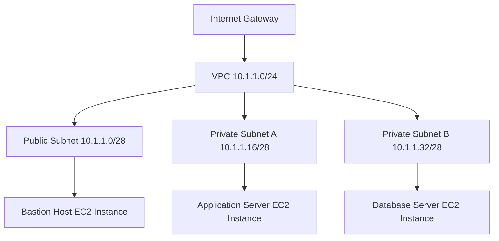
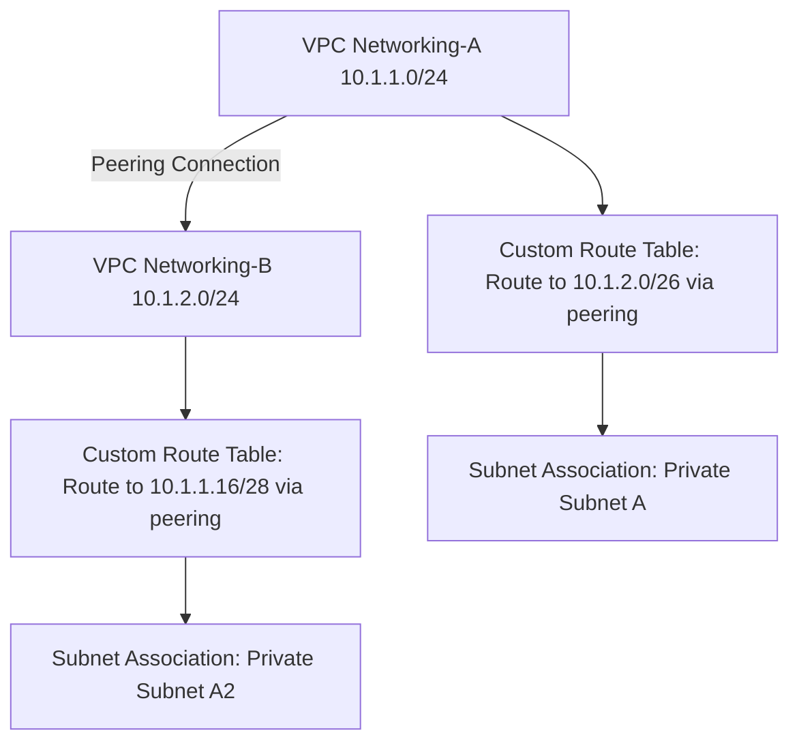

# Course-Summary

## Session Tracker

| Session Number | Session Name | Status | Completed Date | Summary |
|----------------|--------------|--------|----------------|---------|
| 1 | 09 July 28 | [x] Completed | 2026-04-26 | Covered VPC creation, subnet planning, security groups, bastion host setup, VPC peering, and SSH access patterns for AWS networking configuration. Focused on practical implementation with GUI demos and troubleshooting common issues. |

## Course Statistics
- **Total Sessions Completed**: 1
- **Total Sections Expected**: 17 (approximate based on transcript mentions)
- **Last Updated**: 2026-04-26

## Completed Session Summaries

### Session 1: 09 July 28
**Topics Covered**:
- Group member status and participation updates
- Practice session reviews and theory vs. implementation balance
- VPC and subnet architecture design with CIDR blocks
- Security group creation and rule configuration for bastion hosts and private subnets
- EC2 instance creation (bastion host, application servers, database servers)
- VPC peering for cross-VPC connectivity
- Route table customization for controlled communication
- SSH key management using agents and forwarding for secure access
- Trouble shooting basic connectivity and authentication issues
- Network planning concepts including availability zones, overlapping networks, and failover

**Key Concepts Learned**:
- Overlapping network prevention in VPC peering
- Bastion host architecture for secure access to private subnets
- Security group scoped to VPC boundaries
- Route table associations for traffic control
- SSH agent usage vs. key file copying for security best practices

**Modules Referenced**: Module 1 PPT access, Module 2 and 3 content planned, live project demonstration mentioned

**Lab Activities**: Created two VPCs with customized subnets, configured security groups, set up bastion host, initiated but did not complete VPC peering and final connectivity verification due to authentication issues

---

# 09 July 28

<details open>
<summary><b>09 July 28 (CL-KK-Terminal)</b></summary>

## Table of Contents

- [Overview](#overview)
- [Key Concepts and Deep Dive](#key-concepts-and-deep-dive)
  - [VPC Architecture and Design](#vpc-architecture-and-design)
  - [Subnet Planning and IP Address Allocation](#subnet-planning-and-ip-address-allocation)
  - [Security Groups and Network Security](#security-groups-and-network-security)
  - [VPC Peering for Cross-VPC Connectivity](#vpc-peering-for-cross-vpc-connectivity)
  - [SSH Access Patterns and Key Management](#ssh-access-patterns-and-key-management)
- [Lab Demo: VPC and Networking Configuration](#lab-demo-vpc-and-networking-configuration)
- [Summary](#summary)

## Overview

This session focuses on practical AWS networking configuration for deploying a proxy server across multiple VPCs. The instructor demonstrates creating customized VPCs, configuring subnets, setting up security groups, and establishing secure connectivity using bastion hosts and VPC peering. Key emphasis is placed on security best practices, avoiding overlapping networks, and understanding IP addressing schemes. The session includes live GUI demonstrations in the AWS console and troubleshooting common connectivity issues, while providing theoretical foundations for network engineering principles.

### Key Concepts/Deep Dive

#### VPC Architecture and Design

VPCs (Virtual Private Clouds) are isolated virtual networks in AWS that provide complete control over network configuration. When designing VPCs for production environments, always use customized VPCs rather than default VPCs to ensure client requirements are met. Each VPC consists of:

- **CIDR Blocks**: Define the IP address range (e.g., 10.1.1.0/24)
- **Subnets**: Divide the VPC into smaller, isolated segments
- **Availability Zones**: Ensure redundancy across physical data centers
- **Network Components**: Internet gateways, route tables, security groups, and network ACLs




> [!IMPORTANT]
> Never use default VPCs in production environments. Clients expect customized network architectures that align with their specific requirements and compliance standards.

#### Subnet Planning and IP Address Allocation

Subnets subdivide VPCs and determine instance IP addressing. Proper subnet planning involves:

- **CIDR Notation**: /24 = 256 IP addresses, /28 = 16 IP addresses
- **Availability Zone Distribution**: Spread subnets across multiple AZs for redundancy
- **Network Size Calculation**: /28 provides 16 total IPs (11 usable for instances)
- **Overlapping Networks**: Must be avoided when peering VPCs or connecting to on-premises networks

| Subnet Name | CIDR Block | Available IPs | Availability Zone | Purpose |
|-------------|------------|---------------|------------------|---------|
| Public Subnet (Bastion) | 10.1.1.0/28 | 11 | us-east-1a | Internet-accessible jump host |
| Private Subnet A | 10.1.1.16/28 | 11 | us-east-1a | Application servers |
| Private Subnet B | 10.1.1.32/28 | 11 | us-east-1c | Database servers |
| Private Subnet A2 | 10.1.2.0/26 | 59 | us-east-1b | Application servers (VPC2) |
| Private Subnet B2 | 10.1.2.64/26 | 59 | us-east-1c | Database servers (VPC2) |

```diff
+ Best Practices: Always plan for redundancy across AZs and leave room for growth in CIDR allocations
- Common Mistake: Using the same CIDR ranges across different VPCs, causing routing conflicts
! Critical: Understand binary math for IP subnetting - clients will reject candidates who cannot calculate subnets correctly
```

#### Security Groups and Network Security

Security groups act as virtual firewalls that control inbound and outbound traffic to EC2 instances. They are stateful and operate at the instance level.

**Key Characteristics**:
- **Stateful**: Return traffic is automatically allowed
- **VPC-Scoped**: Only referenceable within the same VPC
- **Instance-Based**: Applied to EC2 instances, not subnets
- **Multiple Groups Allowed**: Instances can have multiple security groups

**Bastion Host Security Group Example**:
```
Inbound Rules:
- SSH (22) from 0.0.0.0/0 (for internet access)
- ICMP from security group of private instances

Outbound Rules:
- All traffic (default)
```

**Private Subnet Security Group Example**:
```
Inbound Rules:
- SSH (22) from bastion host security group
- ICMP from bastion host security group

Outbound Rules:
- All traffic (default)
```

> [!NOTE]
> Security groups reference other security groups by ID, allowing dynamic updates when instances are added or removed from the referenced group.

#### VPC Peering for Cross-VPC Connectivity

VPC peering establishes private connectivity between VPCs using AWS backbone network. Critical requirements include:

- **Non-Overlapping CIDRs**: Peering fails if IP ranges overlap
- **Requester/Acceptor Model**: Same account uses single request
- **Route Table Updates**: Manual addition of peering routes required
- **Transitive Limitations**: No hub-and-spoke without Transit Gateway



> [!IMPORTANT]
> Overlapping networks cannot peer. This is a hard requirement that cannot be bypassed and will cause project rejection if not addressed.

#### SSH Access Patterns and Key Management

Multiple methods exist for accessing private subnet instances through bastion hosts:

**Method 1 (Educational - Not Recommended)**:
- Copy private key to bastion host
- Access from bastion using PuTTY or native SSH

**Method 2 (Production Best Practice)**:
- Use SSH agent forwarding
- Keep keys only in local memory
- Seamless hopping between hosts

```bash
# SSH Agent Usage (PowerShell/Windows)
Get-Service ssh-agent  # Check status
Start-Service ssh-agent  # Start if needed
ssh-add <private-key-file>  # Add key to agent

# Connect with forwarding
ssh -A ec2-user@<bastion-public-ip>

# From bastion, connect to private instance (key auto-forwarded)
ssh ec2-user@<private-instance-ip>
```

```bash
# Linux/PowerShell alternative
ssh -i <private-key-file> ec2-user@<bastion-public-ip>
# Then from bastion:
ssh ec2-user@<private-instance-ip>
```

> [!NOTE]
> Method 2 (SSH forwarding) is recommended as it avoids storing private keys on bastion hosts, reducing security risks if the bastion is compromised.

## Lab Demo: VPC and Networking Configuration

This lab demonstrates creating a dual-VPC architecture with secure cross-connectivity for proxy server deployment.

### VPC Creation Steps

1. **Access VPC Dashboard**
   ```
   AWS Console > Services > VPC
   ```

2. **Create First VPC (Networking-A)**
   ```
   Name: Networking-A
   IPv4 CIDR: 10.1.1.0/24
   Tenancy: Default
   ```

3. **Create Second VPC (Networking-B)**
   ```
   Name: Networking-B  
   IPv4 CIDR: 10.1.2.0/24
   Tenancy: Default
   ```

4. **Create Subnets**

   **For Networking-A VPC:**
   ```bash
   # Public Subnet (Bastion) - us-east-1a
   Name: Networking-A-Public-Sub
   VPC: Networking-A
   CIDR: 10.1.1.0/28
   AZ: us-east-1a
   
   # Private Subnet A - us-east-1a  
   Name: Networking-A-Private-Sub-A
   VPC: Networking-A
   CIDR: 10.1.1.16/28
   AZ: us-east-1a
   
   # Private Subnet B - us-east-1c
   Name: Networking-A-Private-Sub-B  
   VPC: Networking-A
   CIDR: 10.1.1.32/28
   AZ: us-east-1c
   ```

   **For Networking-B VPC (optional demonstration):**
   ```bash
   # Private Subnet A2
   Name: Networking-B-Private-Sub-A2
   VPC: Networking-B
   CIDR: 10.1.2.0/26
   AZ: us-east-1b
   
   # Private Subnet B2
   Name: Networking-B-Private-Sub-B2
   VPC: Networking-B 
   CIDR: 10.1.2.64/26
   AZ: us-east-1c
   ```

5. **Create Security Groups**

   **Bastion Host SG (Networking-A):**
   ```bash
   Name: Networking-A-Bastion-SG
   VPC: Networking-A
   Inbound Rules:
   - SSH (22) - Source: 0.0.0.0/0
   ```

   **Private Subnet SG (Networking-A):**
   ```bash
   Name: Networking-A-Private-SG
   VPC: Networking-A
   Inbound Rules:
   - SSH (22) - Source: sg-xxxxx (Bastion SG ID)
   - ICMP - Source: sg-xxxxx (Bastion SG ID)
   ```

6. **Launch EC2 Instances**

   **Bastion Host:**
   ```bash
   AMI: Amazon Linux 2
   Instance Type: t2.micro
   Network: Networking-A VPC, Public Subnet
   Security Group: Networking-A-Bastion-SG
   Key Pair: (Create RSA key pair)
   Auto-assign Public IP: Enabled
   ```

   **Private Instances:**
   ```bash
   AMI: Amazon Linux 2
   Instance Type: t2.micro
   Network: Networking-A VPC, respective private subnets
   Security Group: Networking-A-Private-SG
   Key Pair: Use same key pair
   ```

7. **Create Internet Gateway**
   ```
   Name: Networking-A-IGW
   Attach to: Networking-A VPC
   ```

8. **Configure VPC Peering**
   ```
   Requester: Networking-A VPC
   Acceptor: Networking-B VPC
   Accept the peering request
   ```

9. **Customize Route Tables**

   **Create Custom Route Tables:**
   ```bash
   # Route Table for Private Subnet A
   Name: Networking-A-Private-RT-A
   VPC: Networking-A
   
   # Add route: 10.1.2.0/26 -> pcx-xxxxx (peering connection)
   
   # Associate subnet: Networking-A-Private-Sub-A
   ```

   **Do same for Private Subnet B and VPC-B subnets**

### Troubleshooting Steps

If SSH connectivity fails to private instances:

1. **Verify Security Group Rules:**
   - Ensure source references correct security group ID
   - Check inbound rules allow SSH from bastion

2. **Check SSH Agent:**
   ```bash
   # Windows PowerShell
   Get-Service ssh-agent
   ssh-add -l  # List loaded keys
   ```

3. **Test Connectivity:**
   ```bash
   # From bastion host
   ping <private-instance-ip>  # If ICMP allowed
   ssh -i <key-file> ec2-user@<private-ip>  # Direct test
   ```

4. **Verify Key Permissions:**
   ```bash
   # Local machine
   chmod 400 <private-key-file>
   
   # Bastion host (if copying)
   chmod 600 <private-key-file>
   ```

## Summary

### Key Takeaways
```diff
+ Understand VPC scoping and overlapping network prevention as critical for peering success
+ Always use customized VPCs and subnets in production environments, never defaults
+ Security groups are VPC-bound and instance-level firewalls that support stateful connections
+ SSH agent forwarding provides secure key management without storing keys on jump hosts
+ Proper subnet planning across availability zones ensures redundancy and failover capabilities
- Avoid copying private keys to bastion hosts as it increases security risks if compromised
- Never allow direct internet access to private subnet instances
! Master binary IP calculations for subnetting - this differentiates expert network engineers
```

### Quick Reference
```bash
# Chain SSH commands for bastion hopping:
ssh -A ec2-user@<bastion-ip> ssh ec2-user@<private-ip>

# Check SSH agent status:
Get-Service ssh-agent  # Windows
service ssh status    # Linux

# Typical Amazon Linux SSH user:
ssh -i key.pem ec2-user@<instance-ip>

# VPC peering route addition:
# Route Table > Routes > Add route
# Destination: <peer-cidr>, Target: pcx-xxxxx
```

### Expert Insight

#### Real-world Application
In enterprise proxy deployments, this multi-VPC architecture enables secure traffic segmentation where web proxies reside in public subnets, application servers in private subnets, and databases in isolated VPCs. VPC peering connects disparate environments without exposing routes to the internet, common in hybrid cloud migrations where on-premises networks connect via Direct Connect.

#### Expert Path
Master CIDR calculations through practice with ipcalc tools or manual binary math. Learn Transit Gateway for complex hub-and-spoke architectures beyond basic peering. Study AWS Config and CloudTrail for auditing network changes in production environments. Practice with CloudFormation templates for repeatable VPC deployments.

#### Common Pitfalls
- **Overlapping CIDRs**: Always verify no IP range conflicts before peering - causes immediate peering rejection
- **Security Group Misconfiguration**: Reference security groups by ID, not IP ranges, to prevent connectivity breaks when instances scale
- **Missing Route Table Associations**: Create explicit route tables for private subnets; don't rely on main route table for production security
- **Bastion Compromise Risks**: Never store private keys on bastion hosts; use agent forwarding or session-based access
- **Default VPC Dependencies**: Production deployments require custom networking; defaults lack enterprise security controls

</details>
