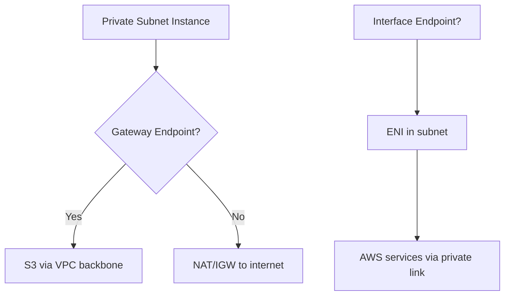

<details open>
<summary><b>10 Aug 03 (CL-KK-Terminal)</b></summary>

# 10 Aug 03

## Table of Contents

- [Overview](#overview)
- [Key Concepts](#key-concepts)
  - [PowerShell Administrator Access](#powershell-administrator-access)
  - [NAT Gateway Redundancy](#nat-gateway-redundancy)
  - [VPC Endpoints: Gateway vs Interface](#vpc-endpoints-gateway-vs-interface)
  - [VPC Peering and Routing](#vpc-peering-and-routing)
  - [Legacy Data Center Design](#legacy-data-center-design)
  - [Hybrid Cloud Connectivity](#hybrid-cloud-connectivity)
- [Code/Config Blocks](#codeconfig-blocks)
- [Lab Demos](#lab-demos)
- [Summary](#summary)

## Overview

This session focuses on transitioning from AWS Networking Module 2 to Module 3 (Hybrid Networking and VPNs). Key topics include troubleshooting VPC connectivity issues, understanding gateway endpoints vs interface endpoints, NAT gateway redundancy, and hybrid cloud concepts where workloads are distributed between on-premise data centers and AWS VPCs. The instructor clarifies PPT upload schedules, lab tasks, and course modules.

> [!IMPORTANT]
> Module 3 covers hybrid connectivity, VPNs (IPsec site-to-site and client-to-site), AWS Direct Connect (DX), and hybrid DNS with Route 53.

## Key Concepts

### PowerShell Administrator Access

PowerCell requires administrator privileges to forward SSH keys properly. When logged in as a user, key forwarding fails. Always open PowerCell as administrator.

**To forward SSH keys:**

```bash
ssh-add ~/.ssh/your-key
ssh -A user@bastion-ip
ssh user@private-ip -p port
```

> [!NOTE] 
> The bastion host should be launched in a public subnet with internet access for SSH sessions.

### NAT Gateway Redundancy

NAT gateways are deployed in specific Availability Zones (AZs). For high availability across multiple AZs:
- Deploy one NAT gateway per public subnet per AZ
- Route traffic through VPC router which handles cross-AZ routing
- Single NAT gateway can serve multiple private subnets across AZs
- Cost optimization: Use main route table vs custom route tables

### VPC Endpoints: Gateway vs Interface

| Feature | Gateway Endpoint | Interface Endpoint |
|---------|-----------------|-------------------|
| Scope | VPC-wide | Subnet-specific |
| ENI created | No | Yes (elastic network interface) |
| Services | S3, DynamoDB | All other AWS services |
| Routing | Automatic prefix injection | Requires route to ENI IP |



+ **Gateway endpoints**: Use for S3/DynamoDB, deployed VPC-wide
- **Interface endpoints**: Deploy per subnet, use for all other AWS services

> [!TIP]
> Gateway endpoints require attaching subnets to route tables. Interface endpoints create ENIs that need explicit routing.

### VPC Peering and Routing

VPC peering enables private connectivity between VPCs without internet exposure.

**For cross-region communication:**
- Peering connection required
- Route tables updated with peer VPC CIDRs
- No overlapping CIDRs allowed
- VGW conversion needed for VPN transit

> [!IMPORTANT]
> Route tables on both sides must include routes to peer VPC CIDRs through the peering connection.

### Legacy Data Center Design

Traditional on-premise setup includes:
- **Routers**: Connected to ISP for internet access
- **Core switches**: Running VLANs with HSRP for redundancy
- **VMware clusters**: ESXi hosts in port channels for HA

Fire ports: ESXi01-port-A → Switch1, ESXi01-port-B → Switch2

Port channel aggregation: Combine multiple physical links into logical bundles for redundancy and load balancing.

### Hybrid Cloud Connectivity

Hybrid cloud distributes workloads between on-premise and public cloud:

**Key components:**
- On-premise router for load balancing
- F5 load balancer or similar for traffic distribution  
- VPN connections to cloud providers
- Subnetting: Different CIDRs for on-premise vs cloud workloads

**Routing logic:**
```
Packet flow:
User → Load Balancer → Route check
- 10.1.1.0/24 → On-premise servers
- 10.1.2.0/24 → AWS EC2 instances via VPN
```

+ **Design benefits**: 50/50 split using routing rather than hardware LB
- **Overlapping subnets**: Must use different CIDR ranges

## Code/Config Blocks

### SSH Key Forwarding Setup

```bash
# Add key to agent
ssh-add ~/.ssh/your-key.pem

# Forward to bastion host  
ssh -A ec2-user@bastion-ip

# Connect to private instance
ssh ec2-user@private-ip
```

### Basic Route Table Configuration

```bash
# Custom route table for private subnets
Routes:
10.0.0.0/16 local
0.0.0.0/0 nat-gateway-id
```

## Lab Demos

### PC2: VPC Gateway Endpoint
1. Create VPC with public and private subnets
2. Create S3 bucket and upload object
3. Make bucket public at bucket level
4. Attach object-level permissions
5. Create Gateway Endpoint for S3
6. Launch EC2 in private subnet with S3FullAccess IAM policy
7. Attach bastion host in public subnet for SSH access
8. Verify S3 access from private EC2 without internet

### PC3: VPC Interface Endpoint  
1. Create additional VPC for ELB simulation
2. Create ELB with target group pointing to EC2 instances
3. Deploy Interface Endpoint in first VPC
4. Update route tables to point to ENI for ELB DNS
5. Test connectivity from different VPC subnets

**Expected outcomes:**
- Gateway endpoint: Access S3 objects internally
- Interface endpoint: Reach ELB across VPCs without peering

## Summary

### Key Takeaways

```diff
+ Hybrid networking combines on-premise and cloud workloads
+ VPC endpoints provide private connectivity to AWS services
+ Route tables control traffic flow between subnets and services
- Avoid overlapping CIDR blocks in hybrid environments
+ Multiple NAT gateways provide redundancy across AZs
```

### Quick Reference

**Endpoint Types:**
- `vpce-xxx` (S3/DynamoDB) → Gateway
- `vpce-yyy` (others) → Interface  

**Common Prefixes:**
- S3: `s3.amazonaws.com` prefixes
- DynamoDB: `dynamodb.region.amazonaws.com`

**BGP basics covered next:** Autonomous systems, route advertisement, neighbor establishment

### Expert Insight

**Real-world Application:**
This session demonstrates real enterprise scenarios where companies migrate gradually to cloud while maintaining on-premise operations. Hybrid architectures enable disaster recovery, workload balancing, and cost optimization.

**Expert Path:**
Master BGP configuration and network automation tools like AWS CloudFormation for infrastructure as code. Study CCNP-level routing and switching concepts for deep network understanding.

**Common Pitfalls:**
- Forgetting to update both route tables in peer connections
- Not launching bastion hosts in public subnets with internet access
- Mixing different key pair configurations across environments
- Assuming single NAT gateway covers cross-AZ routing (it does, but manually)

</details>
