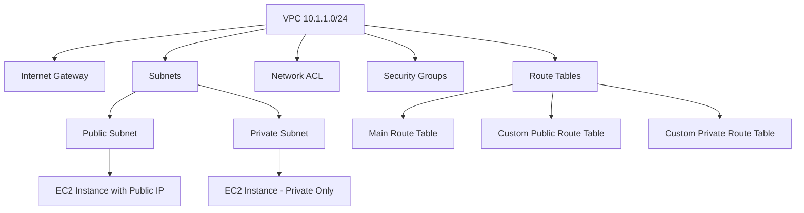
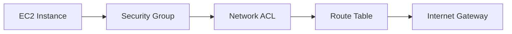

# Session 4: AWS Hands On Playground and VPC Information

<details open>
<summary><b>AWS Hands On Playground and VPC Information (KK-CS45-script-v2-Inst-v1)</b></summary>

## Table of Contents

- [Overview](#overview)
- [Key Concepts and Deep Dive](#key-concepts-and-deep-dive)
  - [AWS Account Setup and Sandbox Access](#aws-account-setup-and-sandbox-access)
  - [Understanding VPC Fundamentals](#understanding-vpc-fundamentals)
  - [Virtual Private Cloud (VPC) Architecture](#virtual-private-cloud-vpc-architecture)
- [Lab Demo: Creating a Customized VPC Environment](#lab-demo-creating-a-customized-vpc-environment)
  - [Step 1: VPC Creation](#step-1-vpc-creation)
  - [Step 2: Creating Subnets](#step-2-creating-subnets)
  - [Step 3: Creating Route Tables](#step-3-creating-route-tables)
  - [Step 4: Creating Internet Gateway](#step-4-creating-internet-gateway)
  - [Step 5: Creating EC2 Instance](#step-5-creating-ec2-instance)
- [Summary](#summary)
- [Key Takeaways](#key-takeaways)
- [Quick Reference](#quick-reference)
- [Expert Insight](#expert-insight)

## Overview

This hands-on session focuses on setting up AWS infrastructure through the AWS Management Console. Students learn how to create free AWS accounts, access sandbox lab environments, and manually build a complete Virtual Private Cloud (VPC) setup from scratch. The session covers VPC creation, subnet configuration, route tables, internet gateways, security groups, and EC2 instance deployment. Multiple approaches are demonstrated, with emphasis on proper networking architecture, security configurations, and hands-on troubleshooting.

## Key Concepts and Deep Dive

### AWS Account Setup and Sandbox Access

#### Free AWS Account Creation
New users can create AWS accounts by:
1. Accessing aws.amazon.com and clicking "Create an AWS Account"
2. Providing a unique email address and account name
3. Completing verification process with credit card (not charged unnecessarily during course)
4. Understanding free tier limits to avoid unexpected charges

#### Sandbox Lab Environment
- Business/Plus account subscription provides prepaid credits
- Shared credentials among students (security group access only)
- Lab auto-shutdown after 4 hours, recommended usage between 1-2 hours
- Regional access (e.g., US East - N. Virginia) based on lab credentials
- Identity Access Management (IAM) structure for user management

#### IAM Concepts
- IAM is AWS's Active Directory equivalent
- Groups contain privileges that inherit to assigned users
- Multi-factor authentication for security
- Used for managing different levels of access across AWS resources

### Understanding VPC Fundamentals

#### Virtual Private Cloud (VPC)
VPC is a logically isolated network environment in AWS cloud:
- Acts as your virtual data center in the cloud
- Contains subnets, route tables, security groups, internet gateways, VPN gateways
- Provides complete control over network architecture

#### VPC Components Architecture



#### Key VPC Networking Rules

**IP Addressing Fundamentals:**
- Class B range: 172.16.0.0/12 supports VPCs
- Default VPC uses 172.31.0.0/16 CIDR block
- Private IPs reserve 5 addresses per subnet:
  - First: Network ID (.0)
  - Next: VPC Gateway (.1-3)
  - Next: DNS server (.4)
  - Last: Broadcast address

**Security Boundary Levels:**


#### Tenancy Models
- **Default (Shared) Tenancy**: Hardware shared, workload logically separated
- **Dedicated Tenancy**: Physically dedicated hardware (expensive, rarely used for basic labs)

### Virtual Private Cloud (VPC) Architecture

#### Comparison: On-Premises vs. AWS VPC

| Component | On-Premises | AWS VPC Equivalent |
|-----------|-------------|-------------------|
| Data Center | Building/Floor | Region/Availability Zone |
| Firewall | Dedicated Hardware | Security Groups |
| Router | Core Router | Route Tables |
| Switches | Distribution Switches | NAT Gateway/Internet Gateway |
| VLANs | Network Segmentation | Subnets (Public/Private) |

#### Route Table Mechanics
- Subnet-to-route table relationship: 1:1 mapping (one route table can have multiple subnets, each subnet only one route table)
- Main route table: Default route table assigned to all newly created subnets
- Custom route tables: Created for specific routing requirements

#### Security Group vs. Network ACL

| Criteria | Security Groups | Network ACLs |
|----------|----------------|--------------|
| **Type** | Instance-level | Subnet-level |
| **Allowance** | Default: Deny all, explicit allow | Default: Allow all, explicit deny |
| **Rules** | Stateful | Stateless |
| **Scope** | Single EC2 instance/port | All instances in subnet |

#### Internet Gateway Behavior
- One IGW per VPC maximum
- Forward traffic between VPC and internet using static NAT table
- Maintains 1:1 relationship between private and public IP addresses
- No crossover between IGWs (each VPC needs its own)

## Lab Demo: Creating a Customized VPC Environment

### Client Requirements
Create a production VPC in US East (N. Virginia):
- VPC Name: `network-kings-VPC`
- CIDR: 10.1.1.0/24
- Subnet A (Private): 10.1.1.0/28
- Subnet B (Public): 10.1.1.16/28
- Private Route Table: For private subnet traffic
- Public Route Table: For public subnet with internet access
- Internet Gateway Name: `network-kings-IGW-prod`
- Egress Only Gateway: Not configured in this demo
- EC2 Instance: Linux t2.micro in public subnet with internet access

### Step 1: VPC Creation

1. **Navigation**: Services > VPC > Your VPCs > Create VPC
2. **VPC Settings**:
   - Name: `network-kings-p-VPC`
   - IPv4 CIDR block: `10.1.1.0/24`
   - IPv6 CIDR block: None (Amazon provided)
   - Tenancy: Default
   - Name tag: `Networking VPC` (for identification)
3. **Verification**: Check VPC creation completes successfully

### Step 2: Creating Subnets

**Private Subnet (No Internet Access)**:
1. Navigate: VPC > Subnets > Create subnet
2. Settings:
   - VPC: Select `network-kings-VPC`
   - Subnet name: `network-kings-subnet-A`
   - Availability Zone: `us-east-1a` (or auto-selected)
   - IPv4 CIDR block: `10.1.1.0/28`
3. **Result**: Subnet ID, 11 available IPs (out of 16, 5 reserved)

**Public Subnet (Internet Access)**:
1. Similar steps as private subnet
2. Settings:
   - Subnet name: `network-kings-subnet-B`
   - Availability Zone: `us-east-1a`
   - IPv4 CIDR block: `10.1.1.16/28`

**Key Point**: Distribution among availability zones for redundancy (though demo uses single AZ)

### Step 3: Creating Route Tables

**Private Route Table**:
1. Navigate: VPC > Route Tables > Create route table
2. Settings:
   - Name: `network-kings-private-RTB`
   - VPC: `network-kings-VPC`
3. **Associate subnet**: Edit subnet associations > Add `subnet-A`
4. **Routes**: Inherits default local route (VPC internal traffic)

**Public Route Table**:
1. Create second route table: `network-kings-public-RTB`
2. Associate with `subnet-B`
3. **Critical Route Addition** (added after IGW creation):
   - Destination: `0.0.0.0/0`
   - Target: Select Internet Gateway `network-kings-IGW-prod`

### Step 4: Creating Internet Gateway

1. Navigate: VPC > Internet Gateways > Create internet gateway
2. Settings:
   - Name: `network-kings-IGW-prod`
   - Attach to VPC: `network-kings-VPC`
3. **Verification**: Status shows "attached"

### Step 5: Creating EC2 Instance

**Instance Configuration**:
1. Navigate: EC2 > Instances > Launch Instances
2. **Settings**:
   - Name: `network-kings-p-VM1`
   - Amazon Machine Image (AMI): Amazon Linux 2 or Ubuntu (64-bit x86)
   - Instance type: t2.micro (free tier)
   - Key pair: Create new RSA key pair `network-kings-key`
   - **Critical Networking Section**:
     - VPC: `network-kings-VPC`
     - Subnet: `network-kings-subnet-B` (public subnet)
     - Auto-assign public IPv4 address: Enable
   - Security group: Select existing `vpc-xxxxx-sg`
   - Security group rules: Allow SSH (22) from `0.0.0.0/0` for demo purposes

**Post-Launch Verification**:
- Instance state: Running
- Networking tab: Shows both private IP and public IP
- Security group: Proper configuration

**Connection Methods**:
1. **AWS Console Connect**: Instance Connect (browser-based)
2. **SSH Connection**:
   ```bash
   # For Linux/Mac
   chmod 400 network-kings-key.pem
   ssh -i network-kings-key.pem ec2-user@<public-ip>

   # For Windows using PuTTY
   # Load .pem file, specify username ec2-user
   ```
3. **Verification Commands**:
   ```bash
   hostname -i  # Shows private IP
   curl ifconfig.me  # Shows public IP (if internet accessible)
   ```

## Summary

### Key Takeaways

```diff
+ VPC is your virtual data center in AWS with complete network control
+ Security occurs at multiple levels: SG (instance), NACL (subnet), RT (routing)
+ Internet access requires IGW + route table entry + public subnet + public IP
+ Always design for multi-AZ redundancy for production workloads
+ Route tables control traffic flow between VPC resources and external networks
- Avoid opening security groups to 0.0.0.0/0 in production (use specific IPs/ranges)
- Don't delete default VPCs unless you understand resource dependencies
- One IGW per VPC, one RT per subnet, but RT can serve multiple subnets
- EC2 instances need explicit networking configuration for internet access
- Free tier has limits (750 hours EC2, bandwidth fees after initial allowance)
```

### Quick Reference

**IMPORTANT CIDR Blocks:**
- Default VPC: `172.31.0.0/16`
- Private Class B: `172.16.0.0/12`
- Class A Private: `10.0.0.0/8`
- Session-Specific: `10.1.1.0/24` → `10.1.1.0/28` (private) + `10.1.1.16/28` (public)

**Critical Route Table Entries:**
```bash
# Public Route Table
Destination: 0.0.0.0/0
Target: igw-xxxxxxxxx  # Internet Gateway ID

# Private Route Table
# Only local route (auto-inherited)
Destination: 10.1.1.0/24
Target: local
```

**NAT-GW Replacement (AWS-managed):**
- Pricing: Per hour + per GB processed
- High availability: Redundant by default
- No single point of failure in subnet

### Expert Insight

**Real-world Application**:
Enterprise VPCs often span multiple AZs with NAT gateways for private subnet internet access. Production workloads separate web, app, and database tiers across different AZs behind load balancers. Route table policies implement least-privilege access.

**Expert Path**:
Master subnetting calculations, understand BGP routing concepts within AWS, and learn advanced networking constructs like VPC peering, Direct Connect, and Transit Gateway. Practice building architectures that comply with security frameworks like CIS AWS Foundations Benchmark.

**Common Pitfalls**:
- Forgetting reserved IP addresses in subnet calculations
- Incorrect route table associations causing traffic blackholes
- Overly permissive security groups leading to exposed resources
- Single AZ deployments causing availability gaps
- Not planning IP address space for future growth

</details>