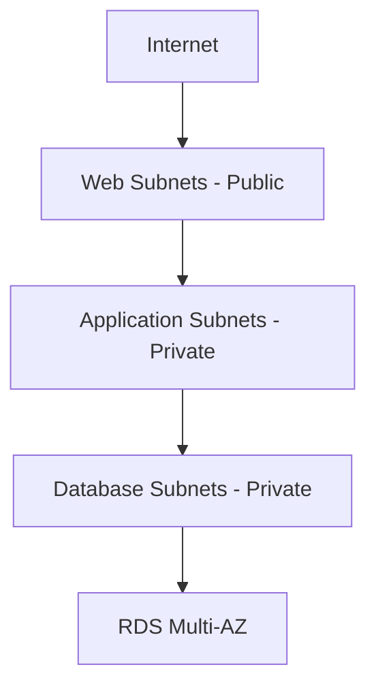
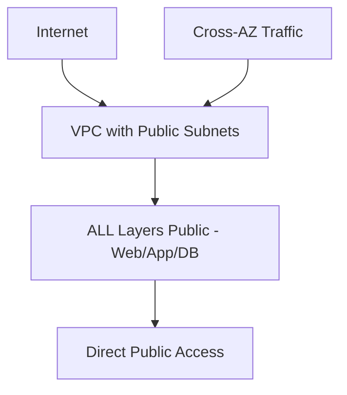
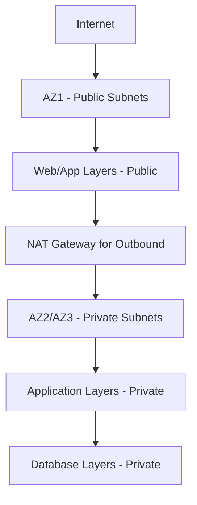
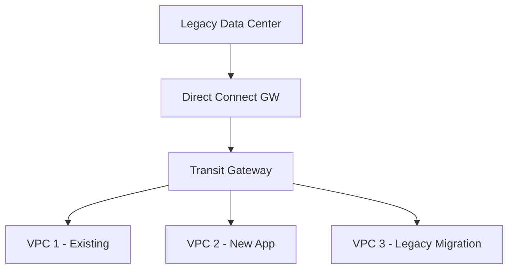

<details open>
<summary><b>06 Sbnet A Sbnet B & Legacy DC (KK-CS45-script-v2-Inst-v3)</b></summary>
# Session 6: Sbnet A Sbnet B & Legacy DC

## Table of Contents

- [Subnet Architectures Overview](#subnet-architectures-overview)
- [Existing Architecture Deep Dive](#existing-architecture-deep-dive)
- [Subnet A Implementation](#subnet-a-implementation)
- [Subnet A Scaling Considerations](#subnet-a-scaling-considerations)
- [Subnet B Implementation](#subnet-b-implementation)
- [Subnet B Scaling and Management](#subnet-b-scaling-and-management)
- [Legacy Data Center Integration](#legacy-data-center-integration)
- [Architecture Decision Framework](#architecture-decision-framework)
- [Lab Demos and Code Snippets](#lab-demos-and-code-snippets)
- Summary

## Subnet Architectures Overview

This session explores different subnet architecture patterns for AWS VPC deployments, focusing on Subnet A (all-public), Subnet B (hybrid public/private), and legacy data center connectivity. These patterns represent common evolution paths for cloud architecture maturity.

### Key Learning Objectives

- Understand trade-offs between different subnet architectures
- Master scaling and networking considerations for each pattern
- Learn migration patterns from traditional data centers to AWS

## Existing Architecture Deep Dive

### Current Setup Analysis

The existing architecture follows a traditional three-tier pattern:

- **Web Tier**: Public subnets for internet-facing load balancers
- **Application Tier**: Private subnets for application servers
- **Database Tier**: Private subnets for RDS instances

### Architecture Flow



### Security and Access Patterns

- Public IPs assigned to web instances behind ELB
- Private IP communications between tiers
- Security groups controlling all traffic
- No NAT gateways in existing setup for outbound internet

## Subnet A Implementation

### All-Public Subnet Architecture

Subnet A represents the "speed-to-market" approach where all subnets across all Availability Zones are public. This eliminates the complexity of private networking and NAT gateways.

### Key Characteristics

- **Simplicity**: No private subnets to manage
- **Speed**: Faster deployment and troubleshooting
- **Cost**: Lower initial setup cost (no NAT gateways)
- **Security Trade-off**: All instances have public IP addresses

### Networking Diagram



## Subnet A Scaling and Networking

### Cross-AZ Communication

With all public subnets, instances communicate via public IP addresses across Availability Zones, eliminating the need for private networking complexity.

### Scaling Considerations

When scaling beyond initial setup, consider:

```bash
# NAT Gateway configuration for outbound traffic
aws ec2 create-nat-gateway \
  --subnet-id <PUBLIC_SUBNET_ID> \
  --allocation-id <EIP_ID> \
  --allocation-id <EIP_ID>
```

### Cost Implications

> [!NOTE]
> Initial cost savings increase with scale as NAT gateways become necessary

## Subnet B Implementation

### Hybrid Public-Private Architecture

Subnet B optimizes for cost and security by:
- Keeping web and application tiers public in one AZ (AZ1)
- Moving subsequent AZs to private subnets
- Implementing private connections for management

### Architecture Layout



## Subnet B Scaling and Management

### Zone-Based Distribution

- **AZ1**: Public orientation for user-facing services
- **AZ2+**: Private oriented for cost optimization
- **Cross-AZ traffic**: Via public/private boundary

### Management Access Patterns

```bash
# EC2 Instance Connect
aws ec2-instance-connect send-ssh-public-key \
  --instance-id i-1234567890abcdef0 \
  --availability-zone us-east-1a \
  --username ec2-user \
  --ssh-public-key file://path/to/key.pub
```

### Security Considerations

- **Bastion/Jump Box**: Required for private AZ access
- **Systems Manager**: For agent-based connectivity
- **VPC Endpoints**: For AWS service access without internet

## Legacy Data Center Integration

### Migration Strategies

Moving from traditional data centers to AWS involves:

1. **Direct Connect**: Dedicated private connectivity
2. **VPN Tunnels**: Secure encrypted connections
3. **PrivateLink**: Service-level peering
4. **Transit Gateway**: Multi-VPC routing

### Connectivity Options Comparison

| Method | Speed | Security | Cost | Use Case |
|--------|-------|----------|------|----------|
| Direct Connect | 1Gbps-100Gbps | Physical | High | Enterprise-grade |
| VPN | Up to 1.25Gbps | Encrypted | Medium | Cost-sensitive |
| PrivateLink | VPC Peering | AWS-managed | Variable | Service integration |

### Network Peering Architecture



## Architecture Decision Framework

### When to Choose Each Pattern

```diff
+ Subnet A: Speed to market, small teams, cost-conscious startups
! Subnet B: Hybrid for cost optimization
- Legacy DC: Migration transition
```

### Scaling Implications

> [!WARNING]
> All-public architectures (Subnet A) may violate compliance requirements

## Lab Demos and Code Snippets

### Terraform VPC Setup

```hcl
resource "aws_vpc" "main" {
  cidr_block = "10.0.0.0/16"

  tags = {
    Name = "main-vpc"
  }
}

resource "aws_subnet" "public" {
  count = 3
  vpc_id = aws_vpc.main.id
  cidr_block = "10.0.${count.index}.0/24"
  availability_zone = var.azs[count.index]

  tags = {
    Name = "public-subnet-${count.index}"
  }
}
```

### Direct Connect Configuration

```bash
# Configure Direct Connect Virtual Interface
aws directconnect create-public-virtual-interface \
  --connection-id dxcon-xxxxxx \
  --new-public-virtual-interface '{
    "virtualInterfaceName": "legacy-dc-link",
    "vlan": 4094,
    "asn": 65000,
    "amazonAddress": "192.0.2.1/30",
    "customerAddress": "192.0.2.2/30",
    "addressFamily": "ipv4"
  }'
```

## Summary

### Key Takeaways

```diff
+ Subnet A optimizes for speed and simplicity at expense of security
+ Subnet B balances cost and compliance for enterprise deployments
+ Legacy DC connectivity requires careful network architecture planning
+ Scaling decisions impact cost, security, and operational complexity
```

### Quick Reference

**Subnet A Commands:**
```bash
# Create all-public subnet architecture
aws ec2 create-subnet --vpc-id vpc-xxxxxx --cidr-block 10.0.1.0/24 --availability-zone us-east-1a
```

**Subnet B Hybrid Setup:**
```bash
# NAT Gateway for private subnets
aws ec2 create-nat-gateway --subnet-id subnet-xxxxxx --allocation-id eip-xxxxxx
```

**Legacy Connectivity:**
```bash
# Transit Gateway attachment
aws ec2 attach-transit-gateway-vpc-attachment --transit-gateway-id tgw-xxxxxx --vpc-id vpc-xxxxxx
```

### Expert Insight

#### Real-world Application
In production environments:
- Use Subnet B for regulated industries requiring private networking
- Implement comprehensive monitoring on cross-AZ traffic
- Design for hybrid cloud transition over 12-18 months

#### Expert Path
- Master AWS networking primitives (Route Tables, Security Groups, NACLs)
- Learn advanced patterns like VPC sharing and networking foundations
- Understand cost optimization with Reserved NAT Gateway hours

#### Common Pitfalls
> [!WARNING]
> Forgetting to update route tables when adding NAT gateways
> Public instances becoming security incidents without proper monitoring
> Underestimating Direct Connect port costs for legacy migrations

#### Lesser-Known Facts
- Direct Connect 100Gbps ports cost $200,000+ monthly
- VPN tunnels can achieve 99.9% uptime with proper configuration
- Transit Gateway routing can replace complex VPC peering meshes

#### Advantages and Disadvantages

**Subnet A (All-Public):**
- ✅ Fast deployment, lowest initial cost
- ✅ Simpler troubleshooting and management
- ❌ Security compliance issues
- ❌ Scaling cost creep with NAT gateways

**Subnet B (Hybrid):**
- ✅ Cost-effective scaling
- ✅ Compliance-friendly architecture
- ✅ Operational complexity
- ❌ Initial design investment required

**Legacy DC Integration:**
- ✅ Continuity during migration
- ✅ Gradual transition support
- ❌ Ongoing connectivity costs
- ❌ Complex routing configurations

</details>
