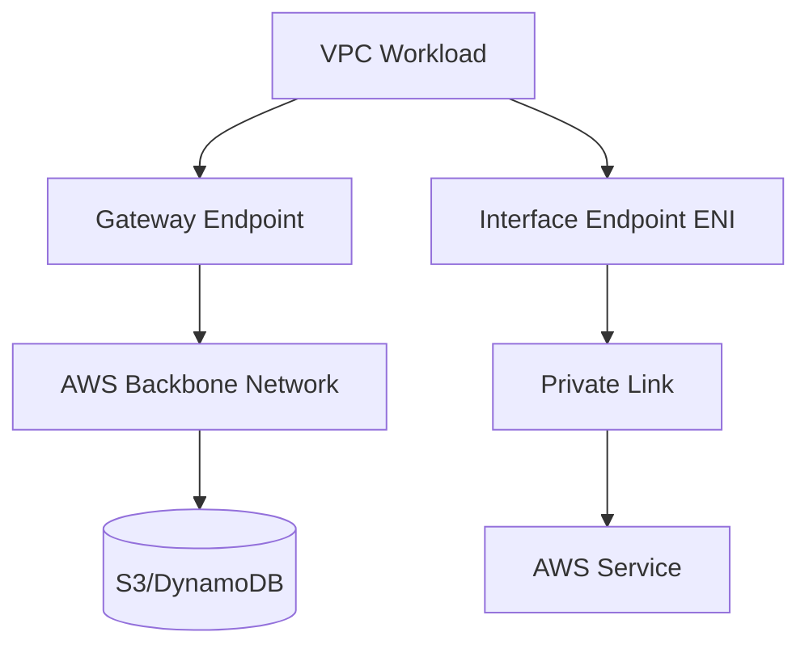
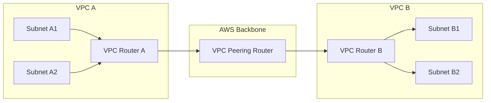

<details open>
<summary><b>Session 07: VPC Private Connectivity (KK-CS45-script-v2-Inst-v3)</b></summary>

# Session 07: VPC Private Connectivity

## Table of Contents
- [Module 2 Introduction](#module-2-introduction)
- [Gateway Endpoint Architecture](#gateway-endpoint-architecture)
- [Interface Endpoint Architecture](#interface-endpoint-architecture)
- [VPC Peering Concepts](#vpc-peering-concepts)
- [Route Table Configuration](#route-table-configuration)
- [Security Group Restrictions](#security-group-restrictions)
- [Production Scenarios](#production-scenarios)
- [Lab 2 Overview](#lab-2-overview)
- [Summary](#summary)

## Module 2 Introduction

### Overview
This module covers VPC Private Connectivity services that enable secure communication within the AWS ecosystem without traversing the public internet. The module focuses on three primary connectivity mechanisms: VPC Peering, Gateway Endpoints, and Interface Endpoints. These services allow workloads in different VPCs or within the same VPC to access AWS services privately using the AWS backbone network.

### Key Concepts

Module 2 concentrates on three main components:
1. **VPC Peering**: Direct connectivity between VPCs
2. **Gateway Endpoint**: Access to S3 and DynamoDB services 
3. **Interface Endpoint**: Access to most other AWS services via private links

> [!IMPORTANT]
> Private connectivity means accessing resources within AWS without leaving the AWS backbone network, providing enhanced security and cost optimization compared to internet-based access.

### Gateway Endpoint vs Interface Endpoint



## Gateway Endpoint Architecture

### Overview
Gateway endpoints provide private connectivity to Amazon S3 and DynamoDB services using the AWS backbone network. Unlike interface endpoints, gateway endpoints are managed gateways that appear as route table targets rather than Elastic Network Interfaces (ENIs).

### Key Concepts

**Service Coverage**:
- **S3 Bucket Access**: Private access to Amazon Simple Storage Service
- **DynamoDB Table Access**: Private access to Amazon DynamoDB NoSQL database
- **Transition Services**: AWS is migrating S3 support from gateway endpoints to interface endpoints

**Deployment Mechanism**:
- Gateway endpoints are L3 (Layer 3) devices managed by AWS
- When deployed via API calls or CloudFormation, AWS creates router instances with connectivity to S3 and DynamoDB
- The routing functionality uses the AWS backbone network for private data transfer
- No visible IP addresses or MAC addresses are exposed to users

**Route Table Integration**:
```bash
# Route table entry for Gateway Endpoint
Destination: s3.amazonaws.com or dynamodb.us-east-1.amazonaws.com
Target: vpce-xxxxxxxx (Gateway Endpoint ID)
```

> [!NOTE]
> Gateway endpoints cost nothing to deploy and maintain, but data transfer charges apply based on volume.

## Interface Endpoint Architecture

### Overview
Interface endpoints provide private connectivity to most AWS services using AWS PrivateLink technology. Unlike gateway endpoints, interface endpoints deploy as Elastic Network Interfaces (ENIs) within specified subnets, providing direct ENI-to-service connectivity.

### Key Concepts

**Service Coverage**:
- **Extensive Support**: Most AWS services support interface endpoints
- **PrivateLink Technology**: Uses AWS's private networking infrastructure
- **Dual Endpoint Support**: Services maintain both public and private endpoints

**Deployment Mechanism**:
```mermaid
graph TD
    A[VPC Subnet] --> B[ENI (Interface Endpoint)]
    B --> C[AWS PrivateLink]
    C --> D[AWS Service Private IP]
    D --> E[(AWS Service)]
```

**Cost Structure**:
- **Hourly Charge**: Based on endpoint uptime (minimum 4 hours per partial hour)
- **Data Transfer**: Ingress and egress charges apply
- **Example**: 6-hour endpoint = 6 hours × hourly rate + data transfer costs

**ENI Characteristics**:
- Deployed in specific subnets chosen during endpoint creation
- Uses private IPs within subnet CIDR blocks
- One ENI per Availability Zone per service endpoint

## VPC Peering Concepts

### Overview
VPC Peering enables direct network connectivity between VPCs using AWS backbone network infrastructure. This creates a seamless networking environment where instances in peered VPCs can communicate directly without requiring gateway appliances or VPN connections.

### Key Concepts

**Peering Establishment**:
- AWS creates router devices (L3) in both VPCs
- Cross-connects these routers using backbone network
- Peering ID represents the paired connection

**Routing Architecture**:


**Routing Logic**:
1. **Source Route Table**: Default route points to VPC router when destination matches peered VPC CIDR
2. **VPC Router**: Routes traffic to peering connection
3. **Target Route Table**: Receives traffic and routes to appropriate local subnet via local route

## Route Table Configuration

### Overview
Route table modifications are required to enable traffic flow through VPC peering connections. Without proper routing configuration, peered VPCs cannot communicate despite the peering connection being established.

### Key Concepts

**Route Table Requirements**:
- **Peering Target**: Add routes pointing to either the entire peered VPC CIDR block or specific subnet ranges
- **Next Hop**: Peering connection ID serves as the next-hop target
- **Local Routes**: Automatically maintained for intra-VPC communication

**Example Configurations**:

```bash
# Scenario 1: Full VPC communication
# Route Table in VPC A (10.1.1.0/24)
Destination: 10.1.2.0/24
Target: pcx-xxxxxxxx (Peering Connection)

# Route Table in VPC B (10.1.2.0/24)  
Destination: 10.1.1.0/24
Target: pcx-xxxxxxxx (Peering Connection)

# Scenario 2: Specific subnet communication
# Only allow traffic to 10.1.2.64/26 subnet
Destination: 10.1.2.64/26
Target: pcx-xxxxxxxx
```

**Security Integration**:
- Route tables define reachability but don't enforce security
- Security groups and NACLs provide filtering capabilities
- Traffic flow: Security Group → NACL → Route Table

## Security Group Restrictions

### Overview
Security groups operate at the instance level and can restrict VPC peering traffic despite proper routing. This provides granular control over which workloads can communicate across peered VPCs.

### Key Concepts

**Security Processing Order**:
1. **Outbound Security Group**: Filters traffic leaving the source instance
2. **NACL (Network ACL)**: Stateless filtering at subnet level  
3. **Route Table**: Determines next hop for allowed traffic
4. **Inbound Security Group**: Filters traffic arriving at destination instance

**Peering Communication Rules**:
```bash
# Example: Allow SSH from VPC A instance to VPC B specific instance
# Security Group on VPC A source instance
Outbound Rule:
Type: SSH (22)
Destination: 10.1.2.100/32

# Security Group on VPC B destination instance  
Inbound Rule:
Type: SSH (22) 
Source: 10.1.1.100/32
```

**Default Security Behavior**:
- Default security groups: All inbound traffic blocked, all outbound traffic allowed
- Peering traffic is subject to normal security group processing
- /32 IP specifications enable instance-level access control

> [!WARNING]
> Route table configuration alone does not guarantee connectivity. Security groups and NACLs can block traffic even with correct routing.

## Production Scenarios

### Overview
Production environments require comprehensive planning that incorporates connectivity, security, and specific business requirements. A single requirement typically encompasses multiple technical considerations.

### Key Concepts

**Three-Tier Architecture Example**:
```yaml
# Production VPC Specifications
VPC_A_Web_Tier:
  CIDR: 10.1.1.0/24
  Subnet: 10.1.1.64/26 (Frontend)

VPC_B_App_Tier: 
  CIDR: 10.1.2.0/24
  Subnet: 10.1.2.128/26 (Backend)
```

**Scenario-Based Planning**:

1. **Full Private Communication**
   ```yaml
   # Required: All subnets communicate privately
   Route Tables: Add peering routes for entire VPC CIDRs
   Security Groups: Allow all required ports between VPCs
   ```

2. **Selective Subnet Access**  
   ```yaml
   # Required: Only specific subnet pairs communicate
   Route Tables: Add discrete routes for specific subnets only
   Security Groups: Configure for exact VM-to-VM communication
   ```

3. **Security-Layered Access**
   ```yaml
   # Required: Routes enabled but security restricts access
   Route Tables: Full VPC connectivity routes
   Security Groups: Deny rules for restricted VMs
   NACLs: Additional subnet-level restrictions
   ```

**Production Planning Best Practices**:
- **Requirement Clarity**: Verify all parameters with client network engineers before planning
- **Parameter Validation**: Ensure CIDR blocks, subnet allocations, and accessibility requirements are explicitly documented
- **Comprehensive Documentation**: Single plan should address all client connectivity and security requirements

## Lab 2 Overview

### Overview
Lab 2 implements Module 2 concepts through practical scenarios demonstrating VPC private connectivity services. The lab requires careful attention to route table configurations, security group settings, and proper endpoint deployment.

### Lab Scenarios
1. **VPC Peering Configuration**: Establish peering between VPC_A (10.1.1.0/24) and VPC_B (10.1.2.0/24)
2. **Subnet-Specific Access**: Configure selective subnet communication
3. **Security Group Restrictions**: Implement instance-level access controls
4. **Gateway Endpoint Deployment**: Configure S3 access endpoint
5. **Interface Endpoint Deployment**: Configure additional service access

### Prerequisites
- Completed Module 1 VPC, subnet, and internet gateway configuration
- NAT Gateway and bastion host setup for management access
- Understanding of AWS networking components and IP addressing

## Summary

### Key Takeaways
```diff
+ VPC Peering enables direct connectivity between VPCs using AWS backbone network
+ Gateway Endpoints provide private access to S3 and DynamoDB (cost-free, no hourly charges)
+ Interface Endpoints support most AWS services but incur hourly and data transfer costs
+ Route tables define connectivity paths but security groups enforce access control
+ Production plans must address multiple scenarios: full access, selective access, and restricted access
- Gateway endpoints cannot be managed or configured - they are AWS-managed routers
- Interface endpoints require ENI deployment and proper subnet allocation
- Security group configuration is critical even with correct routing tables
- Client requirements must be fully clarified before planning begins
! Default security groups block all inbound traffic and allow outbound traffic
! NACLs and Security Groups both filter traffic but operate at different network levels
```

### Quick Reference

#### Subnetting Calculations
```bash
# /28 subnets in 10.1.1.0/24 range
First subnet: 10.1.1.0/28 (range: .0 to .15)
Increment: +16
Second subnet: 10.1.1.16/28 (.16 to .31)

# /26 subnets in 10.1.2.0/24 range  
First subnet: 10.1.2.0/26 (range: .0 to .63)
Increment: +64
Second subnet: 10.1.2.64/26 (.64 to .127)
```

#### Route Table Templates
```bash
# VPC Peering Route
aws ec2 create-route --route-table-id rtb-xxxxxxxx --destination-cidr-block 10.1.2.0/24 --vpc-peering-connection-id pcx-xxxxxxxx

# Gateway Endpoint Route
aws ec2 create-route --route-table-id rtb-xxxxxxxx --destination-cidr-block pl-xxxxxxxx --vpc-endpoint-id vpce-xxxxxxxx
```

#### Security Group Commands
```bash
# Allow SSH between specific instances
aws ec2 authorize-security-group-ingress --group-id sg-xxxxxxxx --protocol tcp --port 22 --source-group sg-xxxxxxxx --cidr 10.1.1.100/32

# Deny specific instance access
aws ec2 revoke-security-group-ingress --group-id sg-xxxxxxxx --protocol tcp --port 22 --source-group sg-xxxxxxxx --cidr 10.1.2.200/32
```

#### Available IP Calculation
```bash
# Total IPs in subnet minus AWS reserved IPs
AWS Reserved: 5 IPs per subnet (network, VPC router, DNS, broadcast, future use)
Available IPs = (2^(32-subnet_mask) - 5)
Example for /26 subnet: 64 - 5 = 59 available IPs
```

### Expert Insight

#### Real-World Application
In enterprise environments, VPC peering often connects web-tier and app-tier VPCs across different AWS accounts or regions. Gateway endpoints are commonly used for multi-account S3 bucket access, while interface endpoints provide private connectivity to services like Lambda, EC2 APIs, and CloudFormation. Cost optimization focuses on using gateway endpoints where possible and strategically deploying interface endpoints for required services.

#### Expert Path
Master VPC connectivity by starting with simple peering scenarios, then progressing to cross-region and cross-account peering. Focus on understanding traffic flow through security groups, NACLs, and route tables. Practice troubleshooting connectivity issues using VPC Flow Logs and packet captures. Develop expertise in endpoint policies for fine-grained access control and cost management strategies for different endpoint types.

#### Common Pitfalls
```diff
- Assuming peering automatically enables communication (routing configuration required)
- Forgetting security group configurations (even with correct routing)
- Using interface endpoints for S3 when gateway endpoints are cheaper
- Not planning ENI availability in subnets for interface endpoints
- Mixing up security group and NACL behaviors
- Overlooking data transfer costs for interface endpoints
```

#### Lesser-Known Facts
VPC peering connections are not transitive - if VPC A peers with VPC B, and VPC B peers with VPC C, traffic cannot flow from A to C without additional peering connections. Gateway endpoints automatically handle AZ redundancy through AWS's distributed infrastructure, eliminating manual failover concerns. Interface endpoints provide automatic DNS resolution that updates based on endpoint health, providing built-in fault tolerance.

```
</details>