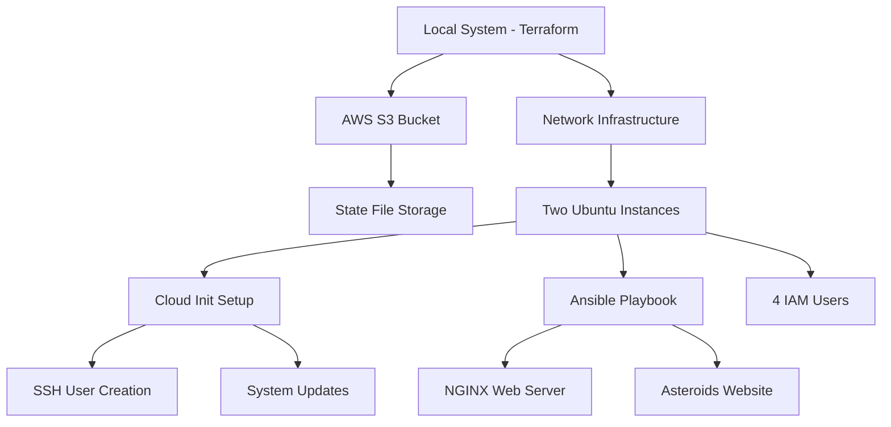
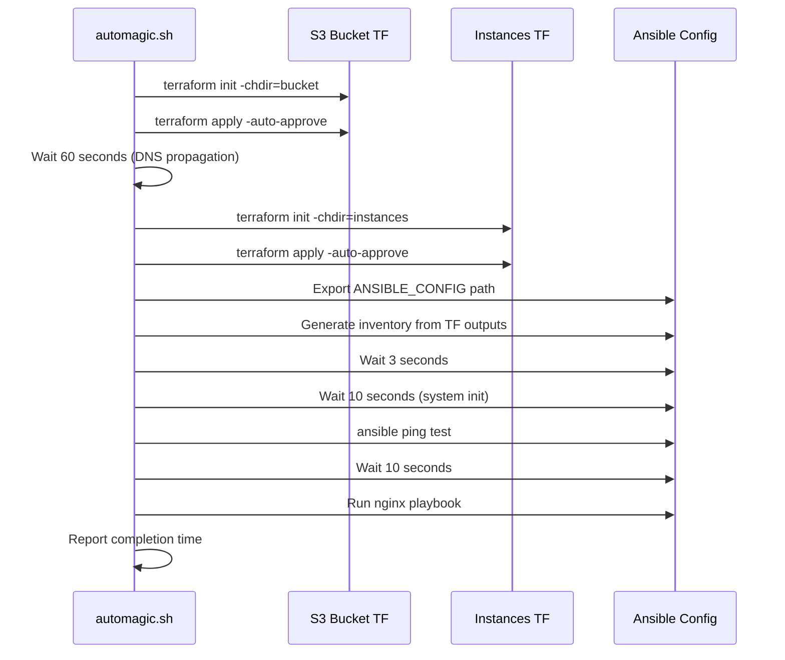
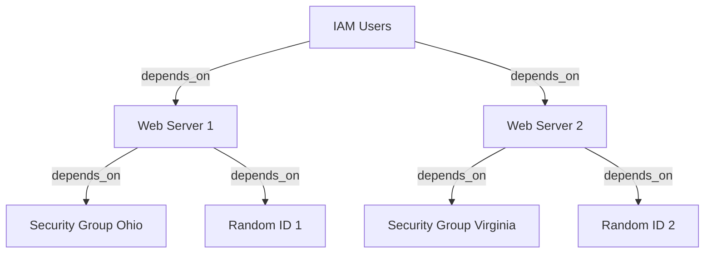

# Section 17: Final Lab

<details open>
<summary><b>Section 17: Final Lab (KK-CS45-script-v2-Inst-v1)</b></summary>

## Table of Contents
- [17.1 Final Lab Introduction](#171-final-lab-introduction)
- [17.2 Analysis of the Lab Files - Bash Scripts](#172-analysis-of-the-lab-files---bash-scripts)
- [17.3 Analysis of the Lab Files - Terraform Files](#173-analysis-of-the-lab-files---terraform-files)
- [17.4 Installing Ansible and Ansible File Analysis](#174-installing-ansible-and-ansible-file-analysis)
- [17.5 SSH Key and Bucket Values](#175-ssh-key-and-bucket-values)
- [17.6 Applying the Infrastructure](#176-applying-the-infrastructure)
- [17.7 Analyzing the Infrastructure](#177-analyzing-the-infrastructure)
- [17.8 Terraform Graphing](#178-terraform-graphing)
- [17.9 Final Destruction and Cloud Check](#179-final-destruction-and-cloud-check)
- [17.10 Quiz](#1710-quiz)

---

## 17.1 Final Lab Introduction

### Overview
This final comprehensive lab integrates Terraform, AWS, Ansible, and Bash scripting to create a complete infrastructure deployment workflow. The lab demonstrates real-world DevOps practices by combining multiple tools and technologies into an automated deployment process.

### Lab Architecture Overview



### Lab Workflow Sequence

```diff
! Lab27 Workflow:
! 1. Create S3 bucket for Terraform state (First Terraform run)
! 2. Build network infrastructure on AWS
! 3. Create two Ubuntu instances (Second Terraform run)
! 4. Configure Cloud Init for SSH access and system updates
! 5. Install Ansible on local system
! 6. Run Ansible playbook to install NGINX and deploy website
```

### Key Components and Directories

| Directory | Description | Contents |
|-----------|-------------|----------|
| `Ansible/` | Ansible configuration | ansible.cfg, inventory, nginx.yml playbook |
| `Bucket/` | S3 bucket Terraform | main.tf (S3 module definition) |
| `Instances/` | AWS infrastructure | Multiple .tf files for EC2, IAM, networking |
| `Keys/` | SSH key storage | sshkey, sshkey.pub |
| `Scripts/` | Supporting scripts | hulk.yaml (cloud-init), bash scripts |
| `automagic.sh` | Main automation script | Orchestrates entire deployment |
| `autodestroy.sh` | Cleanup script | Destroys all infrastructure |

### Important Disclaimers
> [!IMPORTANT]
> Creating infrastructure on AWS or other cloud providers can incur costs. This is a large lab with multiple resources. Do not apply the infrastructure if you do not want to be charged.

### Lab Overview
- **Lab Number**: 27
- **Technologies**: Terraform, AWS, Ansible, Bash, Cloud Init
- **Features**: Multiple regions, random ID generation, dynamic blocks, modules, third-party tools
- **Duration**: ~3 minutes for full deployment, ~55 seconds for destruction

---

## 17.2 Analysis of the Lab Files - Bash Scripts

### Overview
This section analyzes the two critical bash scripts that automate the entire infrastructure deployment: `automagic.sh` for creation and `autodestroy.sh` for cleanup. Understanding these scripts is essential before execution.

### Automagic.sh Script Analysis

#### Script Execution Prerequisites
```diff
! Prerequisites:
! - Linux system with BASH terminal
! - Scripts must be executable (chmod +x)
! - Must be run from Lab27 directory
! - All prerequisite files must be configured
```

#### Script Execution Flow



#### Detailed Script Breakdown

1. **Timer Initialization**
   - Starts a countdown to measure total process duration
   - Reports elapsed time at completion

2. **First Terraform Run (S3 Bucket)**
   ```bash
   terraform -chdir=bucket init
   terraform -chdir=bucket apply -auto-approve
   ```
   - Uses `-chdir` global option to execute from Lab27 directory
   - Creates S3 bucket for state file storage

3. **DNS Propagation Wait**
   ```bash
   printf "Waiting 60 seconds for bucket initialization..."
   sleep 60
   ```
   - Allows time for bucket creation, initialization, and DNS propagation

4. **Second Terraform Run (Instances)**
   ```bash
   terraform -chdir=instances init
   terraform -chdir=instances apply -auto-approve
   ```
   - Creates all AWS infrastructure (instances, IAM users, security groups)

5. **Ansible Configuration Export**
   ```bash
   export ANSIBLE_CONFIG=./ansible/ansible.cfg
   ```
   - Points Ansible to configuration file location

6. **Inventory Generation**
   ```bash
   echo "[nginx]" > ./ansible/inventory
   echo "$(terraform -chdir=instances output -raw public_ip_server_1)" >> ./ansible/inventory
   echo "$(terraform -chdir=instances output -raw public_ip_server_2)" >> ./ansible/inventory
   ```
   - Populates previously empty inventory file
   - Uses terraform output with `-raw` flag to get IP addresses

7. **System Readiness Checks**
   ```bash
   sleep 3
   sleep 10  # System initialization
   ansible nginx -m ping --private-key ./keys/sshkey
   sleep 10
   ```

8. **Playbook Execution**
   ```bash
   ansible-playbook -i ./ansible/inventory ./ansible/nginx.yml --private-key ./keys/sshkey
   ```

9. **Completion Report**
   - Displays success messages
   - Reports total execution time

### Autodestroy.sh Script

#### Destruction Order (Reverse of Creation)
```diff
! Destruction Sequence:
! 1. Destroy instances directory resources (15 resources)
! 2. Destroy bucket directory resources (4 resources)
! 3. Report completion
```

#### Key Differences from Automagic
- Does not wait for DNS propagation
- Destroys in reverse dependency order
- No Ansible operations required

### Making Scripts Executable
```bash
chmod +x automagic.sh autodestroy.sh
# Or
chmod +x *.sh
```

### Best Practices
> [!NOTE]
> Always analyze scripts before execution to understand exactly what they will do and avoid unexpected behavior.

---

## 17.3 Analysis of the Lab Files - Terraform Files

### Overview
This section provides detailed analysis of all Terraform configuration files across the Bucket and Instances directories, covering S3 backend setup, multi-region deployment, and advanced Terraform features.

### Bucket Directory Structure

#### main.tf - S3 Bucket Module
```hcl
terraform {
  required_providers {
    aws = {
      source  = "hashicorp/aws"
      version = "~> 5.0"
    }
  }
}

provider "aws" {
  region = "us-east-2"
}

module "s3_bucket" {
  source  = "terraform-aws-modules/s3-bucket/aws"
  version = "4.2.2"

  bucket = "terraform-dave-01292026"  # Must be globally unique
  force_destroy = true
  control_object_ownership = true
  object_ownership = "BucketOwnerEnforced"
  versioning = {
    enabled = true
  }
}
```

### Instances Directory - Configuration Files

#### version.tf - Backend and Provider Configuration
```hcl
terraform {
  required_version = ">= 1.14.0"

  backend "s3" {
    bucket = "terraform-dave-01292026"  # Must match bucket name
    key    = "dir1/terraform.tfstate"
    region = "us-east-2"
  }

  required_providers {
    aws = {
      source  = "hashicorp/aws"
      version = "~> 5.0"
    }
    azurerm = {
      source  = "hashicorp/azurerm"
      version = "~> 3.0"
    }
    random = {
      source  = "hashicorp/random"
      version = "~> 3.0"
    }
  }
}
```

#### providers.tf - Multi-Region Setup
```hcl
provider "aws" {
  region = "us-east-2"
  alias  = "ohio"
}

provider "aws" {
  region = "us-east-1"
  alias  = "virginia"
}

provider "azurerm" {
  features {}
}
```

#### key_deployer.tf - SSH Key Distribution
```hcl
resource "aws_key_pair" "deployer_ohio" {
  provider   = aws.ohio
  key_name   = "sshkey"
  public_key = file("../keys/sshkey.pub")
}

resource "aws_key_pair" "deployer_virginia" {
  provider   = aws.virginia
  key_name   = "sshkey"
  public_key = file("../keys/sshkey.pub")
}
```

#### sg.tf - Security Groups with Dynamic Blocks
```hcl
locals {
  ingress_ports = [22, 80, 443]
  egress_ports  = [22, 80, 443, 1433]
}

resource "aws_security_group" "web_server_ohio" {
  provider = aws.ohio
  name     = "sg_web_server_ohio"
  vpc_id   = data.aws_vpc.default.id

  dynamic "ingress" {
    for_each = local.ingress_ports
    content {
      from_port   = ingress.value
      to_port     = ingress.value
      protocol    = "tcp"
      cidr_blocks = ["0.0.0.0/0"]
    }
  }

  dynamic "egress" {
    for_each = local.egress_ports
    content {
      from_port   = egress.value
      to_port     = egress.value
      protocol    = "tcp"
      cidr_blocks = ["0.0.0.0/0"]
    }
  }
}
```

#### aws_instances.tf - EC2 Instances
```hcl
resource "aws_instance" "web_server_1" {
  provider      = aws.ohio
  ami           = "ami-0c7217cdde317cfec"  # Ubuntu 24.04 us-east-2
  instance_type = var.instance_type
  key_name      = var.key_name

  vpc_security_group_ids = [aws_security_group.web_server_ohio.id]

  user_data = file("../scripts/hulk.yaml")

  tags = {
    Name        = "Web Server 1"
    Department  = "Techie Nerds"
    TimeCreated = formatdate("YYYY-MM-DD hh:mm", timestamp())
    ID          = random_id.instance_id_1.hex
  }
}

resource "aws_instance" "web_server_2" {
  provider      = aws.virginia
  ami           = "ami-0ebfd9c5e0322c4fe"  # Ubuntu 24.04 us-east-1
  instance_type = var.instance_type
  key_name      = var.key_name

  vpc_security_group_ids = [aws_security_group.web_server_virginia.id]

  user_data = file("../scripts/hulk.yaml")

  tags = {
    Name        = "Web Server 2"
    Department  = "Techie Nerds"
    TimeCreated = formatdate("YYYY-MM-DD hh:mm", timestamp())
    ID          = random_id.instance_id_2.hex
  }
}
```

#### random.tf - Random ID Generation
```hcl
resource "random_id" "instance_id_1" {
  byte_length = 8
}

resource "random_id" "instance_id_2" {
  byte_length = 8
}
```

#### accounts.tf - IAM Users with for_each
```hcl
resource "aws_iam_user" "users" {
  for_each = toset(var.accounts)
  name     = each.value

  tags = {
    Department  = "Techie Nerds"
    TimeCreated = formatdate("YYYY-MM-DD hh:mm", timestamp())
  }

  depends_on = [aws_instance.web_server_1, aws_instance.web_server_2]
}
```

#### variables.tf - Variable Definitions
```hcl
variable "instance_type" {
  default = "t3.micro"
}

variable "key_name" {
  default = "sshkey"
}

variable "accounts" {
  default = [
    "Alice", "Bob", "Charlie", "Denise",
    "Aaron", "Franklin", "Darth"
  ]
}
```

#### outputs.tf - Terraform Outputs
```hcl
output "public_ip_server_1" {
  value = aws_instance.web_server_1.public_ip
}

output "public_ip_server_2" {
  value = aws_instance.web_server_2.public_ip
}

output "public_dns_server_1" {
  value = aws_instance.web_server_1.public_dns
}

output "public_dns_server_2" {
  value = aws_instance.web_server_2.public_dns
}

output "private_ip_server_1" {
  value = aws_instance.web_server_1.private_ip
}

output "private_ip_server_2" {
  value = aws_instance.web_server_2.private_ip
}
```

### Azure VM Support (Optional)
- All Azure resources are commented out by default
- Requires uncommenting `depends_on` meta-arguments
- Follows order: Azure VM first, then AWS instances

---

## 17.4 Installing Ansible and Ansible File Analysis

### Overview
This section covers Ansible installation, configuration file analysis, and the Cloud Init script used for initial instance setup. Ansible serves as the configuration management tool that runs after Terraform provisions the infrastructure.

### Ansible Installation

#### Installation Methods
```bash
# Debian/Ubuntu
sudo apt install ansible

# Verify installation
ansible --version

# Alternative: pip installation
pip install ansible
```

#### Version Information
- Core version used: 2.19.4
- Ansible is Configuration as Code (CaC) tool
- Complements Terraform's Infrastructure as Code (IaC)

### Ansible Directory Structure

#### ansible.cfg Configuration
```ini
[defaults]
remote_user = hulk
host_key_checking = false
private_key_file = ../keys/sshkey
inventory = inventory

[privilege_escalation]
become = true
become_method = sudo
become_user = root
```

> [!NOTE]
> This configuration prioritizes ease of use over security. In production, additional security measures would be required.

#### Inventory File
- Initially empty by design
- Populated dynamically by `automagic.sh` script
- Contains IP addresses retrieved from Terraform outputs

#### nginx.yml Playbook
```yaml
---
- name: Configure NGINX Web Servers
  hosts: nginx
  become: yes

  tasks:
    - name: Install NGINX
      apt:
        name: nginx
        state: latest

    - name: Clone Asteroids repository
      git:
        repo: https://github.com/dmShinya/asteroids.git
        dest: /var/www/html/asteroids

    - name: Copy website files
      copy:
        src: /var/www/html/asteroids/
        dest: /var/www/html/
        remote_src: yes
```

### Cloud Init Script (hulk.yaml)

#### Script Location and Purpose
- Stored in `scripts/hulk.yaml`
- Referenced by `user_data` argument in AWS instances
- Executes on instance boot to perform initial configuration

#### Cloud Init Content
```yaml
#cloud-config
groups:
  - ubuntu
  - ansiblegroup

users:
  - name: hulk
    primary_group: ansiblegroup
    groups: users, admin, sudo
    shell: /bin/bash
    sudo: ALL=(ALL) NOPASSWD:ALL
    ssh_authorized_keys:
      - ssh-ed25519 AAAAC3NzaC1lZDI1NTE5AAAAI... terraform final lab

write_files:
  - path: /home/hulk/hello.txt
    content: |
      Hello from Cloud Init!

runcmd:
  - mkdir /home/hulk/asteroids
  - apt update -y
  - echo "hulk smash when done" > /home/hulk/hello.txt
```

### Key Cloud Init Features
1. **Group Creation**: Creates `ubuntu` and `ansiblegroup` groups
2. **User Creation**: Creates `hulk` user with sudo privileges
3. **SSH Key Configuration**: Injects SSH public key for access
4. **File Operations**: Creates files and directories
5. **System Updates**: Performs apt update

---

## 17.5 SSH Key and Bucket Values

### Overview
This section covers the creation and distribution of SSH keys, as well as configuring the S3 bucket backend for state storage. These pre-deployment steps are critical for successful infrastructure provisioning.

### SSH Key Generation

#### ED25519 Key Generation (Recommended)
```bash
cd keys
ssh-keygen -t ed25519 -f sshkey -C "terraform final lab"
# Press Enter for no passphrase (lab environment only)
```

#### Key Files Created
- `sshkey` - Private key (never share or expose)
- `sshkey.pub` - Public key (copy to required locations)

> [!IMPORTANT]
> For SSH version 9.6+, ED25519 is the default. Use ED25519 over RSA unless RSA is specifically required.

### Public Key Distribution Locations

1. **key_deployer.tf** (Both providers)
   ```hcl
   public_key = file("../keys/sshkey.pub")
   ```

2. **scripts/hulk.yaml** (Cloud Init)
   ```yaml
   ssh_authorized_keys:
     - [paste public key here]
   ```

### Azure Considerations
- Azure VMs may require RSA-based keys
- ED25519 support varies by Azure configuration

### S3 Bucket Configuration

#### Bucket Naming Requirements
- Must be globally unique across all AWS accounts
- Format example: `terraform-dave-01292026`

#### Configuration Updates Required

**bucket/main.tf**:
```hcl
bucket = "terraform-dave-01292026"  # Your unique name
```

**instances/version.tf**:
```hcl
backend "s3" {
  bucket = "terraform-dave-01292026"  # Must match exactly
  key    = "dir1/terraform.tfstate"
  region = "us-east-2"
}
```

### Pre-Deployment Checklist
```diff
! Pre-Flight Checks:
! ✅ automagic.sh is executable
! ✅ SSH keys generated (sshkey and sshkey.pub)
! ✅ Public key copied to key_deployer.tf (both regions)
! ✅ Public key copied to hulk.yaml
! ✅ Unique bucket name selected
! ✅ Bucket name updated in bucket/main.tf
! ✅ Bucket name and key updated in instances/version.tf
! ✅ Working in Lab27 directory
```

---

## 17.6 Applying the Infrastructure

### Overview
This section details the execution of the automated deployment process, including monitoring the Terraform runs, Ansible execution, and understanding the implicit dependency ordering.

### Pre-Execution Verification
```bash
# Verify working directory
pwd  # Should show .../Lab27

# Verify script permissions
ls -la *.sh

# Final configuration review
# - SSH keys in place
# - Bucket names configured
# - All files saved
```

### Execution Command
```bash
./automagic.sh
```

### Deployment Timeline

```mermaid
gantt
    title Infrastructure Deployment Timeline
    dateFormat  HH:mm:ss
    section Terraform
    S3 Bucket Init     :a1, 00:00:00, 30s
    S3 Bucket Apply    :a2, after a1, 1m
    Wait DNS Prop      :a3, after a2, 1m
    Instances Init     :a4, after a3, 45s
    Instances Apply    :a5, after a4, 2m
    section Ansible
    Inventory Gen      :b1, after a5, 10s
    System Wait        :b2, after b1, 20s
    Ping Test          :b3, after b2, 5s
    Playbook Run       :b4, after b3, 30s
```



### Terraform Resource Creation Order (Implicit Dependencies)

1. **Random IDs** - Generated first for instance tagging
2. **Key Pairs** - SSH keys deployed to both regions
3. **Security Groups** - Network rules for both regions
4. **Network Infrastructure** - VPCs, subnets
5. **EC2 Instances** - Web servers in both regions
6. **IAM Users** - Created last due to depends_on

### Expected Output Summary
```
Apply complete! Resources: 15 added, 0 changed, 0 destroyed.

Outputs:
public_ip_server_1 = "X.X.X.X"
public_ip_server_2 = "X.X.X.X"
public_dns_server_1 = "ec2-X-X-X-X.compute-1.amazonaws.com"
public_dns_server_2 = "ec2-X-X-X-X.compute-1.amazonaws.com"
```

### Ansible Execution Results
- Ping test: Green (success) for both instances
- Playbook tasks: Yellow "changed" indicates successful modifications
- Total deployment time: ~158 seconds (~2.5 minutes)

### Accessing Terraform Outputs Post-Deployment
```bash
# From Lab27 (with warning)
terraform output  # Warning: no outputs found

# Correct method 1
cd instances && terraform output

# Correct method 2 (from Lab27)
terraform -chdir=instances output
```

---

## 17.7 Analyzing the Infrastructure

### Overview
This section covers post-deployment verification in AWS console, connecting to instances, accessing the deployed website, and various methods for retrieving Terraform outputs.

### AWS Console Verification

#### EC2 Instances
| Instance | Region | Type | Status | Checks |
|----------|--------|------|--------|--------|
| Web Server 1 | us-east-2 (Ohio) | t3.micro | Running | 2/2 |
| Web Server 2 | us-east-1 (Virginia) | t3.micro | Running | 2/2 |

#### Instance Details
- **Tags**: Department, TimeCreated, Name, ID (random)
- **Security Groups**: Dynamic ingress/egress for ports 22, 80, 443, 1433
- **Key Pair**: sshkey
- **AMI**: Ubuntu 24.04

#### IAM Users Created
- Alice, Bob, Charlie, Denise, Aaron, Franklin, Darth
- All tagged with Department and TimeCreated

#### S3 Bucket Contents
```
terraform-dave-01292026/
└── dir1/
    └── terraform.tfstate  (state for instances run)
```

### Website Access
```bash
# Direct browser access
http://[public-ip-server-1]
http://[public-ip-server-2]

# Or from command line
firefox http://[public-ip]
```

### SSH Access Methods

#### Method 1: Direct IP
```bash
ssh -i keys/sshkey hulk@[public-ip]
```

#### Method 2: Dynamic IP from Terraform Output
```bash
ssh -i keys/sshkey hulk@$(terraform -chdir=instances output -raw public_ip_server_1)
```

### Post-SSH Verification Commands
```bash
# Check NGINX status
sudo systemctl status nginx

# View created files
cat /home/hulk/hello.txt
ls -la /var/www/html/

# Check Asteroids game files
ls -la /var/www/html/asteroids/
```

### State File Analysis

#### View via AWS CLI
```bash
aws s3 cp s3://terraform-dave-01292026/dir1/terraform.tfstate - | jq '.'
```

#### Terraform State Commands
```bash
# List all resources
terraform -chdir=instances state list

# Show specific resource
terraform -chdir=instances state show aws_instance.web_server_1

# Show entire state
terraform -chdir=instances show
```

### Accessing Lost Outputs
When switching terminals or losing output history:
```bash
# Option 1: Direct directory change
cd instances && terraform output

# Option 2: Using -chdir flag
terraform -chdir=instances output -raw public_ip_server_1
```

---

## 17.8 Terraform Graphing

### Overview
Terraform Graph visualizes the dependency relationships between resources in your infrastructure. This section covers generating, viewing, and interpreting these dependency graphs.

### Basic Graph Generation

#### Generate Digraph File
```bash
cd instances
terraform graph > graph
```

#### View in Terminal (Limited)
```bash
terraform graph
```

### Graph Visualization Methods

#### Method 1: Graphviz (Local)
```bash
# Install Graphviz
sudo apt install graphviz

# Generate PNG
terraform graph | dot -Tpng > graph1.png

# Generate SVG (recommended for large graphs)
terraform graph | dot -Tsvg > graph1.svg

# Generate PDF
terraform graph | dot -Tpdf > graph1.pdf
```

#### Method 2: X11 Terminal Display
```bash
terraform graph | dot -Tx11
```

#### Method 3: Web Browser Viewing
```bash
# Linux
xdg-open graph1.png

# macOS
open graph1.png

# Windows
start graph1.png

# Direct browser
firefox graph1.svg
```

#### Method 4: Online Tool (Security Warning)
- Visit: webgraphviz.com
- Paste digraph content
- Generate visualization
> [!WARNING]
> Uploading infrastructure details to third-party websites poses security risks. Avoid in production environments.

### Understanding Dependency Visualization

#### Graph Elements
- **Arrows**: Point from dependent to dependency
- **Direction**: Read opposite to arrows (what this depends on)
- **Clusters**: Grouped resources

#### Example Dependencies
```
IAM Users → Web Servers (depends_on)
Web Servers → Security Groups
Web Servers → Random IDs
Web Servers → Key Pairs (implicit)
```

### Advanced Graph Features

#### Mermaid Diagram Alternative


### Best Practices
1. Always run `terraform graph` from the instances directory
2. Use SVG format for large infrastructures (better zoom/clarity)
3. Review graphs before applying to understand dependencies
4. Document complex dependency relationships

---

## 17.9 Final Destruction and Cloud Check

### Overview
Proper infrastructure cleanup is essential to avoid unnecessary charges. This section covers the automated destruction process and manual verification steps.

### Destruction Process

#### Automated Destruction
```bash
./autodestroy.sh
```

#### Manual Destruction (if script fails)
```bash
# Order matters - destroy instances first
cd instances
terraform destroy

# Then destroy bucket
cd ../bucket
terraform destroy
```

### Destruction Order (Reverse of Creation)
1. Key pairs
2. IAM users
3. EC2 instances
4. Security groups
5. Random IDs
6. S3 bucket

### Verification Steps

#### Terraform State Verification
```bash
# Check bucket state file is null
cat bucket/terraform.tfstate
# Should show null/empty state
```

#### AWS Console Verification
1. **S3 Buckets**: Confirm no buckets remain in us-east-2
2. **EC2 Instances**: Verify all instances show "terminated"
3. **IAM Users**: Confirm lab users are deleted
4. **Security Groups**: Verify custom SGs removed
5. **Key Pairs**: Confirm sshkey removed from both regions

### Resource Count Verification
```
Creation: 15 resources (instances) + 4 resources (bucket) = 19 total
Destruction: Should show exactly 15 + 4 destroyed
```

### Post-Destruction Checklist
```diff
! Cleanup Verification:
! ✅ S3 bucket deleted
! ✅ No EC2 instances running
! ✅ All IAM users removed
! ✅ Security groups deleted
! ✅ Key pairs removed
! ✅ Terraform state files show null/empty
```

### Important Notes
- Orphaned resources from other labs must be cleaned separately
- Some resources (like certain IAM users) may persist from previous labs
- Always verify destruction in AWS console, not just Terraform output

---

## 17.10 Quiz

### Overview
This quiz tests understanding of Terraform outputs and the graph command, key concepts covered in the final lab.

### Question 1: Terraform Output Warning

**Question**: You run the command `terraform output` but receive the following message: "Warning, no outputs found." What did you forget to do? (Select two best answers)

**Options**:
- A) Terraform apply
- B) Terraform get
- C) Terraform init
- D) Create the outputs.tf blocks

**Correct Answers**: A and D

**Explanation**:
- Without running `terraform apply`, there's no infrastructure to output information about
- Without creating `output` blocks in an outputs.tf file, there's nothing to display
- `terraform get` is only for downloading modules
- `terraform init` initializes directories but doesn't create or display outputs

### Question 2: Terraform Graph Command

**Question**: Which command should you run if you want to see a visualization of the dependencies in Terraform?

**Options**:
- A) terraform init
- B) terraform apply
- C) terraform plan
- D) terraform graph

**Correct Answer**: D

**Explanation**:
- `terraform graph` creates a DOT language-based digraph showing resource dependencies
- The output can be visualized using Graphviz or online tools
- While `terraform plan` can work with graph data, `terraform graph` is specifically for dependency visualization

### Key Takeaways from Quiz
```diff
+ Remember: terraform output requires both apply and output blocks
+ terraform graph shows dependencies, not infrastructure creation
+ Always understand what each Terraform command accomplishes
```

---

## Summary

### Key Takeaways
```diff
+ Automated infrastructure deployment using Bash orchestration
+ Multi-region AWS deployment with provider aliases
+ S3 backend for remote state storage
+ Integration of Terraform, Ansible, and Cloud Init
+ Dynamic security groups and random resource generation
+ Dependency visualization with terraform graph
+ Proper cleanup procedures to avoid charges
```

### Quick Reference

#### Essential Commands
```bash
# Full deployment
./automagic.sh

# Full destruction
./autodestroy.sh

# View dependencies
terraform -chdir=instances graph | dot -Tsvg > graph.svg

# Access outputs
terraform -chdir=instances output -raw public_ip_server_1

# SSH with dynamic IP
ssh -i keys/sshkey hulk@$(terraform -chdir=instances output -raw public_ip_server_1)
```

### Expert Insights

#### Real-world Application
This lab demonstrates a production-like CI/CD pipeline where:
- Terraform provisions infrastructure
- Cloud Init performs initial bootstrapping
- Ansible handles application deployment
- Bash orchestrates the entire workflow

#### Expert Path
1. Extend the lab with additional regions
2. Implement proper secret management
3. Add error handling and rollback capabilities
4. Create reusable modules from the lab components
5. Implement CI/CD pipeline integration

#### Common Pitfalls
- Forgetting to make scripts executable
- Using non-unique bucket names
- Not copying SSH keys to all required locations
- Running commands from wrong directories
- Forgetting to destroy infrastructure

#### Lesser-Known Facts
- The `-chdir` flag is a global option affecting all Terraform commands
- Random IDs can be used for tagging without affecting infrastructure
- Cloud Init runs before Ansible in the deployment sequence
- The S3 bucket state file remains local; only instance state is remote

</details>