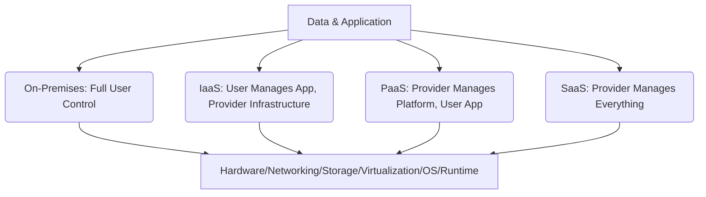

# Section 1: Explanation Of Cloud Services

<details open>
<summary><b>Section 1: Explanation Of Cloud Services (CL-KK-Terminal)</b></summary>

## Table of Contents
- [On-Premises Infrastructure Overview](#on-premises-infrastructure-overview)
- [Infrastructure as a Service (IaaS)](#infrastructure-as-a-service-iaas)
- [Platform as a Service (PaaS)](#platform-as-a-service-paas)
- [Software as a Service (SaaS)](#software-as-a-service-saas)
- [Comparison of Cloud Services](#comparison-of-cloud-services)
- [Summary](#summary)

## On-Premises Infrastructure Overview

### Overview
On-premises infrastructure refers to the traditional model where organizations manage their own IT resources within their physical premises. This encompasses complete control over hardware, software, and data, but requires full responsibility for maintenance, updates, and security. Understanding on-premises setups provides a foundation for appreciating how cloud services offload various layers of management.

### Key Concepts/Deep Dive
- **Networking Management**: Includes responsibility for equipment like switches, routers, firewalls, and internet connectivity.
- **Storage Solutions**: Need to purchase and maintain various storage types such as Network Access Storage (NAS), Network Attached Storage (NAS), or Storage Area Networks (SAN).
- **Server Management**: Acquisition and maintenance of physical servers (e.g., HP or Dell) or virtualized environments.
- **Virtualization Environment**: Management of platforms like VMware or Hyper-V for creating virtual machines.
- **Operating Systems**: Installation, updates, and security for OS like Windows Server or Linux.
- **Runtime and Middleware**: Handling dependencies for applications (e.g., Java Runtime Environment for Java apps or .NET Framework for .NET applications).
- **Data Management**: Encryption, backups, and overall data security and application management.

> [!IMPORTANT]
> In an on-premises setup, you're responsible for 100% of the infrastructure, which can lead to higher operational overhead but offers full control.

## Infrastructure as a Service (IaaS)

### Overview
Infrastructure as a Service (IaaS) provides virtualized computing resources over the internet, allowing users to rent infrastructure (like servers and storage) without managing the physical hardware. Cloud providers handle the underlying infrastructure, while users manage the OS and above layers.

### Key Concepts/Deep Dive
- **Shared Responsibilities**: Cloud provider manages physical infrastructure (networking, storage, servers, virtualization), while the user handles OS, middleware/runtime, data, and applications.
- **Examples**: Amazon EC2 (Elastic Compute Cloud) or Azure Virtual Machines.
- **Benefits**: Reduces management overhead by 50%, allowing focus on business logic rather than hardware maintenance.
- **Operational Responsibility**: User selects and installs the operating system (e.g., Linux or Windows) on the virtual instance.

💡 **Pro Tip**: IaaS is ideal for scenarios requiring custom OS configurations and full control over the application stack.

## Platform as a Service (PaaS)

### Overview
Platform as a Service (PaaS) offers a complete development and deployment environment in the cloud, abstracting much of the underlying infrastructure and platform layers. Users focus solely on their applications and data, with the cloud provider handling everything else.

### Key Concepts/Deep Dive
- **Shared Responsibilities**: Cloud provider manages OS, virtualization, servers, storage, networking, middleware, and runtime; user manages only data and applications.
- **Examples**: Amazon RDS (Relational Database Service) or Azure Database.
- **Benefits**: Significantly reduces responsibility (about 25% user-managed), enabling faster deployment and eliminating infrastructure concerns.
- **Usage**: No selection of OS is required, as the platform handles it automatically.

> [!NOTE]
> PaaS is perfect for developers who want to focus on application logic without worrying about OS or runtime environments.

## Software as a Service (SaaS)

### Overview
Software as a Service (SaaS) delivers fully functional applications over the internet via a subscription model. Users access the application through a web browser without needing to install or maintain any underlying software.

### Key Concepts/Deep Dive
- **Shared Responsibilities**: SaaS provider manages everything (infrastructure, platform, and application); user manages only their data via the application.
- **Examples**: Microsoft Office 365, where applications are accessed from anywhere via the internet.
- **Benefits**: Zero infrastructure management; highly convenient for multi-device access.
- **Dependencies and Risks**: Total reliance on the SaaS provider and internet connectivity. If the service goes down or internet fails, access is lost.

⚠ **Warning**: SaaS can lead to vendor lock-in, as you're dependent on the provider's roadmap and uptime.

## Comparison of Cloud Services

| Aspect | On-Premises | IaaS (50% User Responsibility) | PaaS (25% User Responsibility) | SaaS (0% User Responsibility) |
|--------|-------------|-------------------------------|-------------------------------|------------------------------|
| Networking | ✅ Managed by User | ❌ Managed by Provider | ❌ Managed by Provider | ❌ Managed by Provider |
| Storage | ✅ Managed by User | ❌ Managed by Provider | ❌ Managed by Provider | ❌ Managed by Provider |
| Servers | ✅ Managed by User | ❌ Managed by Provider | ❌ Managed by Provider | ❌ Managed by Provider |
| Virtualization | ✅ Managed by User | ❌ Managed by Provider | ❌ Managed by Provider | ❌ Managed by Provider |
| Operating System | ✅ Managed by User | ✅ Managed by User | ❌ Managed by Provider | ❌ Managed by Provider |
| Runtime/Middleware | ✅ Managed by User | ✅ Managed by User | ❌ Managed by Provider | ❌ Managed by Provider |
| Data/Application | ✅ Managed by User | ✅ Managed by User | ✅ Managed by User | ⚠ Dependent on Provider's Tools |



## Summary

### Key Takeaways
```diff
+ Progressive Abstraction: Cloud services reduce user responsibility layer by layer, from infrastructure to complete application management.
+ Strategic Choice: Choose based on control needs - IaaS for customization, PaaS for development efficiency, SaaS for ease and speed.
+ Cost vs. Control: On-premises offers full control but high maintenance; cloud shifts costs and complexity to providers.
- Dependency Trade-off: More convenience means more reliance on providers and internet connectivity.
! Security Focus: Regardless of service type, data encryption and compliance remain critical user responsibilities.
```

### Quick Reference
- **IaaS Example Command**: `aws ec2 run-instances --image-id ami-12345678 --instance-type t2.micro` (Creates an EC2 instance)
- **PaaS Example**: Configure RDS via AWS Console or CLI, focusing on instance class and storage options.
- **SaaS Access**: Log into Office 365 via browser - no installation required.

### Expert Insight

#### Real-World Application
In production environments, startups often begin with SaaS for rapid deployment (e.g., CRM tools), then migrate to PaaS for custom applications (e.g., web apps with databases), and scale to IaaS for HPC workloads. Enterprises use on-premises for sensitive data while hybridizing with IaaS for scalability during peak loads.

#### Expert Path
To master cloud services, start with hands-on experience: Launch an EC2 instance, deploy a PaaS database, and test a SaaS application like Office 365. Pursue certifications (AWS Certified Cloud Practitioner, Azure Fundamentals) and experiment with multi-cloud deployments to understand interoperability. Deepen knowledge in DevOps practices for IaC, ensuring you can program infrastructure changes.

#### Common Pitfalls
- **Overestimating Savings**: Ignoring data transfer costs or provider lock-in without evaluating exit strategies.
- **Underestimating Dependencies**: Assuming SaaS uptime guarantees - always have contingency plans for internet failures.
- **Security Oversights**: Thinking cloud providers handle all security; users still own data protection and compliance.
- **Poor Resource Sizing**: Selecting wrong instance types in IaaS leads to overpaying or performance issues.

</details>
