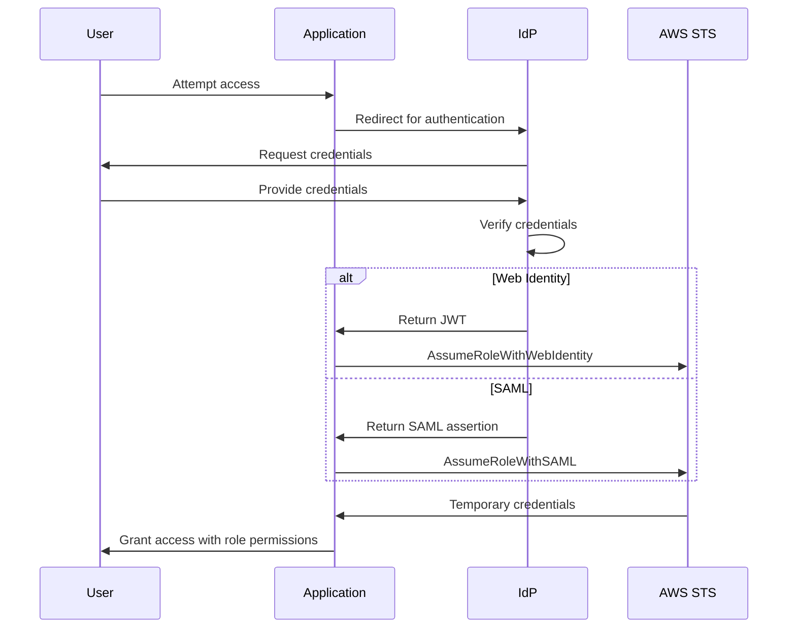

# Section 10.10: IAM Entities - IAM Roles Web Identity-SAML 2.0 Federation (Hands-On)

<details open>
<summary><b>Section 10.10: IAM Entities - IAM Roles Web Identity-SAML 2.0 Federation (Hands-On) (CL-KK-Terminal)</b></summary>

## Table of Contents
- [Overview](#overview)
- [IAM Roles Overview](#iam-roles-overview)
- [Identity Providers](#identity-providers)
- [Web Identity Federation](#web-identity-federation)
- [SAML 2.0 Federation](#saml-20-federation)
- [Authentication Flow](#authentication-flow)
- [Benefits and Use Cases](#benefits-and-use-cases)
- [Summary](#summary)

## Overview

IAM Roles for Web Identity and SAML 2.0 Federation provide mechanisms for secure, temporary access to AWS resources using external identity providers. This approach enables single sign-on experiences without creating individual IAM users for each person. Web Identity uses standards like OAuth 2.0 and OpenID Connect for social media authentication, while SAML 2.0 Federation supports enterprise environments with Active Directory.

These role use cases allow applications to assume roles based on successful authentication through third-party providers, granting temporary AWS credentials. The key benefit is scalability - organizations avoid managing thousands of IAM users directly in AWS.

## IAM Roles Overview

IAM roles are temporary permission sets that can be assumed by users or services. For Web Identity and SAML 2.0 Federation, roles provide secure access to AWS resources through external authentication.

### Role Creation Process
1. Navigate to AWS IAM Console
2. Select "Roles" from the dashboard
3. Choose "Web Identity" or "SAML 2.0 Federation" as trusted entity type
4. Configure identity provider and attach policies
5. Specify conditions for role assumption

### Key Components
- **Trusted Entity**: Specifies which external identities can assume the role
- **Permissions**: IAM policies defining what actions are allowed
- **Trust Policy**: Document defining who can assume the role under what conditions

## Identity Providers

Identity Providers (IDPs) are services that authenticate users and provide user information. They enable single sign-on experiences across multiple applications.

### Characteristics of IDPs
- Offer authentication services for proving user identity
- Support industry-standard protocols
- Enable seamless access across different platforms

### Types Supported in AWS
- **OAuth 2.0 and OpenID Connect**: For social media and public services
- **SAML 2.0**: For enterprise environments

## Web Identity Federation

Web Identity Federation uses OAuth 2.0 and OpenID Connect protocols for authentication through social media providers.

### How It Works
- Users authenticate through external providers (Google, Facebook, etc.)
- IDP issues JSON Web Tokens (JWT) containing user claims
- Application exchanges JWT for temporary AWS credentials
- User assumes IAM role based on successful authentication

### Protocols Used
- **OAuth 2.0**: Handles authorization, allowing applications to request access tokens
- **OpenID Connect**: Provides identity layer on top of OAuth for authentication services

### Implementation Steps
1. User attempts access to web application
2. Application redirects to identity provider
3. User provides credentials at IDP
4. Successful authentication issues JWT token
5. Application assumes web identity role
6. Temporary AWS credentials granted

### Example Use Case
```yaml
AssumeRoleWithWebIdentity:
  User authenticates with Google
  Application receives JWT
  StsAssumeRoleWithWebIdentity called
  AWS credentials issued for role with read-only S3 access
```

> [!NOTE]
> JWT tokens are JSON Web Tokens that contain user identity information and are validated by AWS Security Token Service (STS).

## SAML 2.0 Federation

SAML 2.0 Federation enables single sign-on for enterprise environments using Active Directory Federation Services (AD FS).

### Key Difference from Web Identity
- SAML uses XML-based assertions instead of JWT
- Designed for corporate SSO scenarios
- Supports integrations with enterprise identity systems

### SAML Process
- User authenticates with corporate Active Directory
- IDP generates SAML assertion containing user attributes
- Application/service provider consumes SAML response
- User assumes role with full AWS resource access
- No additional credentials required for multiple applications

### Use Cases
- Large enterprises with thousands of employees
- Centralized user authentication systems
- Single username/password access across all company applications

### Implementation Considerations
```xml
<SAMLResponse>
  <Assertion>
    <Subject>UserName@company.com</Subject>
    <Conditions>NotBefore="2024..." NotOnOrAfter="..."</Conditions>
  </Assertion>
</SAMLResponse>
```

> [!IMPORTANT]
> SAML 2.0 Federation is XML-based and relies on assertions containing user information, unlike the JSON tokens used in OAuth/OpenID Connect.

## Authentication Flow

The authentication flow for both Web Identity and SAML 2.0 follows similar patterns but with different protocols.

### Flow Diagram


### Steps in Detail
1. **User Login**: User attempts access with existing credentials (social or corporate)
2. **IDP Authentication**: Credentials verified against IDP's user database
3. **Token/Assertion Issue**: Successful authentication generates either JWT or SAML assertion
4. **Application Processing**: Application processes token/assertion
5. **Role Assumption**: STS issues temporary AWS credentials for the appropriate role
6. **Resource Access**: User gains access to AWS resources through assumed role permissions

## Benefits and Use Cases

### Key Advantages
- **Simplicity**: Single login experience using existing accounts
- **Security**: AWS credentials not stored on user devices
- **Scalability**: Handle millions of users without creating individual IAM users
- **Centralized Management**: Enterprise control over authentication standards

### Web Identity Benefits
- Enable social media users to access AWS resources
- Perfect for consumer-facing applications
- Leverages popular authentication providers

### SAML Federation Benefits
- Supports enterprise SSO initiatives
- Integrates with existing Active Directory infrastructure
- Enables consistent access across multiple applications

> [!TIP]
> Use Web Identity for consumer applications and SAML 2.0 for enterprise environments.

## Summary

### Key Takeaways
```diff
+ Web Identity uses OAuth 2.0/OpenID Connect with JWT tokens for social media authentication
+ SAML 2.0 Federation uses XML assertions for enterprise SSO scenarios
+ Both provide temporary AWS credentials without creating individual IAM users
+ Web Identity targets public services (Google, Facebook); SAML targets corporate environments (Active Directory)
+ Roles define permissions; trust policies specify who can assume them
+ Scalability is a major benefit - avoid managing millions of individual AWS accounts
```

### Quick Reference
| Protocol | Use Case | Token Type | IDP Examples |
|----------|----------|------------|-------------|
| OAuth 2.0 + OpenID Connect | Social media authentication | JSON Web Token (JWT) | Google, Facebook, Amazon |
| SAML 2.0 | Enterprise federation | XML Assertion | Active Directory Federation Services |
| AWS STS Operation | Web Identity | AssumeRoleWithWebIdentity | Social providers |
| AWS STS Operation | SAML | AssumeRoleWithSAML | AD FS |

### Expert Insight

**Real-world Application**: In production environments, Web Identity is commonly used for mobile apps where users authenticate via Facebook/Google and gain read access to shared S3 buckets. SAML Federation is deployed in enterprise scenarios where Active Directory users need role-based access to AWS resources without managing separate AWS accounts.

**Expert Path**: Master this by understanding the underlying protocols (OAuth flows, SAML assertions) and practicing with AWS SDKs. Focus on trust policy configurations and conditional role assumptions. For certification exams, memorize the differences between JWT and SAML implementations.

**Common Pitfalls**: 
- ❌ Mixing up JWT (JSON) vs SAML (XML) formats
- ❌ Creating unnecessary IAM users when roles suffice
- ❌ Not implementing proper trust policy conditions
- ❌ Forgetting that temporary credentials expire (typically 1 hour)
- ❌ Assuming all third-party authentication uses the same protocols

> [!WARNING]
> Ensure your trust policies include proper conditions to prevent unauthorized role assumptions, especially when dealing with external identity providers.

</details>
