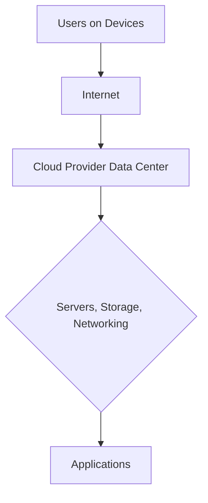
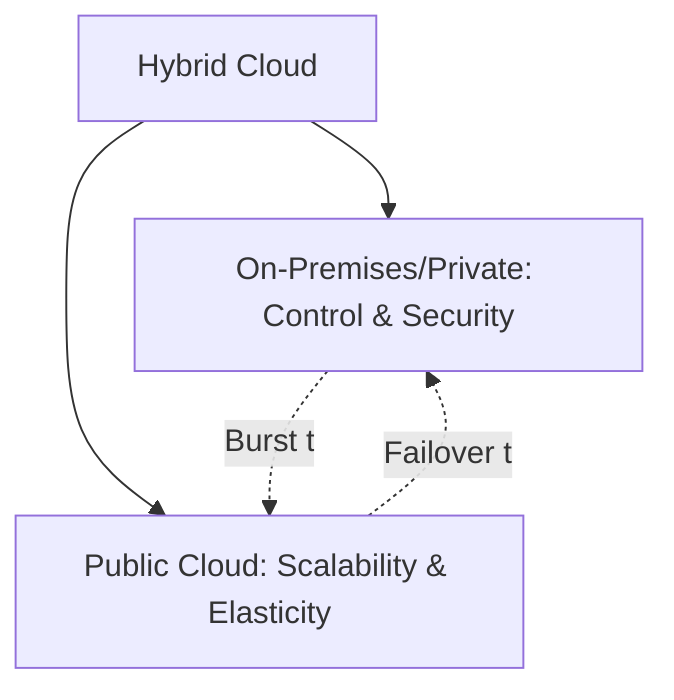
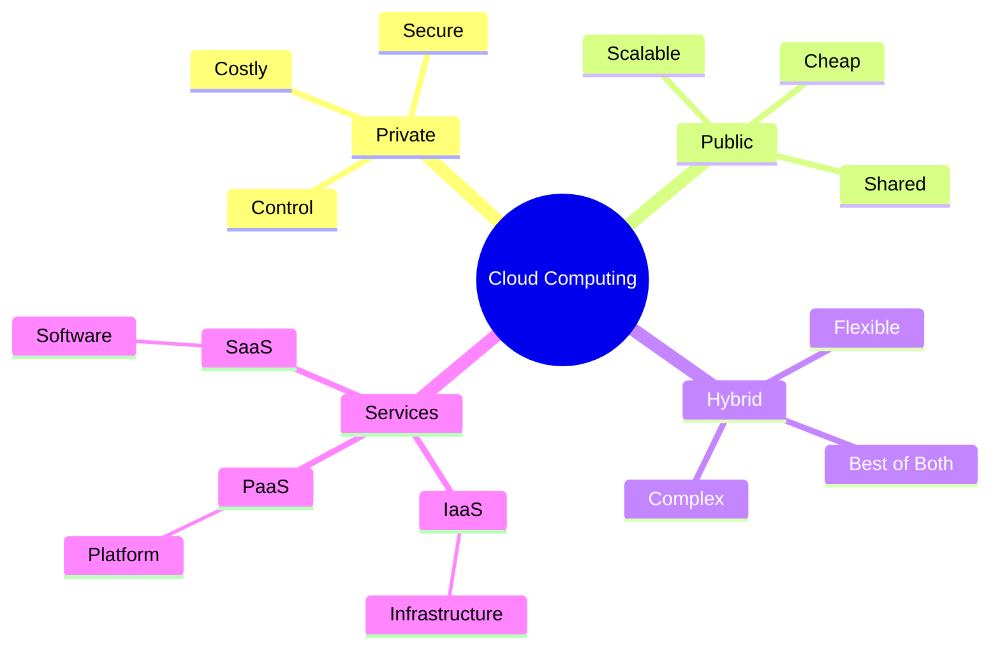

# Section 1: What Is Cloud

<details open>
<summary><b>Section 1: What Is Cloud (CL-KK-Terminal)</b></summary>

## Table of Contents
- [What Is Cloud](#what-is-cloud)
- [Cloud Computing: Benefits & Impact](#cloud-computing-benefits--impact)
- [Types Of Cloud](#types-of-cloud)
- [Explanation Of Cloud Services](#explanation-of-cloud-services)
- [Summary](#summary)

## What Is Cloud

### Overview
This module introduces the fundamental concept of cloud computing by explaining why modern businesses rely on applications and the challenges of running them. It compares traditional on-premises infrastructure to cloud-based solutions, highlighting how cloud service providers like AWS, Azure, and Google Cloud offer ready-to-use resources over the internet, enabling businesses to avoid massive upfront investments in data centers and achieve pay-as-you-go pricing.

### Key Concepts/Deep Dive

Cloud computing addresses the core challenge of running applications that power businesses like Zomato, Amazon, Ola, and Uber in the 21st century. These businesses depend entirely on their applications: if the app is down, revenue stops. Running such apps requires IT resources including servers for computing, databases for data storage, and networking for connectivity.

#### On-Premises Infrastructure Challenges
- **Centralized Management**: Applications run on servers in data centers owned by the business. Users access them from various devices (laptops, mobiles, tablets), but performance depends on server capacity.
  - Example: With 40 million Zomato users, inadequate capacity causes slowdowns. Amazon handles 256 million monthly visitors, requiring server clusters or multiple data centers.
- **Scalability Issues**: Adding users means manually increasing server capacity, which isn't feasible overnight. Building a small data center costs ₹1-2 crore, requiring investments in hardware (servers, routers, cooling), power, and time (months to years).
- **Maintenance Overhead**: Businesses handle electricity, manpower, security, and server lifecycle (decommissioning after 3-4 years).

#### Cloud Computing Solution
Cloud service providers (e.g., AWS, Azure, GCP) solve these by providing infrastructure as a service. You rent resources from their data centers via the internet, paying only for what you use (pay-as-you-go).

```diff
! Client Devices (laptops, mobiles) → Internet → Cloud Provider Data Center → Servers/Apps
```

- **Triple-A Model**:
  - **Anytime**: 24/7 access.
  - **Anywhere**: Global reach via internet.
  - **Any Device**: Browser or app access.
- **Definition**: Cloud computing is the on-demand delivery of IT resources (compute, storage, networking) over the internet with pay-as-you-go pricing. No guessing capacity; scale up/down as needed.
- **Startups & Adoption**: Startups use cloud to launch quickly without building data centers. Startups can deploy apps in minutes instead of waiting years.

#### Visual Diagram


*Figure 1: Basic cloud architecture showing user access to cloud-hosted applications.*



This foundational understanding sets the stage for deeper dives into benefits and types in the following modules.

> [!NOTE]
> Cloud eliminates the need for physical data centers, but requires reliable internet connectivity for access.

## Cloud Computing: Benefits & Impact

### Overview
Building on the basics, this module details six key advantages of cloud computing, explaining how it transforms business economics from capital-intensive models to flexible, scalable operations. It contrasts traditional IT spending with cloud's operational model, emphasizing cost savings, scalability, and speed.

### Key Concepts/Deep Dive

Cloud computing offers six major benefits over on-premises setups, applicable across providers like AWS, Azure, and GCP.

#### 1. Trade Fixed Expenses for Variable Expenses
- **CapEx vs. OpEx**:
  - **Capital Expenditure (CapEx)**: Upfront costs for building data centers (e.g., purchasing servers, routers, cooling – ₹1-2 crore+), plus ongoing but variable operational costs (electricity, maintenance, manpower).
  - **Cloud Shift**: Eliminate CapEx; pay only for used resources as OpEx to the provider. Analogous to renting instead of buying a car: fixed cost becomes monthly variable payments.
- **Impact**: Startups avoid huge initial investments. Businesses pay proportional to usage, reducing financial risk.

```diff
+ Elimination of massive upfront investments
- Ongoing OpEx remains, but more predictable per usage
! Savings: Zero CapEx for core infrastructure
```

#### 2. Benefit from Massive Economies of Scale
- Providers like AWS host 50-60,000 servers per data center, negotiating bulk discounts on hardware (e.g., from Cisco). They pass savings to customers through lower prices.
- **Example**: AWS prices decrease over time as user base grows, enabling cheaper service for everyone. Individual businesses can't replicate this without billionaire-level investment.

#### 3. Stop Guessing Capacity
- **Scalability Challenge**: Startups guess infrastructure needs but can't scale instantly. Overnight success (e.g., Elon Musk tweet) can overwhelm servers.
- **Cloud Solution**: Start small, scale up/down with mouse clicks. Pay only for actual usage (e.g., 1GB storage costs only for 1GB).
- **Pay-as-You-Go**: Infinite capacity available; adjust to user demand without over-provisioning. Perfect for unpredictable growth.

```diff
+ Instant scaling matches user spikes/crashes
- No wasted idle resources during downturns
```

#### 4. Increase Speed and Agility
- **On-Premises Delays**: Server delivery takes 15 days; full data center build takes 6-12 months with upfront costs.
- **Cloud Speed**: Provision resources in minutes via web console. Launch apps in 5-10 minutes, turning ideas into reality faster.
- **Impact**: Accelerates innovation; no waiting periods block product launches.

#### 5. Stop Spending Money on Running and Maintaining Data Centers
- **Outsourced Responsibilities**: Provider handles hardware lifecycle, security, decommissioning, rent – focus on business.
- **Comparison**: OpEx is similar, but no in-house teams or capital for facilities. Work from anywhere, anytime.

#### 6. Go Global in Minutes
- Deploy to any region worldwide (e.g., US infrastructure from India) without physical presence. AWS's global regions enable instant global reach.
- **Limitations of On-Premises**: Hard to manage remote data centers; cloud abstracts this.

These benefits make cloud ideal for startups and scale-ups, enabling rapid global deployment without infrastructure headaches.

> [!IMPORTANT]
> Cloud's pay-as-you-go model particularly benefits unpredictable businesses, while maintaining similar OpEx to on-premises.

## Types Of Cloud

### Overview
This module differentiates cloud deployment models: private, public, and hybrid. It explains why businesses choose each and provides real-world examples, showing how hybrid often combines the best of both for security, cost, and scalability.

### Key Concepts/Deep Dive

Clouds are deployed in three types, each serving different needs based on control, cost, and management preferences.

#### 1. Private Cloud
- **Definition**: Cloud infrastructure dedicated to one organization, built on-premises but with cloud's triple-A features (anytime, anywhere, any device).
- **Advantages**:
  - **Total Control**: Choose hardware, security, and compliance. Ideal for government or highly sensitive data.
- **Disadvantages**:
  - **High Cost**: Capital expenditure for build ($1-2 crore+); manpower for management.
  - **Scalability Limits**: Harder to scale than public cloud.
- **Use Cases**: Financial institutions, defense – where data sovereignty is critical.

#### 2. Public Cloud
- **Definition**: Infrastructure provided by third-party providers (AWS, Azure, GCP) over the internet. Users share provider-owned data centers.
- **Advantages**:
  - **No CapEx**: Zero upfront investment; easy deployment.
  - **Scalability**: Elastic resources; infinite capacity.
- **Disadvantages**:
  - **Less Control**: No access to underlying hardware; provider manages everything.
- **Use Cases**: Startups, general businesses – fast, low-cost scaling.

#### 3. Hybrid Cloud
- **Definition**: Combination of on-premises/private cloud with public cloud. Connects both for unified management.
- **Advantages** (Best of Both):
  - **Control + Scalability**: Keep sensitive data private; burst to public cloud for peaks.
  - **Cost Efficiency**: Pay for public only when needed.
- **Disadvantages**: Complexity in integration and connectivity.
- **Real-World Examples**:
  - **Storage Vendor**: Keep 10GB frequently used data on-premises; archive 10TB to AWS S3. Saves CapEx on new storage.
  - **University Results Site**: Host on-premises for normal 360 days; burst to cloud for 5 high-traffic result days. Handles spikes without over-provisioning.
  - **Disaster Recovery (DR)**: Run primary on-premises; backup/failover to public cloud (e.g., AWS). Stocks exchanges, banks comply with RBI rules. Avoids $15 crore redundant standby sites; pay only during failover.



> [!NOTE]
> Hybrid is popular for balancing security with cloud benefits, especially for regulated industries.

## Explanation Of Cloud Services

### Overview
This module breaks down cloud service models (IaaS, PaaS, SaaS) by responsibility levels, comparing them to on-premises. It layers services from full infrastructure control to hands-off software delivery, preparing you for practical AWS implementations like EC2 and RDS.

### Key Concepts/Deep Dive

Cloud services are categorized by how much infrastructure you manage. On-premises means full control (networking, storage, servers, virtualization, OS, middleware, data, apps). Cloud shifts responsibilities to providers.

#### 1. Infrastructure as a Service (IaaS)
- **Responsibility Split**: Provider manages physical/hardware; you manage OS, middleware, runtime, data, apps.
- **Examples**: AWS EC2 (Elastic Compute Cloud), Azure VMs.
- **Management Shift**:
  - Provider: Networking, storage, servers, virtualization.
  - You: OS (e.g., choose Linux/Windows), middleware (e.g., Java runtime), security updates, backups, app deployment.
- **Benefits**: 50% less management; focus on business. Pay per instance usage.
- **When to Use**: Custom applications needing specific OS/runtime control.

```diff
+ ~50% management load off shoulders
- Still handle OS and app layers
! Example: Deploy Ubuntu server on EC2; install Java manually
```

#### 2. Platform as a Service (PaaS)
- **Responsibility Split**: Provider manages up to OS; you manage data and apps.
- **Examples**: AWS RDS (Relational Database Service), Azure SQL Database.
- **Management Shift**:
  - Provider: Networking, storage, servers, virtualization, OS.
  - You: Only data and application logic (e.g., deploy app without configuring servers).
- **Benefits**: ~75% less management; handles scaling, patching. No OS selection (provider chooses optimal).
- **When to Use**: Database-heavy apps; rapid app development without infrastructure worries.

#### 3. Software as a Service (SaaS)
- **Responsibility Split**: Provider manages everything; you just use the app.
- **Examples**: Office 365, Gmail, Salesforce.
- **Management Shift**:
  - Provider: Hardware, networking, OS, middleware, data storage/encryption/backups, app.
  - You: Access via browser/device; zero technical management.
- **Benefits**: Fully hands-off; subscribe and use. Ideal for non-technical users.
- **Disadvantages**: Total dependence on provider and internet; no customization.
- **When to Use**: Ready-made tools like email, CRM.

#### Comparison Table

| Aspect          | On-Premises          | IaaS                  | PaaS                  | SaaS                  |
|-----------------|----------------------|-----------------------|-----------------------|-----------------------|
| Networking     | You manage           | Provider manages      | Provider manages      | Provider manages      |
| Storage        | You manage           | Provider manages      | Provider manages      | Provider manages      |
| Servers        | You manage           | Provider manages      | Provider manages      | Provider manages      |
| Virtualization | You manage           | Provider manages      | Provider manages      | Provider manages      |
| OS             | You manage           | You manage            | Provider manages      | Provider manages      |
| Middleware/Runtime | You manage      | You manage (install runtime) | Provider manages | Provider manages      |
| Data/App       | You manage           | You manage            | You manage            | Provider manages      |
| Cost Model     | CapEx + OpEx         | Pay per use           | Pay per use           | Subscription          |

> [!IMPORTANT]
> SaaS trades control for convenience; IaaS for platform flexibility. Real-world: Most businesses mix for optimal workloads.

## Summary

> [!IMPORTANT]
> Cloud computing revolutionizes IT by providing on-demand, scalable resources over the internet, eliminating upfront infrastructure costs through a pay-as-you-go model. Businesses like Zomato and Amazon rely on apps running on shared global infrastructure, accessed anytime, anywhere from any device.

### Key Takeaways
- **Cloud Basics**: Solves on-premises challenges (e.g., scalability, cost); providers like AWS offer infinite capacity without CapEx.
- **Six Benefits**: Cost shift (OpEx over CapEx), scale efficiency, accurate capacity planning, deployment speed, maintenance outsourcing, global reach.
- **Three Types**: Private (full control), Public (no CapEx), Hybrid (best mix for control + scale).
- **Service Models**: IaaS (50% you manage), PaaS (25% you manage), SaaS (0% you manage) – choose based on control needs.
- **Economic Impact**: Startups deploy apps in minutes, not months; variable costs protect against under/over-provisioning.

<!-- Mermaid diagram for cloud models overview -->


### Quick Reference
- **Triple-A**: Anytime, Anywhere, Any Device.
- **Pay-as-You-Go**: Usage-based billing (e.g., EC2 per hour).
- **Global Regions**: Deploy anywhere via provider APIs (e.g., AWS CLI).
- **Scaling**: Elasticity – auto-adjust capacity.

### Expert Insight
#### Real-World Application
In startups, cloud enables MVP launches on AWS EC2 in days, scaling to millions of users via auto-scaling. Enterprises use hybrid for secure data (on-prem) and elastic workloads (public), like video streaming during events.

#### Expert Path
Master AWS basics by practicing EC2 deployments and RDS setups. Focus on security (e.g., IAM), cost optimization (e.g., reserved instances), and multi-region architectures for high availability.

#### Common Pitfalls
- Over-deploying resources without monitoring leads to high bills.
- Ignoring provider-specific tools (e.g., AWS CloudFormation) complicates manual setups.
- Assuming public cloud security matches private without encryption/tools like AWS KMS.

#### Lesser-Known Facts
- Clouds can be multi-cloud (mix providers) for vendor lock-in avoidance.
- Serverless (e.g., AWS Lambda) extends IaaS further, auto-managing even runtime scaling.

</details>
