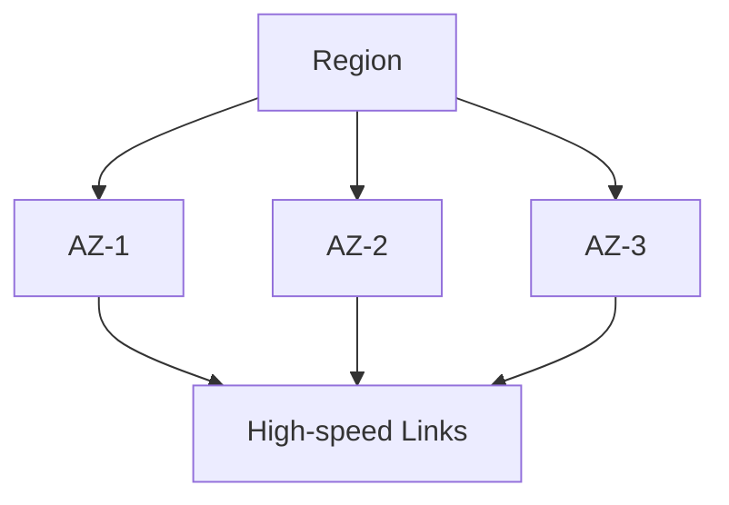
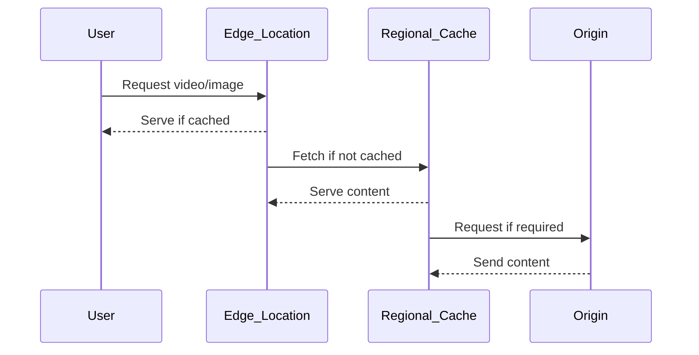

<details open>
<summary><b>Section 2: AWS Getting Started (CL-KK-Terminal)</b></summary>

# Section 2: AWS Getting Started

## Table of Contents
- [2.1 Getting Started with AWS](#21-getting-started-with-aws)
- [2.2 How To Create AWS Free Tier Account](#22-how-to-create-aws-free-tier-account)
- [2.3 AWS Account Budget Setting](#23-aws-account-budget-setting)
- [2.4 Introduction Of AWS Management Console](#24-introduction-of-aws-management-console)
- [2.5 AWS Global Infrastructure Part 1](#25-aws-global-infrastructure-part-1)
- [2.6 AWS Global Infrastructure Part 2](#26-aws-global-infrastructure-part-2)
- [2.7 AWS Global Infrastructure Part 3](#27-aws-global-infrastructure-part-3)
- [Summary](#summary)

## 2.1 Getting Started with AWS

### Overview
This module introduces AWS as a cloud computing platform, covering its history, market position as a leader among cloud providers like Microsoft Azure and Google Cloud Platform, and its extensive service offerings. AWS revolutionized cloud computing with its launch in 2006, initially offering Simple Storage Service (S3), followed by key services like EC2. We'll explore how companies leverage AWS for hosting applications and explore the platform's journey, including regional expansions like the Mumbai and Hyderabad regions.

### Key Concepts

#### AWS History and Milestones
- Launched officially in 2006, marking the beginning of widespread cloud computing adoption
- First major service: Amazon Simple Storage Service (S3) for cloud storage
- Introduced Elastic Compute Cloud (EC2) in 2006, providing virtual servers in the cloud
- Regional expansion: Launched first Asia-Pacific region in Mumbai (2016) and Hyderabad region (November 2022)
- Currently operates two regions in India catering to businesses requiring local data residency

#### AWS as Market Leader
- Holds 33% global market share as per Gartner Magic Quadrant's Top Three leaders
- Provides over 200 services compared to competitors' offerings
- Reasons for leadership position:
  - Vast service ecosystem covering compute, storage, networking, AI/ML, analytics, and more
  - Continuous innovation and feature releases
  - Global infrastructure presence
  - Dominant market share and adoption by enterprises worldwide

#### AWS Services Overview
- Compute services for running virtual servers and applications
- Storage solutions for scalable data management
- Networking components for connecting resources
- Managed databases and data analytics services
- AI/ML tools and application integration services
- Everything needed to build, deploy, and manage modern applications

#### Practical Learning Approach
- Hands-on labs remain within free tier limits
- Resources must be properly deleted after use to avoid charges
- Focus on understanding core concepts while gaining practical experience

### Lab Concepts Covered
- Account setup and navigation
- Basic service understanding
- Cost management fundamentals

## 2.2 How To Create AWS Free Tier Account

### Overview
This module walks through the step-by-step process of creating an AWS Free Tier account, covering essential prerequisites like valid credit/debit cards with international transaction capabilities, email verification, and account setup. We'll emphasize staying within free tier limits, setting up budget alerts, and understanding the verification process including temporary ₹2 charges for card validation.

### Key Concepts

#### Prerequisites for Account Creation
- Valid email account (Gmail, Yahoo, etc.)
- Credit or debit card with international transaction enabled
  - Supported cards: Visa, MasterCard, American Express
  - Indian Rupee cards not acceptable
  - Must support overseas transactions
- Mobile phone for verification SMS
- Ability to enable international transactions via mobile banking apps

#### Free Tier Limitations Awareness
- 12-month duration for free tier eligibility
- Specific limits for services:
  - EC2: 750 hours per month
  - S3: 5 GB storage
  - RDS: 750 hours
  - Many other services with defined free usage thresholds
- Always delete resources after use to avoid crossing limits
- Free tier doesn't automatically become paid tier - charges apply when limits exceeded

#### Account Creation Process
- Visit aws.amazon.com/free → Create Free Account
- Enter email address and AWS account name
- Verify email through confirmation link
- Set root user password (complex: uppercase, lowercase, numbers, special characters)
- Enter personal/business details:
  - Full name, address, city, state, postal code
  - Phone number and country selection
- Agree to terms and click continue

#### Payment Verification and Support Selection
- Enter credit/debit card details for verification
- Temporary ₹2 charge for 1-2 day validation (refunded automatically)
- Optional PIN verification for added security
- Select support plan:
  - Basic Support: Free, email-based support only
  - Developer Support: $29/month
  - Business Support: $100/month
- Complete sign-up and verify account activation email

#### Post-Account Creation Steps
- Sign in using email and password
- AWS account ready for practical exercises
- Always delete resources after completing labs

> [!IMPORTANT]
> Card verification charge will be automatically refunded within 1-2 business days. Never exceed free tier limits to avoid unexpected charges.

## 2.3 AWS Account Budget Setting

### Overview
AWS Account Budget Setting demonstrates how to configure cost alerts to prevent accidental charges beyond free tier limits. By setting up zero-spend budget alerts and billing preferences, you'll receive immediate email notifications when spending reaches even minimal amounts like $0.01 USD, ensuring you can quickly investigate and delete chargeable resources.

### Key Concepts

#### Budget Setting Importance
- Accidental resource creation beyond free tier limits
- Immediate email alerts when spending exceeds $0.01 USD
- Proactive cost management to prevent unexpected bills
- AWS won't automatically delete resources - customer responsibility

#### Configuring Billing Alerts
- Log into AWS Management Console
- Go to Account dropdown → Billing Dashboard → Billing Preferences
- Edit Alert Preferences → Enable "Receive AWS Free Tier Alerts"
- Email address auto-populated or manually add multiple addresses

#### Creating Zero-Spend Budget
- From Billing Dashboard → Budgets → Create Budget
- Use Template → Zero Spend Budget
- Alert when spending > $0.01 USD (above free tier limits)
- Applies to all AWS services globally
- Multiple email addresses for notifications
- Budget creation confirmation via email

#### Best Practices
- Check budget status periodically (Green OK indicator = no alerts)
- Respond immediately to notification emails
- Delete identified resources immediately to stop charges
- Contact support if unable to resolve billing issues
- Regular monitoring prevents cost accumulation

> [!WARNING]
> Budget alerts are informational only - AWS will not stop or delete running resources. Manual intervention required when alerts are triggered.

## 2.4 Introduction Of AWS Management Console

### Overview
The AWS Management Console serves as the primary graphical user interface for managing AWS resources, providing intuitive dashboards for different services categorized by function. This module covers console navigation, service organization, billing verification, and understanding global vs. regional service deployment concepts through the console interface.

### Key Concepts

#### Console Interface Overview
- First screen shows recently visited services
- Service health dashboard for infrastructure status
- Cost breakdown and billing information
- Categorized service menu (Compute, Storage, Networking, etc.)

#### Service Organization Categories
- **Compute**: EC2, Lambda, ECS, etc.
- **Storage**: S3, EBS, Glacier, etc.
- **Database**: RDS, DynamoDB, etc.
- **Networking & Content Delivery**: VPC, CloudFront, Route 53, etc.
- **Analytics**: Redshift, EMR, etc.
- **Application Integration**: SQS, SNS, EventBridge, etc.

#### Console Navigation Elements
- Global search bar for service discovery
- Account menu showing billing dashboard, security credentials, users
- Region selector in top-right corner
- Context-aware help and documentation links

#### Regional Services vs. Global Services
- **Regional Services**: Deployed in specific geographic regions (US East, AP South, etc.)
  - Resources isolated to chosen region
  - Examples: EC2 instances, S3 buckets, RDS databases
- **Global Services**: Available across all regions
  - Identity and Access Management (IAM) shown as global
  - Route 53 DNS, CloudFront CDN, WAF

#### Account Management Features
- Verify billing and cost information
- Access programmatic access keys for CLI/API use
- Account ID visibility (unique 12-digit identifier)
- Multi-account management options

#### Alternative Management Methods
- Command Line Interface (CLI) for scripting and automation
- AWS CloudShell for browser-based command line access
- Programmatic access via SDKs and APIs

> [!NOTE]
> Always verify service type (regional/global) when deploying resources. Most AWS services are region-specific for compliance and performance optimization.

## 2.5 AWS Global Infrastructure Part 1

### Overview
AWS Global Infrastructure demonstrates how Amazon strategically distributes data centers worldwide to minimize latency, ensure compliance with local data regulations, and provide high availability through Regions, Availability Zones, and Local Zones. Understanding this physical architecture is crucial for optimizing application performance and meeting regulatory requirements.

### Key Concepts

#### Core Infrastructure Components
- **Regions**: Geographic boundaries hosting AWS services
- **Availability Zones (AZs)**: Discrete data centers within regions
- **Local Zones**: Data centers outside traditional regions

#### Regions Explained
- Geographic locations containing multiple data centers
- Provide low-latency access for local users
- Enable compliance with data sovereignty laws
- Separate logical boundaries - data doesn't automatically cross regions

| Aspect | Description |
|--------|-------------|
| Purpose | Low latency access, regulatory compliance |
| Geography | 32+ regions worldwide |
| Data Isolation | No automatic data movement between regions |
| Use Case | Host applications where users are located |

#### Availability Zones (AZs)
- Individual data centers within regions
- Typically 3+ AZs per region (India's AP-South-1 has 3)
- Connected via high-speed, low-latency fiber optics (<1ms latency)
- Independent infrastructure (power, cooling, networking)
- Isolated from each other to prevent single-point failures

#### High Availability Pattern


#### Local Zones Implementation
- Data centers outside traditional regions
- Extend AWS infrastructure to metropolitan areas
- Reduce latency for local user populations
- Example: Delhi Local Zone serves users beyond Mumbai region coverage

> [!IMPORTANT]
> Deploy across multiple AZs for production workloads requiring 99.99% uptime. Local Zones complement regions for ultra-low latency requirements.

## 2.6 AWS Global Infrastructure Part 2

### Overview
Extending the global infrastructure discussion, this module introduces AWS Wavelength for 5G edge computing and AWS Outposts for hybrid cloud deployment. These specialized infrastructure options enable deploying AWS services closer to users via telecom infrastructures and bring AWS management capabilities to on-premises data centers.

### Key Concepts

#### AWS Wavelength
- Designed for ultra-low latency 5G applications
- Deploys AWS compute and storage at 5G infrastructure edge
- Enables data processing within 5G network boundaries
- Prevents data travel between 5G and traditional wired networks

**Use Cases:**
- Mobile-first applications requiring instant response
- AR/VR gaming and immersive experiences
- Industrial IoT sensor data processing
- Autonomous vehicle real-time decision making

#### AWS Outposts
- Brings AWS infrastructure to on-premises locations
- Delivered as racks of AWS-compatible hardware
- Managed through AWS Console (unified management)
- Suitable for hybrid cloud architectures

**Benefits:**
- Single pane of glass management for on-premises and cloud resources
- Consistent AWS APIs and services
- No need for separate infrastructure expertise
- Ideal for organizations with existing data center investments

#### Comparison Table

| Feature | Wavelength | Outposts |
|---------|------------|----------|
| Location | Telco 5G edges | On-premises |
| Network | 5G infrastructure | Customer's network |
| Management | AWS Console | AWS Console |
| Use Case | Edge mobile applications | Hybrid cloud |

> [!NOTE]
> Wavelength optimizes for 5G connectivity while Outposts extends cloud management to existing infrastructure, both solving specialized deployment challenges.

## 2.7 AWS Global Infrastructure Part 3

### Overview
Content Delivery Networks (CDN) and edge locations form the final piece of AWS global infrastructure, enabling global content distribution with minimal latency through CloudFront's edge network and regional edge caches. Understanding these components reveals how AWS accelerates content delivery worldwide, particularly for static assets like videos, images, and web content.

### Key Concepts

#### Content Delivery Network Fundamentals
- Caches static content closer to end users
- Reduces latency for global audiences
- Origin servers host primary content
- Multiple caching layers optimize performance

#### Traditional CDN Challenges
- High costs for small businesses
- Complex ISP partnerships
- Limited geographic coverage

#### AWS Edge Locations
- Over 350+ edge locations worldwide
- Cache static content from regional origins
- Enable global content distribution without complex infrastructure
- Deploy anywhere with AWS infrastructure presence

#### Content Delivery Flow


#### Regional Edge Caches
- Intermediate caching layer between edges and origins
- Fewer locations (13+) serve multiple edge locations
- Higher capacity than individual edge locations
- Reduce load on origin servers
- Cache maximum content from origins
- Support for large-scale content distribution

#### Benefits for Businesses
- Cost-effective global content delivery
- No ISP partnerships required
- Leverages AWS infrastructure footprint
- Scales automatically
- Improves user experience with reduced latency

> [!TIP]
> Use CloudFront service to configure edge location caching. Regional edge caches minimize origin requests while maintaining global performance.

## Summary

### Key Takeaways
```diff
+ AWS is the market leader with 33% share and 200+ services, providing everything needed to host modern applications
+ Create free tier accounts using international-enabled cards - remember temporary ₹2 validation charges
+ Always set zero-spend budget alerts to prevent accidental charges beyond $0.01 USD
+ Use AWS Management Console for intuitive GUI management, understand regional vs global services
+ AWS Global Infrastructure includes Regions for low latency, AZs for high availability, Local Zones for metro coverage
+ Wavelength enables 5G edge computing while Outposts extends AWS management to on-premises
+ Edge locations and regional edge caches form a global CDN for content distribution
```

### Quick Reference
- **Free Tier Limits**: EC2 750hrs, S3 5GB, RDS 750hrs
- **Budget Setup**: Zero-spend budget, multiple email alerts
- **Regions**: 32+ global locations, data stays within region boundaries
- **AZs**: 3+ per region, <1ms latency connections
- **Local Zones**: Extend reach beyond traditionnel regions
- **Edge Locations**: 350+ points globally for content caching

### Expert Insight

**Real-world Application**
In production environments, businesses deploy applications across multiple availability zones for 99.99% uptime, using AWS Shield for DDoS protection and CloudFront for global content distribution. Multi-region architectures use Aurora Global Database for cross-region replication, while Australian businesses leverage Melbourne region for compliance with local data residency laws.

**Expert Path**
Master AWS infrastructure by earning AWS Certified Cloud Practitioner certification first, then progress to Solutions Architect Associate. Practice architecting solutions with Well-Architected Framework principles - operate, perform, secure, reliable, cost-optimize. Understand service integrations deeply through hands-on labs.

**Common Pitfalls**
- Deploying all resources in single availability zone, risking complete outage during zone failures
- Ignoring data residency requirements, leading to compliance violations
- Not monitoring costs with budgets, resulting in unexpected bills
- Assuming regional data movement (remember: regions are isolated boundaries)
- Forgetting to configure budget alerts before creating paid resources

**Lesser-Known Facts**
AWS maintains secret regions for government customers with enhanced security clearances. Each availability zone actually consists of multiple physical buildings separated by earthquake-proof concrete barriers, and AWS co-locates many edge locations within major telco facilities worldwide to reduce operational costs while maintaining vast geographic coverage.

</details>
