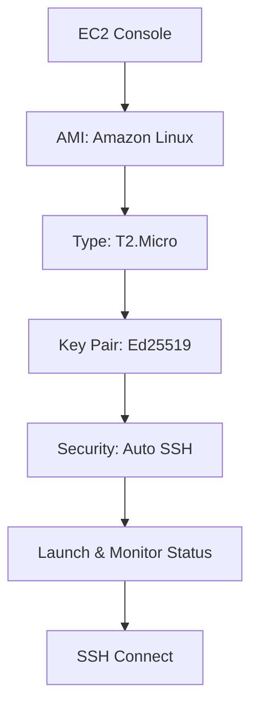
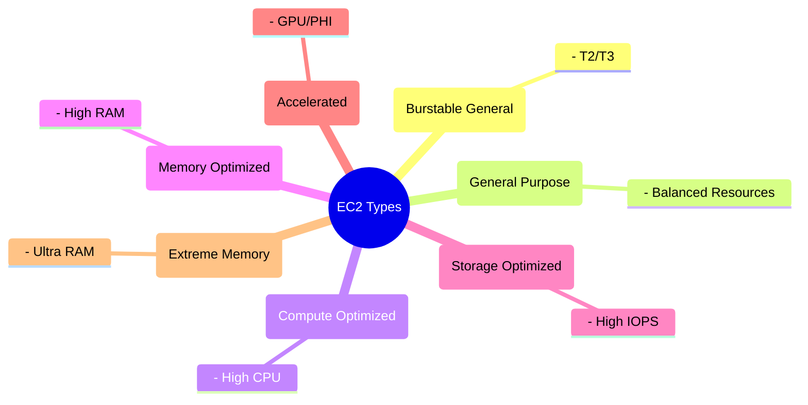
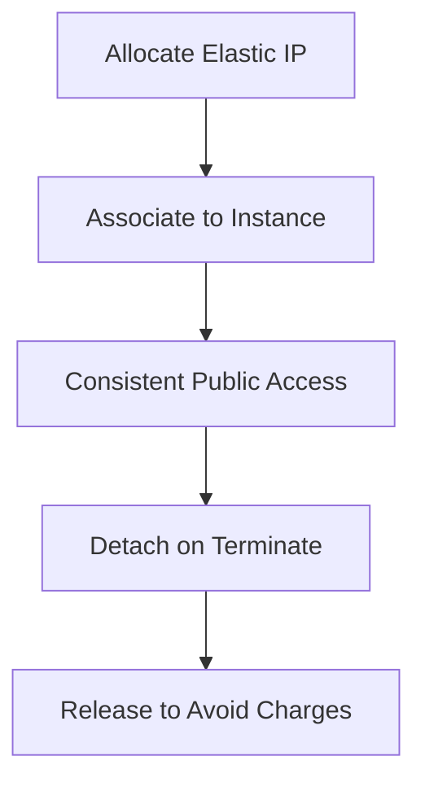
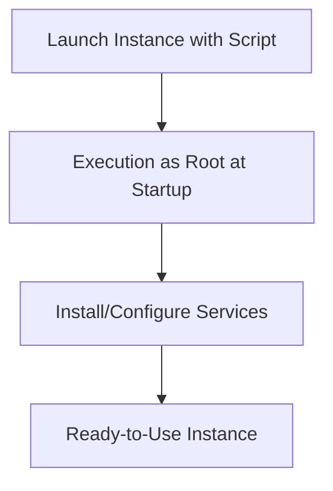
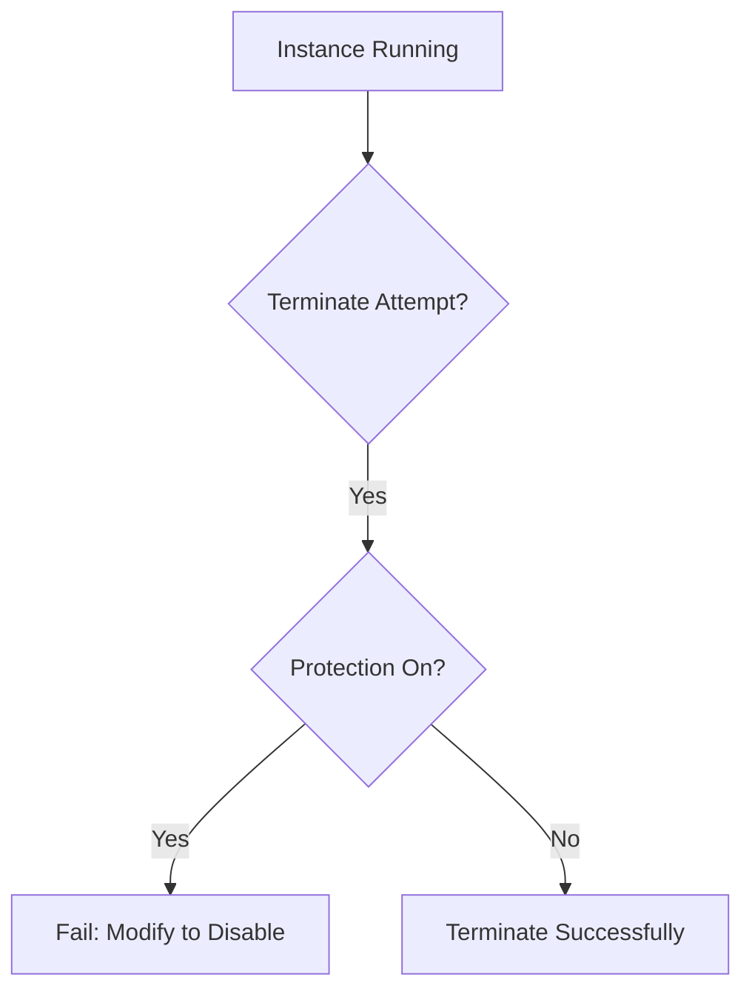
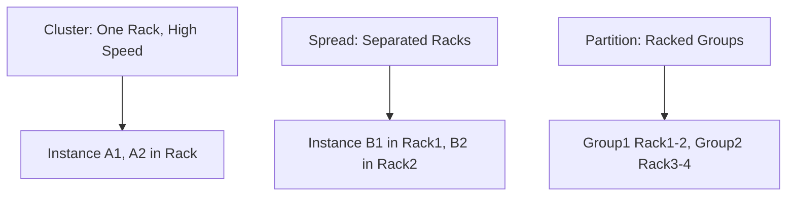
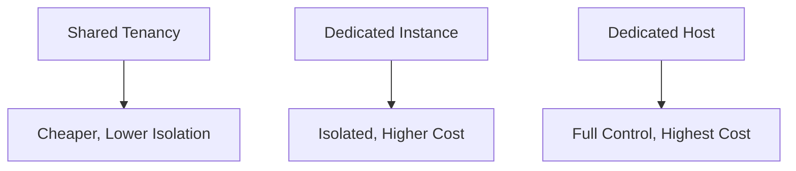

# Section 3: Elastic Compute Cloud (EC2)

<details open>
<summary><b>Section 3: Elastic Compute Cloud (EC2) (CL-KK-Terminal)</b></summary>

## Table of Contents
- [3.1 Introduction - Elastic Compute Cloud (EC2)](#31-introduction---elastic-compute-cloud-ec2)
- [3.2 Create Windows EC2 Instance (Hands-On)](#32-create-windows-ec2-instance-hands-on)
- [3.3 Create EC2 Linux Instance Using Windows 10 (Hand-On)](#33-create-ec2-linux-instance-using-windows-10-hand-on)
- [3.4 Create EC2 Linux Instance Using Windows 7 & 8 Hands-On)](#34-create-ec2-linux-instance-using-windows-7--8-hands-on)
- [3.5 Amazon Machine Image (AMI)](#35-amazon-machine-image-ami)
- [3.6 Customize Amazon Machine Image (AMI) (Hands-On)](#36-customize-amazon-machine-image-ami-hands-on)
- [3.7 EC2 Instance Type](#37-ec2-instance-type)
- [3.8 Multi - AZ](#38-multi---az)
- [3.9 Public Private IP](#39-public-private-ip)
- [3.10 Elastic IP](#310-elastic-ip)
- [3.11 Security Group Part 1](#311-security-group-part-1)
- [3.12 Security Group Part 2](#312-security-group-part-2)
- [3.13 Security Group Part 3](#313-security-group-part-3)
- [3.14 Security Group (Hands-On)](#314-security-group-hands-on)
- [3.15 User Data Script](#315-user-data-script)
- [3.16 Termination Protection](#316-termination-protection)
- [3.17 EC2 Instance Placement Group](#317-ec2-instance-placement-group)
- [3.18 AWS Tenancy](#318-aws-tenancy)
- [3.19 EC2 Instance Purchase Options Part 1](#319-ec2-instance-purchase-options-part-1)
- [3.20 EC2 Instance Purchase Options Part 2](#320-ec2-instance-purchase-options-part-2)
- [3.21 EC2 Instance Purchase Options Part 3](#321-ec2-instance-purchase-options-part-3)
- [3.22 AWS Pricing Calculator](#322-aws-pricing-calculator)
- [3.23 AWS Command Line Interface (CLI) (Hands-On)](#323-aws-command-line-interface-cli-hands-on)

## 3.1 Introduction - Elastic Compute Cloud (EC2)
### Overview
Elastic Compute Cloud (EC2) is Amazon Web Services' foundational compute service, providing secure, resizable compute capacity in the cloud. This module introduces EC2 as a virtualization platform for creating and managing virtual machines (instances), abstracting away underlying infrastructure while offering flexibility for various workloads.

EC2 enables users to launch virtual servers quickly without investing in physical hardware, supporting diverse operating systems and application stacks.

### Key Concepts/Deep Dive
#### Virtualization and EC2 Fundamentals
- **Virtual Machines (VMs)**: VMs run on physical hosts managed by AWS, allowing multiple operating systems on a single machine using hypervisors like VMware ESXi or Microsoft Hyper-V.
  - Physical machines house VMs; EC2 launches VMs as instances.
  - AWS manages hosts, CPU, RAM—users focus on installing OS and applications.
- **Host vs. Guest**: Physical server is the "host"; virtual instances are "guests."
- **EC2 Components**:
  - **Instances**: Virtual servers (e.g., t2.micro, m5.large).
  - **AMI**: Pre-configured template for launching instances.
  - **Instance Types**: Hardware specifications (CPU, RAM, storage).
- **AWS Global Infrastructure Impact**: Instances launched in regions and Availability Zones (AZs) like Mumbai (AP-South-1).
- **Use Cases**: Web servers, databases, development environments.

#### Physical Infrastructures Evolution
- **Tower Servers**: Single systems for standard use.
- **Rack Servers**: Scalable, shared racks for larger setups.
- **Blade Servers**: High-density units for massive need (e.g., 16-core CPU, 128 GB RAM).
- **Virtualization Advantage**: Single physical server can host multiple VMs (Linux/Windows), maximizing resource utilization without purchasing extra hardware.

#### Diagram: EC2 Virtualization Overview
```mermaid
graph TD
    A[Physical Hardware (Host)] --> B[ESXi / Hyper-V (Hypervisor)]
    B --> C[EC2 Instance 1 (Guest VM - Linux)]
    B --> D[EC2 Instance 2 (Guest VM - Windows)]
    B --> E[AWS Managed Resources: CPU, RAM, Storage]
```

No lab demos or specific code blocks.

## 3.2 Create Windows EC2 Instance (Hands-On)
### Overview
This hands-on module demonstrates creating and accessing a Windows EC2 instance using the AWS console, covering AMI selection, instance types, key pairs, networking, security groups, storage, and instance lifecycle management.

Step-by-step guidance ensures beginners can launch, connect via RDP, and manage instances securely.

### Key Concepts/Deep Dive
#### EC2 Launch Process
- **Navigate to EC2 Dashboard**: Launch instances from AWS console; monitor via EC2 > Instances.
- **AMI Selection**:
  - Choose pre-configured images (e.g., Windows Server 2019).
  - Free-tier eligible AMIs for cost-effective learning.
  - Examples: SQL Server ready-to-use, large binary downloads avoided.
- **Instance Type**: Match to use case (e.g., t2.micro for learning: 1 vCPU, 1 GB RAM, free-tier available).
- **Key Pair**:
  - RSA (deprecated soon) or Ed25519 for auth.
  - Download .pem file securely; regenerate passwords generated per launch.
  - Generate via EC2 > Key Pairs or during launch.
- **Networking Settings**:
  - VPC default selection; choose AZ (e.g., AP-South-1a).
  - Auto-assign public IP for internet access.
- **Security Groups**: Firewall-like rules; RDP (3389) auto-allowed for Windows; customizable.
- **Storage**: Root EBS volume (e.g., 30 GB for Windows).
- **Advanced Options**:
  - Number of instances.
  - User Data Script (automation).
- **Instance States**: Pending → Running (2/2 checks pass).

#### Access and Management
- **RDP Connection**: Use public IP + generated password from .pem.
  - Upload key file; decrypt password; RDP into instance.
  - Alternative: Set admin password via Computer Management > Local Users.
- **Lifecycle Actions**:
  - Stop: Powers off VM (retain config).
  - Reboot: Restart VM.
  - Terminate: Destroy instance; no recovery.
- **Best Practices**: Terminate instances post-lab to avoid costs.

#### Diagram: Windows Instance Launch Flow
```mermaid
flowchart TD
    A[Launch Instance Wizard] --> B[Select AMI (Windows 2019)]
    B --> C[Choose Instance Type (T2.Micro)]
    C --> D[Create Key Pair (RSA)]
    D --> E[Configure Networking (Public IP)]
    E --> F[Security Group (Allow RDP)]
    F --> G[Storage (30 GB EBS)]
    G --> H[Launch & Wait for Running]
    H --> I[RDP Connect (IP + Password)]
```

#### Lab Demos
1. Change region to Mumbai.
2. Launch instance: Name `my-new-windows-ec2`, AMI `Microsoft Windows Server 2019 Base`, T2.micro, new key pair `cloudfox-key`.
3. View instance status; wait for 2/2 checks.
4. Connect via RDP client; download RDP file; get password > upload .pem > decrypt > connect.
5. Explore Windows Server (e.g., Server Manager).
6. Terminate instance.

#### Code/Config Blocks
- No custom scripts; uses default AMI.
- RDP client download implied.

#### Tables
No comparisons required.

## 3.3 Create EC2 Linux Instance Using Windows 10 (Hand-On)
### Overview
This hands-on guide focuses on launching and SSH-accessing a Linux EC2 instance from Windows 10, emphasizing AMI choices, SSH-based connections, and resource cleanup.

Users learn Linux instance basics via command-line access, suitable for mixed Windows environments.

### Key Concepts/Deep Dive
#### Linux AMI and Access
- **AMI Selection**: Amazon Linux (common), Ubuntu, Red Hat; default user varies (e.g., `ec2-user` for Amazon Linux, `ubuntu` for Ubuntu).
- **Instance Type**: T2.micro (free-tier).
- **Key Pair**: Ed25519 preferred for faster SSH.
- **Networking**: VPC default; enable public IP.
- **Security Groups**: SSH (22) auto-allowed.
- **Storage**: 8 GB root volume (Linux efficient).
- **Access**: SSH via Command Prompt (Windows 10+); use `ssh -i key.pem user@public-ip`.

#### Diagram: Linux Instance Launch Flow


#### Lab Demos
1. Launch instance: Name `my-first-linux`, Amazon Linux AMI, T2.micro, key `cloudfox-linux`.
2. Wait for running; note public IP.
3. Open Command Prompt: `ssh -i "path/to/key.pem" ec2-user@public-ip`; accept fingerprint.
4. Explore Linux CLI (e.g., `whoami`, `pwd`).
5. Terminate instance.

#### Code/Config Blocks
```bash
# Example SSH command
ssh -i cloudfox-linux.pem ec2-user@<public-ip>
```

## 3.4 Create EC2 Linux Instance Using Windows 7 & 8 Hands-On)
### Overview
This module addresses Linux instance creation for older Windows versions (7/8), requiring PuTTY for SSH due to lack of built-in SSH client, and provides alternatives for access.

Coverage includes tool setup and cross-platform connectivity.

### Key Concepts/Deep Dive
- **PuTTY Requirements**: Older Windows needs PuTTY (.ppk key via PuTTYgen from .pem).
- **AMI/Key Pair**: Same as modern Windows; key export to .ppk.
- **AZ and IP**: Public IP enabled.
- **Security**: SSH via PuTTY.

#### Diagram: PuTTY-Based Access
```mermaid
flowchart TD
    A[Launch Instance (Windows 7/8)] --> B[PuTTY Download]
    B --> C[Convert .pem to .ppk]
    C --> D[PuTTY Connect (Session + SSH)]
    D --> E[Auth: ec2-user + .ppk]
    E --> F[Linux CLI Access]
```

#### Lab Demos
1. Download/PuTTYgen; import .pem; save .ppk.
2. Launch instance: Similar to Section 3.3; use .ppk key.
3. PuTTY: Host `ec2-user@<public-ip>`, Auth > Private key file.
4. Connect and explore.
5. Terminate.

#### Code/Config Blocks
```nginx
# PuTTYgen Convert
Import: cloudfox-linux.pem
Save: cloudfox-linux.ppk
```

## 3.5 Amazon Machine Image (AMI)
### Overview
AMIs are pre-configured virtual machine templates for EC2 launches, enabling rapid deployment of customized environments across use cases like scaling and disaster recovery.

This module explores AMI components, types, and region-specific management.

### Key Concepts/Deep Dive
#### AMI Definition and Components
- **Template Content**: OS, apps, configurations (e.g., server software).
- **Replacement for ISO**: Avoid manual downloads; launch ready-to-use instances.
- **Creation**: From running instances or community/marketplace.
- **Support Termination**: Retain support after configured launches.

#### Use Cases
1. **Rapid Deployment**: Multi-instance scaling (e.g., load balancers).
2. **Environment Cloning**: Replicate setups for teams.
3. **Disaster Recovery**: Backup/clone to secondary regions.

#### AMI Viewer Details
- **Owner**: Amazon, self, third-party.
- **Platform/Architecture**: Linux/Windows; x86/ARM.
- **Root Device**: EBS (persistent) or Instance Store (ephemeral).
- **Virtualization**: Hardware-assisted (HVM) preferred.

#### Custom AMI Creation
- Launch base; configure; create image; register AMI.

#### Diagram: AMI Use Case Flow
```mermaid
graph TD
    A[Launch Base AMI] --> B[Customize Apps/OS]
    B --> C[Create Image (Custom AMI)]
    C --> D[Launch Multiple Instances (Scaling)]
    D --> E[Cross-Region Copy (Disaster Recovery)]
```

No lab demos.

## 3.6 Customize Amazon Machine Image (AMI) (Hands-On)
### Overview
Custom AMIs enable saving pre-configured EC2 states for consistent environments, reducing manual setup in scenarios like scaling or rebuilding.

This hands-on creates, uses, and manages custom AMIs for Windows with web/DHCP services.

### Key Concepts/Deep Dive
#### Custom AMI Benefits
- **Consistency**: Identical stacks across instances.
- **Speed**: Bypass installation for scaling/recovery.
- **Lifecycle**: Create from running instance; save EBS snapshot.

#### Process Steps
1. Launch/config instance.
2. Install/configure software (e.g., IIS/DHCP).
3. Set static passwords (override .pem dependency).
4. Stop/create AMI.
5. Launch from custom AMI.
6. Manage (deregister, delete snapshots).

#### Region Considerations
- AMIs region-specific; copy via console for migration.

#### Diagram: Custom AMI Creation
```mermaid
flowchart TD
    A[Launch Base Instance] --> B[Install Software (IIS/DHCP)]
    B --> C[Set Admin Password]
    C --> D[Stop Instance]
    D --> E[Create Image (AMI)]
    E --> F[Launch New Instances]
    F --> G[Terminate Old; Delete AMI]
```

#### Lab Demos
1. Launch Windows 2019; install IIS/DHCP via Server Manager.
2. Set admin password via Computer Management.
3. Verify services (http://public-ip).
4. Create AMI from EC2 > Actions > Image and Templates > Create Image.
5. Launch new instance from custom AMI; RDP with set password.
6. Cleanup: Terminate instances; deregister AMI; delete snapshot.

#### Code/Config Blocks
- IIS default page implies custom web config.
- RDP password set via admin tools.

## 3.7 EC2 Instance Type
### Overview
Instance types define hardware specs, optimized for workloads like compute, memory, storage, or GPU tasks, grouped by families for cost-efficiency.

Selection balances CPU, RAM, storage; free-tier (T2.micro) for basics.

### Key Concepts/Deep Dive
- **Family Classification**:
  - **T**: T2/T3 (general-purpose, burstable).
  - **M/C**: Moderate CPU/RAM (traditional apps).
  - **R**: RAM-heavy (databases).
  - **I/D**: IOPS/storage (big data).
  - **P/G**: GPU (ML, rendering).
  - **X**: Extreme RAM (big data).
  - Others: Network-optimized, etc.
- **Specifiers**: vCPU count doubles/halves across sizes (e.g., micro=1, small=1, medium=2 vCPU).
- **Hardware Integration**: Nitro for direct hardware access (high-performance instances).

#### Diagram: Instance Type Mind Map


No lab demos; simulate comparisons.

#### Tables
| Family | Use Case | Example Size | CPU | RAM |
|--------|----------|-------------|-----|-----|
| T     | General/Burstable | T2.micro  | 1 vCPU | 1 GB |
| M/C   | Apps/Compute      | M5.large  | 2 vCPU | 8 GB |
| R     | Databases        | R5.xlarge | 4 vCPU | 32 GB |

## 3.8 Multi - AZ
### Overview
Multi-AZ deployment distributes EC2 instances across Availability Zones for high availability, minimizing single points of failure in critical scenarios.

Focus on failover strategies and resource allocation.

### Key Concepts/Deep Dive
#### AZ Fundamentals
- **Regions/AZs**: One account can span multiple AZs; launch specifics via subnet/AZ selection.
- **Failover Logic**: Non-critical: Single AZ; critical: Multi-AZ with load balancers.
- **Examples**: Domain controllers (Active Directory) in separate AZs for redundancy.

#### Decision Flow
- Critical workload? → Multi-AZ (extra cost).
- Zoning: Balance across AZs (e.g., AP-South-1a, -1b, -1c).

#### Diagram: Multi-AZ vs Single AZ
```diff
- Single AZ: One failure point (e.g., rack/zone down → outage)
+ Multi-AZ: Redundant instances (e.g., load-balanced across zones)
```

#### Tables
| Load | Strategy | Cost Impact |
|------|---------|-------------|
| Non-Critical | Single AZ | Low |
| Critical     | Multi-AZ  | High |

No lab demos.

## 3.9 Public Private IP
### Overview
EC2 instances receive private IPs always; public IPs optionally for internet access, following secure defaults and bastion host patterns.

Strategies prioritize security over exposure.

### Key Concepts/Deep Dive
#### IP Types
- **Public IP**: Routable internet IP (dynamic unless Elastic); enables inbound access (e.g., RDP/SSH).
- **Private IP**: Non-routable (RFC 1918 ranges: 10/172.16/192.168); for internal comms.
- **Assignment**: Auto or manual; Elastic IP for static public.

#### Use Case Strategies
- **With Public**: Web servers, accessible services.
- **Private-Only**: Backends; access via bastion (public-facing instance for management).

#### Diagram: Public vs Private Access
```mermaid
flowchart TD
    A[Public Access: Direct RDP/SSH]
    B[Private Access: Via Bastion Host]
    C[Bastion (Public) → Private Instances]
    A --> C
    B --> C
```

#### Lab Demos (Implied)
- Launch with/without public IP; test RDP/SSH/pings.
- Create bastion: Public instance RDP to private via Tools > Remote Desktop.

## 3.10 Elastic IP
### Overview
Elastic IPs provide static public IPs for dynamic instances, charged when unused, ensuring consistent endpoints without reconfiguration.

Attach/detach for active EC2s; no auto-release on stop.

### Key Concepts/Deep Dive
- **EBL Address**: Static IP from AWS pool; not instance-bound.
- **Lifecycle**: Allocate > Associate > Detach/Release.
- **Charges**: When allocated but not attached.

#### Process
- Allocate in console/CLI; associate to running instance.
- Stops: IP retained; starts: Same IP.

#### Diagram: Elastic IP Allocation


#### Lab Demos
1. Allocate Elastic IP.
2. Associate to running instance.
3. Stop/start → verify IP persistence.
4. Disassociate/release after testing.

#### Tables
| Action | Result |
|--------|--------|
| Stop Instance | IP Retained |
| Terminate     | IP Eğer |

## 3.11 Security Group Part 1
### Overview
Security groups act as firewalls, filtering TCP/UDP/ICMP by port for EC2 inbound/outbound traffic, essential for secure instance protection.

Introduction covers basics before hands-on configuration.

### Key Concepts/Deep Dive
#### Networking Primer
- **Transport Protocols**: TCP (reliable, e.g., HTTP), UDP (fast, e.g., DNS), ICMP (pings).
- **Ports**: Identify services (e.g., 80/HTTP, 443/HTTPS, 22/SSH, 3389/RDP).
- **Communication Flow**: Client requests → Server responds via IPs/ports.

#### Security Groups: Firewall Analogy
- **Rules**: Allow/deny traffic; default block except permitted.
- **Attachment**: Per instance; VM isolation.

No diagrams; preparatory for usage.

## 3.12 Security Group Part 2
### Overview
Security groups are stateless for outbound (no inbound checks) and stateful for inbound (record connections), ensuring secure, firewall-like EC2 protection.

Defines default behaviors and rule management.

### Key Concepts/Deep Dive
#### Key Properties
- **No Deny Rules**: Explicit allow only; implicit deny.
- **Multi-Groups**: Instances can have multiple; rules aggregate.
- **Outbound Default**: All traffic open (configurable).
- **Inbound Default**: No rules (secure lock-down).
- **Rule Flexibility**: Add per port/protocol; groups as sources for internal access.

#### Diagram: Stateful Flow
```mermaid
flowchart TD
    A[Inbound Rule Check] --> B[Connection Logged (Stateful)]
    B --> C[Outbound Reply Allowed]
    C --> D[No Extra Inbound Rule for Response]
```

#### Example Table
| Protocol | Port | Source | Action |
|----------|------|--------|---------|
| TCP      | 80   | 0.0.0.0/0 | Allow (HTTP) |
| RDP      | 3389 | My IP    | Allow |

No lab demos; focuses on theory.

## 3.13 Security Group Part 3
### Overview
Demonstrates stateful behavior where initial outbound enables seamless inbound responses, highlighting how security groups track connections without explicit return rules.

Prevents complex rule duplicates.

### Key Concepts/Deep Dive
- **Stateful Example**: Outbound request (e.g., ping) allows response despite no inbound ICMP rule.
- **Management**: Add rules via console/CLI; no redundancy for returns.
- **Non-Stateful Alternate**: Manual bidirectional rules (error-prone).

#### Diagram: Outbound Ping Example
```mermaid
flowchart TD
    A[EC2 Outbound Ping] --> B[Security Group Allows (Rules)]
    B --> C[Response Arrives (Stateful Allowed)]
    C --> D[No Explicit Inbound Rule Needed]
```

#### Lab Concept
- Launch instance; ping external; confirm via BGP (bastion host proxy).

## 3.14 Security Group (Hands-On)
### Overview
Practical setup of security groups for inbound/outbound rules, enabling HTTP/RDP/ICMP via console, demonstrating stateful access and rule management.

Builds secure environments with least-privilege.

### Key Concepts/Deep Dive
#### Creation/Management
- **Via Console**: EC2 > Security Groups > Create (name, VPC, rules).
- **Rules Addition**: Protocol/port/source (IP/group).
- **Sources**: IPs/CIDR/groups.
- **Verification**: Instance associate; test access.

#### Stateful Demonstration
- ICMP ping through outbound; no inbound needed.
- Strict inbound for RDP/HTTP.

#### Diagram: Rule Application
```mermaid
flowchart TD
    A[Create SG] --> B[Add Rules (TCP/80, RDP)]
    B --> C[Attach to Instance]
    C --> D[Test Access (Browser/RDP/Ping)]
    D --> E[Verify OUT ≠ IN Rules (Stateful)]
```

#### Lab Demos
1. Create SG: Allow HTTP (80), RDP (3389 from my-ip), ICMP.
2. Launch Windows instance with SG.
3. RDP; install Apache via yum; test HTTP on public IP.
4. Test ping (no inbound, succeeds via state).

#### Code/Config Blocks
```bash
# Add Apache
sudo yum install httpd -y
sudo systemctl start httpd
sudo systemctl enable httpd
```

## 3.15 User Data Script
### Overview
User data scripts automate EC2 customizations post-launch, executing as root, ideal for scaling and consistent environments via shell/PowerShell.

Supports complex setups without manuals.

### Key Concepts/Deep Dive
#### Mechanism
- **Execution**: At launch; processes text as script (bash/PS).
- **Use Cases**: Auto-scaling fleets, web configurations, user data avoids login/install cycles.
- **Formats**: Bash for Linux; PS for Windows.
- **Limitations**: Runs once; idempotent if designed.

#### Diagram: User Data Execution


#### Lab Demos
1. Launch Linux with user data:
   ```bash
   #!/bin/bash
   yum update -y
   yum install httpd -y
   systemctl start httpd
   systemctl enable httpd
   echo "Welcome to Cloud Fox Hub" > /var/www/html/index.html
   ```
2. Verify web page on public IP.
3. Compare manual vs automated launches.

For Windows: PowerShell equivalents.

## 3.16 Termination Protection
### Overview
Termination protection prevents accidental instance deletion via console/CLI/API, adding security without halting operations like stop/reboot.

Critical for prod environments.

### Key Concepts/Deep Dive
- **Enable/Disable**: Per instance or at launch; API swing.
- **Actions Allowed**: Stop/restart; denied terminates.

#### Diagram: Protection Toggle


#### Lab Demos
1. Launch instance; enable protection.
2. Attempt terminate → fail.
3. Disable; exemplify terminate.

## 3.17 EC2 Instance Placement Group
### Overview
Placement groups control VM distribution across hardware for performance (cluster) or availability (spread), with strict rules and no modifications post-creation.

Tailored for latency-sensitive or isolated workloads.

### Key Concepts/Deep Dive
#### Types
- **Cluster**: Rack-grouped; low-latency/high-throughput (e.g., HPC grids).
  - Same AZ; no multi-AZ.
- **Spread**: Individual racks/hardware; fault-isolated (max 7/AZ).
  - High-availability.
- **Partition**: Group racks; balance cluster speed with spread risks (e.g., HDFS partitions).
  - Fault-tolerant groups.

#### Constraints
- Unique names; same AZ; no changes; no dedicated hosts.

#### Diagram: Group Types


No hands-on; theory-focused.

## 3.18 AWS Tenancy
### Overview
Tenancy options control hardware sharing—shared (cost-effective default), dedicated (isolated extras), dedicated host (full control)—for compliance and performance.

Select based on security needs.

### Key Concepts/Deep Dive
#### Options
- **Shared**: Multi-tenant hardware; lower cost/no commitment.
- **Dedicated Instance**: Isolated hardware/extra costs.
- **Dedicated Host**: User-managed hardware/license bring-own; highest cost/control.
- **Charges**: Shared free; others premium.

#### Diagram: Tenancy Levels


No hands-on; resource-heavy.

## 3.19 EC2 Instance Purchase Options Part 1
### Overview
EC2 offers On-Demand (pay-as-you-go), Spot (bid-based savings), Reserved (commitment discounts), and Savings Plans, with up to 90% Spot savings for non-critical loads.

Introduces bidding/fleeting for cost-optimization.

### Key Concepts/Deep Dive
#### Purchase Types
- **On-Demand**: No commitment; highest cost but flexible.
- **Spot**: Bid capacity; 90% off but interruptible.
- **Reserved Standard/Convertible**: 1-3 year commit; OS/flexible changes restricted.
- **Scheduled Reserved**: 1 year; fixed schedules (e.g., 8h/day).

#### Diagram: Cost Comparison
```mermaid
bar title EC2 Cost Savings
x-axis Purchase Types
y-axis Savings %
data: 0 90 72 70
```

No hands-on; focuses on plans.

## 3.20 EC2 Instance Purchase Options Part 2
### Overview
Compares purchase options detail: Spot for fleets, Reserved for predictability, Savings Plans for broad flexibility; no in-types allow vendor pauses.

Highlights termination risks and tenancy.

### Key Concepts/Deep Dive
#### Comparative Matrix
Including size changes, OS swaps, regions—Savings Plans most lenient.

#### Tables
| Option | Size Change | OS Swap | Termination Risk | Savings |
|--------|-------------|---------|------------------|---------|
| On-Demand | Yes       | Yes    | Low              | 0%     |
| Spot      | No        | No     | High             | 90%    |
| Reserved  | Family    | Convertible | No           | 72%    |
| Savings   | Yes       | Yes    | No              | 70%    |

#### Key Insights
- Saved Plans AWS recommended for modern use.

## 3.21 EC2 Instance Purchase Options Part 3
### Overview
Hands-on purchasing via console: On-Demand/Spot default, Reserved/Savings via dedicated wizards for commitments and hour-based savings.

Demonstrates CLI/console hybrid for advanced users.

### Key Concepts/Deep Dive
- **Reserved**: Class (standard/convertible); term; upfront (all/partial/none).
- **Savings Plans**: EC2/compute; hourly commitment.
- **Spot**: Min price; interruption (terminate/auto recover).

#### Lab Demos
1. Launch On-Demand (default).
2. Configure Spot: Custom bid, interruption terminate.
3. Purchase Reserved: Standard, 1 year, no upfront.
4. Setup Savings: $100 hourly (simulate).
5. Monitor costs via Calculator.

#### Code/Config Blocks
- CLI examples for spot/reserved implied.

## 3.22 AWS Pricing Calculator
### Overview
AWS Pricing Calculator estimates multi-service costs interactively, showing instance type impacts, scheduling savings, and region variations for budgeting.

Tool for financial planning without launches.

### Key Concepts/Deep Dive
- **Inputs**: Region, service (EC2), config (type, OS, savings plan).
- **Outputs**: Monthly/yearly estimates.

No diagrams; examples for t2.micro On-Demand.

## 3.23 AWS Command Line Interface (CLI) (Hands-On)
### Overview
AWS CLI manages EC2 via shell commands, enabling automation/scripting for power users, with JSON outputs for parsing and C# usage without GUI.

Install/configure; create instances, SMBGs, key pairs.

### Key Concepts/Deep Dive
#### Setup
- **Install**: MSI for Windows; configure access key/secret/region.
- **Commands**: ec2 sub-commands for CRUD.

#### Lab Demos
1. Configure CLI: `aws configure`.
2. Create SG: `aws ec2 create-security-group`.
3. Add rules: `aws ec2 authorize-security-group-ingress`.
4. Create key pair: `aws ec2 create-key-pair`.
5. Launch instance: `aws ec2 run-instances` with params.
6. Control: Stop/start/terminate via CLI.
7. Verify via console.

#### Code/Config Blocks
Examples:
```bash
aws ec2 create-security-group --group-name aws-cli-training --description "test from CLI"
aws ec2 run-instances --image-id <ami> --instance-type t2.micro --key-name <key> --security-group-ids <sg>
```

#### Tables
Pand memory key names/types.

## Summary Section

### Key Takeaways
```diff
+ EC2 core: Virtualization platform for VMs; AMI, types, security keys essential.
+ Hands-on: Windows/Linux launches via console; RDP/SSH access; cleanup critical.
+ Customization: AMIs for rapid scaling; user data for automation.
+ Networking: Multi-AZ for HA; public/private IPs strategically.
- Avoid costs: Terminate instances; reserve for savings; placement groups niche.
- Security: Stateful SGs filter traffic; bastion for private access.
+ Cost-optimize: Spot for volatile loads; Savings Plans for flexibility.
+ CLI: Powers automation; JSON for integrations.
! Tenancy/Protection: Layer extras for compliance/accidents.
```

### Quick Reference
- **Launch**: AMI > Type > Key > Networking > SG > Storage > User Data.
- **Access**: RDP (Windows): IP + password (AML.pem); SSH (Linux): `ssh -i key user@ip`.
- **CLI Essentials**: `aws ec2 subcommand --parameters`.
- **Savings**: Spot: 90%; Reserved: 72%; Savings Plans: Flexible discounts.
- **Cleanup**: Terminate non-used; deregister AMIs; release EIPs.

### Expert Insight
**Real-world Application**: Prod deploys use custom AMIs/User Data for app stacks (e.g., web + DB in auto-scaling); Spot for batch processing; Multi-AZ + load balancers for zero-downtime.

**Expert Path**: Master CLI scripting for IaC (Infrastructure as Code); study Nitro/Tenancy for performance; integrate with CloudWatch for monitoring/monetization.

**Common Pitfalls**: Over-provision (start small, monitor); forget termination (cost surprises); insecure SGs (0.0.0.0/0 wide-open); AMI region limits (copy early).

**Lesser-Known Facts**: Nitro instances bypass hypervisor for 15% better perf; older Windows uses PuTTY; user data logs in /var/log/cloud-init.log (Linux).

</details>
