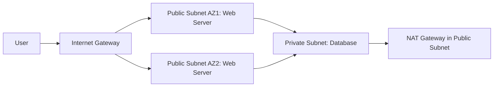

<details open>
<summary><b>Section 5: Comprehensive Guide to AWS Virtual Private Cloud (VPC) (CL-KK-Terminal)</b></summary>

# Section 5: Comprehensive Guide to AWS Virtual Private Cloud (VPC)

## Table of Contents
- [5.1 Introduction Of Virtual Private Cloud (VPC)](#51-introduction-of-virtual-private-cloud-vpc)
- [5.2 How To Create VPC Part 1 (Live Hands-On)](#52-how-to-create-vpc-part-1-live-hands-on)
- [5.3 How To Create VPC -- Subnets Part 2 (Hands-On)](#53-how-to-create-vpc-subnets-part-2-hands-on)
- [5.4 How To Create VPC -- Internet Gateway & Route Table Part 3 (Hands-On)](#54-how-to-create-vpc-internet-gateway-route-table-part-3-hands-on)
- [5.5 How To Create VPC -- VPC 2-Tire Architecture Part 4](#55-how-to-create-vpc-vpc-2-tire-architecture-part-4)
- [5.6 How To Create VPC - Create Public Subnet And Private Subnet Part 5 Hands-On](#56-how-to-create-vpc-create-public-subnet-and-private-subnet-part-5-hands-on)
- [5.7 How To Create VPC -- NAT Gateway Part 7 (Hand-On)](#57-how-to-create-vpc-nat-gateway-part-7-hand-on)
- [5.8 VPC Access Control List (ACL) (Hands-On)](#58-vpc-access-control-list-acl-hands-on)
- [5.9 Security Group V-S Access Control List (Hands-on)](#59-security-group-v-s-access-control-list-hands-on)
- [5.10 Stateless Vs Stateful](#510-stateless-vs-stateful)
- [5.11 Virtual Private Network (VPN)](#511-virtual-private-network-vpn)
- [5.12 Virtual Private Network (VPN) (Hands-On)](#512-virtual-private-network-vpn-hands-on)
- [5.13 AWS Direct Connect (Hands-On)](#513-aws-direct-connect-hands-on)
- [5.14 VPC Transit Gateway](#514-vpc-transit-gateway)
- [5.15 VPC Transit Gateway (Hands-on)](#515-vpc-transit-gateway-hands-on)
- [5.16 VPC Endpoint](#516-vpc-endpoint)
- [5.17 VPC Endpoint Services - Private Link (Hands-On)](#517-vpc-endpoint-services-private-link-hands-on)
- [5.18 DHCP Option Sets (Hands-On)](#518-dhcp-option-sets-hands-on)
- [5.19 VPC Flow Log (Hands-On)](#519-vpc-flow-log-hands-on)
- [5.20 Managed Prefix List Part 1 (Hands-On)](#520-managed-prefix-list-part-1-hands-on)
- [5.21 Managed Prefix List Part 2 (Hands-On)](#521-managed-prefix-list-part-2-hands-on)
- [5.22 VPC Peering Connection (Hands-on)](#522-vpc-peering-connection-hands-on)

## 5.1 Introduction Of Virtual Private Cloud (VPC)

### Overview
This module introduces AWS Virtual Private Cloud (VPC), a core service for isolating AWS resources and providing secure networking. It explains how VPC mimics on-premises networking in the cloud, using isolation to prevent unauthorized access between user resources, even when sharing physical hosts. Default VPCs are automatically provided, but custom VPCs are essential for complex architectures with public/private subnets, security groups, and internet gateways.

### Key Concepts
- **VPC Isolation**: Amazon's VPC service creates a logical network boundary, ensuring EC2 instances of different users remain isolated, even on the same physical host. This prevents security breaches where one user could access another's resources.
- **Regional Scope**: VPCs are region-specific, aligning with AWS Availability Zones (AZs). For Mumbai (ap-south-1), possible AZs include ap-south-1a, ap-south-1b, and ap-south-1c. Resources like EC2 instances must be deployed in a VPC, either default or custom.
- **Default VPCs**: AWS provides a default VPC in each region upon account creation, allowing immediate EC2 launches without configuration. It includes internet access and predefined security settings, usable for small-scale or simple deployments.
- **Custom VPCs**: For production environments or complex apps (e.g., Swiggy, Zomato), custom VPCs with tailored IP ranges (e.g., 192.168.0.0/24) are necessary. Components include public/private subnets, internet gateways, NAT gateways, route tables, security groups, and network ACLs.
- **IP Addressing**: VPCs support private IP ranges (Class A: 10.0.0.0/8; Class B: 172.16.0.0/12; Class C: 192.168.0.0/16). Choose based on infrastructure size: Class C for small setups, Class A for massive enterprise needs.

### Diagram: Basic VPC Architecture
```mermaid
graph TD
    A[Region: Mumbai (ap-south-1)] --> B[Availability Zone: ap-south-1a]
    A --> C[Availability Zone: ap-south-1b]
    A --> D[Availability Zone: ap-south-1c]
    B --> E[VPC: 192.168.0.0/24]
    E --> F[Default Subnet]
    F --> G[EC2 Instance]
    H[User A] --> I[Own VPC]
    J[User B] --> K[Own VPC]
    I --> L[Physical Host: Isolated EC2 Instances]
    K --> L
```

> [!NOTE]
> VPC is Encrypted HTTP instead of HTP in transcripts, corrected to HTTP for accuracy.

## 5.2 How To Create VPC Part 1 (Live Hands-On)

### Overview
Practical guide to creating a custom VPC, starting with VPC-only creation using CIDR blocks and subnet setup. Covers deleting default VPCs, creating custom ones with private IP ranges, and initial subnet configuration in AZs.

### Key Concepts
- **VPC Creation Steps**: Basic 5-step process: 1) Create VPC, 2) Assign IP range (e.g., 192.168.0.0/24), 3) Create subnets, 4) Attach internet gateway, 5) Configure route tables.
- **CIDR Blocks**: Use private ranges like 10.0.0.0/8 (Class A), 172.16.0.0/12 (Class B), 192.168.0.0/16 (Class C). Example: 192.168.0.0/24 for small setups.
- **Default vs. Custom**: Delete default VPCs for complex setups to avoid clutter. Create multiple VPCs if needed, but focus on one per demo.

### Lab Demo: Create Basic VPC
1. In AWS Console, navigate to VPC > Your VPCs.
2. Click "Create VPC".
3. Select "VPC only", name: "my-corp-VPC", CIDR: "192.168.0.0/24".
4. Launch EC2 without VPC to confirm failure.
5. Delete default VPC.

> [!IMPORTANT]
> Ensure CIDR blocks don't overlap if creating multiple VPCs.

## 5.3 How To Create VPC -- Subnets Part 2 (Hands-On)

### Overview
Deep dive into subnet creation within VPCs, emphasizing AZ-specific subnets for high availability (HA). Covers CIDR subnetting and IP allocation issues when expanding subnets.

### Key Concepts
- **Subnets in AZs**: Subnets are AZ-bound; cannot span AZs. Create subnets in each AZ (e.g., ap-south-1a, ap-south-1b) for HA.
- **Subnetting**: Use tools like subnet calculator for CIDR divisions (e.g., 192.168.0.0/24 into /25 subnets). AWS allocates IPs: first is router gateway, second DNS, third reserved.
- **IP Exhaustion Handling**: Overlap CIDR blocks cause failures; expand VPC CIDR if needed (up to 5 ranges).
- **EC2 Elastic IPs**: Assign public IPs via auto-assign settings per subnet.

### Lab Demo: Create Subnets and EC2
1. Create subnet1 (192.168.0.0/25) in ap-south-1a, subnet2 (192.168.0.128/25) in ap-south-1b.
2. Launch EC2 in each subnet with auto-assign public IP enabled.
3. SSH into instances: `ssh -i key.pem ec2-user@<public-ip>`.
4. Test ping between instances for intra-VPC communication.

## 5.4 How To Create VPC -- Internet Gateway & Route Table Part 3 (Hands-On)

### Overview
Explains internet gateway (IGW) attachment for outbound/inbound internet access and route table configurations for public subnets. Covers NAT implications and security best practices.

### Key Concepts
- **Internet Gateway**: Provides internet access; attach to VPC. Enables EC2s with public IPs for full internet connectivity.
- **Route Tables**: Default "Main" route table associates with all subnets. Create custom route tables for selective routing (e.g., public subnets only route to IGW).
- **Inbound/Outbound Optimization**: Public IPs enable both directions; private subnets may need NAT for outbound.
- **Charges**: Outbound traffic billed (inbound free for IGW).

### Lab Demo: Attach IGW and Configure Routes
1. Create IGW: VPC > Internet Gateways > Create IGW.
2. Attach to VPC.
3. Edit main route table: Add route 0.0.0.0/0 → IGW.
4. Verify SSH to EC2 and internal pings.

> [!NOTE]
> IGW provides high availability; public IPs mandatory for IGW communication.

## 5.5 How To Create VPC -- VPC 2-Tire Architecture Part 4

### Overview
Introduces 2-tier architecture: public subnets for web servers (user-facing) with public IPs, private subnets for databases (secure, no inbound internet).

### Key Concepts
- **Public Subnets**: For load balancers, web servers; internet-exposed for user access.
- **Private Subnets**: For DBs, backend services; no inbound internet, only outbound via NAT if needed.
- **High Availability**: Multiple subnets per AZ for redundancy.
- **Security**: User accesses web → web communicates with DB via private IPs.

### Diagram: 2-Tier VPC Architecture


## 5.6 How To Create VPC - Create Public Subnet And Private Subnet Part 5 Hands-On

### Overview
Hands-on creation of segregated public/private subnets using route tables for isolated access control.

### Key Concepts
- **Route Table Segregation**: Custom route tables for public (routes to IGW), private (no IGW route).
- **Subnet Association**: Associate subnets explicitly with route tables for precise control.
- ** Bastion Host**: EC2 in public subnet for private subnet access via SSH tunneling or EC2 instance connect.

### Lab Demo: Segregate Subnets
1. Create route table "rt-public", associate public subnets.
2. Add route 0.0.0.0/0 → IGW.
3. Keep main route table for private subnets (no IGW route).
4. Access via bastion: SCP key to bastion, then SSH: `ssh -i key ec2-user@<private-ip>`.

## 5.7 How To Create VPC -- NAT Gateway Part 7 (Hand-On)

### Overview
Covers NAT Gateway for private subnet outbound internet access (e.g., updates, downloads) without inbound exposure.

### Key Concepts
- **NAT Gateway Function**: Translates private IPs to public IPs for outbound; lives in public subnet.
- **Route Configuration**: Add route to NAT Gateway in private subnet route table.
- **SAAS/HA**: Supports 45 Gbps, 55k connections; highly available, no management needed.
- **Charges**: Billed for data transfer; region-specific.

### Lab Demo: Enable NAT for Private Subnets
1. Create NAT Gateway in public subnet (requires EIP).
2. Edit private route table: Add 0.0.0.0/0 → NAT Gateway.
3. Test: Ping Google from private EC2.

> [!IMPORTANT]
> NAT allows outbound only; inbound traffic blocked for security.

## 5.8 VPC Access Control List (ACL) (Hands-On)

### Overview
Introduces Network ACLs for subnet-level traffic control, complementing instance-level Security Groups.

### Key Concepts
- **Stateless Filtering**: Allows/denies traffic based on rules (lower numbers higher priority); no state tracking.
- **Defaults**: VPC creates default ACL allowing all; custom ACL starts with deny all.
- **Use Cases**: Deny specific IPs/ports at subnet level.

### Lab Demo: Custom ACL
1. Create ACL, associate with subnet.
2. Edit inbound: Allow ICMP (rule 100), deny specific IP/port (rule 200).
3. Test: Ping allowed from permitted IPs.

## 5.9 Security Group V-S Access Control List (Hands-on)

### Key Concepts
- **Security Groups**: Instance-level, stateful (auto-allows return traffic), allow rules only.
- **Network ACLs**: Subnet-level, stateless (explicit inbound/outbound rules), allow/deny rules, sequence-based priority.

## 5.10 Stateless Vs Stateful

### Key Concepts
- **Stateless (ACLs)**: Filters each packet independently; requires explicit rules for both directions (e.g., inbound/outbound TCP).
- **Stateful (Security Groups)**: Tracks connections; one rule suffices for bidirectional flow (e.g., inbound outbound handled).

## 5.11 Virtual Private Network (VPN)

### Overview
Explains site-to-site VPN for connecting on-premises to AWS VPC using internet, enabling hybrid clouds.

### Key Concepts
- **VPN Process**: Create VPN gateway, customer gateway (on-premises public IP), site-to-site connection with IPsec encryption.
- **Use Case**: Secure data flow between on-premises and cloud.

## 5.12 Virtual Private Network (VPN) (Hands-On)

### Lab Demo: Set Up Site-to-Site VPN
1. Create Customer Gateway: Provide on-premises router public IP.
2. Create VPN Gateway: Attach to VPC.
3. Create VPN Connection: Associate gateways, upload config to router.
4. Update route tables for on-premises and AWS routes.

## 5.13 AWS Direct Connect (Hands-On)

### Overview
Alternative to VPN: Direct fiber-optic connection (50-500 Mbps to 10 Gbps+) for low-latency, predictable performance without internet.

### Key Concepts
- **Process**: Select AWS Direct Connect provider, port speed, establish circuit, configure VGW/Route Tables.
- **Advantages**: Faster, secure, cost-effective for high data transfer.

## 5.14 VPC Transit Gateway

### Overview
Centralized hub for multi-VPC interconnection, reducing peering complexity (e.g., 10 VPCs need 45 peerings vs. 1 TGW).

### Key Concepts
- **Attachement Types**: VPC, VPN, Direct Connect.
- **Cross-Region/Account**: Supports peering between TGWs.

## 5.15 VPC Transit Gateway (Hands-on)

### Lab Demo: Connect Multiple VPCs via TGW
1. Create TGW, attach VPC attachments.
2. Update route tables to forward via TGW.

## 5.16 VPC Endpoint

### Overview
Enables private VPC-to-AWS service communication without IGW/NAT, using AWS private network.

### Key Concepts
- **Types**: Gateway endpoints (S3, DynamoDB; add route table entries), Interface endpoints (other services; ENI in subnet).

## 5.17 VPC Endpoint Services - Private Link (Hands-On)

### Overview
Shares services via VPC interfaces without VPC peering.

### Key Concepts
- **NLB Requirement**: Use Network Load Balancer for endpoint services.
- **Access**: Clients create private endpoints for secure,.Scale access.

### Lab Demo: Create Endpoint Service
1. Create NLB for service.
2. Create VPC endpoint service using NLB ARN.
3. Create VPC endpoint from client side.

## 5.18 DHCP Option Sets (Hands-On)

### Overview
Customizes DNS, NTP, domain names for VPC EC2s instead of AWS defaults.

### Key Concepts
- **Update Triggers**: Requires IP renew (`ipconfig /renew`) or reboot for changes.

### Lab Demo: Custom DNS/NTP
1. Create DHCP option set: domain-name: cloudfox.local, DNS: 8.8.8.8.
2. Associate with VPC.
3. Renew IP to apply.

## 5.19 VPC Flow Log (Hands-On)

### Overview
Logs all VPC traffic for security and troubleshooting.

### Key Concepts
- **Destinations**: CloudWatch Logs/S3; supports accepted/rejected/all traffic.
- **Formats**: Default fields (source IP, port, protocol, action).

### Lab Demo: Enable Flow Logs
1. VPC > Flow Logs > Create: Select VPC, destination (CloudWatch/S3), log format.
2. Analyze logs for traffic patterns.

## 5.20 Managed Prefix List Part 1 (Hands-On)

### Overview
Manages reusable IP sets for route tables/groups, simplifying updates.

### Key Concepts
- **Types**: Customer-managed (editable), AWS-managed (read-only for services like S3).

### Lab Demo: Customer-Managed Prefix List
1. Create prefix list: Add CIDRs (e.g., 10.0.0.0/24).
2. Edit Security Group: Allow traffic from prefix list.

## 5.21 Managed Prefix List Part 2 (Hands-On)

### Overview
Uses AWS-managed prefix lists (e.g., Amazon S3 IPs) for outbound rules.

### Key Concepts
- **Weights**: AWS-managed lists have "weights" (IP count); consider limits (e.g., SG: 60 rules, route table: 50).

## 5.22 VPC Peering Connection (Hands-on)

### Overview
Connects VPCs for direct communication without gateways.

### Lab Demo: Peer VPCs
1. Create peering connection: Select requester VPC and accepter VPC.
2. Accept in accepter account.
3. Update route tables: Add routes to peer VPC CIDRs via peering connection.

## Summary

### Key Takeaways
```diff
+ VPC provides isolation and custom networking in AWS, enabling secure hybrid architectures.
- Default VPCs are convenient, but custom VPCs are essential for production with public/private setups.
+ Components like IGW, NAT, route tables control traffic flow.
- Security via SG (stateful, instance-level) and ACL (stateless, subnet-level) is critical.
+ Advanced: TGW for hub-spoke, peering for direct links, endpoints for private API access.
- Flow logs, DHCP sets, prefix lists aid monitoring and management.
+ Hybrid options: VPN for internet-based, Direct Connect for dedicated fiber.
```

### Quick Reference
- **CIDR Subnetting**: Use /8 (10.0.0.0), /12 (172.16.0.0), /16 (192.168.0.0) for private ranges.
- **Key Commands**: `aws ec2 describe-vpcs`, `aws ec2 create-vpc --cidr-block 192.168.0.0/24`.
- **SG Rules**: Allow SSH (22), HTTP (80), HTTPS (443); reference prefix lists for managed IPs.

### Expert Insight
- **Real-world Application**: Use VPC for multi-tier apps (e.g., public web, private DB), TGW for cross-account sharing, Direct Connect for data-intensive workloads.
- **Expert Path**: Master route tables, FGWs, NATs; integrate with CloudFormation for IaC; study TGW attachments for advanced topologies like Global Networks.
- **Common Pitfalls**: Overallocate CIDRs, forget stateful SG behavior, ignore NAT charges; use flow logs proactively for security.
- **Lesser-Known Facts**: VPC endpoints reduce API call costs by 50% (free when private); TGW supports IPv6 peering; custom DHCP sets override OS-level DNS.

</details>
