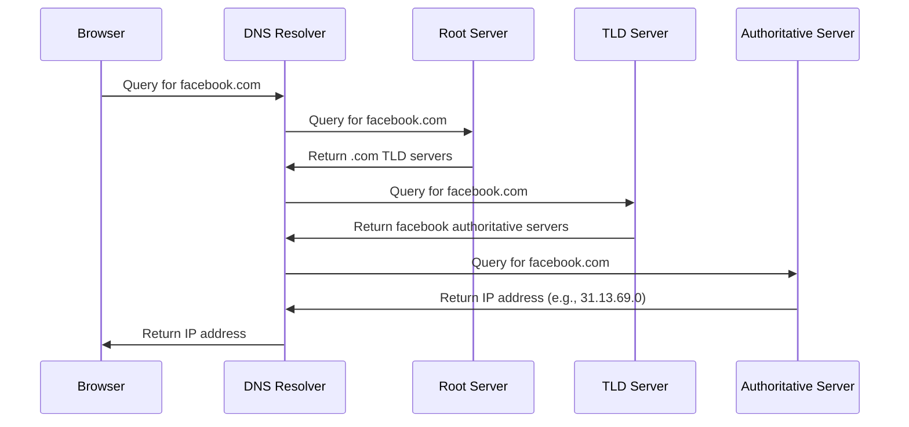
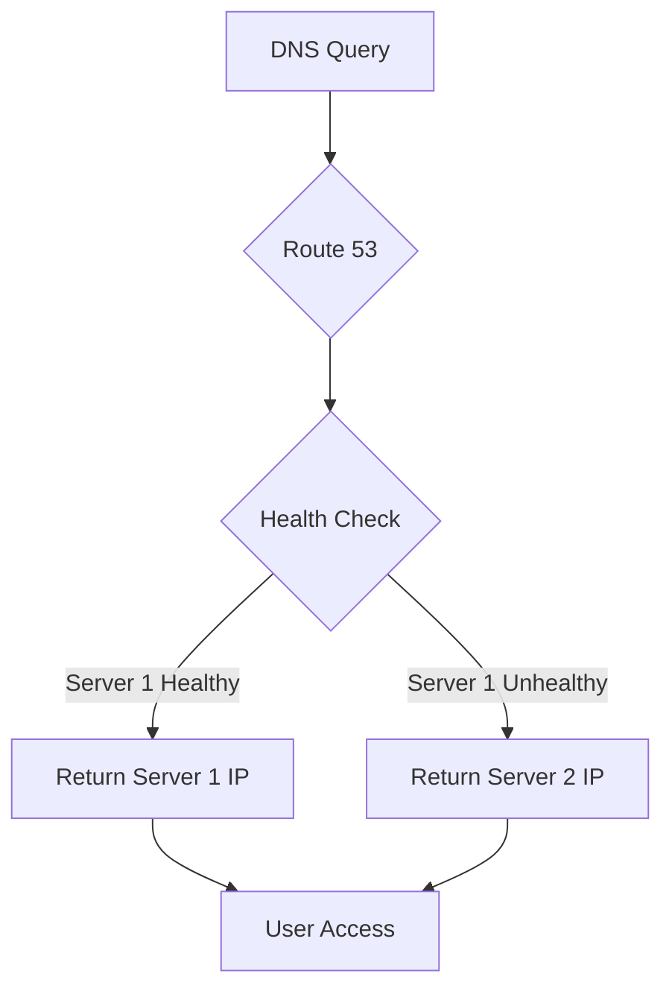
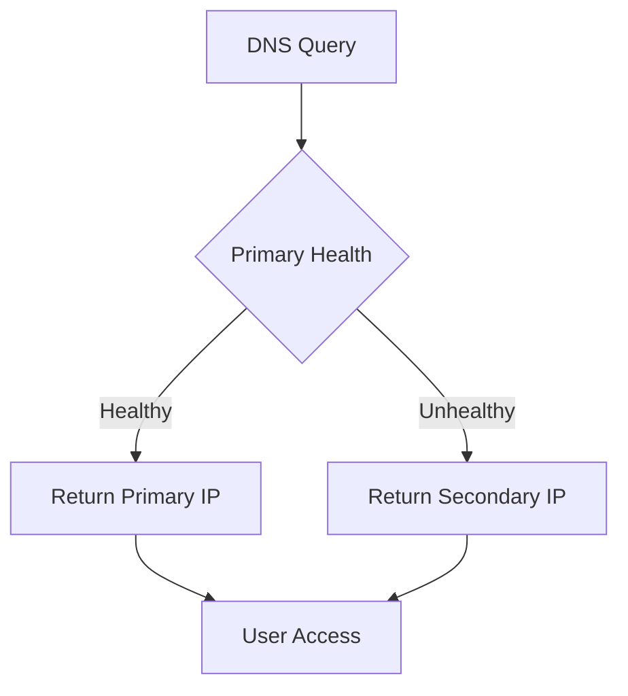

# Section 6: Route 53 DNS Service

<details open>
<summary><b>Section 6: Route 53 DNS Service (CL-KK-Terminal)</b></summary>

## Table of Contents

- [DNS Basics and Why DNS is Necessary](#dns-basics-and-why-dns-is-necessary)
- [Domain Registration and Route 53 Setup](#domain-registration-and-route-53-setup)
- [Route 53 Record Types](#route-53-record-types)
- [Simple Routing Policy](#simple-routing-policy)
- [Weighted Routing Policy](#weighted-routing-policy)
- [Health Checks with Weighted Policy](#health-checks-with-weighted-policy)
- [Geolocation Routing Policy](#geolocation-routing-policy)
- [Latency-Based Routing Policy](#latency-based-routing-policy)
- [Geoproximity Routing Policy](#geoproximity-routing-policy)
- [Failover Routing Policy](#failover-routing-policy)
- [Multivalue Answer Routing Policy](#multivalue-answer-routing-policy)
- [IP-Based Routing Policy](#ip-based-routing-policy)

## DNS Basics and Why DNS is Necessary

### Overview
This section introduces the fundamental concepts of DNS (Domain Name System) and explains why DNS is essential for internet connectivity. DNS acts as the phonebook of the internet, translating human-readable domain names into IP addresses that computers understand.

### Key Concepts

#### What is DNS?
DNS resolves domain names (like google.com) to IP addresses (like 8.8.8.8). Without DNS, users would need to memorize numeric IP addresses, making internet navigation impossible.

#### How DNS Resolution Works


#### DNS Name Structure
- **FQDN (Fully Qualified Domain Name)**: Maximum 255 characters
  - Example: `learn.subdomain.subdomain.tld` (learn.example.co.in)
- **Label**: Subdomain part, maximum 63 characters
- **TLD (Top Level Domain)**: Like .com, .net, .org, .in

#### DNS Hierarchy
1. **Root Servers**: 13 global servers directing queries
2. **TLD Servers**: Handle specific TLDs (e.g., .com servers)
3. **Authoritative Servers**: Managed by organizations for their domains

#### DNS Cache
- Resolvers cache DNS responses to speed up future queries
- DNS servers maintain cache to avoid redundant lookups
- **Cache Clearing**: Use `ipconfig /flushdns` on Windows to clear local cache

### Quick Reference
Common DNS Commands:
- `nslookup [domain] [dns-server]` - Query DNS records
- `ipconfig /flushdns` - Clear Windows DNS cache
- `dig [domain]` - Linux DNS query tool

## Domain Registration and Route 53 Setup

### Overview
This section covers the process of registering a domain name and setting up Route 53 as your DNS authoritative server. AWS Route 53 provides domain registration services with nameservers for DNS management.

### Key Concepts

#### Domain Registration Options
1. **Route 53 Domain Registration**: Register directly through AWS
   - Pricing: $5-15 USD/year depending on TLD (e.g., .in, .org)
   - Includes free hosted zone setup

2. **Third-Party Registrars**: 
   - GoDaddy, Namecheap, BigRock
   - Cheaper options available
   - Transfer to Route 53 required for usage

3. **Free Domains**: Limited availability (not reliable for production)

#### Domain Transfer Process
1. Domain must be older than 60 days for transfer
2. Obtain authorization code from current registrar
3. Initiate transfer via Route 53
4. Update nameservers in current registrar to point to Route 53 nameservers

#### Route 53 Hosted Zones
- **Public Hosted Zone**: Internet-resolvable DNS records
- **Private Hosted Zone**: VPC-internal DNS resolution
- Contains 4 nameservers for redundancy

#### Connecting Existing Domain to Route 53
1. Create public hosted zone in Route 53
2. Copy nameservers from hosted zone
3. Update domain registrar settings with Route 53 nameservers
4. Create DNS records in Route 53 for your services

### Real-world Application
> [!IMPORTANT]  
> For learning AWS, purchase domain in your name early. Use it for personal brand building by hosting a CV/resume website showcasing your skills.

### Common Pitfalls
- Transfer not available for domains <60 days old
- Nameserver updates take 10-60 minutes globally
- Always test DNS propagation using tools like DNS Checker

## Route 53 Record Types

### Overview
Route 53 supports multiple DNS record types for different use cases. Each record type serves specific purposes from web hosting to email routing.

### Key Concepts

#### A Record (Address Record)
- Maps domain names to IPv4 addresses
- Primary record for web servers
- Example: `www.example.com -> 1.2.3.4`

#### AAAA Record
- Maps domain names to IPv6 addresses  
- IPv6 equivalent of A record
- Example: `www.example.com -> 2001:db8::1`

#### CNAME Record (Canonical Name)
- Creates alias pointing to another domain name
- Cannot be used for root domain (naked domain)
- Useful for creating multiple domain names pointing to same service

#### MX Record (Mail Exchange)
- Specifies mail servers for email routing
- Includes priority values (lower = higher priority)
- Requires functioning mail server setup

#### TXT Record
- Contains text information about domain
- Used for domain verification, SPF records
- Example: Domain ownership verification

#### PTR Record (Pointer)
- Reverse of A record (IP to name)
- Used rarely, mainly for diagnostics

#### SRV Record (Service)
- Application-specific records for services like Active Directory
- Complex configuration, follows specific format
- Not commonly used outside enterprise applications

#### SPF Record (Sender Policy Framework)
- Prevents email spoofing by specifying authorized sending servers
- TXT record type validation
- Not recommended for complex multi-server environments

> [!WARNING]  
> SPF recommended for simple email setups. For complex environments, use dedicated email security services.

### Quick Reference
Record Type Usage:
| Record Type | Purpose | Example |
|-------------|---------|---------|
| A | Web server IP | example.com -> 192.168.1.1 |
| AAAA | IPv6 web server | example.com -> 2001:db8::1 |
| CNAME | Domain alias | www.example.com -> example.com |
| MX | Email routing | example.com -> mail.example.com |
| TXT | Domain info/SPF | example.com -> "v=spf1..." |

## Simple Routing Policy

### Overview
Simple routing is the basic DNS record configuration where Route 53 provides a single IP address for a domain name. This policy doesn't support multiple IPs for the same record name.

### Key Concepts

#### How Simple Routing Works
- Creates single A/CNAME record per unique name
- No load balancing or redundancy features
- Route 53 validates uniqueness of record name per policy

#### Use Cases
- Basic web hosting with single server
- Development/test environments
- Scenarios not requiring high availability

#### Limitations
> [!IMPORTANT]  
> Cannot create multiple records with same name using simple routing. Use weighted, multivalue, or other policies for multi-server setups.

### Real-world Application
Use simple routing for personal websites or applications with single server dependency, such as development blogs or portfolio sites.

#### Testing DNS Records
Use Route 53's built-in "Test Record" functionality to validate IP resolution without waiting for global propagation.

## Weighted Routing Policy

### Overview
Weighted routing distributes DNS queries across multiple resources based on assigned percentages, enabling load balancing and A/B testing scenarios.

### Key Concepts

#### How Weighting Works
```
Record 1: Weight 50 → 50% traffic
Record 2: Weight 50 → 50% traffic  
Total: 100% traffic split 50/50
```

#### Weight Calculation Formula
```
Individual Weight Percentage = (Record Weight ÷ Total Weight) × 100
```

Example with weights 120 + 50 + 30 = 200 total:
- Record 1 (120): (120 ÷ 200) × 100 = 60%
- Record 2 (50): (50 ÷ 200) × 100 = 25%  
- Record 3 (30): (30 ÷ 200) × 100 = 15%

#### Supported Weight Range
0-255 (0 = disabled, higher = greater traffic allocation)

#### Practical Scenarios
- **Load Balancing**: Equal traffic distribution (50/50 weights)
- **A/B Testing**: Different application versions (10/90 split)
- **Regional Traffic**: More traffic to better-performing servers

### Expert Insight
Weighted routing provides granular control over traffic distribution. Test thoroughly as DNS caching affects immediate traffic shifts.

## Health Checks with Weighted Policy

### Overview
Health checks enable Route 53 to monitor endpoint health and automatically route traffic away from failed resources, ensuring high availability.

### Key Concepts

#### Health Check Configuration
- **Protocol**: HTTP/HTTPS/UDP/TCP
- **Endpoint**: IP address or domain name
- **Port**: Service port (default 80/443 for HTTP)
- **Path**: Specific URL path for checking
- **Frequency**: Check intervals (30 seconds default)

#### Integration with Routing Policies
```diff
- Unhealthy endpoint automatically removed from rotation
+ Traffic redirects to healthy servers
! No manual intervention required
```

#### Health Status Determination
- **Healthy**: Endpoint responds successfully
- **Unhealthy**: Endpoint unreachable or returns non-2xx HTTP status
- **Status Changes**: 
  - Healthy detection: ~2-3 minutes
  - Unhealthy detection: Immediate + confirmation period

#### Multi-Server Scenario


### Real-world Application
> [!TIP]  
> Use health checks with weighted routing for zero-downtime deployments and automatic failover scenarios.

### Common Pitfalls
- Health checks add ~2-3 minute delay for status detection
- Endpoints must be publicly accessible for internet-based checks
- False positives possible during maintenance windows

## Geolocation Routing Policy

### Overview
Geolocation routing directs users to resources based on their geographic location, enabling location-specific content delivery and compliance.

### Key Concepts

#### Geographic Targeting
- **Continent**: Africa, Antarctica, Asia, Europe, Oceania, South America
- **Country**: Specific country codes (US, IN, JP, etc.)
- **Default**: Catch-all for unmatched locations

#### Use Cases
- **Content Localization**: Country-specific website versions
- **Legal Compliance**: Data residency requirements
- **Performance Optimization**: Geographic-specific assets

#### Record Configuration
Multiple records with same name, different locations:
```
learn.example.com - US → us-server-ip
learn.example.com - IN → in-server-ip  
learn.example.com - Default → global-server-ip
```

#### Global Testing
Use tools like dnschecker.org to verify responses from different geographic locations simultaneously.

### Expert Insight
Geolocation routing is user-location based, not latency optimized. For performance-focused routing, use latency-based policy instead.

## Latency-Based Routing Policy

### Overview
Latency-based routing intelligently routes users to the AWS region or endpoint offering the lowest network latency to their location.

### Key Concepts

#### Latency Measurement
Route 53 continuously monitors latency between user locations and AWS regions, not physical distance.

#### AWS Region Configuration
Each record targets specific AWS region (us-east-1, ap-south-1, etc.)

#### Decision Process
> [!NOTE]  
> Route 53 compares network latency from user location to each configured region and selects the optimal path.

#### Practical Example
```diff
User in Mumbai, India:
- ap-south-1 (Mumbai): Low latency → Selected
- us-east-1 (Virginia): High latency → Not selected

! Latency-based trumps geographic distance
```

### Real-world Application
Ideal for globally distributed applications where low latency is critical, such as real-time gaming or financial trading platforms.

## Geoproximity Routing Policy

### Overview
Geoproximity routing allows manual override of geographic boundaries through bias adjustments, enabling custom traffic shaping based on business logic.

### Key Concepts

#### Bias Adjustment
- **Negative Bias**: Shrank geographic coverage
- **Positive Bias**: Expanded geographic coverage  
- **Zero Bias**: Default geographic boundaries

#### Traffic Policy Implementation
Separate traffic policy creation required (not direct record creation) for complex geoproximity rules.

> [!IMPORTANT]  
> Geoproximity routing incurs $50/month charge and requires traffic policy configuration.

#### Visual Configuration
Interactive map interface allows visual adjustment of geographic boundaries through bias controls.

### Expert Insight
Use geoproximity when business requirements demand specific geographic traffic patterns beyond standard geo-location defaults.

## Failover Routing Policy

### Overview
Failover routing provides active-passive redundancy, routing all traffic to a primary resource while automatically failing over to secondary resources when needed.

### Key Concepts

#### Active-Passive Model


#### TTL Configuration
```diff
+ Recommended: 60 seconds
- Higher TTL delays failover (up to 5 minutes cache)
```

#### Primary vs Secondary
- **Primary**: Preferred/active server (set as "Primary")
- **Secondary**: Failover server (set as "Secondary")

### Real-world Application
Critical applications requiring guaranteed uptime with backup infrastructure, such as financial systems or healthcare applications.

### Common Pitfalls
- DNS caching delays failover (mitigate with low TTL)
- Requires health checks on primary resources
- Unlike active-active policies, only one resource active at a time

## Multivalue Answer Routing Policy

### Overview
Multivalue routing returns all matching IP addresses in single DNS response, providing simple client-side load balancing without server-side coordination.

### Key Concepts

#### Response Format
DNS query receives multiple IPs:
```
learn.example.com → [1.1.1.1, 2.2.2.2, 3.3.3.3]
```

#### Round-Robin Rotation
Each DNS query returns all IPs in different order:
- Query 1: 1.1.1.1, 2.2.2.2, 3.3.3.3
- Query 2: 2.2.2.2, 3.3.3.3, 1.1.1.1  
- Query 3: 3.3.3.3, 1.1.1.1, 2.2.2.2

#### Health Check Integration
Unhealthy endpoints automatically excluded from response sets.

### Expert Insight
Multivalue routing provides basic client-side load balancing. For more advanced control, use weighted routing with health checks.

## IP-Based Routing Policy

### Overview
IP-based routing directs traffic based on client source IP ranges, enabling session affinity and network-specific optimizations.

### Key Concepts

#### CIDR Block Configuration
- Create CIDR collections defining IP ranges
- Maximum 1000 IP ranges per collection
- Example: 192.168.0.0/24

#### Use Cases
- **Session Affinity**: Route users from specific networks to designated servers
- **Network Optimization**: ISP-specific optimizations
- **Testing**: Send test traffic to staging environments

#### Default Routing
Unmatched IP ranges route to default resources.

### Real-world Application
Enterprise environments with distributed offices requiring specific resource access patterns, or testing scenarios needing traffic isolation.

## Summary

### Key Takeaways
```diff
+ DNS translates names to IPs for internet navigation
+ Route 53 provides 100% managed DNS service  
+ Multiple routing policies for different use cases:
  - Weighted: Load balancing by percentages
  - Geolocation: Geographic-specific routing
  - Latency: Low-latency endpoint selection
  - Failover: Active-passive redundancy
+ Health checks enable automatic failover
+ Domain registration available through Route 53
- DNS changes take 10-60 minutes globally due to caching
```

### Quick Reference

#### Routing Policy Decision Table
| Policy | Use Case | Multiple IPs? | Geographic? | High Availability? |
|--------|----------|---------------|-------------|-------------------|
| Simple | Single server | No | No | No |
| Weighted | Load balancing | Yes | No | Yes (with health) |
| Geolocation | Geographic routing | Yes | Yes | Yes |
| Latency | Performance optimization | Yes | No | Yes |
| Geoproximity | Custom geographic boundaries | Yes | Yes | Yes |
| Failover | Active-passive | No | No | Yes |
| Multivalue | Client-side load balancing | Yes | No | Yes (with health) |
| IP-based | Source IP routing | Yes | No | Yes |

#### Common Commands
```bash
# Query DNS records
nslookup learn.example.com

# Clear DNS cache (Windows)
ipconfig /flushdns

# DNS health check (Linux)
dig learn.example.com
```

### Expert Path
Master Route 53 by understanding the constraints and ideal use cases for each routing policy. Practice with real domains and multiple EC2 instances to validate traffic routing behavior. Focus on health check integration for production reliability.

### Common Pitfalls
- DNS caching delays propagation (always test globally)
- Health check configurations add 2-3 minute detection delays
- Geoproximity requires $50/month additional charge
- IP-based routing doesn't differentiate users behind NAT
- Always associate health checks with failover/weighted policies for production use

### Lesser-Known Facts
- Route 53 inspired by DNS port 53
- Supports private hosted zones for VPC-internal DNS
- Health checks support both AWS endpoints and external resources
- Traffic policies enable advanced routing configurations beyond basic records
- Route 53 integrates with other AWS services like CloudFront and ELB for enhanced routing

</details>
