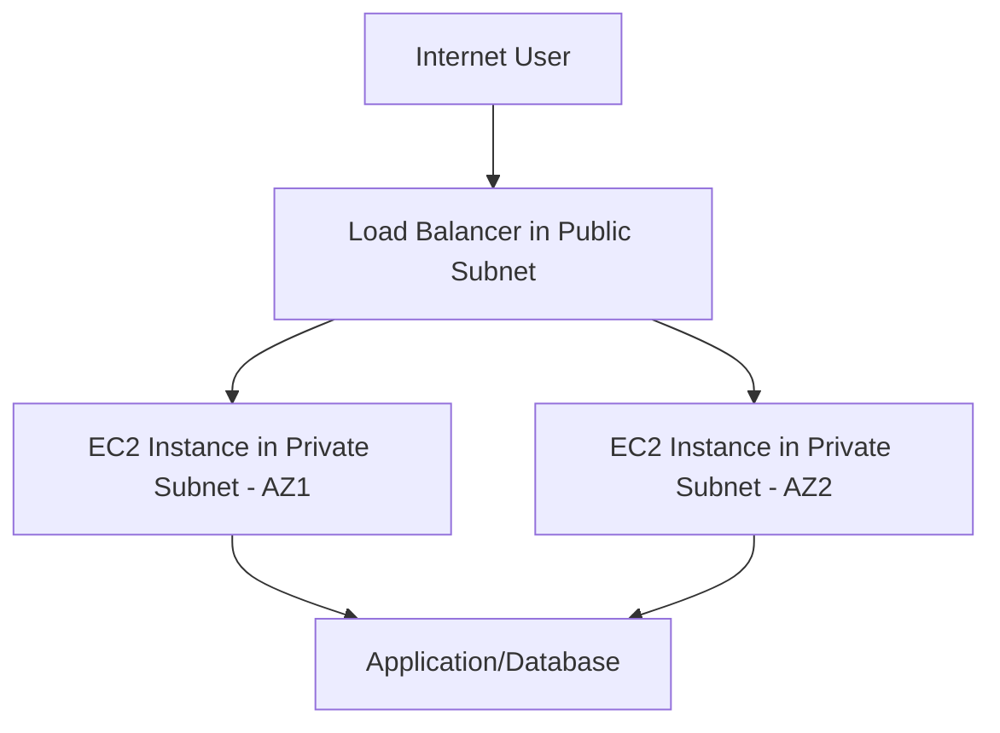
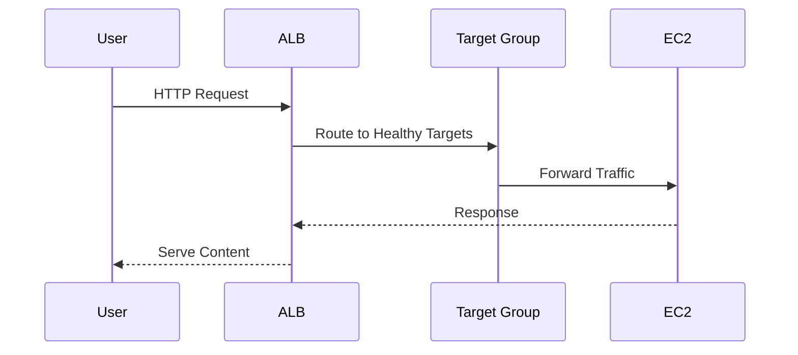
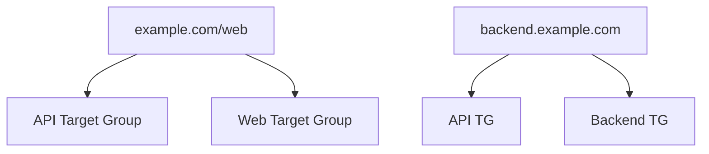
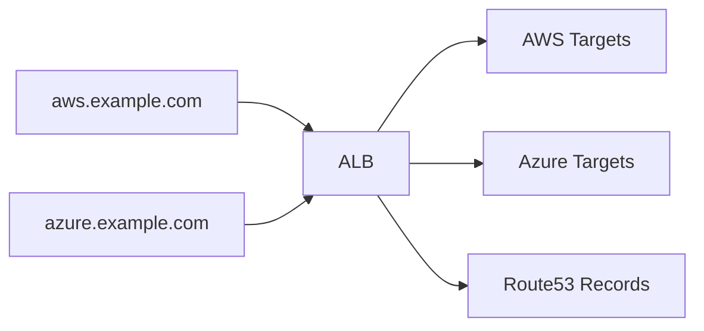
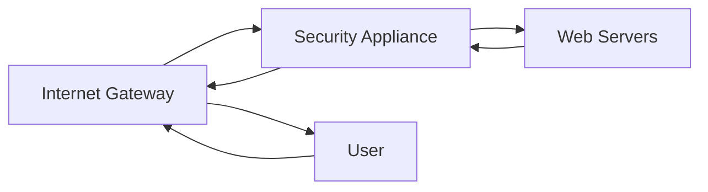

# Section 7: Load Balancer

<details open>
<summary><b>Section 7: Load Balancer (CL-KK-Terminal)</b></summary>

## Table of Contents
- [7.1 Introduction to Load Balancer](#71-introduction-to-load-balancer)
- [7.2 Load Balancer Terminology](#72-load-balancer-terminology)
- [7.3 Implementation Load Balancer Part 1 - VPC Design (Hands-On)](#73-implementation-load-balancer-part-1--vpc-design-hands-on)
- [7.4 Implementation Load Balancer Part 2 - SG Design (Hands-On)](#74-implementation-load-balancer-part-2--sg-design-hands-on)
- [7.5 Implementation Load Balancer Part 3 - Application Load Balancer](#75-implementation-load-balancer-part-3--application-load-balancer)
- [7.6 Path-Based vs Host-Based Routing](#76-path-based-vs-host-based-routing)
- [7.7 Application Load Balancer Path-Based Routing (Hands-On)](#77-application-load-balancer-path-based-routing-hands-on)
- [7.8 Application Load Balancer Host-Based Routing (Hands-On)](#78-application-load-balancer-host-based-routing-hands-on)
- [7.9 Network Load Balancer Overview](#79-network-load-balancer-overview)
- [7.10 Network Load Balancer (Hands-On)](#710-network-load-balancer-hands-on)
- [7.11 Cross-Zone Load Balancing (Hands-On)](#711-cross-zone-load-balancing-hands-on)
- [7.12 Gateway Load Balancer Overview](#712-gateway-load-balancer-overview)
- [7.13 VPC Ingress Routing for Gateway Load Balancer](#713-vpc-ingress-routing-for-gateway-load-balancer)
- [7.14 VPC Ingress Routing for Gateway Load Balancer (Hands-On)](#714-vpc-ingress-routing-for-gateway-load-balancer-hands-on)
- [7.15 Gateway Load Balancer Practical Part 1](#715-gateway-load-balancer-practical-part-1)
- [7.16 Gateway Load Balancer Practical Part 2](#716-gateway-load-balancer-practical-part-2)
- [7.17 Gateway Load Balancer Practical Part 3 (Hands-On)](#717-gateway-load-balancer-practical-part-3-hands-on)
- [7.18 Classic Load Balancer](#718-classic-load-balancer)
- [Summary](#summary)

## 7.1 Introduction to Load Balancer

### Overview
This introductory module explains why load balancers are essential in AWS, comparing them to Route 53 for load balancing. It covers the main use case of distributing traffic across EC2 instances in private subnets while securing them by placing the load balancer in public subnets. The session outlines the four types of AWS load balancers: Application Load Balancer (ALB), Network Load Balancer (NLB), Gateway Load Balancer (GWLB), and Classic Load Balancer (CLB).

### Key Concepts/Deep Dive

#### Use Case and Benefits
- **Traffic Distribution**: Load balancers evenly distribute incoming traffic across multiple EC2 instances to prevent overloading and ensure high availability.
- **Security Enhancement**: Place web servers in private subnets without public IPs; load balancer handles internet-facing requests and forwards them securely.
- **Continuous Service**: Uses health checks to monitor instance health; removes unhealthy instances from rotation and adds them back when recovered.
- **Comparison to Route 53**: Route 53 provides DNS-based load balancing but lacks application-layer features like HTTPS offloading and health checks that load balancers offer.

#### Load Balancer Types Overview
- **Application Load Balancer (ALB)**: Layer 7, handles HTTP/HTTPS traffic, supports advanced routing features.
- **Network Load Balancer (NLB)**: Layer 4, ultra-low latency, suitable for high-traffic scenarios like gaming.
- **Gateway Load Balancer (GWLB)**: Layer 3, integrates third-party security appliances like firewalls.
- **Classic Load Balancer (CLB)**: Legacy, previous generation, not recommended for new deployments.

#### VPC Prerequisites
- Requires understanding of VPC, public/private subnets, internet gateways, NAT gateways, and route tables.
- Best practice: Deploy resources across multiple availability zones (AZs) for redundancy.



### Lab Demos
- Diagram of before/after load balancer deployment in VPC.
- Health check mechanism explanation with instance failover simulation.

## 7.2 Load Balancer Terminology

### Overview
This module dives into essential AWS Load Balancer terminology through the EC2 console, explaining components like scheme, IP address type, listeners, routing, target groups, health checks, and security groups without creating actual resources.

### Key Concepts/Deep Dive

#### Basic Configuration
- **Scheme**: 
  - Internet-facing: Accessible from internet (most common).
  - Internal: Accessible only within VPC/subnets.
- **IP Address Type**:
  - IPv4: Standard.
  - Dual-stack: IPv4 + IPv6.
- **VPC and Subnets**: Load balancer placed in public subnets for internet access.

#### Listeners and Routing
- **Listener**: Defines how load balancer listens for incoming traffic (e.g., TCP port 80 for HTTP).
- **Protocol**: ALB supports HTTP (port 80) and HTTPS (port 443); enables SSL offloading.
- **Routing**: Forwards traffic from listener to target group based on rules.

#### Target Groups
- **Purpose**: Groups EC2 instances, IPs, or Lambda functions for traffic forwarding.
- **Protocol/Port**: Matches listener (e.g., HTTP on port 80) but can differ if needed.
- **Health Checks**: Monitors targets; default protocol is HTTP; customizable path, timeout, intervals.
- **Types**: Instances, IP addresses, Lambda functions, Application Load Balancer.

#### Security Considerations
- Load balancers have dedicated security groups for inbound traffic filtering.

| Component | Description | Example |
|-----------|-------------|---------|
| Listener | Entry point protocol/port | HTTP:80 |
| Target Group | Backend resources | EC2 instances on port 80 |
| Health Check | Monitors backend health | HTTP GET request |
| Security Group | Access control | Allow traffic from specific sources |

### Lab Demos
- Simulated creation process in AWS console without actual deployment.
- Explanation of listener routing paths.

```bash
# Example: Target group health check configuration
curl -I http://target-instance/  # Simulate health check
```

## 7.3 Implementation Load Balancer Part 1 - VPC Design (Hands-On)

### Overview
This hands-on lab focuses on creating a robust VPC infrastructure for load balancers, emphasizing high availability with multiple subnets, internet gateways, NAT gateways, and route tables across two availability zones.

### Key Concepts/Deep Dive

#### VPC Architecture
- **CIDR Block**: e.g., 192.168.0.0/16 divided into subnets.
- **Subnets**: 4 subnets (2 public, 2 private) across 2 AZs.
  - Public subnets: For load balancers and NAT gateways.
  - Private subnets: For EC2 instances (secure, inbound via load balancer).

#### Gateway Setup
- **Internet Gateway (IGW)**: Enables public subnet internet access; attach to VPC.
- **NAT Gateway**: Provides outbound internet for private subnets; placed in public subnet with Elastic IP.
- **NAT Instance** vs **NAT Gateway**: Gateway is managed, scalable; instance requires manual management.

#### Route Tables
- **Public Route Table**: Routes 0.0.0.0/0 to IGW.
- **Private Route Table**: Routes 0.0.0.0/0 to NAT Gateway.
- **Associations**: Explicitly associate subnets with route tables for isolation.

#### Best Practices
- Use multiple AZs for redundancy.
- Separate public/private routing for security.
- Tag resources for management.

```yaml
# Example VPC subnet CIDR divisions
VPC CIDR: 192.168.0.0/16
- Public AZ1: 192.168.0.0/24
- Public AZ2: 192.168.1.0/24
- Private AZ1: 192.168.2.0/24
- Private AZ2: 192.168.3.0/24
```

> [!NOTE]
> NAT Gateway requires Elastic IP for consistent public IP.

### Lab Demos
- Step-by-step VPC creation, subnet allocation, IGW attachment.
- Route table configuration for public/private subnets.
- Verification of internet connectivity in public subnets.

```bash
# Verify IGW attachment
aws ec2 describe-internet-gateways --filters "Name=attachment.vpc-id,Values=vpc-id"
```

## 7.4 Implementation Load Balancer Part 2 - SG Design (Hands-On)

### Overview
This module implements security groups for load balancer components, ensuring secure communication between internet, load balancer, and EC2 instances while launching web servers in private subnets.

### Key Concepts/Deep Dive

#### Security Group Principles
- **Load Balancer SG**: Allow inbound HTTP/HTTPS from 0.0.0.0/0 (internet).
- **Web Server SG**: Allow inbound HTTP from load balancer SG only; restrict access for security.
- **EC2 in Private Subnets**: No public IP; access via User Data or bastion host.
- **SSH for Management**: Optional SSH access for troubleshooting.

#### User Data Scripts
- Automate web server setup (Apache, content) using EC2 User Data.
- Example script installs httpd, starts service, creates index.html with dynamic content.

```bash
#!/bin/bash
yum update -y
yum install httpd -y
systemctl start httpd
echo "<h1>Welcome to Web Server</h1><p>$(hostname)</p>" > /var/www/html/index.html
systemctl enable httpd
```

#### High Availability
- EC2 instances across 2 AZs for redundancy.
- Security groups reference each other for controlled access.

### Lab Demos
- Security group creation and rule setup.
- EC2 launch with User Data in private subnets.
- Verification of web servers via internal access or logs.

```diff
+ Secure Design: EC2 only accepts traffic from ALB
- Insecure: Direct public access to EC2 without load balancer
```

## 7.5 Implementation Load Balancer Part 3 - Application Load Balancer

### Overview
This lab creates and configures an Application Load Balancer, registers targets, tests routing, and demonstrates DNS integration for a fully functional load-balanced environment.

### Key Concepts/Deep Dive

#### ALB Configuration
- **Type**: Internal/Internet-facing; IPv4/IPv6.
- **Subnets**: Public subnets across AZs for availability.
- **Listeners**: HTTP/HTTPS with port mappings (e.g., 80:80).
- **Target Groups**: Group EC2 instances; health checks ensure availability.

#### Routing and Health Checks
- **Default Routing**: Forwards traffic to target group.
- **Health Monitoring**: Automatic removal of unhealthy instances.
- **Cross-Zone Load Balancing**: Enabled by default for even distribution.

#### DNS Integration
- Route 53 alias records point custom domain to ALB DNS.
- Seamless traffic distribution without custom IPs.



### Lab Demos
- ALB creation, target group setup, instance registration.
- Traffic testing across instances using browser refreshes.
- Route 53 integration for custom domain.
- Instance failure simulation and recovery.

```bash
# Test ALB DNS
curl http://alb-dns-name
```

> [!IMPORTANT]
> ALB health checks prevent serving from failed instances.

## 7.6 Path-Based vs Host-Based Routing

### Overview
This module compares Application Load Balancer routing policies: path-based (URL paths) and host-based (domain names), highlighting use cases, differences, and when to use each for complex traffic routing.

### Key Concepts/Deep Dive

#### Routing Types
- **Path-Based**: Routes based on URL path (e.g., /api, /images).
- **Host-Based**: Routes based on domain/subdomain (e.g., api.example.com).
- **Hybrid**: Rules combine paths and hosts for granular control.

#### Key Differences

| Aspect | Path-Based | Host-Based |
|--------|------------|-----------|
| DNS Setup | Single alias record | Multiple records per subdomain |
| SSL Certs | Single wildcard cert | Separate certs per domain |
| Use Case | Multi-services on same domain | Multi-domains/services |
| Complexity | Simpler config | More complex DNS/cert management |
| Flexibility | Limited to paths | Flexible for domains |

#### When to Use
- **Path-Based**: Simplify intra-domain routing (e.g., example.com/api vs example.com/web).
- **Host-Based**: Route across domains/subdomains (e.g., backend.example.com to backend TG).



### Lab Demos
- Mind map comparison of routing policies.
- Real-world examples (Pearson VUE, Google services).

> [!TIP]
> Path-based: One DNS, simpler; Host-based: Multi-domain flexibility.

## 7.7 Application Load Balancer Path-Based Routing (Hands-On)

### Overview
This lab implements path-based routing in an Application Load Balancer, creating multiple target groups for different URL paths and configuring rules for segmenting traffic.

### Key Concepts/Deep Dive

#### Multi-Target Setup
- **Target Groups**: Separate TGs for /, /aws, /azure (e.g., root, AWS, Azure pages).
- **User Data**: Custom scripts per EC2 instance for different content.
- **Rules**: Conditional forwarding based on path patterns (e.g., /aws* -> AWS TG).

#### Limitations in Lab
- Single availability zone for complexity reasons (production: multi-AZ).
- No redundant TGs; demonstrates concept without full HA.

#### Rule Configuration
- **Priority**: Lower numbers have higher precedence.
- **Conditions**: Path matches with wildcards (e.g., /aws/*).
- **Weights**: Optional traffic splitting (10%/20%/70%).

```nginx
# Simulated ALB rule (path-based)
/aws/* -> AWS-Target-Group
/azure/* -> Azure-Target-Group
/* -> Default-Target-Group
```

### Lab Demos
- VPC setup with single AZ (public/private subnets).
- Multiple EC2 instances with distinct User Data per path.
- ALB creation, multiple target groups, path-based rules.
- Testing: Navigate to /aws, /azure, root for different content.

```diff
+ Path-Based: Logical service separation on single domain
- Traditional: Single TG for all paths
```

## 7.8 Application Load Balancer Host-Based Routing (Hands-On)

### Overview
This lab configures host-based routing in ALBs using subdomains, setting up DNS records for each host and routing rules that direct traffic based on domain names to respective target groups.

### Key Concepts/Deep Dive

#### Host-Based Routing
- **Subdomains**: aws.cloudfox.in -> AWS TG, azure.cloudfox.in -> Azure TG.
- **DNS**: Alias records in Route 53 for each subdomain pointing to ALB.
- **Rules**: Conditions match host headers (e.g., aws.cloudfox.in).
- **SSL**: Separate certificates per host if using HTTPS.

#### Setup Process
- **ALB**: One ALB handles multiple hosts/subdomains.
- **Targets**: Separate EC2 instances/TGs per service.
- **Security**: Minimal exposed IPs; ALB manages routing.

#### Advantages/Disadvantages
- **Pros**: Flexible for multi-tenant applications; scalable hosts.
- **Cons**: DNS/cert management per host; complex setup.



### Lab Demos
- ALB with host-based rules for subdomains.
- Route 53 record creation per subdomain.
- Traffic verification: Different content per subdomain.
- Rule editing and priority management.

```bash
# DNS config simulation
# aws.example.com A ALIAS alb-dns
# azure.example.com A ALIAS alb-dns
```

> [!NOTE]
> Host-based requires DNS for each host; path-based uses single DNS.

## 7.9 Network Load Balancer Overview

### Overview
This module explains Network Load Balancers (NLBs), their ultra-low latency capabilities, TCP/UDP support, and comparison to Application Load Balancers, highlighting when to choose NLB over ALB.

### Key Concepts/Deep Dive

#### NLB Characteristics
- **Layer 4**: Routes based on IP/port, not content.
- **Performance**: Millions of requests/second, <100ms latency.
- **Protocols**: TCP, UDP, TLS.
- **Static IP**: Elastic IP support for consistent addressing.
- **Use Cases**: Gaming, IoT, high-frequency apps.

#### Key Differences from ALB

| Feature | ALB | NLB |
|---------|-----|-----|
| Layer | 7 | 4 |
| Protocols | HTTP/HTTPS/WebSocket | TCP/UDP/TLS |
| Latency | Standard | Ultra-low |
| Static IP | No | Yes (Elastic IP) |
| Routing | Advanced (paths/hosts) | Basic (IP/port) |
| Stickiness | Cookie-based | IP-based |

#### Advanced Features
- **Cross-Zone LB**: Disabled by default; enables/disables per zone handling.
- **Health Checks**: TCP or custom scripts (not HTTP like ALB).
- **Security**: Security groups apply; integrates with VPC.

> [!IMPORTANT]
> NLB default health check: HTTP; no default idle timeout.

### Lab Demos
- Theoretical explanation with diagrams; practical in next video.

## 7.10 Network Load Balancer (Hands-On)

### Overview
This lab creates a Network Load Balancer for TCP traffic, demonstrates IP-hash based routing, and shows how NLB maintains session continuity based on source IP without HTTP-level stickiness.

### Key Concepts/Deep Dive

#### NLB Configuration
- **Listeners**: TCP on port 80/443.
- **Target Groups**: EC2 instances on TCP ports.
- **Health Checks**: TCP connectivity (default); no HTTP assumption.
- **Static IPs**: Optionally assign Elastic IPs.

#### Routing Behavior
- **Source IP Hashing**: Routes consistent requests from same IP to same instance.
- **No Content Awareness**: Blind TCP forwarding; no path/host routing.
- **Cross-Zone**: Manageable per AZ.

#### Testing
- Refresh browser: Same source IP gets same instance (persistent).
- Change IP (VPN/proxy): Routes to different instance based on new hash.

```bash
# NLB access test
curl http://nlb-dns:80
```

### Lab Demos
- NLB creation across AZs, target registration.
- Session persistence testing via IP hashing.
- Instance stop simulation: Automatic fail-over to healthy instances.
- Ping tests to verify IP-based distribution (not round-robin).

```diff
+ Ultra-low latency for TCP/UDP apps
- No content-based routing like ALB
```

## 7.11 Cross-Zone Load Balancing (Hands-On)

### Overview
This lab demonstrates cross-zone load balancing in Network Load Balancers, showing how enabling it ensures even traffic distribution across all instances regardless of zone, while disabling it isolates traffic per zone.

### Key Concepts/Deep Dive

#### Cross-Zone Concept
- **Enabled**: NLB routes to any healthy instance in any AZ (balanced across all).
- **Disabled (Default)**: Routes only within same AZ; uneven distribution if imbalanced AZs.
- **Impact**: 
  - Enabled: 50%/50% traffic split in 2 AZs → even load across 10 instances.
  - Disabled: 50%/50% but AZ1 (8 instances) overloaded vs AZ2 (2 instances).

#### Configuration
- **Per Load Balancer**: Toggle in actions → Edit attributes.
- **Impact Visibility**: Only apparent with uneven instance distributions across AZs.

#### Best Practices
- **Enable**: For balanced workloads.
- **Disable**: For zone isolation (compliance/data locality).

> [!NOTE]
> ALB: Cross-zone always enabled; NLB/GWLB: Optional.

### Lab Demos
- NLB with imbalanced AZ instances (e.g., 2 vs 8).
- Disable cross-zone: Observe uneven traffic.
- Enable cross-zone: Even distribution.
- Traffic simulation with curl or browser refreshes.

| Cross-Zone | AZ1 (2 inst) | AZ2 (8 inst) | Result |
|------------|-------------|--------------|--------|
| Disabled | 50% | 50% | Uneven load |
| Enabled | 25% total | 75% total | Even load |

## 7.12 Gateway Load Balancer Overview

### Overview
This module introduces Gateway Load Balancers, explaining their layer 3 routing role, integration with virtual appliances (firewalls/IDS), and how they enable security inspection without routing changes.

### Key Concepts/Deep Dive

#### GWLB Role
- **Layer 3**: Routes IP packets; no protocol awareness (TCP/UDP/HTTP).
- **Virtual Appliances**: Third-party firewalls (Palo Alto, Fortinet) as AWS Marketplace AMIs.
- **Components**: GWLB + GWLB Endpoints for communication.

#### Operation
- Traffic flows: Client → GWLB Endpoint → GWLB → Appliance → GWLB → Endpoint → Client.
- **Transparent**: No IP/header changes; appliances inspect/pass traffic.
- **Geneve Tunneling**: Encapsulates traffic to appliances for processing.

#### Use Cases
- **Security**: DDoS protection, IDS/IPS via third-party tools.
- **Multi-VPC**: One GWLB serves multiple consumer VPCs via endpoints.
- **High Availability**: Appliance failure → GWLB routes to healthy appliances.

> [!CAUTION]
> Requires Geneve protocol support in appliances.

## 7.13 VPC Ingress Routing for Gateway Load Balancer

### Overview
This module covers VPC ingress routing, explaining how it routes all inbound VPC traffic through security appliances for inspection, contrasting traditional on-premises and AWS approaches.

### Key Concepts/Deep Dive

#### Ingress Routing
- **Traditional Firewall**: On-premises hardware inspects traffic transparently.
- **AWS Ingress Routing**: Routes IGW traffic to appliances before EC2.
- **No Direct Access**: Appliances filter all inbound traffic without public IPs on targets.

#### Setup Components
- **Gateway Route Table**: IGW routes specific CIDRs to appliance ENIs.
- **ENI Targets**: Appliance network interfaces receive routed traffic.
- **Source/Dest Check**: Disable on appliances for routing functionality.

#### Flow
1. Internet traffic → IGW → Appliance (via route table).
2. Appliance inspects/allows → Routes to EC2.
3. Response: Reverse path through appliance.



## 7.14 VPC Ingress Routing for Gateway Load Balancer (Hands-On)

### Overview
This lab implements ingress routing with a custom security appliance EC2 instance, demonstrating traffic inspection via tcpdump and transparent routing where traffic passes through appliances undetected by endpoints.

### Key Concepts/Deep Dive

#### Appliance Setup
- **Custom AMI**: T2.micro-compatible; supports Geneve-free routing.
- **User Data**: Configures as router/GRE tunnel handler.
- **Tcpdump**: Captures IP traffic (e.g., ports 80 for HTTP, ICMP for ping).

#### Routing Configuration
- **IGW Route Table**: Routes app subnet CIDR to appliance ENI.
- **Disable Source/Dest Check**: Allows appliance to route non-local traffic.
- **Bidirectional**: Inbound/outbound via appliances.

#### Verification
- **Tcpdump Output**: Shows IP headers, source/dest IPs.
- **Transparency**: Apps see normal source IPs; no appliance awareness.

### Lab Demos
- VPC setup: Two subnets (firewall, apps).
- Appliance deployment with User Data.
- Route table modification for ingress routing.
- Tcpdump capturing traffic flows through appliance.

```bash
# Appliance monitoring
tcpdump -i eth0 -nn ip proto \\tcp and port 80
# Shows: source IP -> dest IP via appliance
```

> [!TIP]
> Appliances must handle routing; disable source/dest checks.

## 7.15 Gateway Load Balancer Practical Part 1

### Overview
This theoretical part explains GWLB use case expansion to load balancing across multiple security appliances, ensuring HA and scaling for high-traffic inspections.

### Key Concepts/Deep Dive

#### Multi-Appliance Scaling
- **Problem**: Single appliance bottleneck/overloads.
- **Solution**: GWLB distributes traffic across appliance pool.
- **HA**: Appliance failure → Auto failover without SRE intervention.

#### Components Revisited
- **GWLB**: Load balancer for appliances (Geneve protocol).
- **GWLB Endpoints**: Per-consumer VPC for GWLB communication.
- **Consumer VPC**: Client workloads; routed via endpoints.

#### Advanced Scenarios
- **Stateful Inspection**: Appliances maintain session state across flows.
- **Auto Scaling**: Scale appliances based on traffic.

> [!NOTE]
> Consumer VPC: Workloads; Service VPC: GWLB + Appliances.

## 7.16 Gateway Load Balancer Practical Part 2

### Overview
This lab sets up the VPC architecture for Gateway Load Balancer with separate consumer and service provider VPCs, preparing subnets, security groups, and basic EC2 instances for the next implementation phase.

### Key Concepts/Deep Dive

#### Dual-VPC Architecture
- **Consumer VPC**: Apps, IGW, subnets (GW ELB endpoint + apps).
- **Service Provider VPC**: GWLB, appliances.
- **No Peering**: Endpoint services handle cross-VPC communication.

#### Setup Steps
- Consumer VPC: Gateway endpoint subnet, app subnet, route tables.
- Service VPC: Firewall subnet for appliances.
- Security groups: Allow all for testing.

#### Lab Prep
- EC2 per VPC with User Data web servers.
- VPC endpoints for secure cross-VPC access.

> [!IMPORTANT]
> Gateways enable multi-VPC security without replication.

## 7.17 Gateway Load Balancer Practical Part 3 (Hands-On)

### Overview
This comprehensive lab implements full Gateway Load Balancer with endpoints, target groups using Geneve, and demonstrates traffic inspection, appliance failure recovery, and transparent load balancing.

### Key Concepts/Deep Dive

#### GWLB Implementation
- **Target Groups**: Geneve protocol (port 6081 UDP) for appliances.
- **Endpoint Services**: Allow cross-VPC via IAM (accept required).
- **Routing**: Ingress route table points app CIDR to GWLB endpoint ENI.

#### Flow Testing
- **Tcpdump on Appliances**: Capture encapsulated Geneve traffic.
- **Geneve Tunneling**: Traffic wrapped in UDP for inspection.
- **HA Demo**: Stop appliance; GWLB routes to healthy one automatically.

#### Key Commands
- Appliance config: Run tunnel script for Geneve.
- Monitoring: Tcpdump on interfaces to verify flows.

### Lab Demos
- GWLB creation, target group with Geneve.
- Endpoint service setup using GWLB name.
- GWLB endpoint in consumer VPC.
- Ingress routing (IGW → Endpoint).
- Traffic testing: Website loads through appliances.
- Appliance failover simulation.

```bash
# Appliance Geneve config (simplified)
./configure-tunnel.sh  # Enables Geneve on port 6081
tcpdump -i geneve0 -nn  # Monitor tunneled traffic
```

> [!TIP]
> Use custom AMIs; verify Geneve support for production.

## 7.18 Classic Load Balancer

### Overview
This legacy module explains Classic Load Balancers as previous-generation (EC2-Classic era), their limitations, and why AWS recommends modern ALB/NLB instead, noting their retirement path.

### Key Concepts/Deep Dive

#### Historical Context
- **EC2-Classic**: Shared network, no VPC isolation.
- **CLB Features**: Basic TCP/HTTP load balancing; no advanced routing.
- **VPC Support**: Works in VPC but lacks modern features.

#### Limitations vs Modern LBs

| Limitation | Impact |
|------------|--------|
| No Path/Host Routing | Rigid; requires multiple CLBs |
| No WebSockets | Legacy protocols only |
| Manual Scaling | Limited auto-scaling integration |
| Security | Basic; no advanced features |
| Maintenance | AWS retirement planned |

#### Migration Path
- **EC2-Classic Retirement**: Phased removal (2021-2022).
- **Replace with ALB/NLB**: AWS tools for migration.
- **Not Recommended**: Use for new deployments.

> [!WARNING]
> CLB deprecated; migrate to ALB/NLB for modern apps.

## Summary

### Key Takeaways
```diff
+ Load balancers distribute traffic for HA, security, and performance
+ ALB: Layer 7, advanced routing, HTTP/HTTPS
+ NLB: Layer 4, ultra-low latency, TCP/UDP, static IPs
+ GWLB: Layer 3, appliance integration via Geneve
+ CLB: Legacy, avoid for new deployments
+ Ingress routing enables transparent security appliances
+ Always use multi-AZ for redundancy
+ Cross-zone balancing prevents uneven loads
+ Health checks ensure continuous service
```

### Quick Reference
- **ALB Protocols**: HTTP/HTTPS; Routing: Path-based, Host-based
- **NLB Protocols**: TCP/UDP/TLS; Static IP: Via Elastic IP
- **GWLB Protocols**: IP traffic via Geneve tunnels
- **Health Check Defaults**: ALB: HTTP; NLB: TCP; GWLB: Custom
- **Subnets**: Public for LBs, Private for EC2
- **Security Groups**: LB allows 0.0.0.0/0; EC2 from LB SG only

### Expert Insight

#### Real-World Application
Load balancers are foundational for scalable web apps, enabling zero-downtime deployments through blue-green or canary releases. NLBs excel in gaming/real-time apps; ALBs in microservices with API routing; GWLBs protect enterprise traffic with native firewalls.

#### Expert Path
Master multi-listener rules in ALB for complex routing; tune NLB idle timeouts for long-lived connections; integrate GWLBs with marketplace appliances for compliance-heavy environments. Experiment with Lambda targets for event-driven backends.

#### Common Pitfalls
- Misconfiguring security groups leads to open EC2 exposure.
- Disabling cross-zone without AZ balance causes hotspots.
- Ignoring health check paths/services results in failed traffic.
- Overlooking Geneve support in GWLB appliances breaks inspection.
- Using CLB instead of ALB for modern apps wastes resources.

#### Lesser-Known Facts
- NLB idle timeout is infinite (vs ALB's 60s), ideal for websockets.
- GWLB enables third-party firewall licensing without full VPC management.
- ALB supports IP-based target groups for non-EC2 backends.
- Route 53 integration provides free global DNS for LBs.

</details>
