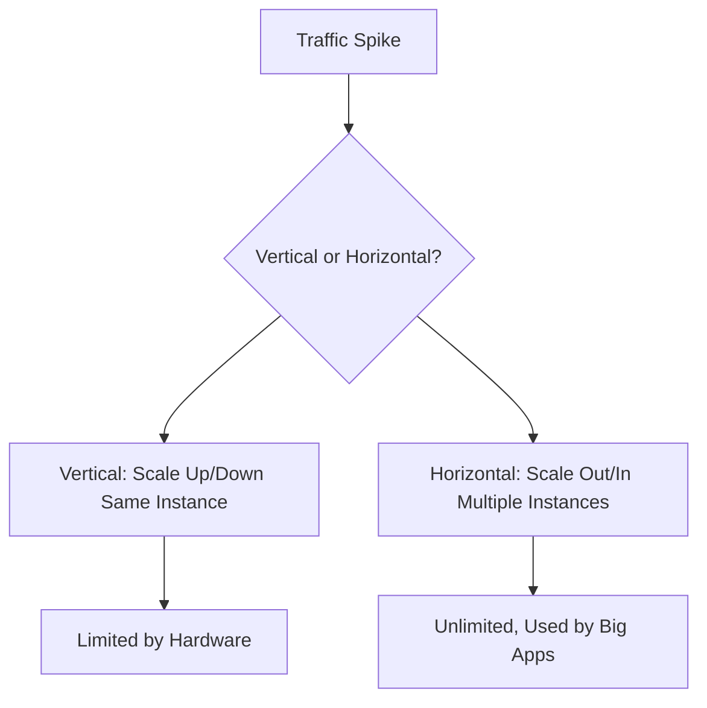

# Section 8: Auto Scaling

<details open>
<summary><b>Section 8: Auto Scaling (CL-KK-Terminal)</b></summary>

## Table of Contents
- [8.1 Auto Scaling (Hands-On)](#81-auto-scaling-hands-on)
- [8.2 Auto Scaling Group & Launch Template (Hands-On)](#82-auto-scaling-group--launch-template-hands-on)
- [8.3 Scaling Option Manual Scaling (Hands-On)](#83-scaling-option-manual-scaling-hands-on)
- [8.4 Scaling Option Schedule Scaling (Hands-On)](#84-scaling-option-schedule-scaling-hands-on)
- [8.5 Scaling Option Dynamic Scaling (Hands-On)](#85-scaling-option-dynamic-scaling-hands-on)
- [8.6 Scaling Option Predictive Scaling -- Introduction & Configuration (Hands-On)](#86-scaling-option-predictive-scaling----introduction--configuration-hands-on)
- [8.7 Auto Scaling -- Instance Maintenance Policy (Hands-On)](#87-auto-scaling----instance-maintenance-policy-hands-on)
- [8.8 Auto Scaling -- Default Termination Policy (Hands-On)](#88-auto-scaling----default-termination-policy-hands-on)
- [8.9 Auto Scaling -- Built-in Termination Policies (Hands-On)](#89-auto-scaling----built-in-termination-policies-hands-on)
- [8.10 Auto Scaling -- Custom Termination Policies (Hands-On)](#810-auto-scaling----custom-termination-policies-hands-on)
- [8.11 Auto Scaling -- Types Of Timers](#811-auto-scaling----types-of-timers)
- [8.12 Difference Between AWS Auto Scaling Vs Elastic Load Balancer](#812-difference-between-aws-auto-scaling-vs-elastic-load-balancer)

## 8.1 Auto Scaling (Hands-On)

### Overview
This module introduces AWS Auto Scaling, explaining scaling concepts, vertical vs. horizontal scaling, and how auto scaling automates scaling for better availability and fault tolerance. It contrasts manual vertical scaling limitations with automated horizontal scaling used by e-commerce platforms.

### Key Concepts
- **Scaling Definition**: Adjusting compute capacity to match changing demands (e.g., traffic spikes during sales).
- **Vertical Scaling**: Increasing resources (CPU, RAM) on the same instance (scale up/down). Limited by hardware ceilings, used for small-scale adjustments.
- **Horizontal Scaling**: Adding/removing multiple instances. Enables unlimited capacity, preferred for high-traffic apps like Amazon/Flipkart.
  - **Scale Out**: Increase instances for more load.
  - **Scale In**: Decrease instances to reduce costs.
- **Auto Scaling Benefits**: Automatic scaling, fault tolerance (replaces failed instances), cost optimization, and high availability.
- **Comparison to E-commerce**: Similar to how retail sites handle traffic surges without over-provisioning.

### Flowchart of Scaling Types


### Code/Config Blocks
- No specific code shown, but manual scaling examples imply configuring instance sizes:
  ```bash
  # Hypothetical: Increase instance size
  aws ec2 modify-instance-attribute --instance-id i-12345 --instance-type m5.large
  ```

### Summary for 8.1
Auto scaling lays the foundation for automated capacity management in AWS, emphasizing horizontal scaling for dynamic workloads. Key takeaway: Focus on horizontal scaling for elasticity.

## 8.2 Auto Scaling Group & Launch Template (Hands-On)

### Overview
This module covers Auto Scaling Groups (ASG) for managing EC2 fleets and Launch Templates for defining instance configurations. It demonstrates creating a launch template with AMI, instance type, security groups, and user data, then configuring an ASG using the template.

### Key Concepts
- **Auto Scaling Group (ASG)**: Manages a collection of EC2 instances as a single unit, supporting automatic scaling based on demand. Enables fault tolerance by replacing unhealthy instances.
- **Launch Template**: Defines instance specs reused for scaling. Includes AMI, instance type, storage, security groups, and user data scripts for automated setup.
- **Example Scenario**: Weekend traffic increase requires more instances; Launch Template ensures consistent configuration.
- **Components in Launch Template**:
  - AMI selection (e.g., Amazon Linux).
  - Instance type (e.g., T2 micro for free tier).
  - Key pairs for access.
  - Security groups for traffic rules.
  - User data for post-launch automation (e.g., web server setup).
- **Integration**: ASG uses Launch Template to launch instances; supports versioning for updates.

### Hands-On Setup
- **Create Launch Template (LTE)**:
  - Name: LTE-ASG
  - AMI: Amazon Linux 2023
  - Instance Type: T2 micro
  - Key Pair: Existing pair
  - Security Group: Allow HTTP, SSH traffic
  - User Data: Script for Apache web server (e.g., `echo "Welcome to CloudBox"`).
- **Update ASG**:
  - Select Launch Template version (e.g., $/latest).
  - Subnets across AZs (AP South 1A/1B).

> [!NOTE]
> Launch Templates standardize instance creation for reliability in auto scaling environments.

### Summary for 8.2
ASGs and Launch Templates streamline fleet management, ensuring consistent and automated instance provisioning.

## 8.3 Scaling Option Manual Scaling (Hands-On)

### Overview
Manual scaling involves manually adjusting ASG capacities for infrequent events. This hands-on demo covers creating Launch Templates/ASGs, then manually performing scale out/scale in, while demonstrating fault tolerance and capacity limits.

> [!IMPORTANT]
> Manual scaling suits predictable load spikes (e.g., product launches) but doesn't automate; reactive to expected changes.

### Key Concepts
- **Manual Scaling**: Adjust desired capacity in ASG manually. Useful for events with known timing (e.g., game releases).
- **Fault Tolerance**: ASG maintains minimum capacity by replacing terminated instances.
- **Scale Out/In Process**: Increase/decrease desired capacity; ASG launches/terminates instances accordingly.
- **Capacity Limits**: Desired capacity must stay between minimum (e.g., 1) and maximum (e.g., 5).
- **Health Checks**: ASG monitors instance health; unhealthy ones auto-replaced.
- **Load Balancer Integration**: Optional for traffic distribution (covered later).
- **Best Practices**: Delete ASG to remove all instances; don't terminate manually without ASG deletion, as it auto-recreates.

### Hands-On Steps
1. **Create Launch Template (Web Server LT)**:
   ```yaml
   Name: web-server-lt
   AMI: Amazon Linux 2023
   Instance Type: T2 micro
   Key Pair: 2024-key
   Security Groups: Allow HTTP/SSH
   User Data: Apache install script
   ```
2. **Create ASG (learning-ASG)**:
   ```yaml
   Launch Template: web-server-lt
   VPC: Default
   AZs: ap-south-1a, ap-south-1b
   Desired: 1, Min: 1, Max: 5
   # No auto scaling
   Health Check: EC2 (default)
   ```
3. **Manual Scale Out**:
   - Set desired capacity to 2 (scale out).
   - ASG launches new instance with identical config.
4. **Fault Tolerance Demo**:
   - Terminate instance manually.
   - ASG auto-replaces to maintain min capacity.
5. **Manual Scale In**:
   - Set desired capacity to 1 (scale in).
   - ASG terminates excess instances.
6. **Cleanup**: Delete ASG to remove all resources.

> [!WARNING]
> Avoid terminating instances directly; use ASG deletion to prevent auto-recreation and billing issues.

### Summary for 8.3
Manual scaling provides control for anticipated events, but ASG ensures reliability through instance replacement.

## 8.4 Scaling Option Schedule Scaling (Hands-On)

### Overview
Schedule scaling automates scaling based on time/date for periodic or known events. This hands-on creates schedules for scale out/scale in, simulating traffic patterns like weekends/sales.

### Key Concepts
- **Schedule Scaling Use Cases**: Recurring events (e.g., weekends, sales) with predictable traffic.
- **Configuration**: Set cron-like schedules for scale out/scale in.
- **Steps**:
  1. Define times/dates for capacity changes.
  2. Specify desired capacity for scale out (> current).
  3. Specify for scale in (< current).
- **Timezone**: Use local timezone (e.g., Asia/Kolkata).
- **Cron Format**: Supports minute/hour/etc. for scheduling.

> [!NOTE]
> Useful for batch processes (e.g., month-end reports) or seasonal loads.

### Hands-On Demo
1. **Setup ASG**:
   ```yaml
   Name: learning-ASG
   LT: Default (T2 micro, web server)
   Desired: 1, Min: 1, Max: 5
   ```
2. **Create Schedule Scaling**:
   - **Scale Out**: Desire=4 at 20:06 (24-Jan, Asia/Kolkata) – simulates traffic spike.
   - **Scale In**: Desire=1 at 20:09 – reduces after event.
3. **Execution**: At scheduled times, ASG adjusts capacity automatically.
4. **Cleanup**: Delete ASG.

### Summary for 8.4
Schedule scaling handles time-bound events efficiently, pre-provisioning capacity without manual intervention.

## 8.5 Scaling Option Dynamic Scaling (Hands-On)

### Overview
Dynamic scaling uses policies reacting to metrics in real-time. Options: Simple scaling, Step scaling, Target tracking. Hands-on uses CPU utilization with user data script to simulate load and demonstrate auto scaling.

### Key Concepts
- **Dynamic Scaling**: Reactive to actual load (vs. predictive/forecast).
- **Policies**:
  - **Simple Scaling**: Add/remove fixed instances per threshold (e.g., CPU >70%, add 1).
  - **Step Scaling**: Multi-threshold steps (e.g., CPU 70-80%: +1, 80-90%: +2).
  - **Target Tracking**: Maintain target metric (e.g., CPU at 60%) auto-adjusting instances.
- **Metrics**: CPU, Network I/O, ALB Request Count.
- **Instance Warm-Up**: Delay before metrics counted (prevents premature actions).
- **Cooldown**: Wait after scaling before next action.
- **CloudWatch Integration**: Alarms trigger scaling.

> [!IMPORTANT]
> Dynamic is proactive for uncertain loads; combines with schedule for comprehensive auto scaling.

### Hands-On with Target Tracking
1. **Launch Template**:
   ```yaml
   Name: limit-ASG-LT
   AMI: Amazon Linux 2023
   User Data: CPU stress script + web server
   ```
2. **ASG Setup**:
   ```yaml
   Desired: 1, Min: 1, Max: 5
   ```
3. **Dynamic Policy (Target Tracking)**:
   - Metric: Avg CPU Utilization
   - Target: 60% (scale out when >60%, scale in when <60%)
   - Warm-Up: 300s
4. **Load Test**:
   - Access website; CPU ~0%.
   - Run load script → CPU 100% → Scale out (e.g., 2 instances).
   - Stop load → CPU drops → Scale in (e.g., back to 1).
5. **Cleanup**: Delete ASG.

### Script Snippet for Load
```bash
# User Data (simplified)
yum update -y
yum install httpd -y
systemctl start httpd
# CPU stress loop for demo
```

### Summary for 8.5
Dynamic scaling ensures optimal capacity via metrics, automatically adjusting to volatile demands.

## 8.6 Scaling Option Predictive Scaling -- Introduction & Configuration (Hands-On)

### Overview
Predictive scaling uses machine learning on historical data for proactive planning. Configures forecasting modes, metrics, target utilization, and buffers. This module explains options without full hands-on due to data requirements.

### Key Concepts
- **Predictive Scaling**: Analyzes 3+ weeks historical data to forecast demand; proactive vs. reactive.
- **Modes**:
  - Forecasting only: Predicts without scaling.
  - Forecasting + Scaling: Auto-scales based on predictions.
- **Metrics**: CPU, Network, ALB Requests (analyzed for patterns).
- **Target Utilization**: Threshold (e.g., 50%); scale to maintain.
- **Buffer**: Extra instances on top of forecast (e.g., 20% adds 20% extra for safety).
- **Pre-launch**: Advances launch time (e.g., -5 min) for faster readiness.
- **Limitations**: Requires long-term data; not hands-on feasible without history.

> [!NOTE]
> Use with dynamic scaling for hybrid approach (proactive + reactive).

### Configuration Options Table
| Option | Purpose | Example |
|--------|---------|---------|
| Scale based on forecast | Enable auto-scaling | Yes/No |
| Metric | Data source | CPU Utilization |
| Target Utilization | Maintenance level | 50% |
| Buffer max capacity | Extra overhead | 20% |
| Pre-launch instances | Advance launch | -5 min |

### Summary for 8.6
Predictive scaling forecasts future needs using ML, enabling ahead-of-time scaling for anticipating baselines.

## 8.7 Auto Scaling -- Instance Maintenance Policy (Hands-On)

### Overview
Instance maintenance policies control how ASG updates instances (e.g., to new AMI). Options: Terminate & Launch (cost-efficient), Launch Before Terminating (availability-focused), Custom (advanced control).

### Key Concepts
- **Instance Refresh**: Updates instances in ASG to new Launch Template version (e.g., OS changes).
- **Policies**:
  - **Terminate & Launch**: Replace instances in-place; min health % ensures minimum running (e.g., 50% with 2 = 1 always).
  - **Launch Before Terminate**: Builds new fleet first, then terminates old; ensures uninterrupted service but higher costs (e.g., 100% min with 2 could go to 4 temporarily).
  - **Custom**: Fine-tune min/max health and warmup/cooldown for unique scenarios.
- **Scenarios**: Updating AMI/OS, replacing for compliance.
- **Instance Warm-Up/Coolddown**: Delays for stability post-launch.

### Hands-On Demos
1. **Setup ASG (± temp-ASG)**:
   - LT: V1 (Amazon Linux), then update to V2 (Ubuntu).
   - Desired: 2, Min: 2, Max: 2.
2. **Terminate & Launch**:
   - Policy: Min 50% (1 always running).
   - Refresh: OS updates step-by-step.
3. **Launch Before Terminate**:
   - Policy: Min 100% (2 always), Max 200% (up to 4).
   - Builds new set, then removes old.
4. **Cleanup**: Delete ASG.

### Before/After Comparison
```diff
! Terminate & Launch: Cost-optimized, brief downtime if needed.
! Launch Before Terminate: Availability priority, higher temporary costs.
```

### Summary for 8.7
Maintenance policies balance cost and uptime during ASG updates, ensuring smooth transitions.

## 8.8 Auto Scaling -- Default Termination Policy (Hands-On)

### Overview
Default termination policy follows multi-step logic for scale-in (EC2 instance reduction), prioritizing balance, protection, and cost optimization.

### Key Concepts
- **Termination Policy**: Determines which instances terminate during scale-in.
- **Default Steps** (for scale-in):
  1. Balance across AZs (even distribution).
  2. Skip protected instances.
  3. Prioritize oldest Launch Template/Config.
  4. Closest to next billing hour (minimize unused pay).
  5. Random tie-breaker.
- **AZ Balancing Example**: Unbalanced AZs target equalization first.
- **Protection**: Use "Instance Protection" in ASG console to exclude instances.

### Scenario Demo
- 6 Instances: A1,A2,A3 (ap-south-1a), B1,B2 (1b), C1 (1c).
- Scale-in prioritizes 1a (most instances) > 1b/1c > oldest config > billing proximity.

### Summary for 8.8
Termination prioritizes fairness and cost-saving in scale-in operations.

## 8.9 Auto Scaling -- Built-in Termination Policies (Hands-On)

### Overview
Explains built-in policies beyond default, including allocation-based and age-based terminations.

### Key Concepts
- **Allocation Strategies**: Align termination with instance purchase types (On-Demand/Spot) or mixes.
- **Built-in Policies**:
  - Allocation Strategy: Match provisioning strategy (e.g., terminate based on spot allocation).
  - Oldest Launch Template/Config: Remove legacy instances.
  - Closest to Next Billing Hour: Optimize costs.
  - Newest Instance: Terminate recently added ones.
  - Oldest Instance: Remove oldest for upgrades.

> [!NOTE]
> Choose based on priorities (cost, age, type).

### Hands-On Setup
1. **ASG with Mixed Instances**:
   - Use instance types req (t2.micro + other).
   - Purchase options: On-Demand/Spot.
2. **Policies** (in ASG Advanced Config).
3. **Simulate Scale-In**.

### Summary for 8.9
Built-in policies cover common termination needs like cost and type balancing.

## 8.10 Auto Scaling -- Custom Termination Policies (Hands-On)

### Overview
Custom policies use Lambda for advanced logic, overcoming built-in limitations.

### Key Concepts
- **Lambda Setup**: Write functions in Node/Python for logic (no full demo due to complexity).
- **Reasons for Custom**:
  - Precise control (tags, metrics).
  - Graceful shutdown/backups.
  - External integrations (e.g., license removal).
  - Dynamic rules (complex conditions).

### Use Cases
| Reason | Benefit |
|--------|---------|
| Control | Tag-based, multi-metric decisions |
| Graceful Shutdown | Prevent disruptions |
| Backups | Save data before termination |
| Integration | Notify systems/database |
| Flexibility | Evolvable logic |

> [!IMPORTANT]
> Built-in policies suffice for most; custom for niche needs.

### Summary for 8.10
Custom policies extend auto scaling for unique, programmable termination logic via Lambda.

## 8.11 Auto Scaling -- Types Of Timers

### Overview
ASG uses timers for stability: warm-up (new instances), cooldown (after scaling), grace period (health checks).

### Key Concepts
- **Warm-Up Time (Instance Warm-Up)**: Delay before new instances contribute metrics (300s default). Prevents premature scaling; used in dynamic policies.
- **Cooldown Period**: Wait after scaling before next action (300s default); avoids overscaling.
- **Health Check Grace Period**: Delay health checks post-launch (300s default); allows full startup.

### Scenario Calculation
- Scale Out at 12:00: Instance launches 12:00, warm-up until 12:05 (included at 12:05).
- Next Scaling: Cooldown starts 12:05, next possible at 12:15.
- Health Check: Starts at 12:03.

### Summary for 8.11
Timers ensure accurate, stable scaling decisions in dynamic environments.

## 8.12 Difference Between AWS Auto Scaling Vs Elastic Load Balancer

### Overview
Auto Scaling manages instance capacity; ELB routes traffic. They integrate for full AWS app deployment.

### Key Concepts
- **Auto Scaling**: Scales EC2 instances (horizontal). Policies: Manual, Schedule, Dynamic, Predictive.
- **Elastic Load Balancer (ELB)**: Routes traffic across instances; health checks healthy ones.
- **Integration**: ASG adjusts fleet size; ELB distributes load dynamically. ELB detects new instances via ASG.
- **Differences Table**:

| Aspect | Auto Scaling | Elastic Load Balancer |
|--------|--------------|-----------------------|
| Purpose | Scale instances up/down | Route traffic evenly |
| Scaling | Add/remove EC2s | No instance changes |
| Health | Replaces unhealthy | Routes away from unhealthy |
| Traffic | N/A | Distributes to instances |

- **Together**: ASG for capacity, ELB for traffic balance (upcoming projects integrate both).

### Summary for 8.12
Auto Scaling & ELB are complementary: auto scaling manages compute, ELB directs traffic for reliability.

---

## Summary

### Key Takeaways
```diff
+ Horizontal Scaling enables unlimited capacity in auto scaling, preferred for high-traffic apps like e-commerce.
- Vertical Scaling is limited by instance hardware and not supported in AWS auto scaling.
+ Manual/Schedule Scaling for known events; Dynamic/Predictive for reactive/proactive automation.
+ ASGs & Launch Templates standardize and automate EC2 provisioning.
+ Termination Policies prioritize balance, cost, and protection during scale-in.
+ Timers (warm-up, cooldown, grace) ensure stable scaling decisions.
+ Auto Scaling adjusts fleet; ELB routes traffic for full app elasticity.
```

### Quick Reference
- **Create ASG+bash**: `aws autoscaling create-launch-template ...; aws autoscaling create-auto-scaling-group --launch-template-name lt_name --min-size 1 --max-size 5 --desired-capacity 1`
- **Scale Manual**: Update desired capacity via console/API.
- **Schedule Scaling**: Use cron in ASG actions.
- **Dynamic Policy**: CloudWatch-based (e.g., CPU >70% add instance).
- **Termination Default**: Balance AZs → Protect → Oldest Config → Billing Hour.
- **Maintenance**: Use Instance Refresh for AMI updates.

### Expert Insight
**Real-world Application**: In production, combine dynamic auto scaling with ELB for zero-downtime apps; predictive for baseline traffic, dynamic for spikes.  
**Expert Path**: Master metrics tuning (e.g., ALB request count); experiment with multi-region ASGs.  
**Common Pitfalls**: Ignoring warm-up/cooldown → flapping (rapid scale-out/in); mixing ASG deletion without cleaning instances.  
**Lesser-Known Facts**: Predictive scaling requires 3+ weeks data; custom Lambda policies enable AI-based termination (e.g., ML models for smarter decisions).

</details>
